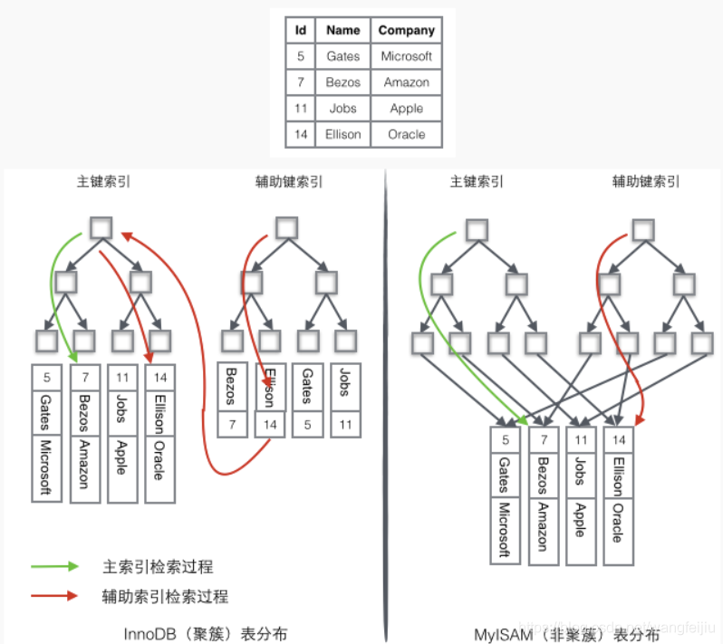

# 一文搞懂MySQL索引（清晰明了）

转载链接：[(13条消息) 一文搞懂MySQL索引（清晰明了）_Free Joe的博客-CSDN博客_mysql索引](https://blog.csdn.net/wangfeijiu/article/details/113409719)

索引是对数据库表中一列或多列的值进行排序的一种结构。MySQL索引的建立对于MySQL的高效运行是很重要的，索引可以大大提高MySQL的检索速度。索引只是提高效率的一个因素，如果你的MySQL有大数据量的表，就需要花时间研究建立最优秀的索引，或优化查询语句。

📌简单类比一下，数据库如同书籍，索引如同书籍目录，假如我们需要从书籍查找与 xx 相关的内容，我们可以直接从目录中查找，定位到 xx 内容所在页面，如果目录中没有 xx 相关字符或者没有设置目录（索引），那只能逐字逐页阅读文本查找，效率可想而知。

❓如果你不仅仅想了解索引，可看我上篇文章[《MySQL体系构架、存储引擎和索引结构》](https://blog.csdn.net/wangfeijiu/article/details/112454405)

## 1️⃣索引的优缺点

索引可以大大提高MySQL的检索速度，为什么不对表中的每一个列创建一个索引呢？

### 优点

- 索引大大减小了服务器需要扫描的数据量，从而大大加快数据的检索速度，这也是创建索引的最主要的原因。
- 索引可以帮助服务器避免排序和创建临时表
- 索引可以将随机IO变成顺序IO
- 索引对于InnoDB（对索引支持行级锁）非常重要，因为它可以让查询锁更少的元组，提高了表访问并发性
- 关于InnoDB、索引和锁：InnoDB在二级索引上使用共享锁（读锁），但访问主键索引需要排他锁（写锁）
- 通过创建唯一性索引，可以保证数据库表中每一行数据的唯一性。
- 可以加速表和表之间的连接，特别是在实现数据的参考完整性方面特别有意义。
- 在使用分组和排序子句进行数据检索时，同样可以显著减少查询中分组和排序的时间。
- 通过使用索引，可以在查询的过程中，使用优化隐藏器，提高系统的性能。

### 缺点

- 创建索引和维护索引要耗费时间，这种时间随着数据量的增加而增加
- 索引需要占物理空间，除了数据表占用数据空间之外，每一个索
- 引还要占用一定的物理空间，如果需要建立聚簇索引，那么需要占用的空间会更大
- 对表中的数据进行增、删、改的时候，索引也要动态的维护，这就降低了整数的维护速度
- 如果某个数据列包含许多重复的内容，为它建立索引就没有太大的实际效果。
- 对于非常小的表，大部分情况下简单的全表扫描更高效；

## 2️⃣创建索引准则

索引是建立在数据库表中的某些列的上面。因此，在创建索引的时候，应该仔细考虑在哪些列上可以创建索引，在哪些列上不能创建索引。

### 应该创建索引的列

- 在经常需要搜索的列上，可以加快搜索的速度
- 在作为主键的列上，强制该列的唯一性和组织表中数据的排列结构
- 在经常用在连接（JOIN）的列上，这些列主要是一外键，可以加快连接的速度
- 在经常需要根据范围（<，<=，=，>，>=，BETWEEN，IN）进行搜索的列上创建索引，因为索引已经排序，其指定的范围是连续的
- 在经常需要排序（order by）的列上创建索引，因为索引已经排序，这样查询可以利用索引的排序，加快排序查询时间；
- 在经常使用在WHERE子句中的列上面创建索引，加快条件的判断速度。

### 不该创建索引的列

- 对于那些在查询中很少使用或者参考的列不应该创建索引。
- 若列很少使用到，因此有索引或者无索引，并不能提高查询速度。相反，由于增加了索引，反而降低了系统的维护速度和增大了空间需求。
- 对于那些只有很少数据值或者重复值多的列也不应该增加索引。
  这些列的取值很少，例如人事表的性别列，在查询的结果中，结果集的数据行占了表中数据行的很大比例，即需要在表中搜索的数据行的比例很大。增加索引，并不能明显加快检索速度。
  对于那些定义为text, image和bit数据类型的列不应该增加索引。
- 这些列的数据量要么相当大，要么取值很少。
- 当该列修改性能要求远远高于检索性能时，不应该创建索引。（修改性能和检索性能是互相矛盾的）

## 3️⃣索引结构

MySQL中常用的索引结构（索引底层的[数据结构](https://so.csdn.net/so/search?q=数据结构&spm=1001.2101.3001.7020)）有：B-TREE ，B+TREE ，HASH 等。这部分强烈建议看我上篇[《MySQL体系构架、存储引擎和索引结构》](https://blog.csdn.net/wangfeijiu/article/details/112454405)，有更细致的讲解，以下我也会简要说明。

### B-TREE

B-树就是B树，多路搜索树，树高一层意味着多一次的磁盘I/O，下图是3阶B树


> B树的特征：

- 关键字集合分布在整颗树中；
- 任何一个关键字出现且只出现在一个结点中；
- 搜索有可能在非叶子结点结束；
- 其搜索性能等价于在关键字全集内做一次二分查找；
- 自动层次控制

### B+TREE

B+树是B-树的变体，也是一种多路搜索树


> B+树的特征：

- 所有关键字都出现在叶子结点的链表中（稠密索引），且链表中的关键字恰好是有序的；
- 不可能在非叶子结点命中；
- 非叶子结点相当于是叶子结点的索引（稀疏索引），叶子结点相当于是存储（关键字）数据的数据层；
- 每一个叶子节点都包含指向下一个叶子节点的指针，从而方便叶子节点的范围遍历。
- 更适合文件索引系统；

> HASH

哈希索引就是采用一定的哈希算法，把键值换算成新的哈希值，检索时不需要类似B+树那样从根节点到叶子节点逐级查找，只需一次哈希算法即可立刻定位到相应的位置，速度非常快。


Hash索引仅仅能满足"=",“IN"和”<=>"查询，不能使用范围查询。也不支持任何范围查询，例如WHERE price > 100。
　　
由于Hash索引比较的是进行Hash运算之后的Hash值，所以它只能用于等值的过滤，不能用于基于范围的过滤，因为经过相应的Hash算法处理之后的Hash值的大小关系，并不能保证和Hash运算前完全一样。

### 补充：索引存储在文件系统中

索引是占据物理空间的，在不同的存储引擎中，索引存在的文件也不同。存储引擎是基于表的，以下分别使用MyISAM和InnoDB存储引擎建立两张表。


> 存储引擎为MyISAM：

*.frm：与表相关的元数据信息都存放在frm文件，包括表结构的定义信息等
*.MYD：MyISAM DATA，用于存储MyISAM表的数据
*.MYI：MyISAM INDEX，用于存储MyISAM表的索引相关信息

> 存储引擎为InnoDB：

*.frm：与表相关的元数据信息都存放在frm文件，包括表结构的定义信息等
*.ibd：InnoDB DATA，表数据和索引的文件。该表的索引(B+树)的每个非叶子节点存储索引，叶子节点存储索引和索引对应的数据

## 4️⃣索引分类

MySQL 的索引有两种分类方式：逻辑分类和物理分类。

### 逻辑分类

有多种逻辑划分的方式，比如按功能划分，按组成索引的列数划分等

#### 按功能划分

- 主键索引：一张表只能有一个主键索引，不允许重复、不允许为 NULL；

```sql
 ALTER TABLE TableName ADD PRIMARY KEY(column_list); 
```

- 唯一索引：数据列不允许重复，允许为 NULL 值，一张表可有多个唯一索引，索引列的值必须唯一，但允许有空值。如果是组合索引，则列值的组合必须唯一。

```sql
CREATE UNIQUE INDEX IndexName ON `TableName`(`字段名`(length));
# 或者
ALTER TABLE TableName ADD UNIQUE (column_list); 
```

- 普通索引：一张表可以创建多个普通索引，一个普通索引可以包含多个字段，允许数据重复，允许 NULL 值插入；

```sql
CREATE INDEX IndexName ON `TableName`(`字段名`(length));
# 或者
ALTER TABLE TableName ADD INDEX IndexName(`字段名`(length));
```

- 全文索引：它查找的是文本中的关键词，主要用于全文检索。（篇幅较长，下文有独立主题说明）

#### 按列数划分

- 单例索引：一个索引只包含一个列，一个表可以有多个单例索引。
- 组合索引：一个组合索引包含两个或两个以上的列。查询的时候遵循 mysql 组合索引的 “最左前缀”原则，即使用 where 时条件要按照建立索引的时候字段的排列方式放置索引才会生效。

### 物理分类

分为聚簇索引和非聚簇索引（有时也称辅助索引或二级索引）

#### 聚簇索引和非聚簇索引

> 聚簇是为了提高某个属性(或属性组)的查询速度，把这个或这些属性(称为聚簇码)上具有相同值的元组集中存放在连续的物理块。

聚簇索引（clustered index）不是单独的一种索引类型，而是一种数据存储方式。这种存储方式是依靠B+树来实现的，根据表的主键构造一棵B+树且B+树叶子节点存放的都是表的行记录数据时，方可称该主键索引为聚簇索引。聚簇索引也可理解为将数据存储与索引放到了一块，找到索引也就找到了数据。

> 非聚簇索引：数据和索引是分开的，B+树叶子节点存放的不是数据表的行记录。

虽然InnoDB和MyISAM存储引擎都默认使用B+树结构存储索引，但是只有InnoDB的主键索引才是聚簇索引，InnoDB中的辅助索引以及MyISAM使用的都是非聚簇索引。每张表最多只能拥有一个聚簇索引。

#### 拓展：聚簇索引优缺点

> 优点：

- 数据访问更快，因为聚簇索引将索引和数据保存在同一个B+树中，因此从聚簇索引中获取数据比非聚簇索引更快
- 聚簇索引对于主键的排序查找和范围查找速度非常快

> 缺点：

- 插入速度严重依赖于插入顺序，按照主键的顺序插入是最快的方式，否则将会出现页分裂，严重影响性能。因此，对于InnoDB表，我们一般都会定义一个自增的ID列为主键（主键列不要选没有意义的自增列，选经常查询的条件列才好，不然无法体现其主键索引性能）
- 更新主键的代价很高，因为将会导致被更新的行移动。因此，对于InnoDB表，我们一般定义主键为不可更新。
- 二级索引访问需要两次索引查找，第一次找到主键值，第二次根据主键值找到行数据。

#### 【补充】Mysql中key 、primary key 、unique key 与index区别

> key 与 index 含义

key具有两层含义：1.约束（约束和规范数据库的结构完整性）2.索引

index：索引

> key 种类

- key：等价普通索引 key 键名 (列)

- primary key：

约束作用（constraint），主键约束（unique，not null，一表一主键，唯一标识记录），规范存储主键和强调唯一性

为这个key建立主键索引

- unique key：

约束作用（constraint），unique约束（保证列或列集合提供了唯一性）

为这个key建立一个唯一索引；

- foreign key：

约束作用（constraint），外键约束，规范数据的引用完整性
为这个key建立一个普通索引；

### 实战分析

建立个user表，看看表的各个字段，下面我们逐一分析

```sql
mysql> create table user(
    -> id int auto_increment,
    -> username varchar(100) not null,
    -> user_id int(8) primary key,
    -> depart_no int not null,
    -> corp varchar(100),
    -> phone char(11),
    -> key auto_id (id),
    -> unique key phone (phone),
    -> index username_depart_corp (username,depart_no,corp),
    -> constraint fk_user_depart foreign key(depart_no) references depart(id);
    -> )engine=innodb charset=utf8;
```

auto_increment修饰的字段需要是一个候选键，需要用key指定，否则报错。我们看下表的结构：


查看表的索引


可见key也会生成索引

> key 值类型

- PRI 主键约束
- UNI 唯一约束
- MUL 可以重复


如果一个Key有多个约束，将显示约束优先级最高的， PRI>UNI>MUL

## 5️⃣InnoDB和MyISAM索引实现

### InnoDB索引实现

- InnoDB使用B+TREE存储数据，除了主键索引为聚簇索引，其它索引均为非聚簇索引。

- 一个表中只能存在一个聚簇索引（主键索引），但可以存在多个非聚簇索引。

- InnoDB表的索引和数据是存储在一起的，`.idb`表数据和索引的文件


#### 聚簇索引（主键索引）

B+树 叶子节点包含数据表中行记录就是聚簇索引（索引和数据是存放在一块的）


可以看到叶子节点包含了完整的数据记录，这就是聚簇索引。因为InnoDB的数据文件（.idb）按主键聚集，所以InnoDB必须有主键（MyISAM可以没有），如果没有显示指定主键，则选取首个为唯一且非空的列作为主键索引，如果还没具备，则MySQL自动为InnoDB表生成一个隐含字段作为主键，这个字段长度为6个字节，类型为长整形。

> 主键索引结构分析：

- B+树单个叶子节点内的行数据按主键顺序排列，**物理空间是连续的（聚簇索引的数据的物理存放顺序与索引顺序是一致的）**
- 叶子节点之间是通过指针连接，相邻叶子节点的数据在逻辑上也是连续的（根据主键值排序），实际存储时的数据页（叶子节点）可能相距甚远。

#### 非聚簇索引（辅助索引或二级索引）

在聚簇索引之外创建的索引（不是根据主键创建的）称之为辅助索引，辅助索引访问数据总是需要二次查找。辅助索引叶子节点存储的不再是行数据记录，而是主键值。首先通过辅助索引找到主键值，然后到主键索引树中通过主键值找到数据行。


#### 拓展：InnoDB索引优化

- InnoDB中主键不宜定义太大，因为辅助索引也会包含主键列，如果主键定义的比较大，其他索引也将很大。如果想在表上定义 、很多索引，则争取尽量把主键定义得小一些。InnoDB 不会压缩索引。

- InnoDB中尽量不使用非单调字段作主键（不使用多列），因为InnoDB数据文件本身是一颗B+Tree，非单调的主键会造成在插入新记录时数据文件为了维持B+Tree的特性而频繁的分裂调整，十分低效，而使用自增字段作为主键则是一个很好的选择。

### MyISAM索引实现

- MyISAM也使用B+Tree作为索引结构，但具体实现方式却与InnoDB截然不同。MyISAM使用的都是非聚簇索引。

- MyISAM表的索引和数据是分开存储的，`.MYD`表数据文件 `.MYI`表索引文件

#### MyISAM主键索引


可以看到叶子节点的存放的是数据记录的地址。也就是说索引和行数据记录是没有保存在一起的，所以MyISAM的主键索引是非聚簇索引。

#### MyISAM辅助索引

在MyISAM中，主索引和辅助索引（Secondary key）在结构上没有任何区别，只是主索引要求key是唯一的，而辅助索引的key可以重复。 MyISAM辅助索引也是非聚簇索引。

### InnoDB和MyISAM的索引检索过程

- 对于InnoDB和MyISAM而言，主键索引是根据主关键字来构建的B+树存储结构，辅助索引则是根据辅助键来构造的B+树存储结构，彼此的索引树都是相互独立的。

- InnoDB辅助索引的访问需要两次索引查找，第一次从辅助索引树找到主键值，第二次根据主键值到主键索引树中找到对应的行数据。

- MyISM使用的是非聚簇索引，表数据存储在独立的地方，这两棵（主键和辅助键）B+树的叶子节点都使用一个地址指向真正的表数据。由于索引树是独立的，通过辅助键检索无需访问主键的索引树。

假想一个表如下图存储了4行数据。其中Id作为主索引，Name作为辅助索引。图示清晰的显示了聚簇索引和非聚簇索引的差异。



### 聚簇索引和非聚簇索引的区别

- 聚簇索引的叶子节点存放的是数据行（主键值也是行内数据），支持覆盖索引；而二级索引的叶子节点存放的是主键值或指向数据行的指针。
- 由于叶子节点(数据页)只能按照一棵B+树排序，故一张表只能有一个聚簇索引。辅助索引的存在不影响聚簇索引中数据的组织，所以一张表可以有多个辅助索引。

## 6️⃣操作索引

### 创建索引

索引名称 index_name 是可以省略的，省略后，索引的名称和索引列名相同。

```sql
-- 创建普通索引 
CREATE INDEX index_name ON table_name(col_name);

-- 创建唯一索引
CREATE UNIQUE INDEX index_name ON table_name(col_name);

-- 创建普通组合索引
CREATE INDEX index_name ON table_name(col_name_1,col_name_2);

-- 创建唯一组合索引
CREATE UNIQUE INDEX index_name ON table_name(col_name_1,col_name_2);
```

修改表结构创建索引

```sql
ALTER TABLE table_name ADD INDEX index_name(col_name);
```

创建表时直接指定索引

```sql
CREATE TABLE table_name (
    ID INT NOT NULL,
    col_name VARCHAR (16) NOT NULL,
    INDEX index_name (col_name)
);
```

### 删除索引

```sql
-- 直接删除索引
DROP INDEX index_name ON table_name;

-- 修改表结构删除索引
ALTER TABLE table_name DROP INDEX index_name;
```

### 其它相关命令

```sql
-- 查看表结构
desc table_name;

-- 查看生成表的SQL
show create table table_name;

-- 查看索引信息（包括索引结构等）
show index from  table_name;

-- 查看SQL执行时间（精确到小数点后8位）
set profiling = 1;
SQL...
show profiles;
```


## 7️⃣索引实战

索引实战学习的基础，首先应该学会分析SQL的执行，使用EXPLAIN关键字可以模拟优化器执行SQL查询语句，下面我们学习下EXPLAIN。

### explain

使用EXPLAIN关键字可以模拟优化器执行SQL查询语句，从而知道MySQL是如何处理SQL语句。不展开讲解，大家可自行百度这块知识点。

使用格式：`EXPLAIN SQL...;`

Look一下EXPLAIN 查询结果包含的字段（v5.7）

```sh
mysql> explain select * from student;
+----+-------------+---------+------------+------+---------------+------+---------+------+------+----------+-------+
| id | select_type | table   | partitions | type | possible_keys | key  | key_len | ref  | rows | filtered | Extra |
+----+-------------+---------+------------+------+---------------+------+---------+------+------+----------+-------+
|  1 | SIMPLE      | student | NULL       | ALL  | NULL          | NULL | NULL    | NULL |    2 |   100.00 | NULL  |
+----+-------------+---------+------------+------+---------------+------+---------+------+------+----------+-------+
————————————————
```

- id:选择标识符
- select_type:表示查询的类型。
- table:输出结果集的表
- partitions:匹配的分区
- type:表示表的连接类型
- possible_keys:表示查询时，可能使用的索引
- key:表示实际使用的索引
- key_len:索引字段的长度
- ref:列与索引的比较
- rows:扫描出的行数(估算的行数)
- filtered:按表条件过滤的行百分比
- Extra:执行情况的描述和说明

#### Extra 探究

本打算展开讲一下Extra的常见的几个值：Using index，Using index condition，Using where，其中Using index 表示使用了覆盖索引，其它的都不好总结。翻阅网上众多博文，目前暂未看到完全总结到位的，且只是简单的查询条件下也是如此。我本打算好好总结一番，发现半天过去了，坑貌似越来越大，先打住，因为我目前没太多时间研究…

我这有个简单的表结构，有兴趣的同学可以多尝试总结（注意 玩总结的，不能只考虑简单查询的情况）

```sql
create table student(
 id int auto_increment primary key,
 name varchar(255) not null,
 c_id int,
 phone char(11),
 guardian varchar(50) not null,
 qq varchar(20) not null,
 index stu_class_phone (name,c_id,phone),
 index qq (qq)
)engine=innodb charset=utf8;
```

这里有我的一个比对关键项表，或许对有心探索的同学有点帮助，估计看了也有点懵，建议先尝试后再回头看我这个表。


#### key_len讲解

我也稍微讲解一下网文中鲜有提及key_len字节长度计算规则，


```sh
mysql> explain select * from student where name='Joe';
+----+-------------+---------+------------+------+-----------------+-----------------+---------+-------+------+----------+-------+
| id | select_type | table   | partitions | type | possible_keys   | key             | key_len | ref   | rows | filtered | Extra |
+----+-------------+---------+------------+------+-----------------+-----------------+---------+-------+------+----------+-------+
|  1 | SIMPLE      | student | NULL       | ref  | stu_class_phone | stu_class_phone | 767     | const |    1 |   100.00 | NULL  |
+----+-------------+---------+------------+------+-----------------+-----------------+---------+-------+------+----------+-------+
1 row in set, 1 warning (0.00 sec)

mysql> explain select * from student where name='Joe' and c_id=2;
+----+-------------+---------+------------+------+-----------------+-----------------+---------+-------------+------+----------+-------+
| id | select_type | table   | partitions | type | possible_keys   | key             | key_len | ref         | rows | filtered | Extra |
+----+-------------+---------+------------+------+-----------------+-----------------+---------+-------------+------+----------+-------+
|  1 | SIMPLE      | student | NULL       | ref  | stu_class_phone | stu_class_phone | 772     | const,const |    1 |   100.00 | NULL  |
+----+-------------+---------+------------+------+-----------------+-----------------+---------+-------------+------+----------+-------+
1 row in set, 1 warning (0.00 sec)

mysql> explain select * from student where name='Joe' and c_id=2 and phone='13500000000';
+----+-------------+---------+------------+------+-----------------+-----------------+---------+-------------------+------+----------+-------+
| id | select_type | table   | partitions | type | possible_keys   | key             | key_len | ref               | rows | filtered | Extra |
+----+-------------+---------+------------+------+-----------------+-----------------+---------+-------------------+------+----------+-------+
|  1 | SIMPLE      | student | NULL       | ref  | stu_class_phone | stu_class_phone | 806     | const,const,const |    1 |   100.00 | NULL  |
+----+-------------+---------+------------+------+-----------------+-----------------+---------+-------------------+------+----------+-------+
1 row in set, 1 warning (0.00 sec)
```

- 如果表结构未限制某列为非空，那么MySQL将会使用一个字节来标识该列对应的值是否为NULL；限定非空，不止not null，还有primary key等隐含非空约束。

- 字符串类型括号内的数字并不是字节数，而是字符长度，一个字符占几个字节与建表选用的字符集有关，如果表使用的是utf8字符集，那么一个字符占3个字节；注意，对于可变长字符串类（varchar）型的实际占用字节数，除了需要考虑设置了非空与否的那个字节，还要使用2个字节来记录字符串的长度。定长字符串类型（char）则不用额外字节记录长度

- 整数类型括号内的数字无论是什么，都不影响它实际的字节数，int就是4个字节。int(xx)，xx只是填充占位符，一般配合zerofill使用，只是一种标识，没有多大用处。
  

观察三次Explain 的查询结果，留意key_len与where搜索键的微妙关系，如果type列的值是ref时，ref列的值标识索引参考列的形参。

首先，我们看到key列为stu_class_phone ，说明该查询使用了stu_class_phone索引，这是一个组合索引（name,c_id,phone）。看下这三个字段的结构声明与实际字节计算：

- name varchar(255) not null, （占767字节）
  - ①255字长（utf8字符集，一个字长3字节 ）255*3=765 √
    *
  - *②是否非空 已限定非空（not null） 那就不额外占1字节
  - *③字符串长度 str_len占2字节√
- c_id int,（占5字节）
  - ①是否非空 未限定非空 那将额外占1字节 √
  - ②int 占4字节√
- phone char(11),（占36字节）
  - ①11字长（utf8字符集，一个字长3字节 ）11*3=33√

int(xx) xx无论是多少 int永远4字节 xx只是填充占位符（一种标识 一般配合zerofill使用的）

组合索引满足最左前缀原则就会生效，我们看到三次Explain 的查询中stu_class_phone索引都生效了，第一次采用name构建索引树，第二次采用name+c_id构建索引树，第三次采用name+c_id+phone构建索引树。第一次：key_len就是name的存储字节数，767；第二次：key_len就是name+c_id的存储字节数，767+5=772；第三次：255 * 3 + 2 + 5 + 11 * 3 + 1 = 806

我们再看一条执行计划：

```sql
mysql> explain select * from student where name='Joe' and phone ='13500000000';
+----+-------------+---------+------------+------+-----------------+-----------------+---------+-------+------+----------+-----------------------+
| id | select_type | table   | partitions | type | possible_keys   | key             | key_len | ref   | rows | filtered | Extra                 |
+----+-------------+---------+------------+------+-----------------+-----------------+---------+-------+------+----------+-----------------------+
|  1 | SIMPLE      | student | NULL       | ref  | stu_class_phone | stu_class_phone | 767     | const |    1 |    50.00 | Using index condition |
+----+-------------+---------+------------+------+-----------------+-----------------+---------+-------+------+----------+-----------------------+
```

为什么不是255 * 3 + 11 * 3 + 1 +2=801；却是767？我们看下ref为const，说明只有一个索引键生效，明显就是name，因为 不符合最左前缀原则，phone列被忽视了；也可能是mysql做了优化，发现通过name和phone构建的索引树对查询列 （* 表示全部列）并没有加快了查询速率，自行优化，减少键长。

> 拓展：优秀的索引是什么样的？

- 键长 短
- 精度 高

比如，在保证查询精度的情况下，两个索引的key_len分别为10字节和100字节，数据行的量也一样（大数据量效果更佳），100字节索引检索的时间会比10字节的要多；再者，一个磁盘页能存储的10字节的索引记录的量是100字节的10倍。