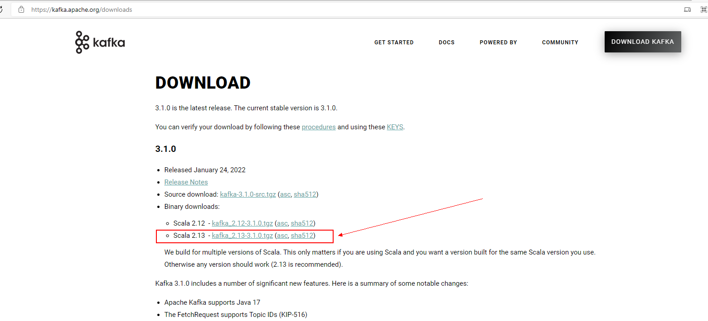

官方文档地址：[Apache Kafka](https://kafka.apache.org/documentation/)

## 1. 概要

### 1.1 介绍

> 事件流

- Event streaming is the digital equivalent of the human body's central nervous system. 等效于人的人体中枢神经系统
- It is the technological foundation for the 'always-on' world where businesses are increasingly software-defined and automated.现代企业的软件定义和自动化都离不开它，是构建“网络持久化世界"的基础
- event streaming is the practice of capturing data in real-time from event sources like databases, sensors, mobile devices, cloud services, and software applications in the form of streams of events.事件流是从不同的事件源（如数据库、传感器、移动设备、云服务和软件应用程序）**以事件流的形式实时捕获数据的实践**
  - storing these event streams durably for later retrieval.持久存储这些事件流以供以后检索
  - manipulating, processing, and reacting to the event streams in real-time as well as retrospectively. 实时和回顾性地操作、处理和响应事件流
  - and routing the event streams to different destination technologies as needed.并根据需要将事件流路由到不同的目标技术
-  因此，事件流确保了数据的连续流动和解释，以便正确的信息在正确的时间出现在正确的位置

> 通过事件流我们能做什么？

事件流应用于众多行业和组织的各种用例

- 实时处理支付和金融交易，例如在证券交易所、银行和保险中。
- 实时跟踪和监控汽车、卡车、车队和货运，例如在物流和汽车行业。
- 持续捕获和分析来自物联网设备或其他设备的传感器数据，例如工厂和风电场。
- 收集并立即响应客户互动和订单，例如零售、酒店和旅游行业以及移动应用程序。
- 监测住院病人，预测病情变化，确保在紧急情况下及时治疗。
- 连接、存储和提供公司不同部门产生的数据。
- 作为数据平台、事件驱动架构和微服务的基础。

> kafka作为一个事件流平台，这意味着什么？

Kafka 结合了三个关键功能，因此可以通过一个经过实战考验的解决方案实现端到端的事件流用例：

1. **发布**（写入）和**订阅**（读取）事件流，包括从其他系统持续导入/导出数据。
2. 根据需要**持久可靠地存储事件流**。
3. 在事件发生时或回顾性地**处理事件流**。

所有这些功能都以**分布式、高度可扩展、弹性、容错和安全的方式**提供。 Kafka 可以部署在裸机硬件、虚拟机和容器上，也可以部署在本地和云端。 您可以在自行管理 Kafka 环境和使用各种供应商提供的完全托管服务之间进行选择。

> kafka是如何工作的？

Kafka 是一个分布式系统，由通过高性能 [TCP 网络协议](https://kafka.apache.org/protocol.html)进行通信的服务器和客户端组成。它可以部署在本地和云环境中的裸机硬件、虚拟机和容器上。

- 服务器：

Kafka 作为**一个或多个服务器的集群运行**，可以跨越多个数据中心或云区域。其中一些服务器形成存储层，称为代理。其他服务器运行 [Kafka Connect](https://kafka.apache.org/documentation/#connect) 以将数据作为事件流持续导入和导出，以将 Kafka 与您现有的系统（例如关系数据库以及其他 Kafka 集群）集成。为了让您实现关键任务用例，Kafka 集群具有高度可扩展性和容错性：如果其中任何一个服务器出现故障，其他服务器将接管它们的工作，以确保持续运行而不会丢失任何数据。 

- 客户端：

它们允许您编写分布式应用程序和微服务，以并行、大规模和容错方式读取、写入和处理事件流，即使在网络问题或机器故障的情况下也是如此。 Kafka 附带了一些这样的客户端，这些客户端由 Kafka 社区提供的数十个客户端增强：客户端可用于 Java 和 Scala，包括更高级别的 Kafka Streams 库，用于 Go、Python、C/C++ 和许多其他编程语言以及 REST API。

> 主要概念和术语

**事件**记录了世界或您的业务中“something happened”的事实。在文档中也称为记录或消息。当您向 Kafka 读取或写入数据时，您以事件的形式执行此操作。从概念上讲，**事件具有键、值、时间戳和可选的元数据标头**。这是一个示例事件：

```
lEvent key: "Alice"
Event value: "Made a payment of $200 to Bob"
Event timestamp: "Jun. 25, 2020 at 2:06 p.m."
```

**生产者**是那些向 Kafka 发布（写入）事件的客户端应用程序，而**消费者**是订阅（读取和处理）这些事件的那些客户端应用程序。在 Kafka 中，生产者和消费者完全解耦并且彼此不可知，这是实现 Kafka 众所周知的高可扩展性的关键设计元素。例如，生产者永远不需要等待消费者。 Kafka 提供了各种[保证](https://kafka.apache.org/documentation/#semantics)，例如一次性处理事件的能力。

事件被组织并持久地存储在**主题**中。非常简化，主题类似于文件系统中的文件夹，事件是该文件夹中的文件。示例主题名称可以是“付款”。 Kafka 中的主题始终是多生产者和多订阅者：**一个主题可以有零个、一个或多个向其写入事件的生产者，以及订阅这些事件的零个、一个或多个消费者**。主题中的事件可以根据需要随时读取——与传统的消息传递系统不同，事件在消费后不会被删除。相反，您**可以通过每个主题的配置设置来定义 Kafka 应该将您的事件保留多长时间，之后旧事件将被丢弃**。 Kafka 的性能在数据大小方面实际上是恒定的，因此长时间存储数据是非常好的。

主题是**分区**的，这意味着主题分布在位于不同 Kafka 代理上的多个“buckets”中。数据的这种分布式放置对于可扩展性非常重要，因为它允许客户端应用程序同时从多个代理读取和写入数据。当一个新事件发布到一个主题时，它实际上是附加到主题的分区之一。具有相同事件键（例如，客户或车辆 ID）的事件被写入同一个分区，并且 Kafka [保证](https://kafka.apache.org/documentation/#semantics)给定主题分区的任何消费者将始终以与写入事件完全相同的顺序读取该分区的事件。 


图：此示例主题有四个分区 P1–P4。 两个不同的生产者客户端通过网络将事件写入主题的分区，彼此独立地向主题发布新事件。 具有相同键的事件（在图中由它们的颜色表示）被写入同一个分区。 请注意，如果合适的话，两个生产者都可以写入同一个分区。

为了使您的数据具有容错性和高可用性，可以**复制**每个主题，甚至跨地理区域或数据中心，以便始终有多个代理拥有数据副本，以防万一出现问题，您想要对`brokers`进行维护，等等。 一个常见的生产设置是复制因子为 3，即始终存在3个数据副本。 此复制在主题分区级别执行。

这本入门书应该足以进行介绍。 如果您有兴趣，文档的[设计部分](https://kafka.apache.org/documentation/#design)会详细解释 Kafka 的各种概念。

> #### [Kafka APIs](https://kafka.apache.org/documentation/#intro_apis)

除了用于management和administration tasks的命令行工具外，Kafka 还为 Java 和 Scala 提供了五个核心 API： 

- 用于管理和检查主题、代理和其他 Kafka 对象的[Admin API](https://kafka.apache.org/documentation.html#adminapi)。
- 将事件流发布（写入）到一个或多个 Kafka 主题的 [Producer API](https://kafka.apache.org/documentation.html#producerapi)。 
- [Consumer API](https://kafka.apache.org/documentation.html#consumerapi) 订阅（读取）一个或多个主题并处理向它们生成的事件流。
- 用于实现流处理应用程序和微服务的 [Kafka Streams API](https://kafka.apache.org/documentation/streams/)。它提供了更高级别的函数来处理事件流，包括转换、聚合和连接等有状态操作、窗口化、基于事件时间的处理等等。从一个或多个主题读取输入以生成一个或多个主题的输出，有效地将输入流转换为输出流。
- [Kafka Connect API](https://kafka.apache.org/documentation.html#connect) 用于构建和运行可重用的数据导入/导出连接器，这些连接器从外部系统和应用程序消耗（读取）或生成（写入）事件流，以便它们可以与 Kafka 集成。例如，与 PostgreSQL 等关系数据库的连接器可能会捕获对一组表的每次更改。但是，在实践中，您通常不需要实现自己的连接器，因为 Kafka 社区已经提供了数百个即用型连接器。

>  怎么样快速学习kafka

- To get hands-on experience with Kafka, follow the [Quickstart](https://kafka.apache.org/quickstart).
- To understand Kafka in more detail, read the [Documentation](https://kafka.apache.org/documentation/). You also have your choice of [Kafka books and academic papers](https://kafka.apache.org/books-and-papers).
- Browse through the [Use Cases](https://kafka.apache.org/powered-by) to learn how other users in our world-wide community are getting value out of Kafka.
- Join a [local Kafka meetup group](https://kafka.apache.org/events) and [watch talks from Kafka Summit](https://kafka-summit.org/past-events/), the main conference of the Kafka community.

### 1.2 用例

Here is a description of a few of the popular use cases for Apache Kafka®. For an overview of a number of these areas in action, see [this blog post](https://engineering.linkedin.com/distributed-systems/log-what-every-software-engineer-should-know-about-real-time-datas-unifying/).

> [Messaging](https://kafka.apache.org/documentation/#uses_messaging)

Kafka 可以很好地替代更传统的消息代理。 消息代理的使用有多种原因（将处理与数据生产者分离，缓冲未处理的消息等）。 与大多数消息传递系统相比，Kafka 具有更好的吞吐量、内置的分区、复制和容错能力，这使其成为大规模消息处理应用程序的良好解决方案。
根据我们的经验，消息传递的使用通常吞吐量相对较低，但可能需要较低的端到端延迟，并且通常依赖于 Kafka 提供的强大的持久性保证。

在这个领域，Kafka 可与 [ActiveMQ](https://activemq.apache.org/) 或 [RabbitMQ](https://www.rabbitmq.com/) 等传统消息传递系统相媲美。

> #### [Website Activity Tracking](https://kafka.apache.org/documentation/#uses_website) 网站活动跟踪

Kafka 的原本用例是能够将用户活动跟踪管道重建为一组实时发布-订阅源。 这意味着站点活动（页面查看、搜索或用户可能采取的其他操作）将发布到中心主题，每种活动类型都有一个主题。 这些订阅源可用于订阅一系列用例，包括实时处理、实时监控以及加载到 Hadoop 或离线数据仓库系统以进行离线处理和报告。

**活动跟踪的数量通常非常高，因为每个用户页面查看都会生成许多活动消息。**

> #### [Metrics](https://kafka.apache.org/documentation/#uses_metrics)指标

Kafka 常用于运营监控数据。 这涉及聚合来自分布式应用程序的统计数据以生成操作数据的centralized feeds集中反馈。

> #### [Log Aggregation](https://kafka.apache.org/documentation/#uses_logs) 聚合日志

许多人使用 Kafka 作为日志聚合解决方案的替代品。 日志聚合通常从服务器收集物理日志文件，并将它们放在一个中心位置（可能是文件服务器或 HDFS）进行处理。 Kafka 抽象出文件的细节，并将日志或事件数据更清晰地抽象为消息流。 这允许更低延迟的处理和更容易支持多个数据源和分布式数据消费。 与 Scribe 或 Flume 等以日志为中心的系统相比，**Kafka 提供同样出色的性能、由于复制而产生的更强大的持久性保证以及更低的端到端延迟。**

> #### [Stream Processing](https://kafka.apache.org/documentation/#uses_streamprocessing) 流处理

许多 Kafka 用户在由多个阶段组成的处理管道中处理数据，其中原始输入数据从 Kafka 主题中消费，然后聚合、丰富或以其他方式转换为新主题以供进一步消费或后续处理。 例如，用于推荐新闻文章的处理管道可能会从 RSS 提要中抓取文章内容并将其发布到“文章”主题； 进一步的处理可能会对该内容进行规范化或去重，并将清理后的文章内容发布到新主题； 最终处理阶段可能会尝试向用户推荐此内容。 此类处理管道基于各个主题创建实时数据流图。 从 0.10.0.0 开始，Apache Kafka 中提供了一个名为 [Kafka Streams](https://kafka.apache.org/documentation/streams/) 的轻量级但功能强大的流处理库，用于执行上述数据处理。 除了 Kafka Streams，替代的开源流处理工具包括 [Apache Storm](https://storm.apache.org/) 和 [Apache Samza](https://samza.apache.org/)。

> #### [Event Sourcing](https://kafka.apache.org/documentation/#uses_eventsourcing) 事件溯源

[事件溯源](https://martinfowler.com/eaaDev/EventSourcing.html)是一种应用程序设计风格，其中状态更改被记录为按时间排序的记录序列。 Kafka 对非常大的存储日志数据的支持使其成为以这种风格构建的应用程序的出色后端。

> #### [Commit Log](https://kafka.apache.org/documentation/#uses_commitlog) 提交日志

Kafka 可以作为分布式系统的一种外部提交日志。 该日志有助于在节点之间复制数据，并充当故障节点恢复其数据的重新同步机制。 Kafka 中的[日志压缩功能](https://kafka.apache.org/documentation.html#compaction)有助于支持这种用法。 在这种用法中，Kafka 类似于 Apache [BookKeeper](https://bookkeeper.apache.org/) 项目。

### 1.3 快速开始

- 第一步：下载kafka

[Download](https://www.apache.org/dyn/closer.cgi?path=/kafka/3.1.0/kafka_2.13-3.1.0.tgz) the latest Kafka release and extract it:

```sh
$ tar -xzf kafka_2.13-3.1.0.tgz
$ cd kafka_2.13-3.1.0
```

- 第二步：配置kafka环境

*NOTE: Your local environment must have Java 8+ installed.*

运行以下命令以按正确顺序启动所有服务：

```sh
# Start the ZooKeeper service
# Note: Soon, ZooKeeper will no longer be required by Apache Kafka.
$ bin/zookeeper-server-start.sh config/zookeeper.properties
```

Open another terminal session and run:

```sql
# Start the Kafka broker service
$ bin/kafka-server-start.sh config/server.properties
```

Once all services have successfully launched, you will have a basic Kafka environment running and ready to use.

- 第三步：创建一个主题去存储你的事件

kafka 是一个分布式事件流平台，可让您跨多台机器读取、写入、存储和处理事件（在文档中也称为记录或消息）。

示例事件包括支付交易、手机的地理位置更新、运输订单、物联网设备或医疗设备的传感器测量等等。 这些事件被组织并存储在主题中。 非常简化，主题类似于文件系统中的文件夹，事件是该文件夹中的文件。

因此，在您编写第一个事件之前，您必须创建一个主题。 打开另一个终端会话并运行：

```sh
$ bin/kafka-topics.sh --create --topic quickstart-events --bootstrap-server localhost:9092
```

Kafka 的所有命令行工具都有其他选项：运行不带任何参数的 kafka-topics.sh 命令以显示使用信息。 例如，它还可以显示[新主题的分区数](https://kafka.apache.org/documentation/#intro_concepts_and_terms)等详细信息：

```sh
$ bin/kafka-topics.sh --describe --topic quickstart-events --bootstrap-server localhost:9092
Topic:quickstart-events  PartitionCount:1    ReplicationFactor:1 Configs:
    Topic: quickstart-events Partition: 0    Leader: 0   Replicas: 0 Isr: 0
```

- 第四步：通过生产者写入一些事件到主题中

Kafka 客户端通过网络与 Kafka 代理通信以写入（或读取）事件。 **一旦收到，代理将以持久和容错的方式存储事件，只要您需要——甚至永远。**

运行控制台生产者客户端将一些事件写入您的主题。 默认情况下，您输入的每一行都会导致将一个单独的事件写入主题。

```sh
$ bin/kafka-console-consumer.sh --topic quickstart-events --from-beginning --bootstrap-server localhost:9092
This is my first event
This is my second event
```

You can stop the consumer client with `Ctrl-C` at any time.

- 第五步：通过消费者读取事件

打开另一个终端会话并运行控制台使用者客户端以读取您刚刚创建的事件：

```sh
$ bin/kafka-console-consumer.sh --topic quickstart-events --from-beginning --bootstrap-server localhost:9092
This is my first event
This is my second event
```

You can stop the consumer client with `Ctrl-C` at any time.

随意尝试 Feel free to experiment：例如，切换回您的生产者终端（上一步）以编写其他事件，并查看这些事件如何立即显示在您的消费者终端中。

因为事件被持久地存储在 Kafka 中，所以它们可以被尽可能多的消费者多次读取。 您可以通过打开另一个终端会话并再次重新运行上一个命令来轻松验证这一点。

- 第六步：通过KAFKA CONNECT采用STREAMS或者EVENTS的方式 IMPORT/EXPORT YOUR DATA AS STREAMS OF EVENTS WITH KAFKA CONNECT

您可能在现有系统（如关系数据库或传统消息传递系统）中拥有大量数据，以及许多已经使用这些系统的应用程序。 [Kafka Connect](https://kafka.apache.org/documentation/#connect) 允许您不断地将来自外部系统的数据摄取到 Kafka 中，反之亦然。 因此很容易将现有系统与 Kafka 集成。 为了使这个过程更容易，有数百个这样的连接器随时可用。

查看 [Kafka Connect section](https://kafka.apache.org/documentation/#connect)，了解有关如何将数据持续导入和导出 Kafka 的更多信息。

- 第七步：通过 kafka STREAMS 管理你的事件

一旦您的数据作为事件存储在 Kafka 中，您就可以使用 Java/Scala 的 [Kafka Streams](https://kafka.apache.org/documentation/streams/) 客户端库处理数据。 它允许您实现关键任务的实时应用程序和微服务，其中输入和/或输出数据存储在 Kafka 主题中。 Kafka Streams 将在客户端编写和部署标准 Java 和 Scala 应用程序的简单性与 Kafka 的服务器端集群技术的优势相结合，使这些应用程序具有高度可扩展性、弹性、容错性和分布式性。 该库支持一次性处理、有状态操作和聚合、窗口化、连接、基于事件时间的处理等等。

为了让您第一次体验，以下是如何实现流行的 WordCount 算法：

```java
KStream<String, String> textLines = builder.stream("quickstart-events");

KTable<String, Long> wordCounts = textLines
            .flatMapValues(line -> Arrays.asList(line.toLowerCase().split(" ")))
            .groupBy((keyIgnored, word) -> word)
            .count();

wordCounts.toStream().to("output-topic", Produced.with(Serdes.String(), Serdes.Long()));
```

[Kafka Streams demo](https://kafka.apache.org/31/documentation/streams/quickstart) 和 [app development tutorial](https://kafka.apache.org/31/documentation/streams/tutorial) 教程演示了如何从头到尾编写和运行这样的流应用程序。

- 第八步：终止kafka环境

1. Stop the producer and consumer clients with `Ctrl-C`, if you haven't done so already.
2. Stop the Kafka broker with `Ctrl-C`.
3. Lastly, stop the ZooKeeper server with `Ctrl-C`.

If you also want to delete any data of your local Kafka environment including any events you have created along the way, run the command:

```sh
$ rm -rf /tmp/kafka-logs /tmp/zookeeper
```

> 想要学习更多关于kafka的知识，可以通过以下步骤：

To learn more, we suggest the following next steps:

- Read through the brief [Introduction](https://kafka.apache.org/intro) to learn how Kafka works at a high level, its main concepts, and how it compares to other technologies. To understand Kafka in more detail, head over to the [Documentation](https://kafka.apache.org/documentation/).
- Browse through the [Use Cases](https://kafka.apache.org/powered-by) to learn how other users in our world-wide community are getting value out of Kafka.
- Join a [local Kafka meetup group](https://kafka.apache.org/events) and [watch talks from Kafka Summit](https://kafka-summit.org/past-events/), the main conference of the Kafka community.

### 1.4 生态系统

除了主要发行版之外，有许多工具可以与 Kafka 集成。 生态系统页面列出了其中许多，包括流处理系统、Hadoop 集成、监控和部署工具。

### 1.5 老版本更新

[Apache Kafka](https://kafka.apache.org/documentation/#upgrade)


## 2. APIS

Kafka includes five core apis:

1. The [Producer](https://kafka.apache.org/documentation/#producerapi) API allows applications to send streams of data to topics in the Kafka cluster.允许应用程序将数据流发送到 Kafka 集群中的主题。 
2. The [Consumer](https://kafka.apache.org/documentation/#consumerapi) API allows applications to read streams of data from topics in the Kafka cluster.允许应用程序从 Kafka 集群中的主题读取数据流。
3. The [Streams](https://kafka.apache.org/documentation/#streamsapi) API allows transforming streams of data from input topics to output topics.允许将数据流从输入主题转换为输出主题。
4. The [Connect](https://kafka.apache.org/documentation/#connectapi) API allows implementing connectors that continually pull from some source system or application into Kafka or push from Kafka into some sink system or application.允许实现连接器，这些连接器不断地从某个源系统或应用程序拉入 Kafka，或从 Kafka 推入某个接收器系统或应用程序。
5. The [Admin](https://kafka.apache.org/documentation/#adminapi) API allows managing and inspecting topics, brokers, and other Kafka objects.允许管理和检查主题、代理和其他 Kafka 对象。

### 2.1 [Producer API](https://kafka.apache.org/documentation/#producerapi)

The Producer API allows applications to send streams of data to topics in the Kafka cluster.

Examples showing how to use the producer are given in the [javadocs](https://kafka.apache.org/31/javadoc/index.html?org/apache/kafka/clients/producer/KafkaProducer.html).

To use the producer, you can use the following maven dependency:

```xml
<dependency>
	<groupId>org.apache.kafka</groupId>
	<artifactId>kafka-clients</artifactId>
	<version>3.1.0</version>
</dependency>
```

### 2.2 [Consumer API](https://kafka.apache.org/documentation/#consumerapi)

The Consumer API allows applications to read streams of data from topics in the Kafka cluster.

Examples showing how to use the consumer are given in the [javadocs](https://kafka.apache.org/31/javadoc/index.html?org/apache/kafka/clients/consumer/KafkaConsumer.html).

To use the consumer, you can use the following maven dependency:

```xml
<dependency>
	<groupId>org.apache.kafka</groupId>
	<artifactId>kafka-clients</artifactId>
	<version>3.1.0</version>
</dependency>
```

### 2.3 [Streams API](https://kafka.apache.org/documentation/#streamsapi)

The [Streams](https://kafka.apache.org/documentation/#streamsapi) API allows transforming streams of data from input topics to output topics.

Examples showing how to use this library are given in the [javadocs](https://kafka.apache.org/31/javadoc/index.html?org/apache/kafka/streams/KafkaStreams.html)

Additional documentation on using the Streams API is available [here](https://kafka.apache.org/31/documentation/streams).

To use Kafka Streams you can use the following maven dependency:

```xml
<dependency>
	<groupId>org.apache.kafka</groupId>
	<artifactId>kafka-streams</artifactId>
	<version>3.1.0</version>
</dependency>
```

When using Scala you may optionally include the `kafka-streams-scala` library. Additional documentation on using the Kafka Streams DSL for Scala is available [in the developer guide](https://kafka.apache.org/31/documentation/streams/developer-guide/dsl-api.html#scala-dsl).

To use Kafka Streams DSL for Scala for Scala 2.13 you can use the following maven dependency:

```xml
<dependency>
	<groupId>org.apache.kafka</groupId>
	<artifactId>kafka-streams-scala_2.13</artifactId>
	<version>3.1.0</version>
</dependency>
```

### 2.4 [Connect API](https://kafka.apache.org/documentation/#connectapi)

The Connect API allows implementing connectors that continually pull from some source data system into Kafka or push from Kafka into some sink data system.

Many users of Connect won't need to use this API directly, though, they can use pre-built connectors without needing to write any code. Additional information on using Connect is available [here](https://kafka.apache.org/documentation.html#connect).

Those who want to implement custom connectors can see the [javadoc](https://kafka.apache.org/31/javadoc/index.html?org/apache/kafka/connect).

### 2.5 [Admin API](https://kafka.apache.org/documentation/#adminapi)

The Admin API supports managing and inspecting topics, brokers, acls, and other Kafka objects. 支持管理和检查主题、代理、acls 和其他 Kafka 对象。

To use the Admin API, add the following Maven dependency:

```xml
<dependency>
	<groupId>org.apache.kafka</groupId>
	<artifactId>kafka-clients</artifactId>
	<version>3.1.0</version>
</dependency>
```

For more information about the Admin APIs, see the [javadoc](https://kafka.apache.org/31/javadoc/index.html?org/apache/kafka/clients/admin/Admin.html).

## 3. 配置

Kafka uses key-value pairs in the [property file format](http://en.wikipedia.org/wiki/.properties) for configuration. These values can be supplied either from a file or programmatically.通过属性文件使用键值对的格式进行配置，可以采用文件或者编程的方式

[Apache Kafka](https://kafka.apache.org/documentation/#configuration)

## Linux安装Kafka

- 在官网下载最新的下载包：[Apache Kafka](https://kafka.apache.org/downloads)



- 将文件上传到服务器上面

```sh
[root@ls-usCoaSsG kafka]# pwd
/home/kafka
[root@ls-usCoaSsG kafka]# ls
kafka_2.13-3.1.0.tgz
```

- 解压文件

```sh
tar -zxvf kafka_2.13-3.1.0.tgz
```

- 修改配置文件

```sh
[root@ls-usCoaSsG config]# pwd
/home/kafka/kafka_2.13-3.1.0/config
[root@ls-usCoaSsG config]# ls
connect-console-sink.properties    connect-mirror-maker.properties  server.properties
connect-console-source.properties  connect-standalone.properties    tools-log4j.properties
connect-distributed.properties     consumer.properties              trogdor.conf
connect-file-sink.properties       kraft                            zookeeper.properties
connect-file-source.properties     log4j.properties
connect-log4j.properties           producer.properties
[root@ls-usCoaSsG config]# vim server.properties
[root@ls-usCoaSsG kafka_2.13-3.1.0]# mkdir log
[root@ls-usCoaSsG kafka_2.13-3.1.0]# ls
bin  config  libs  LICENSE  licenses  log  NOTICE  site-docs

```

server.properties修改 内容如下：可直接复制粘贴。

```properties
broker.id=0
#端口号 
port=9092
#单机可直接用localhost
host.name=localhost
#日志存放路径可修改可不修改
log.dirs=/home/kafka/kafka_2.13-3.1.0/log
#zookeeper地址和端口，单机配置部署，localhost:2181 
zookeeper.connect=localhost:2181
```

- 修改zookeeper.properties

```properties
dataDir=/home/kafka/kafka_2.13-3.1.0/zookeeper/data/dataDir  #zookeeper数据目录  (可以修改可以不修改)
dataLogDir=/home/kafka/kafka_2.13-3.1.0/zookeeper/data/dataLogDir #zookeeper日志目录 （可以修改可以不修改）
clientPort=2181 
maxClientCnxns=100 
tickTime=2000 
initLimit=10
```

- 创建启动脚本

进入kafka目录下 输入命令：`vim  kafkaStart.sh`

添加内容为：

```sh
#!/bin/bash
#启动zookeeper
/home/kafka/kafka_2.13-3.1.0/bin/zookeeper-server-start.sh /home/kafka/kafka_2.13-3.1.0/config/zookeeper.properties &
#默默等3秒后执行
sleep 3 
#启动kafka
/home/kafka/kafka_2.13-3.1.0/bin/kafka-server-start.sh /home/kafka/kafka_2.13-3.1.0/config/server.properties &
```

添加脚本执行权限：

```sh
chmod +x kafkaStart.sh（启动脚本名称）
```

- 启动kafka

1. 先启动zookeeper，启动命令（在kafka启动命令中包含了zookeeper的启动，这一步骤可以省略）：

```sh
sh $ZOOKEEPER_HOME/bin/zkServer.sh start
```

2. 启动kafka，在kafka目录下输入，启动脚本命令：

```sh
./kafkaStart.sh
```

- 创建topic

出现Created topid test 则创建成功，在kafka 目录下bin目录下执行：

```sh
./kafka-topics.sh --create --zookeeper localhost:2181 --replication-factor 1 --partitions 1 --topic test (test是topic名字可以随便换哦。)
```

> **在创建主题时！！！！**
>
> 在较新版本（2.2 及更高版本）的 Kafka 不再需要 ZooKeeper 连接字符串，即- -zookeeper localhost:2181。使用 Kafka Broker的 --bootstrap-server localhost:9092来替代- -zookeeper localhost:2181。
>
> 即使用命令：
>
> ```sh
> bin/kafka-topics.sh --create --bootstrap-server localhost:9092 --replication-factor 1 --partitions 1 --topic test
> ```
>
> 替代命令：
>
> ```sh
> bin/kafka-topics.sh --create --zookeeper localhost:2181 --replication-factor 1 --partitions 1 --topic test
> ```

因为kafka的版本是3.1.0，所以创建主题的命令为以下：

```sh
./kafka-topics.sh --create --bootstrap-server localhost:9092 --replication-factor 1 --partitions 1 --topic test
```

```sh
[root@ls-usCoaSsG bin]# ./kafka-topics.sh --create --bootstrap-server localhost:9092 --replication-factor 1 --partitions 1 --topic test
Created topic test.
```

查询创建的top主题 出现test则为正常

```sh
./kafka-topics.sh --list --bootstrap-server localhost:9092
```

```sh
[root@ls-usCoaSsG bin]# ./kafka-topics.sh --list --bootstrap-server localhost:9092
test
```

- 测试生产者

命令：在kafka 目录下bin目录下执行：

```sh
./kafka-console-producer.sh --broker-list localhost:9092 --topic test（要启动生成者的topic名称）
```

- 测试消费者

命令：在kafka 目录下bin目录下执行：

```sh
./kafka-console-consumer.sh --bootstrap-server localhost:9092 --topic test --from-beginning
```

- 测试发送消息和消费消息

生产者控制台：

```sh
[root@ls-usCoaSsG bin]# ./kafka-console-producer.sh --broker-list localhost:9092 --topic test
>view
>hello world
>view6view.club
>hello world111
>测试消费者
>
```

消费者控制台：

```sh
[root@ls-usCoaSsG bin]# ./kafka-console-consumer.sh --bootstrap-server localhost:9092 --topic test --from-beginning
view
hello world
view6view.club
hello world111
测试消费者
```

- 创建关闭脚本

进入kafka目录下 输入命令：`vim kafkaStop.sh`

```sh
#!/bin/bash
#关闭zookeeper
/home/kafka/kafka_2.13-3.1.0/bin/zookeeper-server-stop.sh  /home/kafka/kafka_2.13-3.1.0/config/zookeeper.properties &
#默默等3秒后执行 
sleep 3
#关闭kafka
/home/kafka/kafka_2.13-3.1.0/bin/kafka-server-stop.sh /home/kafka/kafka_2.13-3.1.0/config/server.properties &
```

添加脚本执行权限：

```sh
chmod +x kafkaStop.sh（启动脚本名称）
```

- 关闭kafka

1. 关闭kafka，在kafka目录下输入，停止脚本命令：

```sh
./kafkaStop.sh
```

2. 关闭zookeeper

```sh
sh $ZOOKEEPER_HOME/bin/zkServer.sh stop
```

```
https://mirror-gitlab.hikvision.com.cn/OpenHarmony
```

## SpringBoot整合Kafka

- 导入核心依赖

```xml
        <dependency>
            <groupId>org.springframework.kafka</groupId>
            <artifactId>spring-kafka</artifactId>
        </dependency>
        <!-- https://mvnrepository.com/artifact/com.google.guava/guava -->
        <dependency>
            <groupId>com.google.guava</groupId>
            <artifactId>guava</artifactId>
            <version>20.0</version>
        </dependency>
```

- 编辑配置文件

```yml
spring:
  #kafka配置
  kafka:
    #这里改为你的kafka服务器ip和端口号
    bootstrap-servers: YOUR_ADDRESS:9092
    #=============== producer  =======================
    producer:
      #如果该值大于零时，表示启用重试失败的发送次数
      retries: 0
      #每当多个记录被发送到同一分区时，生产者将尝试将记录一起批量处理为更少的请求，默认值为16384(单位字节)
      batch-size: 16384
      #生产者可用于缓冲等待发送到服务器的记录的内存总字节数，默认值为3355443
      buffer-memory: 33554432
      #key的Serializer类，实现类实现了接口org.apache.kafka.common.serialization.Serializer
      key-serializer: org.apache.kafka.common.serialization.StringSerializer
      #value的Serializer类，实现类实现了接口org.apache.kafka.common.serialization.Serializer
      value-serializer: org.apache.kafka.common.serialization.StringSerializer
    #=============== consumer  =======================
    consumer:
      #用于标识此使用者所属的使用者组的唯一字符串
      group-id: test-consumer-group
      #当Kafka中没有初始偏移量或者服务器上不再存在当前偏移量时该怎么办，默认值为latest，表示自动将偏移重置为最新的偏移量
      #可选的值为latest, earliest, none
      auto-offset-reset: earliest
      #消费者的偏移量将在后台定期提交，默认值为true
      enable-auto-commit: true
      #如果'enable-auto-commit'为true，则消费者偏移自动提交给Kafka的频率（以毫秒为单位），默认值为5000。
      auto-commit-interval: 100
      #密钥的反序列化器类，实现类实现了接口org.apache.kafka.common.serialization.Deserializer
      key-deserializer: org.apache.kafka.common.serialization.StringDeserializer
      #值的反序列化器类，实现类实现了接口org.apache.kafka.common.serialization.Deserializer
      value-deserializer: org.apache.kafka.common.serialization.StringDeserializer
```

> 这里有一个坑！！！
>
> 之前如果`server.properties`中配置填写为`host.name=localhost`，则只能单机访问，项目运行的服务器和kafka运行的不是同一台服务器，会连接不上！所以应该修改为对应的服务器ip地址。
>
> ```properties
> port:9092
> host.name=your.host.name
> advertised.listeners=PLAINTEXT://your.host.name:9092
> ```

- 编写kafka工具类

```java
import com.google.common.collect.Lists;
import org.apache.kafka.clients.admin.*;
import org.apache.kafka.common.TopicPartitionInfo;
import org.springframework.beans.factory.annotation.Autowired;
import org.springframework.beans.factory.annotation.Value;
import org.springframework.kafka.core.KafkaTemplate;
import org.springframework.stereotype.Component;

import javax.annotation.PostConstruct;
import java.util.Collection;
import java.util.HashMap;
import java.util.List;
import java.util.Map;
import java.util.concurrent.ExecutionException;
import java.util.concurrent.atomic.AtomicReference;
import java.util.stream.Collectors;

@Component
public class KafkaUtils {

    @Value("${spring.kafka.bootstrap-servers}")
    private String springKafkaBootstrapServers;

    private AdminClient adminClient;

    @Autowired
    private KafkaTemplate kafkaTemplate;


    /**
     * 初始化AdminClient
     * '@PostConstruct该注解被用来修饰一个非静态的void（）方法。
     * 被@PostConstruct修饰的方法会在服务器加载Servlet的时候运行，并且只会被服务器执行一次。
     * PostConstruct在构造函数之后执行，init（）方法之前执行。
     */
    @PostConstruct
    private void initAdminClient() {
        Map<String, Object> props = new HashMap<>(1);
        props.put(AdminClientConfig.BOOTSTRAP_SERVERS_CONFIG, springKafkaBootstrapServers);
        adminClient = KafkaAdminClient.create(props);
    }

    /**
     * 新增topic，支持批量
     */
    public void createTopic(Collection<NewTopic> newTopics) {
        adminClient.createTopics(newTopics);
    }

    /**
     * 删除topic，支持批量
     */
    public void deleteTopic(Collection<String> topics) {
        adminClient.deleteTopics(topics);
    }

    /**
     * 获取指定topic的信息
     */
    public String getTopicInfo(Collection<String> topics) {
        AtomicReference<String> info = new AtomicReference<>("");
        try {
            adminClient.describeTopics(topics).all().get().forEach((topic, description) -> {
                for (TopicPartitionInfo partition : description.partitions()) {
                    info.set(info + partition.toString() + "\n");
                }
            });
        } catch (InterruptedException | ExecutionException e) {
            e.printStackTrace();
        }
        return info.get();
    }

    /**
     * 获取全部topic
     */
    public List<String> getAllTopic() {
        try {
            return adminClient.listTopics().listings().get().stream().map(TopicListing::name).collect(Collectors.toList());
        } catch (InterruptedException | ExecutionException e) {
            e.printStackTrace();
        }
        return Lists.newArrayList();
    }

    /**
     * 往topic中发送消息
     */
    public void sendMessage(String topic, String message) {
        kafkaTemplate.send(topic, message);
    }
}
```

- 编写控制器，可以操纵相关的topic

```java
import com.google.common.collect.Lists;
import com.wu.springbootkafka.util.KafkaUtils;
import lombok.extern.slf4j.Slf4j;
import org.apache.kafka.clients.admin.NewTopic;
import org.springframework.beans.factory.annotation.Autowired;
import org.springframework.http.ResponseEntity;
import org.springframework.kafka.annotation.KafkaListener;
import org.springframework.web.bind.annotation.*;

import java.util.List;

@RestController
@Slf4j
public class KafkaController {

    @Autowired
    private KafkaUtils kafkaUtils;

    /**
     * 新增topic (支持批量，这里就单个作为演示)
     * @param topic topic
     * @return ResponseVo
     */
    @PostMapping("/kafka/{topic}")
    public ResponseEntity<?> add(@PathVariable String topic) {
        NewTopic newTopic = new NewTopic(topic, 3, (short) 1);
        kafkaUtils.createTopic(Lists.newArrayList(newTopic));
        return ResponseEntity.ok(null);
    }

    /**
     * 查询topic信息 (支持批量，这里就单个作为演示)
     * @param topic
     * @return
     */
    @GetMapping("/kafka/{topic}")
    public ResponseEntity<String> getBytTopic(@PathVariable String topic) {
        return ResponseEntity.ok(kafkaUtils.getTopicInfo(Lists.newArrayList(topic)));
    }

    /**
     * 删除topic (支持批量，这里就单个作为演示)
     * (注意：如果topic正在被监听会给人感觉删除不掉（但其实是删除掉后又会被创建）)
     * @param topic
     * @return
     */
    @DeleteMapping("/kafka/{topic}")
    public ResponseEntity<?> delete(@PathVariable String topic) {
        kafkaUtils.deleteTopic(Lists.newArrayList(topic));
        return ResponseEntity.ok(null);
    }

    /**
     * 查询所有topic
     * @return
     */
    @GetMapping("/kafka/allTopic")
    public ResponseEntity<List<String>> getAllTopic() {
        return ResponseEntity.ok(kafkaUtils.getAllTopic());
    }

    /**
     * 生产者往topic中发送消息demo
     * @param topic
     * @param message
     * @return
     */
    @PostMapping("/kafka/{topic}/{message}")
    public ResponseEntity<?> sendMessage(@PathVariable String topic,
                                         @PathVariable String message) {
        kafkaUtils.sendMessage(topic, message);
        return ResponseEntity.ok(null);
    }

    /**
     * 消费者示例demo
     * <p>
     * 基于注解监听多个topic，消费topic中消息
     * （注意：如果监听的topic不存在则会自动创建）
     */
    @KafkaListener(topics = {"topic1", "topic2", "topic3"})
    public void consume(String message) {
        log.info("receive msg: " + message);
    }
}
```

