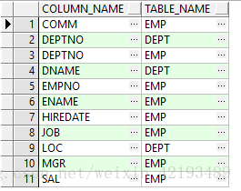
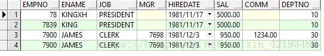
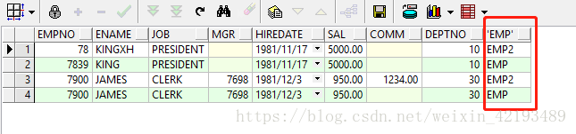

## 多数据源切换demo

- 导入依赖
  - 导入`spring-boot-configuration-processor`注解处理器依赖的主要功能主要是在编译阶段通过修改配置指定不同的数据源
  - ORM插件可选Mybatis-Plus和JPA，这里演示的是Mybatis-Plus，JPA需要修改对应的代码

```xml
        <dependency>
            <groupId>org.springframework.boot</groupId>
            <artifactId>spring-boot-starter-web</artifactId>
        </dependency>

        <dependency>
            <groupId>org.springframework.boot</groupId>
            <artifactId>spring-boot-configuration-processor</artifactId>
        </dependency>

        <!--<dependency>-->
            <!--<groupId>org.springframework.boot</groupId>-->
            <!--<artifactId>spring-boot-starter-data-jpa</artifactId>-->
        <!--</dependency>-->

        <dependency>
            <groupId>org.projectlombok</groupId>
            <artifactId>lombok</artifactId>
        </dependency>

        <dependency>
            <groupId>com.baomidou</groupId>
            <artifactId>mybatis-plus-boot-starter</artifactId>
            <version>3.1.2</version>
        </dependency>

        <dependency>
            <groupId>mysql</groupId>
            <artifactId>mysql-connector-java</artifactId>
            <version>8.0.12</version>
        </dependency>
```

- 创建两个不同的数据库`test1`和`test2`，分别创建`user`表和`person`表

```sql
CREATE TABLE `user` (
  `id` int(11) NOT NULL AUTO_INCREMENT,
  `name` varchar(100) DEFAULT NULL,
  `password` varchar(100) DEFAULT NULL,
  PRIMARY KEY (`id`)
) ENGINE=InnoDB AUTO_INCREMENT=16 DEFAULT CHARSET=utf8

CREATE TABLE `person` (
  `id` int(11) NOT NULL AUTO_INCREMENT,
  `name` varchar(100) DEFAULT NULL,
  `password` varchar(100) DEFAULT NULL,
  PRIMARY KEY (`id`)
) ENGINE=InnoDB AUTO_INCREMENT=16 DEFAULT CHARSET=utf8
```

- 编写配置文件，分别连接不同的数据库

```sql
spring.datasource1.jdbcurl=jdbc:mysql://YOUR_HOST:3306/test1?useSSL=false
spring.datasource1.username=YOUR_USERNAME
spring.datasource1.password=YOUR_PASSWORD
spring.datasource1.driver-class-name=com.mysql.cj.jdbc.Driver

spring.datasource2.jdbcurl=jdbc:mysql://YOUR_HOST:3306/test2?useSSL=false
spring.datasource2.username=YOUR_USERNAME
spring.datasource2.password=YOUR_PASSWORD
spring.datasource2.driver-class-name=com.mysql.cj.jdbc.Driver
```

- 分别定义两个实体对象，这个很简单

```java
import lombok.Data;

@Data
public class User {

    private String id;

    private String name;

    private String password;

}
```

```java
import lombok.Data;

@Data
public class Person {

    private String id;

    private String name;

    private String password;

}
```

- 编写2个配置类，读取不同的数据源，指定对应的mapper文件

```java
import lombok.extern.slf4j.Slf4j;
import org.apache.ibatis.session.SqlSessionFactory;
import org.mybatis.spring.SqlSessionFactoryBean;
import org.mybatis.spring.annotation.MapperScan;
import org.springframework.boot.context.properties.ConfigurationProperties;
import org.springframework.boot.jdbc.DataSourceBuilder;
import org.springframework.context.annotation.Bean;
import org.springframework.context.annotation.Configuration;
import org.springframework.jdbc.datasource.DataSourceTransactionManager;

import javax.sql.DataSource;

@Slf4j
@Configuration
// basePackages指定对应mapper文件的url，定义sqlSessionFactory1的名字用于区分
@MapperScan(basePackages = {"com.example.demo.mapper.source1"}, sqlSessionFactoryRef = "sqlSessionFactory1")
public class DataSource1Config {

    // 指定数据源配置路径的前缀，用于区分数据源
    @ConfigurationProperties(prefix = "spring.datasource1")
    @Bean
    public DataSource dataBase1DataSource() {
        log.info("dataBase1DataSource初始化");
        return DataSourceBuilder.create().build();
    }

    @Bean
    public SqlSessionFactory sqlSessionFactory1(DataSource dataBase1DataSource) throws Exception {
        final SqlSessionFactoryBean sessionFactory = new SqlSessionFactoryBean();
        sessionFactory.setDataSource(dataBase1DataSource);
        return sessionFactory.getObject();
    }

    @Bean
    public DataSourceTransactionManager dataSource1TransactionManager(DataSource dataBase1DataSource) {
        return new DataSourceTransactionManager(dataBase1DataSource);
    }

}
```

```java
import lombok.extern.slf4j.Slf4j;
import org.apache.ibatis.session.SqlSessionFactory;
import org.mybatis.spring.SqlSessionFactoryBean;
import org.mybatis.spring.annotation.MapperScan;
import org.springframework.boot.context.properties.ConfigurationProperties;
import org.springframework.boot.jdbc.DataSourceBuilder;
import org.springframework.context.annotation.Bean;
import org.springframework.context.annotation.Configuration;
import org.springframework.jdbc.datasource.DataSourceTransactionManager;

import javax.sql.DataSource;

@Slf4j
@Configuration
// basePackages指定对应mapper文件的url，定义sqlSessionFactory2的名字用于区分
@MapperScan(basePackages = {"com.example.demo.mapper.source2"}, sqlSessionFactoryRef = "sqlSessionFactory2")
public class DataSource2Config {

    // 指定数据源配置路径的前缀，用于区分数据源
    @ConfigurationProperties(prefix = "spring.datasource2")
    @Bean
    public DataSource dataBase2DataSource() {
        log.info("dataBase2DataSource初始化");
        return DataSourceBuilder.create().build();
    }

    @Bean
    public SqlSessionFactory sqlSessionFactory2(DataSource dataBase2DataSource) throws Exception {
        final SqlSessionFactoryBean sessionFactory = new SqlSessionFactoryBean();
        sessionFactory.setDataSource(dataBase2DataSource);
        return sessionFactory.getObject();
    }

    @Bean
    public DataSourceTransactionManager dataSource2TransactionManager(DataSource dataBase2DataSource) {
        return new DataSourceTransactionManager(dataBase2DataSource);
    }

}
```

- 编写两个mapper接口，注意mapper接口的包路径要和前面配置类的包路径想对应，也不要搞反了也会报错

```java
import com.example.demo.entity.User;
import org.apache.ibatis.annotations.*;

import java.util.List;

@Mapper
public interface UserMapper {

    @Insert("insert into user(name,password) values(#{name},#{password})")
    @Options(useGeneratedKeys = true, keyProperty = "id", keyColumn = "id")
    int insert(User user);

    @Select("select * from user")
    List<User> selectAll();

    @Delete("delete from user")
    void delete();

}
```

```java
import com.example.demo.entity.Person;
import org.apache.ibatis.annotations.*;

import java.util.List;

@Mapper
public interface PersonMapper {

    @Insert("insert into person(name,password) values(#{name},#{password})")
    @Options(useGeneratedKeys = true, keyProperty = "id", keyColumn = "id")
    int insert(Person person);

    @Select("select * from person")
    List<Person> selectAll();

    @Delete("delete from person")
    void delete();

}
```

- 编写主启动类，重写run方法，项目启动的时候进行测试

```java
import com.example.demo.entity.Person;
import com.example.demo.entity.User;
import com.example.demo.mapper.source1.UserMapper;
import com.example.demo.mapper.source2.PersonMapper;
import org.springframework.beans.factory.annotation.Autowired;
import org.springframework.boot.CommandLineRunner;
import org.springframework.boot.SpringApplication;
import org.springframework.boot.autoconfigure.SpringBootApplication;

/**
 * <p>
 * 静态绑定数据源示例
 * </p>
 * @author: zhu.chen
 * @date: 2020/1/17
 * @version: v1.0.0
 */
@SpringBootApplication
public class DemoApplication implements CommandLineRunner {

    public static void main(String[] args) {
        SpringApplication.run(DemoApplication.class, args);
    }

    @Autowired
    private UserMapper userMapper;

    @Autowired
    private PersonMapper personMapper;

    @Override
    public void run(String... args) throws Exception {
        userMapper.delete();
        for (int i = 0; i < 5; i++) {
            User user = new User();
            user.setName("张三" + i);
            user.setPassword("abc" + i);
            userMapper.insert(user);
        }
        System.out.println("user : " + userMapper.selectAll());

        personMapper.delete();
        for (int i = 0; i < 5; i++) {
            Person person = new Person();
            person.setName("小明" + i);
            person.setPassword("efg" + i);
            personMapper.insert(person);
        }
        System.out.println("person : " + personMapper.selectAll());
    }

}
```

- 最终结果就是操作了不同的数据源

## 动态数据源切换demo

- 导入依赖
  - 所需要的依赖和`多数据源切换demo`差不多

```xml
		<dependency>
			<groupId>org.springframework.boot</groupId>
			<artifactId>spring-boot-starter-web</artifactId>
		</dependency>

		<dependency>
			<groupId>org.springframework.boot</groupId>
			<artifactId>spring-boot-configuration-processor</artifactId>
		</dependency>

		<dependency>
			<groupId>org.projectlombok</groupId>
			<artifactId>lombok</artifactId>
		</dependency>

		<dependency>
			<groupId>com.baomidou</groupId>
			<artifactId>mybatis-plus-boot-starter</artifactId>
			<version>3.1.2</version>
		</dependency>

		<dependency>
			<groupId>mysql</groupId>
			<artifactId>mysql-connector-java</artifactId>
			<version>8.0.12</version>
		</dependency>

		<dependency>
			<groupId>org.springframework.boot</groupId>
			<artifactId>spring-boot-starter-test</artifactId>
			<scope>test</scope>
			<exclusions>
				<exclusion>
					<groupId>org.junit.vintage</groupId>
					<artifactId>junit-vintage-engine</artifactId>
				</exclusion>
			</exclusions>
		</dependency>
```

- 数据库也和`多数据源切换demo`一样

- 修改配置文件

```java
# master DB properties:
spring.datasource.default.url=jdbc:mysql://YOUR_HOST:3306/test1?useSSL=false
spring.datasource.default.username=YOUR_USERNAME
spring.datasource.default.password=YOUR_PASSWORD
spring.datasource.default.driver-class-name=com.mysql.cj.jdbc.Driver

# slave DB properties
spring.datasource.master.url=jdbc:mysql://YOUR_HOST:3306/test2?useSSL=false
spring.datasource.master.username=YOUR_USERNAME
spring.datasource.master.password=YOUR_PASSWORD
spring.datasource.master.driver-class-name=com.mysql.cj.jdbc.Driver
```

- 编写两个实体类，和`多数据源切换demo`一样
- 编写一个静态常量类，读取数据库配置

```java
import org.springframework.beans.factory.InitializingBean;
import org.springframework.beans.factory.annotation.Value;
import org.springframework.stereotype.Component;

@Component
public class DataSourceProperties implements InitializingBean {
    @Value("${spring.datasource.default.url}")
    private String defaultDBUrl;
    @Value("${spring.datasource.default.username}")
    private String defaultDBUser;
    @Value("${spring.datasource.default.password}")
    private String defaultDBPassword;
    @Value("${spring.datasource.default.driver-class-name}")
    private String defaultDBDriverName;

    @Value("${spring.datasource.master.url}")
    private String masterDBUrl;
    @Value("${spring.datasource.master.username}")
    private String masterDBUser;
    @Value("${spring.datasource.master.password}")
    private String masterDBPassword;
    @Value("${spring.datasource.default.driver-class-name}")
    private String masterDBDriverName;

    public static String DEFAULT_DB_URL;
    public static String DEFAULT_DB_USER;
    public static String DEFAULT_DB_PASSWORD;
    public static String DEFAULT_DB_DRIVER_NAME;

    public static String MASTER_DB_URL;
    public static String MASTER_DB_USER;
    public static String MASTER_DB_PASSWORD;
    public static String MASTER_DB_DRIVER_NAME;

    @Override
    public void afterPropertiesSet() {
        this.DEFAULT_DB_URL = defaultDBUrl;
        this.DEFAULT_DB_USER = defaultDBUser;
        this.DEFAULT_DB_PASSWORD = defaultDBPassword;
        this.DEFAULT_DB_DRIVER_NAME = defaultDBDriverName;

        this.MASTER_DB_URL = masterDBUrl;
        this.MASTER_DB_USER = masterDBUser;
        this.MASTER_DB_PASSWORD = masterDBPassword;
        this.MASTER_DB_DRIVER_NAME = masterDBDriverName;
    }
}
```

- 编写一个配置类，启动程序的时候默认先加载默认数据库

```java
import com.example.demo1.datasource.DynamicDataSource;
import com.zaxxer.hikari.HikariDataSource;
import org.apache.ibatis.session.SqlSessionFactory;
import org.mybatis.spring.SqlSessionFactoryBean;
import org.mybatis.spring.annotation.MapperScan;
import org.springframework.beans.factory.annotation.Value;
import org.springframework.context.annotation.Bean;
import org.springframework.context.annotation.Configuration;

import javax.sql.DataSource;
import java.util.HashMap;
import java.util.Map;

@Configuration
@MapperScan(basePackages = {"com.example.demo1.mapper"}, sqlSessionFactoryRef = "sqlSessionFactory")
public class DataSourceConfig {
    /**
     * 因为配置类@Configuration的加载顺序比组件类@Component的顺序要早，所以不也能通过DataSourceProperties读取配置
     */
    @Value("${spring.datasource.default.url}")
    private String defaultDBUrl;
    @Value("${spring.datasource.default.username}")
    private String defaultDBUser;
    @Value("${spring.datasource.default.password}")
    private String defaultDBPassword;
    @Value("${spring.datasource.default.driver-class-name}")
    private String defaultDBDriverName;

    @Bean
    public DynamicDataSource dynamicDataSource() {
        DynamicDataSource dynamicDataSource = DynamicDataSource.getInstance();

        HikariDataSource defaultDataSource = new HikariDataSource();
        defaultDataSource.setJdbcUrl(defaultDBUrl);
        defaultDataSource.setUsername(defaultDBUser);
        defaultDataSource.setPassword(defaultDBPassword);
        defaultDataSource.setDriverClassName(defaultDBDriverName);

        Map<Object,Object> map = new HashMap<>();
        map.put("default", defaultDataSource);
        dynamicDataSource.setTargetDataSources(map);
        dynamicDataSource.setDefaultTargetDataSource(defaultDataSource);
        return dynamicDataSource;
    }

    @Bean
    public SqlSessionFactory sqlSessionFactory(DataSource dynamicDataSource) throws Exception {
        SqlSessionFactoryBean bean = new SqlSessionFactoryBean();
        bean.setDataSource(dynamicDataSource);
        return bean.getObject();
    }

}
```

- 自定义动态数据源单例对象，切换不同的数据源操作都是操作这个单例对象

```java
import com.google.common.collect.Maps;
import org.springframework.jdbc.datasource.lookup.AbstractRoutingDataSource;

import java.util.Map;

public class DynamicDataSource extends AbstractRoutingDataSource {

    private static DynamicDataSource instance;

    private static Object lock = new Object();

    private static Map<Object, Object> dataSourceMap = Maps.newConcurrentMap();

    @Override
    protected Object determineCurrentLookupKey() {
        return DynamicDataSourceContextHolder.getDbType();
    }

    @Override
    public void setTargetDataSources(Map<Object, Object> targetDataSources) {
        super.setTargetDataSources(targetDataSources);
        dataSourceMap.putAll(targetDataSources);
        super.afterPropertiesSet();
    }

    /**
     * 懒汉式获取动态数据源单例
     * @return
     */
    public static synchronized DynamicDataSource getInstance(){
        if(instance==null){
            synchronized (lock){
                if(instance==null){
                    instance=new DynamicDataSource();
                }
            }
        }
        return instance;
    }

    public Map<Object, Object> getDataSourceMap() {
        return dataSourceMap;
    }

}
```

- 自定义对象控制数据源的上下文切换，使用[ThreadLocal](https://www.liaoxuefeng.com/wiki/1252599548343744/1306581251653666)保证线程安全，对于`ThreadLocal`，可以简单这样理解：

  - 可以把`ThreadLocal`看成一个全局`Map<Thread, Object>`：每个线程获取`ThreadLocal`变量时，总是使用`Thread`自身作为key：

    ```java
    Object threadLocalValue = threadLocalMap.get(Thread.currentThread());
    ```

  - 因此，`ThreadLocal`相当于给每个线程都开辟了一个独立的存储空间，各个线程的`ThreadLocal`关联的实例互不干扰。

  - `ThreadLocal`要先`set`，然后再`get`，不然get的结果为`null`（一次也没有set）或者上一次`set`的结果

  - 并且`set`的同时，调用工厂更新数据源

```java
import com.example.demo1.factory.DataSourceFactory;

public class DynamicDataSourceContextHolder {

    private static final ThreadLocal<String> dbTypeHolder = new ThreadLocal<String>();

    public static void setDbType(String dbType){
        dbTypeHolder.set(dbType);
        DataSourceFactory.dynamicDataSource(dbType);
    }

    public static String getDbType(){
        return dbTypeHolder.get();
    }

    public static void clearDBType(){
        dbTypeHolder.remove();
    }

}
```

- 自定义简单工厂，根据参数设置不同的数据源

```java
import com.example.demo1.constant.DataSourceProperties;
import com.example.demo1.datasource.DynamicDataSource;
import com.zaxxer.hikari.HikariDataSource;

import java.util.HashMap;
import java.util.Map;

public class DataSourceFactory {
//    public final static String DEFAULT = "default";
    public final static String MASTER = "master";

    public static DynamicDataSource dynamicDataSource(String type) {
        DynamicDataSource dynamicDataSource = DynamicDataSource.getInstance();

        HikariDataSource dataSource = new HikariDataSource();
        if (MASTER.equals(type)) {
            dataSource.setJdbcUrl(DataSourceProperties.MASTER_DB_URL);
            dataSource.setUsername(DataSourceProperties.MASTER_DB_USER);
            dataSource.setPassword(DataSourceProperties.MASTER_DB_PASSWORD);
            dataSource.setDriverClassName(DataSourceProperties.MASTER_DB_DRIVER_NAME);
        } else {
            dataSource.setJdbcUrl(DataSourceProperties.DEFAULT_DB_URL);
            dataSource.setUsername(DataSourceProperties.DEFAULT_DB_USER);
            dataSource.setPassword(DataSourceProperties.DEFAULT_DB_PASSWORD);
            dataSource.setDriverClassName(DataSourceProperties.DEFAULT_DB_DRIVER_NAME);
        }

        Map<Object,Object> map = new HashMap<>();
        map.put(type, dataSource);
        dynamicDataSource.setTargetDataSources(map);
        dynamicDataSource.setDefaultTargetDataSource(dataSource);
        return dynamicDataSource;
    }
}
```

- 重写启动类的run方法，进行测试，就实现了数据源的动态切换

```java
import com.example.demo1.datasource.DynamicDataSourceContextHolder;
import com.example.demo1.entity.Person;
import com.example.demo1.entity.User;
import com.example.demo1.mapper.PersonMapper;
import com.example.demo1.mapper.UserMapper;
import org.springframework.beans.factory.annotation.Autowired;
import org.springframework.boot.CommandLineRunner;
import org.springframework.boot.SpringApplication;
import org.springframework.boot.autoconfigure.SpringBootApplication;

/**
 * <p>
 * 动态绑定数据源示例
 * </p>
 * @author: zhu.chen
 * @date: 2020/1/17
 * @version: v1.0.0
 */
@SpringBootApplication
public class Demo1Application implements CommandLineRunner {

    public static void main(String[] args) {
        SpringApplication.run(Demo1Application.class, args);
    }

    @Autowired
    private UserMapper userMapper;

    @Autowired
    private PersonMapper personMapper;

    @Override
    public void run(String... args) throws Exception {
        DynamicDataSourceContextHolder.setDbType("default");
        userMapper.delete();
        for (int i = 0; i < 5; i++) {
            User user = new User();
            user.setName("张三" + i);
            user.setPassword("abc" + i);
            userMapper.insert(user);
        }
        System.out.println("user : " + userMapper.selectAll());

        DynamicDataSourceContextHolder.setDbType("master");
        personMapper.delete();
        for (int i = 0; i < 5; i++) {
            Person person = new Person();
            person.setName("小明" + i);
            person.setPassword("efg" + i);
            personMapper.insert(person);
        }
        System.out.println("person : " + personMapper.selectAll());
    }

}
```

## SQL比较两张表结构差异、两张结构相同表的数据差异

主要使用到union和minus这两个关键字，但是MySQL不支持minus

> 比较表结构

```sql
(select column_name,table_name
	from user_tab_columns
	where table_name = 'EMP'
minus
select column_name,table_name
	from user_tab_columns
	where table_name = 'DEPT')
union 
(select column_name,table_name
	from user_tab_columns
	where table_name = 'DEPT'
minus
select column_name,table_name
	from user_tab_columns
	where table_name = 'EMP');
```

***注意：表结构信息存储在user_tab_columns，规定表的名称全部为大写形式***



结果：得到了两张表不同结构的列名，以及表名

> 比较表数据：

```sql
(select * from EMP 
 minus
select *from EMP2)
union 
(select * from EMP2
minus
select * from EMP)
```

**注意：前提是表结构一样，可以进行数据差异查询**
得到下列结果：



结果：得到了两张结构相同表的差异数据

但是无法区分哪一行的数据，属于那张表，因此加上子查询，利用虚拟列名称，进行区分·，sql如下所示：

```sql
select a.*,'EMP' from 
	(select *from EMP
	minus
	select * FROM EMP2)  a
union 
select b.*,'EMP2' from
	(select * from EMP2
	minus
	select * FROM EMP) b
```

得到的查询结果，如下所示：


