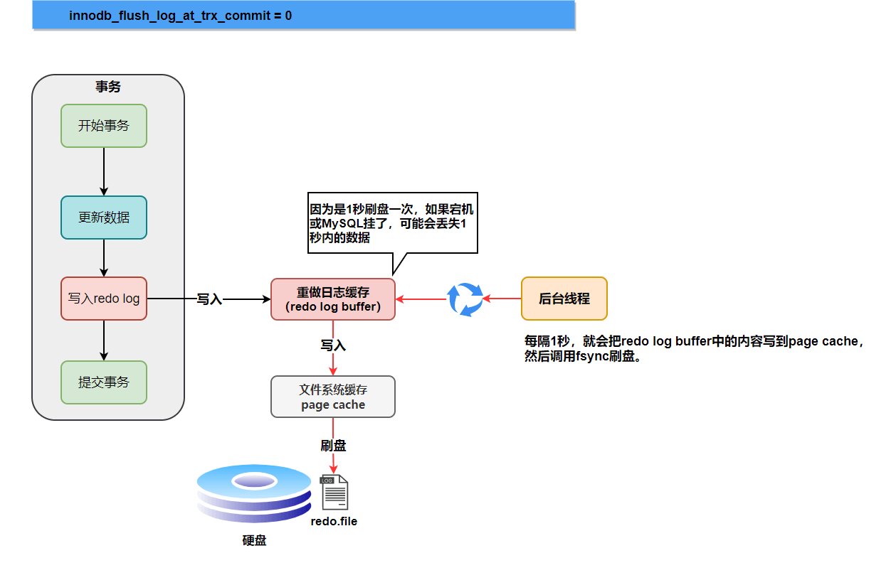
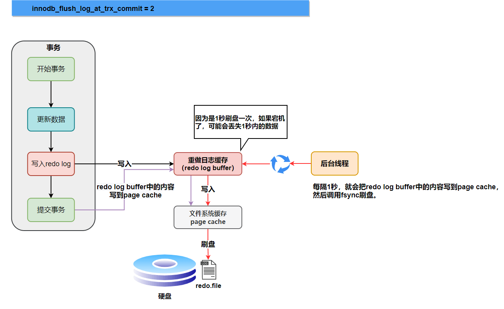
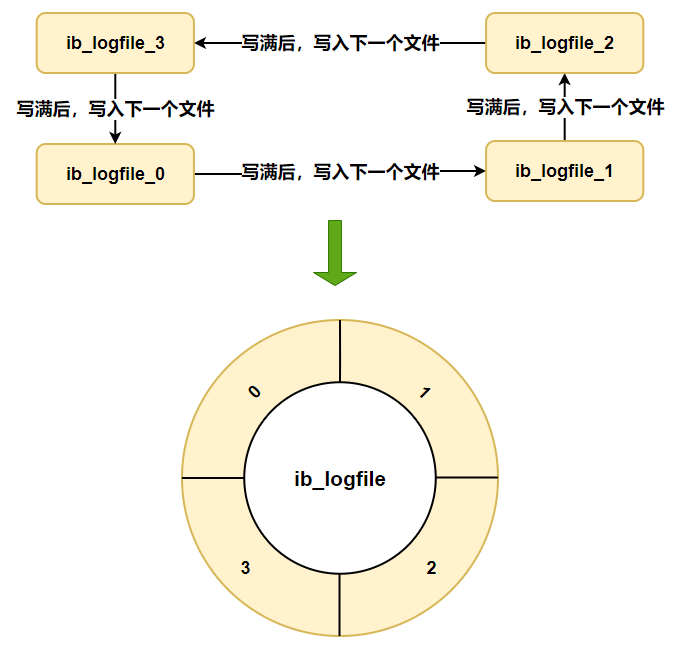

## 多数据源切换demo

- 导入依赖
  - 导入`spring-boot-configuration-processor`注解处理器依赖的主要功能主要是在编译阶段通过修改配置指定不同的数据源
  - ORM插件可选Mybatis-Plus和JPA，这里演示的是Mybatis-Plus，JPA需要修改对应的代码

```xml
        <dependency>
            <groupId>org.springframework.boot</groupId>
            <artifactId>spring-boot-starter-web</artifactId>
        </dependency>

        <dependency>
            <groupId>org.springframework.boot</groupId>
            <artifactId>spring-boot-configuration-processor</artifactId>
        </dependency>

        <!--<dependency>-->
            <!--<groupId>org.springframework.boot</groupId>-->
            <!--<artifactId>spring-boot-starter-data-jpa</artifactId>-->
        <!--</dependency>-->

        <dependency>
            <groupId>org.projectlombok</groupId>
            <artifactId>lombok</artifactId>
        </dependency>

        <dependency>
            <groupId>com.baomidou</groupId>
            <artifactId>mybatis-plus-boot-starter</artifactId>
            <version>3.1.2</version>
        </dependency>

        <dependency>
            <groupId>mysql</groupId>
            <artifactId>mysql-connector-java</artifactId>
            <version>8.0.12</version>
        </dependency>
```

- 创建两个不同的数据库`test1`和`test2`，分别创建`user`表和`person`表

```sql
CREATE TABLE `user` (
  `id` int(11) NOT NULL AUTO_INCREMENT,
  `name` varchar(100) DEFAULT NULL,
  `password` varchar(100) DEFAULT NULL,
  PRIMARY KEY (`id`)
) ENGINE=InnoDB AUTO_INCREMENT=16 DEFAULT CHARSET=utf8

CREATE TABLE `person` (
  `id` int(11) NOT NULL AUTO_INCREMENT,
  `name` varchar(100) DEFAULT NULL,
  `password` varchar(100) DEFAULT NULL,
  PRIMARY KEY (`id`)
) ENGINE=InnoDB AUTO_INCREMENT=16 DEFAULT CHARSET=utf8
```

- 编写配置文件，分别连接不同的数据库

```sql
spring.datasource1.jdbcurl=jdbc:mysql://YOUR_HOST:3306/test1?useSSL=false
spring.datasource1.username=YOUR_USERNAME
spring.datasource1.password=YOUR_PASSWORD
spring.datasource1.driver-class-name=com.mysql.cj.jdbc.Driver

spring.datasource2.jdbcurl=jdbc:mysql://YOUR_HOST:3306/test2?useSSL=false
spring.datasource2.username=YOUR_USERNAME
spring.datasource2.password=YOUR_PASSWORD
spring.datasource2.driver-class-name=com.mysql.cj.jdbc.Driver
```

- 分别定义两个实体对象，这个很简单

```java
import lombok.Data;

@Data
public class User {

    private String id;

    private String name;

    private String password;

}
```

```java
import lombok.Data;

@Data
public class Person {

    private String id;

    private String name;

    private String password;

}
```

- 编写2个配置类，读取不同的数据源，指定对应的mapper文件

```java
import lombok.extern.slf4j.Slf4j;
import org.apache.ibatis.session.SqlSessionFactory;
import org.mybatis.spring.SqlSessionFactoryBean;
import org.mybatis.spring.annotation.MapperScan;
import org.springframework.boot.context.properties.ConfigurationProperties;
import org.springframework.boot.jdbc.DataSourceBuilder;
import org.springframework.context.annotation.Bean;
import org.springframework.context.annotation.Configuration;
import org.springframework.jdbc.datasource.DataSourceTransactionManager;

import javax.sql.DataSource;

@Slf4j
@Configuration
// basePackages指定对应mapper文件的url，定义sqlSessionFactory1的名字用于区分
@MapperScan(basePackages = {"com.example.demo.mapper.source1"}, sqlSessionFactoryRef = "sqlSessionFactory1")
public class DataSource1Config {

    // 指定数据源配置路径的前缀，用于区分数据源
    @ConfigurationProperties(prefix = "spring.datasource1")
    @Bean
    public DataSource dataBase1DataSource() {
        log.info("dataBase1DataSource初始化");
        return DataSourceBuilder.create().build();
    }

    @Bean
    public SqlSessionFactory sqlSessionFactory1(DataSource dataBase1DataSource) throws Exception {
        final SqlSessionFactoryBean sessionFactory = new SqlSessionFactoryBean();
        sessionFactory.setDataSource(dataBase1DataSource);
        return sessionFactory.getObject();
    }

    @Bean
    public DataSourceTransactionManager dataSource1TransactionManager(DataSource dataBase1DataSource) {
        return new DataSourceTransactionManager(dataBase1DataSource);
    }

}
```

```java
import lombok.extern.slf4j.Slf4j;
import org.apache.ibatis.session.SqlSessionFactory;
import org.mybatis.spring.SqlSessionFactoryBean;
import org.mybatis.spring.annotation.MapperScan;
import org.springframework.boot.context.properties.ConfigurationProperties;
import org.springframework.boot.jdbc.DataSourceBuilder;
import org.springframework.context.annotation.Bean;
import org.springframework.context.annotation.Configuration;
import org.springframework.jdbc.datasource.DataSourceTransactionManager;

import javax.sql.DataSource;

@Slf4j
@Configuration
// basePackages指定对应mapper文件的url，定义sqlSessionFactory2的名字用于区分
@MapperScan(basePackages = {"com.example.demo.mapper.source2"}, sqlSessionFactoryRef = "sqlSessionFactory2")
public class DataSource2Config {

    // 指定数据源配置路径的前缀，用于区分数据源
    @ConfigurationProperties(prefix = "spring.datasource2")
    @Bean
    public DataSource dataBase2DataSource() {
        log.info("dataBase2DataSource初始化");
        return DataSourceBuilder.create().build();
    }

    @Bean
    public SqlSessionFactory sqlSessionFactory2(DataSource dataBase2DataSource) throws Exception {
        final SqlSessionFactoryBean sessionFactory = new SqlSessionFactoryBean();
        sessionFactory.setDataSource(dataBase2DataSource);
        return sessionFactory.getObject();
    }

    @Bean
    public DataSourceTransactionManager dataSource2TransactionManager(DataSource dataBase2DataSource) {
        return new DataSourceTransactionManager(dataBase2DataSource);
    }

}
```

- 编写两个mapper接口，注意mapper接口的包路径要和前面配置类的包路径想对应，也不要搞反了也会报错

```java
import com.example.demo.entity.User;
import org.apache.ibatis.annotations.*;

import java.util.List;

@Mapper
public interface UserMapper {

    @Insert("insert into user(name,password) values(#{name},#{password})")
    @Options(useGeneratedKeys = true, keyProperty = "id", keyColumn = "id")
    int insert(User user);

    @Select("select * from user")
    List<User> selectAll();

    @Delete("delete from user")
    void delete();

}
```

```java
import com.example.demo.entity.Person;
import org.apache.ibatis.annotations.*;

import java.util.List;

@Mapper
public interface PersonMapper {

    @Insert("insert into person(name,password) values(#{name},#{password})")
    @Options(useGeneratedKeys = true, keyProperty = "id", keyColumn = "id")
    int insert(Person person);

    @Select("select * from person")
    List<Person> selectAll();

    @Delete("delete from person")
    void delete();

}
```

- 编写主启动类，重写run方法，项目启动的时候进行测试

```java
import com.example.demo.entity.Person;
import com.example.demo.entity.User;
import com.example.demo.mapper.source1.UserMapper;
import com.example.demo.mapper.source2.PersonMapper;
import org.springframework.beans.factory.annotation.Autowired;
import org.springframework.boot.CommandLineRunner;
import org.springframework.boot.SpringApplication;
import org.springframework.boot.autoconfigure.SpringBootApplication;

/**
 * <p>
 * 静态绑定数据源示例
 * </p>
 * @author: zhu.chen
 * @date: 2020/1/17
 * @version: v1.0.0
 */
@SpringBootApplication
public class DemoApplication implements CommandLineRunner {

    public static void main(String[] args) {
        SpringApplication.run(DemoApplication.class, args);
    }

    @Autowired
    private UserMapper userMapper;

    @Autowired
    private PersonMapper personMapper;

    @Override
    public void run(String... args) throws Exception {
        userMapper.delete();
        for (int i = 0; i < 5; i++) {
            User user = new User();
            user.setName("张三" + i);
            user.setPassword("abc" + i);
            userMapper.insert(user);
        }
        System.out.println("user : " + userMapper.selectAll());

        personMapper.delete();
        for (int i = 0; i < 5; i++) {
            Person person = new Person();
            person.setName("小明" + i);
            person.setPassword("efg" + i);
            personMapper.insert(person);
        }
        System.out.println("person : " + personMapper.selectAll());
    }

}
```

- 最终结果就是操作了不同的数据源

## 动态数据源切换demo

- 导入依赖
  - 所需要的依赖和`多数据源切换demo`差不多

```xml
		<dependency>
			<groupId>org.springframework.boot</groupId>
			<artifactId>spring-boot-starter-web</artifactId>
		</dependency>

		<dependency>
			<groupId>org.springframework.boot</groupId>
			<artifactId>spring-boot-configuration-processor</artifactId>
		</dependency>

		<dependency>
			<groupId>org.projectlombok</groupId>
			<artifactId>lombok</artifactId>
		</dependency>

		<dependency>
			<groupId>com.baomidou</groupId>
			<artifactId>mybatis-plus-boot-starter</artifactId>
			<version>3.1.2</version>
		</dependency>

		<dependency>
			<groupId>mysql</groupId>
			<artifactId>mysql-connector-java</artifactId>
			<version>8.0.12</version>
		</dependency>

		<dependency>
			<groupId>org.springframework.boot</groupId>
			<artifactId>spring-boot-starter-test</artifactId>
			<scope>test</scope>
			<exclusions>
				<exclusion>
					<groupId>org.junit.vintage</groupId>
					<artifactId>junit-vintage-engine</artifactId>
				</exclusion>
			</exclusions>
		</dependency>
```

- 数据库也和`多数据源切换demo`一样

- 修改配置文件

```java
# master DB properties:
spring.datasource.default.url=jdbc:mysql://YOUR_HOST:3306/test1?useSSL=false
spring.datasource.default.username=YOUR_USERNAME
spring.datasource.default.password=YOUR_PASSWORD
spring.datasource.default.driver-class-name=com.mysql.cj.jdbc.Driver

# slave DB properties
spring.datasource.master.url=jdbc:mysql://YOUR_HOST:3306/test2?useSSL=false
spring.datasource.master.username=YOUR_USERNAME
spring.datasource.master.password=YOUR_PASSWORD
spring.datasource.master.driver-class-name=com.mysql.cj.jdbc.Driver
```

- 编写两个实体类，和`多数据源切换demo`一样
- 编写一个静态常量类，读取数据库配置

```java
import org.springframework.beans.factory.InitializingBean;
import org.springframework.beans.factory.annotation.Value;
import org.springframework.stereotype.Component;

@Component
public class DataSourceProperties implements InitializingBean {
    @Value("${spring.datasource.default.url}")
    private String defaultDBUrl;
    @Value("${spring.datasource.default.username}")
    private String defaultDBUser;
    @Value("${spring.datasource.default.password}")
    private String defaultDBPassword;
    @Value("${spring.datasource.default.driver-class-name}")
    private String defaultDBDriverName;

    @Value("${spring.datasource.master.url}")
    private String masterDBUrl;
    @Value("${spring.datasource.master.username}")
    private String masterDBUser;
    @Value("${spring.datasource.master.password}")
    private String masterDBPassword;
    @Value("${spring.datasource.default.driver-class-name}")
    private String masterDBDriverName;

    public static String DEFAULT_DB_URL;
    public static String DEFAULT_DB_USER;
    public static String DEFAULT_DB_PASSWORD;
    public static String DEFAULT_DB_DRIVER_NAME;

    public static String MASTER_DB_URL;
    public static String MASTER_DB_USER;
    public static String MASTER_DB_PASSWORD;
    public static String MASTER_DB_DRIVER_NAME;

    @Override
    public void afterPropertiesSet() {
        this.DEFAULT_DB_URL = defaultDBUrl;
        this.DEFAULT_DB_USER = defaultDBUser;
        this.DEFAULT_DB_PASSWORD = defaultDBPassword;
        this.DEFAULT_DB_DRIVER_NAME = defaultDBDriverName;

        this.MASTER_DB_URL = masterDBUrl;
        this.MASTER_DB_USER = masterDBUser;
        this.MASTER_DB_PASSWORD = masterDBPassword;
        this.MASTER_DB_DRIVER_NAME = masterDBDriverName;
    }
}
```

- 编写一个配置类，启动程序的时候默认先加载默认数据库

```java
import com.example.demo1.datasource.DynamicDataSource;
import com.zaxxer.hikari.HikariDataSource;
import org.apache.ibatis.session.SqlSessionFactory;
import org.mybatis.spring.SqlSessionFactoryBean;
import org.mybatis.spring.annotation.MapperScan;
import org.springframework.beans.factory.annotation.Value;
import org.springframework.context.annotation.Bean;
import org.springframework.context.annotation.Configuration;

import javax.sql.DataSource;
import java.util.HashMap;
import java.util.Map;

@Configuration
@MapperScan(basePackages = {"com.example.demo1.mapper"}, sqlSessionFactoryRef = "sqlSessionFactory")
public class DataSourceConfig {
    /**
     * 因为配置类@Configuration的加载顺序比组件类@Component的顺序要早，所以不也能通过DataSourceProperties读取配置
     */
    @Value("${spring.datasource.default.url}")
    private String defaultDBUrl;
    @Value("${spring.datasource.default.username}")
    private String defaultDBUser;
    @Value("${spring.datasource.default.password}")
    private String defaultDBPassword;
    @Value("${spring.datasource.default.driver-class-name}")
    private String defaultDBDriverName;

    @Bean
    public DynamicDataSource dynamicDataSource() {
        DynamicDataSource dynamicDataSource = DynamicDataSource.getInstance();

        HikariDataSource defaultDataSource = new HikariDataSource();
        defaultDataSource.setJdbcUrl(defaultDBUrl);
        defaultDataSource.setUsername(defaultDBUser);
        defaultDataSource.setPassword(defaultDBPassword);
        defaultDataSource.setDriverClassName(defaultDBDriverName);

        Map<Object,Object> map = new HashMap<>();
        map.put("default", defaultDataSource);
        dynamicDataSource.setTargetDataSources(map);
        dynamicDataSource.setDefaultTargetDataSource(defaultDataSource);
        return dynamicDataSource;
    }

    @Bean
    public SqlSessionFactory sqlSessionFactory(DataSource dynamicDataSource) throws Exception {
        SqlSessionFactoryBean bean = new SqlSessionFactoryBean();
        bean.setDataSource(dynamicDataSource);
        return bean.getObject();
    }

}
```

- 自定义动态数据源单例对象，切换不同的数据源操作都是操作这个单例对象

```java
import com.google.common.collect.Maps;
import org.springframework.jdbc.datasource.lookup.AbstractRoutingDataSource;

import java.util.Map;

public class DynamicDataSource extends AbstractRoutingDataSource {

    private static DynamicDataSource instance;

    private static Object lock = new Object();

    private static Map<Object, Object> dataSourceMap = Maps.newConcurrentMap();

    @Override
    protected Object determineCurrentLookupKey() {
        return DynamicDataSourceContextHolder.getDbType();
    }

    @Override
    public void setTargetDataSources(Map<Object, Object> targetDataSources) {
        super.setTargetDataSources(targetDataSources);
        dataSourceMap.putAll(targetDataSources);
        super.afterPropertiesSet();
    }

    /**
     * 懒汉式获取动态数据源单例
     * @return
     */
    public static synchronized DynamicDataSource getInstance(){
        if(instance==null){
            synchronized (lock){
                if(instance==null){
                    instance=new DynamicDataSource();
                }
            }
        }
        return instance;
    }

    public Map<Object, Object> getDataSourceMap() {
        return dataSourceMap;
    }

}
```

- 自定义对象控制数据源的上下文切换，使用[ThreadLocal](https://www.liaoxuefeng.com/wiki/1252599548343744/1306581251653666)保证线程安全，对于`ThreadLocal`，可以简单这样理解：

  - 可以把`ThreadLocal`看成一个全局`Map<Thread, Object>`：每个线程获取`ThreadLocal`变量时，总是使用`Thread`自身作为key：

    ```java
    Object threadLocalValue = threadLocalMap.get(Thread.currentThread());
    ```

  - 因此，`ThreadLocal`相当于给每个线程都开辟了一个独立的存储空间，各个线程的`ThreadLocal`关联的实例互不干扰。

  - `ThreadLocal`要先`set`，然后再`get`，不然get的结果为`null`（一次也没有set）或者上一次`set`的结果

  - 并且`set`的同时，调用工厂更新数据源

```java
import com.example.demo1.factory.DataSourceFactory;

public class DynamicDataSourceContextHolder {

    private static final ThreadLocal<String> dbTypeHolder = new ThreadLocal<String>();

    public static void setDbType(String dbType){
        dbTypeHolder.set(dbType);
        DataSourceFactory.dynamicDataSource(dbType);
    }

    public static String getDbType(){
        return dbTypeHolder.get();
    }

    public static void clearDBType(){
        dbTypeHolder.remove();
    }

}
```

- 自定义简单工厂，根据参数设置不同的数据源

```java
import com.example.demo1.constant.DataSourceProperties;
import com.example.demo1.datasource.DynamicDataSource;
import com.zaxxer.hikari.HikariDataSource;

import java.util.HashMap;
import java.util.Map;

public class DataSourceFactory {
//    public final static String DEFAULT = "default";
    public final static String MASTER = "master";

    public static DynamicDataSource dynamicDataSource(String type) {
        DynamicDataSource dynamicDataSource = DynamicDataSource.getInstance();

        HikariDataSource dataSource = new HikariDataSource();
        if (MASTER.equals(type)) {
            dataSource.setJdbcUrl(DataSourceProperties.MASTER_DB_URL);
            dataSource.setUsername(DataSourceProperties.MASTER_DB_USER);
            dataSource.setPassword(DataSourceProperties.MASTER_DB_PASSWORD);
            dataSource.setDriverClassName(DataSourceProperties.MASTER_DB_DRIVER_NAME);
        } else {
            dataSource.setJdbcUrl(DataSourceProperties.DEFAULT_DB_URL);
            dataSource.setUsername(DataSourceProperties.DEFAULT_DB_USER);
            dataSource.setPassword(DataSourceProperties.DEFAULT_DB_PASSWORD);
            dataSource.setDriverClassName(DataSourceProperties.DEFAULT_DB_DRIVER_NAME);
        }

        Map<Object,Object> map = new HashMap<>();
        map.put(type, dataSource);
        dynamicDataSource.setTargetDataSources(map);
        dynamicDataSource.setDefaultTargetDataSource(dataSource);
        return dynamicDataSource;
    }
}
```

- 重写启动类的run方法，进行测试，就实现了数据源的动态切换

```java
import com.example.demo1.datasource.DynamicDataSourceContextHolder;
import com.example.demo1.entity.Person;
import com.example.demo1.entity.User;
import com.example.demo1.mapper.PersonMapper;
import com.example.demo1.mapper.UserMapper;
import org.springframework.beans.factory.annotation.Autowired;
import org.springframework.boot.CommandLineRunner;
import org.springframework.boot.SpringApplication;
import org.springframework.boot.autoconfigure.SpringBootApplication;

/**
 * <p>
 * 动态绑定数据源示例
 * </p>
 * @author: zhu.chen
 * @date: 2020/1/17
 * @version: v1.0.0
 */
@SpringBootApplication
public class Demo1Application implements CommandLineRunner {

    public static void main(String[] args) {
        SpringApplication.run(Demo1Application.class, args);
    }

    @Autowired
    private UserMapper userMapper;

    @Autowired
    private PersonMapper personMapper;

    @Override
    public void run(String... args) throws Exception {
        DynamicDataSourceContextHolder.setDbType("default");
        userMapper.delete();
        for (int i = 0; i < 5; i++) {
            User user = new User();
            user.setName("张三" + i);
            user.setPassword("abc" + i);
            userMapper.insert(user);
        }
        System.out.println("user : " + userMapper.selectAll());

        DynamicDataSourceContextHolder.setDbType("master");
        personMapper.delete();
        for (int i = 0; i < 5; i++) {
            Person person = new Person();
            person.setName("小明" + i);
            person.setPassword("efg" + i);
            personMapper.insert(person);
        }
        System.out.println("person : " + personMapper.selectAll());
    }

}
```

## SQL比较两张表结构差异、两张结构相同表的数据差异

主要使用到union和minus这两个关键字，但是MySQL不支持minus

> 比较表结构

```sql
(select column_name,table_name
	from user_tab_columns
	where table_name = 'EMP'
minus
select column_name,table_name
	from user_tab_columns
	where table_name = 'DEPT')
union 
(select column_name,table_name
	from user_tab_columns
	where table_name = 'DEPT'
minus
select column_name,table_name
	from user_tab_columns
	where table_name = 'EMP');
```

***注意：表结构信息存储在user_tab_columns，规定表的名称全部为大写形式***


结果：得到了两张表不同结构的列名，以及表名

> 比较表数据：

```sql
(select * from EMP 
 minus
select *from EMP2)
union 
(select * from EMP2
minus
select * from EMP)
```

**注意：前提是表结构一样，可以进行数据差异查询**
得到下列结果：


结果：得到了两张结构相同表的差异数据

但是无法区分哪一行的数据，属于那张表，因此加上子查询，利用虚拟列名称，进行区分·，sql如下所示：

```sql
select a.*,'EMP' from 
	(select *from EMP
	minus
	select * FROM EMP2)  a
union 
select b.*,'EMP2' from
	(select * from EMP2
	minus
	select * FROM EMP) b
```

得到的查询结果，如下所示：


## MySQL三大日志(binlog、redo log和undo log)详解

### 前言

`MySQL` 日志 主要包括错误日志、查询日志、慢查询日志、事务日志、二进制日志几大类。其中，比较重要的还要属二进制日志 `binlog`（归档日志）和事务日志 `redo log`（重做日志）和 `undo log`（回滚日志）。


今天就来聊聊 `redo log`（重做日志）、`binlog`（归档日志）、两阶段提交、`undo log` （回滚日志）。

### redo log

`redo log`（重做日志）是`InnoDB`存储引擎独有的，它让`MySQL`拥有了崩溃恢复能力。

比如 `MySQL` 实例挂了或宕机了，重启时，`InnoDB`存储引擎会使用`redo log`恢复数据，保证数据的持久性与完整性。


`MySQL` 中数据是以页为单位，你查询一条记录，会从硬盘把一页的数据加载出来，加载出来的数据叫数据页，会放入到 `Buffer Pool` 中。

后续的查询都是先从 `Buffer Pool` 中找，没有命中再去硬盘加载，减少硬盘 `IO` 开销，提升性能。

更新表数据的时候，也是如此，发现 `Buffer Pool` 里存在要更新的数据，就直接在 `Buffer Pool` 里更新。

然后会把“在某个数据页上做了什么修改”记录到重做日志缓存（`redo log buffer`）里，接着刷盘到 `redo log` 文件里。


> 图片笔误提示：第 4 步 “清空 redo log buffe 刷盘到 redo 日志中”这句话中的 buffe 应该是 buffer。

理想情况，事务一提交就会进行刷盘操作，但实际上，刷盘的时机是根据策略来进行的。

> 小贴士：每条 redo 记录由“表空间号+数据页号+偏移量+修改数据长度+具体修改的数据”组成

#### 刷盘时机

`InnoDB` 存储引擎为 `redo log` 的刷盘策略提供了 `innodb_flush_log_at_trx_commit` 参数，它支持三种策略：

- **0** ：设置为 0 的时候，表示每次事务提交时不进行刷盘操作
- **1** ：设置为 1 的时候，表示每次事务提交时都将进行刷盘操作（默认值）
- **2** ：设置为 2 的时候，表示每次事务提交时都只把 redo log buffer 内容写入 page cache

`innodb_flush_log_at_trx_commit` 参数默认为 1 ，也就是说当事务提交时会调用 `fsync` 对 redo log 进行刷盘

另外，`InnoDB` 存储引擎有一个后台线程，每隔`1` 秒，就会把 `redo log buffer` 中的内容写到文件系统缓存（`page cache`），然后调用 `fsync` 刷盘。


也就是说，一个没有提交事务的 `redo log` 记录，也可能会刷盘。

**为什么呢？**

因为在事务执行过程 `redo log` 记录是会写入`redo log buffer` 中，这些 `redo log` 记录会被后台线程刷盘。


除了后台线程每秒`1`次的轮询操作，还有一种情况，当 `redo log buffer` 占用的空间即将达到 `innodb_log_buffer_size` 一半的时候，后台线程会主动刷盘。

下面是不同刷盘策略的流程图。

##### innodb_flush_log_at_trx_commit=0



为`0`时，如果`MySQL`挂了或宕机可能会有`1`秒数据的丢失。

##### innodb_flush_log_at_trx_commit=1


为`1`时， 只要事务提交成功，`redo log`记录就一定在硬盘里，不会有任何数据丢失。

如果事务执行期间`MySQL`挂了或宕机，这部分日志丢了，但是事务并没有提交，所以日志丢了也不会有损失。

##### innodb_flush_log_at_trx_commit=2



为`2`时， 只要事务提交成功，`redo log buffer`中的内容只写入文件系统缓存（`page cache`）。

如果仅仅只是`MySQL`挂了不会有任何数据丢失，但是宕机可能会有`1`秒数据的丢失。

#### 日志文件组

硬盘上存储的 `redo log` 日志文件不只一个，而是以一个**日志文件组**的形式出现的，每个的`redo`日志文件大小都是一样的。

比如可以配置为一组`4`个文件，每个文件的大小是 `1GB`，整个 `redo log` 日志文件组可以记录`4G`的内容。

它采用的是环形数组形式，从头开始写，写到末尾又回到头循环写，如下图所示。



在个**日志文件组**中还有两个重要的属性，分别是 `write pos、checkpoint`

- **write pos** 是当前记录的位置，一边写一边后移
- **checkpoint** 是当前要擦除的位置，也是往后推移

每次刷盘 `redo log` 记录到**日志文件组**中，`write pos` 位置就会后移更新。

每次 `MySQL` 加载**日志文件组**恢复数据时，会清空加载过的 `redo log` 记录，并把 `checkpoint` 后移更新。

`write pos` 和 `checkpoint` 之间的还空着的部分可以用来写入新的 `redo log` 记录。


如果 `write pos` 追上 `checkpoint` ，表示**日志文件组**满了，这时候不能再写入新的 `redo log` 记录，`MySQL` 得停下来，清空一些记录，把 `checkpoint` 推进一下。


#### redo log 小结

相信大家都知道 `redo log` 的作用和它的刷盘时机、存储形式。

现在我们来思考一个问题： **只要每次把修改后的数据页直接刷盘不就好了，还有 `redo log` 什么事？**

它们不都是刷盘么？差别在哪里？

```ini
1 Byte = 8bit
1 KB = 1024 Byte
1 MB = 1024 KB
1 GB = 1024 MB
1 TB = 1024 GB
```

实际上，数据页大小是`16KB`，刷盘比较耗时，可能就修改了数据页里的几 `Byte` 数据，有必要把完整的数据页刷盘吗？

而且数据页刷盘是随机写，因为一个数据页对应的位置可能在硬盘文件的随机位置，所以性能是很差。

如果是写 `redo log`，一行记录可能就占几十 `Byte`，只包含表空间号、数据页号、磁盘文件偏移 量、更新值，再加上是顺序写，所以刷盘速度很快。

所以用 `redo log` 形式记录修改内容，性能会远远超过刷数据页的方式，这也让数据库的并发能力更强。

> 其实内存的数据页在一定时机也会刷盘，我们把这称为页合并，讲 `Buffer Pool`的时候会对这块细说

### binlog

`redo log` 它是物理日志，记录内容是“在某个数据页上做了什么修改”，属于 `InnoDB` 存储引擎。

而 `binlog` 是逻辑日志，记录内容是语句的原始逻辑，类似于“给 ID=2 这一行的 c 字段加 1”，属于`MySQL Server` 层。

不管用什么存储引擎，只要发生了表数据更新，都会产生 `binlog` 日志。

那 `binlog` 到底是用来干嘛的？

可以说`MySQL`数据库的**数据备份、主备、主主、主从**都离不开`binlog`，需要依靠`binlog`来同步数据，保证数据一致性。


`binlog`会记录所有涉及更新数据的逻辑操作，并且是顺序写。

#### 记录格式

`binlog` 日志有三种格式，可以通过`binlog_format`参数指定。

- **statement**
- **row**
- **mixed**

指定`statement`，记录的内容是`SQL`语句原文，比如执行一条`update T set update_time=now() where id=1`，记录的内容如下。


同步数据时，会执行记录的`SQL`语句，但是有个问题，`update_time=now()`这里会获取当前系统时间，直接执行会导致与原库的数据不一致。

为了解决这种问题，我们需要指定为`row`，记录的内容不再是简单的`SQL`语句了，还包含操作的具体数据，记录内容如下。


`row`格式记录的内容看不到详细信息，要通过`mysqlbinlog`工具解析出来。

`update_time=now()`变成了具体的时间`update_time=1627112756247`，条件后面的@1、@2、@3 都是该行数据第 1 个~3 个字段的原始值（**假设这张表只有 3 个字段**）。

这样就能保证同步数据的一致性，通常情况下都是指定为`row`，这样可以为数据库的恢复与同步带来更好的可靠性。

但是这种格式，需要更大的容量来记录，比较占用空间，恢复与同步时会更消耗`IO`资源，影响执行速度。

所以就有了一种折中的方案，指定为`mixed`，记录的内容是前两者的混合。

`MySQL`会判断这条`SQL`语句是否可能引起数据不一致，如果是，就用`row`格式，否则就用`statement`格式。

#### 写入机制

`binlog`的写入时机也非常简单，事务执行过程中，先把日志写到`binlog cache`，事务提交的时候，再把`binlog cache`写到`binlog`文件中。

因为一个事务的`binlog`不能被拆开，无论这个事务多大，也要确保一次性写入，所以系统会给每个线程分配一个块内存作为`binlog cache`。

我们可以通过`binlog_cache_size`参数控制单个线程 binlog cache 大小，如果存储内容超过了这个参数，就要暂存到磁盘（`Swap`）。

`binlog`日志刷盘流程如下


- **上图的 write，是指把日志写入到文件系统的 page cache，并没有把数据持久化到磁盘，所以速度比较快**
- **上图的 fsync，才是将数据持久化到磁盘的操作**

`write`和`fsync`的时机，可以由参数`sync_binlog`控制，默认是`0`。

为`0`的时候，表示每次提交事务都只`write`，由系统自行判断什么时候执行`fsync`。


虽然性能得到提升，但是机器宕机，`page cache`里面的 binlog 会丢失。

为了安全起见，可以设置为`1`，表示每次提交事务都会执行`fsync`，就如同 **redo log 日志刷盘流程** 一样。

最后还有一种折中方式，可以设置为`N(N>1)`，表示每次提交事务都`write`，但累积`N`个事务后才`fsync`。


在出现`IO`瓶颈的场景里，将`sync_binlog`设置成一个比较大的值，可以提升性能。

同样的，如果机器宕机，会丢失最近`N`个事务的`binlog`日志。

### 两阶段提交

虽然它们都属于持久化的保证，但是侧重点不同。

在执行更新语句过程，会记录`redo log`与`binlog`两块日志，以基本的事务为单位，`redo log`在事务执行过程中可以不断写入，而`binlog`只有在提交事务时才写入，所以`redo log`与`binlog`的写入时机不一样。


回到正题，`redo log`与`binlog`两份日志之间的逻辑不一致，会出现什么问题？

我们以`update`语句为例，假设`id=2`的记录，字段`c`值是`0`，把字段`c`值更新成`1`，`SQL`语句为`update T set c=1 where id=2`。

假设执行过程中写完`redo log`日志后，`binlog`日志写期间发生了异常，会出现什么情况呢？


由于`binlog`没写完就异常，这时候`binlog`里面没有对应的修改记录。因此，之后用`binlog`日志恢复数据时，就会少这一次更新，恢复出来的这一行`c`值是`0`，而原库因为`redo log`日志恢复，这一行`c`值是`1`，最终数据不一致。


为了解决两份日志之间的逻辑一致问题，`InnoDB`存储引擎使用**两阶段提交**方案。

原理很简单，将`redo log`的写入拆成了两个步骤`prepare`和`commit`，这就是**两阶段提交**。


使用**两阶段提交**后，写入`binlog`时发生异常也不会有影响，因为`MySQL`根据`redo log`日志恢复数据时，发现`redo log`还处于`prepare`阶段，并且没有对应`binlog`日志，就会回滚该事务。


再看一个场景，`redo log`设置`commit`阶段发生异常，那会不会回滚事务呢？


并不会回滚事务，它会执行上图框住的逻辑，虽然`redo log`是处于`prepare`阶段，但是能通过事务`id`找到对应的`binlog`日志，所以`MySQL`认为是完整的，就会提交事务恢复数据。

### undo log

> 这部分内容为 JavaGuide 的补充：

我们知道如果想要保证事务的原子性，就需要在异常发生时，对已经执行的操作进行**回滚**，在 MySQL 中，恢复机制是通过 **回滚日志（undo log）** 实现的，所有事务进行的修改都会先记录到这个回滚日志中，然后再执行相关的操作。如果执行过程中遇到异常的话，我们直接利用 **回滚日志** 中的信息将数据回滚到修改之前的样子即可！并且，回滚日志会先于数据持久化到磁盘上。这样就保证了即使遇到数据库突然宕机等情况，当用户再次启动数据库的时候，数据库还能够通过查询回滚日志来回滚将之前未完成的事务。

另外，`MVCC` 的实现依赖于：**隐藏字段、Read View、undo log**。在内部实现中，`InnoDB` 通过数据行的 `DB_TRX_ID` 和 `Read View` 来判断数据的可见性，如不可见，则通过数据行的 `DB_ROLL_PTR` 找到 `undo log` 中的历史版本。每个事务读到的数据版本可能是不一样的，在同一个事务中，用户只能看到该事务创建 `Read View` 之前已经提交的修改和该事务本身做的修改

### 总结

> 这部分内容为 JavaGuide 的补充：

MySQL InnoDB 引擎使用 **redo log(重做日志)** 保证事务的**持久性**，使用 **undo log(回滚日志)** 来保证事务的**原子性**。

`MySQL`数据库的**数据备份、主备、主主、主从**都离不开`binlog`，需要依靠`binlog`来同步数据，保证数据一致性。
