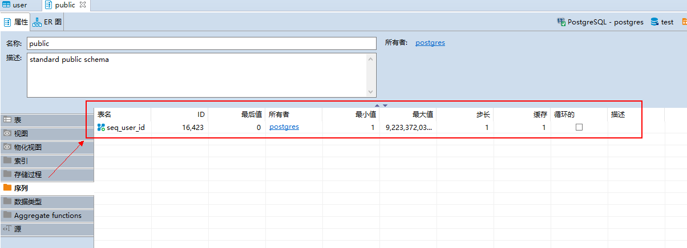

## SpringBootData JPA操作pqsql数据库

- 生成一个`user`数据库用于测试

  - id的的数据类型为serial，是pqsql中实现主键自增的一种方式，类似与MySQL的`AUTO INCREMENT`
  - 实现主键自增的方式还有就是通过自定义序列实现

  

```sql
CREATE TABLE public."user" (
	id serial NOT NULL,
	sex int2 NULL,
	age int2 NULL,
	"name" varchar NULL,
	phone bpchar(11) NULL,
	address varchar NULL,
	email varchar NULL,
	CONSTRAINT test_pk PRIMARY KEY (id)
);
```

- 配置数据库：

```yml
spring:
  datasource:
    url: jdbc:postgresql://localhost:5432/test
    username: postgres
    password: PASSWORD
    driver-class-name: org.postgresql.Driver
    type: com.alibaba.druid.pool.DruidDataSource
  jpa:
    database: postgresql
    database-platform: org.hibernate.dialect.PostgreSQLDialect
    show-sql: true
    hibernate:
      ddl-auto: update
```

- JavaConfig配置

```java
import org.springframework.context.annotation.Bean;
import org.springframework.context.annotation.Configuration;
import org.springframework.orm.jpa.JpaTransactionManager;
import org.springframework.orm.jpa.JpaVendorAdapter;
import org.springframework.orm.jpa.LocalContainerEntityManagerFactoryBean;
import org.springframework.orm.jpa.vendor.Database;
import org.springframework.orm.jpa.vendor.HibernateJpaVendorAdapter;
import org.springframework.transaction.PlatformTransactionManager;
import org.springframework.transaction.annotation.EnableTransactionManagement;

import javax.persistence.EntityManagerFactory;
import javax.sql.DataSource;

@Configuration
@EnableTransactionManagement
public class SpringDataJpaConfig {
    @Bean
    public JpaVendorAdapter jpaVendorAdapter() {
        HibernateJpaVendorAdapter jpaVendorAdapter = new HibernateJpaVendorAdapter();
        // 设置数据库类型（可使用org.springframework.orm.jpa.vendor包下的Database枚举类）
        jpaVendorAdapter.setDatabase(Database.POSTGRESQL);
        // 设置打印sql语句
        jpaVendorAdapter.setShowSql(true);
        // 设置不生成ddl语句
        jpaVendorAdapter.setGenerateDdl(false);
        // 设置hibernate方言
        jpaVendorAdapter.setDatabasePlatform("org.hibernate.dialect.PostgreSQLDialect");
        return jpaVendorAdapter;
    }

    /**
     * 配置实体管理器工厂
     * @param dataSource
     * @param jpaVendorAdapter
     * @return
     */
    @Bean
    public LocalContainerEntityManagerFactoryBean entityManagerFactory(
            DataSource dataSource, JpaVendorAdapter jpaVendorAdapter) {
        LocalContainerEntityManagerFactoryBean emfb = new LocalContainerEntityManagerFactoryBean();
        // 注入数据源
        emfb.setDataSource(dataSource);
        // 注入jpa厂商适配器
        emfb.setJpaVendorAdapter(jpaVendorAdapter);
        // 设置扫描基本包
        emfb.setPackagesToScan("com.wu.pqsqltest.entity");
        return emfb;
    }

    /**
     * 配置jpa事务管理器
     * @param entityManagerFactory
     * @return
     */
    @Bean
    public PlatformTransactionManager transactionManager(EntityManagerFactory entityManagerFactory) {
        JpaTransactionManager txManager = new JpaTransactionManager();
        txManager.setEntityManagerFactory(entityManagerFactory);
        return txManager;
    }
}

```

- 需要注意实体对象的配置
  - 和MySQL的区别，`@Table(name = "user", schema = "public")`不仅需要指定哪张表，还需要指定`schema`模式，因为我们的user表创建在`public`模式之下的，所以我们需要指定模式为`schema`
  - 在主键id上面的设置自增方式有两种实现
    - `@GeneratedValue(generator = "idGenerator", strategy = GenerationType.IDENTITY)`通过数据库默认方式
    - `@GeneratedValue(generator = "public", strategy = GenerationType.SEQUENCE)`,`@SequenceGenerator(name = "seq_user_id", sequenceName = "seq_user_id")`设置指定要采用的

```java
import lombok.Data;

import javax.persistence.*;
import java.io.Serializable;

/**
 * (User)实体类
 *
 * @author makejava
 * @since 2022-02-11 10:38:17
 */
@Entity
@Table(name = "user", schema = "public")
@Data
public class User implements Serializable {
    private static final long serialVersionUID = -23733744927088877L;

    /**
     * 用户id
     */
    @Id
    @GeneratedValue(generator = "idGenerator", strategy = GenerationType.IDENTITY)
//    @GeneratedValue(generator = "public", strategy = GenerationType.SEQUENCE)
//    @SequenceGenerator(name = "seq_user_id", sequenceName = "seq_user_id")
    private Long id;
    /**
     * 用户姓名
     */
    @Column(name = "name", length = 20)
    private String name;
    /**
     * 用户年龄
     */
    @Column(name = "age")
    private Integer age;
    /**
     * 用户性别
     */
    @Column(name = "sex")
    private Integer sex;
    /**
     * 用户电话
     */
    @Column(name = "phone", length = 11)
    private String phone;
    /**
     * 用户地址
     */
    @Column(name = "address", length = 70)
    private String address;
    /**
     * 用户邮箱
     */
    @Column(name = "email", length = 30)
    private String email;

}
```

## 实现批量更新数据sql的操作

```sql
update public.goods_info
set 
goods_name = tmp.goodsName, 
goods_num = tmp.goodsNum, 
goods_unit = tmp.goodsUnit, 
goods_feature = tmp.goodsFeature
from (values (2, '辣条1', 2, '个', '嘻嘻嘻'), (3, '水杯1', 2, '个', '嘻嘻嘻'), (4, '糖果1', 2, '颗', '嘻嘻嘻'), (1, '美元1', 2, '元', '嘻嘻嘻')) as tmp(goodsId, goodsName, goodsNum, goodsUnit, goodsFeature) 
where goods_id = tmp.goodsId;
```

