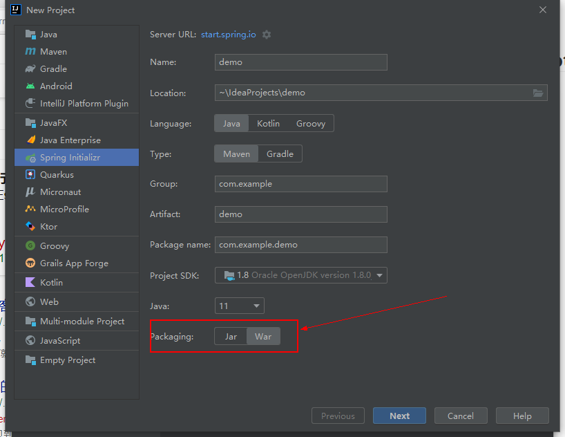

## SpringBoot项目打war包

- 初始化项目的时候直接勾选打war包，IDEA就会默认构建好项目结构



- 构建好的项目主要有以下两处不同

  - 依赖中导入了`spring-boot-starter-web容器`

  ```
  <dependency>
      <groupId>org.springframework.boot</groupId>
      <artifactId>spring-boot-starter-web容器</artifactId>
      <scope>provided</scope>
  </dependency>
  ```

  - 在启动类的同级目录重写`configure`方法

  ```java
  import org.springframework.boot.builder.SpringApplicationBuilder;
  import org.springframework.boot.web.servlet.support.SpringBootServletInitializer;
  
  public class ServletInitializer extends SpringBootServletInitializer {
  
      @Override
      protected SpringApplicationBuilder configure(SpringApplicationBuilder application) {
          return application.sources(JpaTestApplication.class);
      }
  
  }
  ```


## 配置servlet容器为undertow

> 概述

- Undertow 是红帽公司开发的一款基于 NIO 的高性能 Web 嵌入式服务器。

- Undertow 是一个采用 Java 开发的灵活的高性能 Web 服务器，提供包括阻塞和基于 NIO 的非堵塞机制。Undertow 是红帽公司的开源产品，是 Wildfly 默认的 Web 服务器。

- Undertow 提供一个基础的架构用来构建 Web 服务器，这是一个完全为嵌入式设计的项目，提供易用的构建器 API，完全兼容 Java EE Servlet 3.1 和低级非堵塞的处理器

> 特点 

- 轻量级：它是一个 Web 服务器，但不像传统的 Web 服务器有容器概念，它由两个核心 Jar 包组成，加载一个 Web 应用可以小于 10MB 内存

- Servlet3.1 支持：它提供了对 Servlet3.1 的支持

- WebSocket 支持：对 Web Socket 完全支持，用以满足 Web 应用巨大数量的客户端

- 嵌套性：它不需要容器，只需通过 API 即可快速搭建 Web 服务器
- 在并发量不高的情况下，Tomcat和Undertow的吞吐量区别不大，并发量高的情况下，Undertow的性能要优于Tomcat和Jetty

> Spring Boot项目中的引入方式

Spring Boot 内嵌 Jetty , Tomcat , Undertow , 默认是Tomcat

- 修改依赖

```xml
		<dependency>
			<groupId>org.springframework.boot</groupId>
			<artifactId>spring-boot-starter-web</artifactId>
			<exclusions>
				<exclusion>
					<groupId>org.springframework.boot</groupId>
					<artifactId>spring-boot-starter-tomcat</artifactId>
				</exclusion>
			</exclusions>
		</dependency>

		<dependency>
			<groupId>org.springframework.boot</groupId>
			<artifactId>spring-boot-starter-undertow</artifactId>
			<scope>provided</scope>
		</dependency>

<!--		<dependency>-->
<!--			<groupId>org.springframework.boot</groupId>-->
<!--			<artifactId>spring-boot-starter-tomcat</artifactId>-->
<!--			<scope>provided</scope>-->
<!--		</dependency>-->
```

- 配置文件

```yml
server:
  port: 8100
  undertow:
    accesslog:
      #Undertow日志存放目录
      dir: D:\log
      #是否开启日志
      enabled: true
      #日志格式
      pattern: common
      #日志文件名前缀
      prefix: access_log
      #日志文件名后缀
      suffix: .log
    #http post请求最大的大小
    max-http-post-size: 0
    #设置IO线程数，它主要执行非阻塞的任务，它们会负责多个连接，默认设置每个CPU核心一个线程，不可以设置过大，否则项目启动会报错 io-threads:
    #阻塞任务线程池，当执行类似servlet请求阻塞操作，undertow会从这个线程中获取线程，主要取决于系统的负载，默认io-threads*8 worker-threads:

    #以下配置会影响buffer，这些buffer会用于服务器连接的IO操作，类似与Netty的池化内存管理
    #每块buffer的空间大小，越小的空间利用越充分，不利于太大，太大了会影响其它程序
    buffer-size: 1024
    #每个区分配的buffer数量 buffers-per-region:
    #是否分配的直接内存（NIO直接分配的堆外内存）
    direct-buffers: true
```

