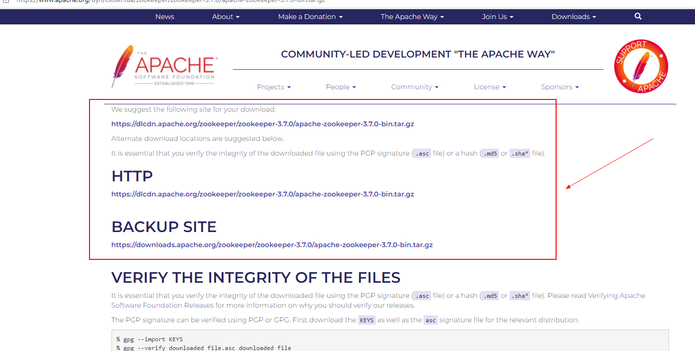

## Linux安装Zookeeper

- 首先确保已经安装好了jdk，因为zookeeper是需要依赖java来进行编译的。

- 去官网下载Zookeeper最新版：[Apache ZooKeeper](https://zookeeper.apache.org/releases.html)

点击可以查看下载地址



- 可以之间下载压缩包上传到服务器，也可以直接使用`wget`指令进行下载

```sh
[root@ls-usCoaSsG zookeeper]# pwd
/home/zookeeper
[root@ls-usCoaSsG zookeeper]# wget https://downloads.apache.org/zookeeper/zookeeper-3.7.0/apache-zookeeper-3.7.0-bin.tar.gz
--2022-02-12 17:17:03--  https://downloads.apache.org/zookeeper/zookeeper-3.7.0/apache-zookeeper-3.7.0-bin.tar.gz
Resolving downloads.apache.org (downloads.apache.org)... 88.99.95.219, 135.181.214.104, 2a01:4f8:10a:201a::2, ...
Connecting to downloads.apache.org (downloads.apache.org)|88.99.95.219|:443... connected.
HTTP request sent, awaiting response... 200 OK
Length: 12387614 (12M) [application/x-gzip]
Saving to: ‘apache-zookeeper-3.7.0-bin.tar.gz’

100%[=================================================================>] 12,387,614  52.1KB/s   in 3m 21s 

2022-02-12 17:20:25 (60.2 KB/s) - ‘apache-zookeeper-3.7.0-bin.tar.gz’ saved [12387614/12387614]
```

- 解压缩

```sh
tar -zxvf apache-zookeeper-3.7.0-bin.tar.gz
```

- 配置环境变量：`vim /etc/profile`

新增以下配置，注意将路径改为自己的：

```properties
export ZOOKEEPER_HOME=/home/zookeeper/apache-zookeeper-3.7.0-bin
export PATH=$PATH:$ZOOKEEPER_HOME/bin
```

使配置生效：`source /etc/profile`

- 修改配置文件

进入conf目录，首先将`zoo_sample.cgf`复制一份到新文件`zoo.cgf`

```sh
[root@ls-usCoaSsG apache-zookeeper-3.7.0-bin]# cd conf
[root@ls-usCoaSsG conf]# ls
configuration.xsl  log4j.properties  zoo_sample.cfg
[root@ls-usCoaSsG conf]# cp zoo_sample.cfg zoo.cfg
[root@ls-usCoaSsG conf]# ls
configuration.xsl  log4j.properties  zoo.cfg  zoo_sample.cfg
```

这样zookeeper就能够读取到该配置文件，主要配置项如下：

| 配置项     | 说明                                                         |
| ---------- | ------------------------------------------------------------ |
| tickTime   | 用于计算的时间单元，以毫秒为单位。比如session超时：N* tickTime |
| initLimit  | 用于集群，允许从节点连接并同步到master节点的初始化连接时间，以tickTime的倍数来表示 |
| syncLimit  | 用于集群，master主节点与从节点之间发送消息，请求和应答时间长度。（心跳机制） |
| dataDir    | 快照日志目录，存放内存数据快照的位置，**必须配置**           |
| dataLogDir | 事物日志目录，如果不配置和dataDir共用                        |
| clientPort | 连接服务器的端口，默认2181                                   |

创建两个目录：

```sh
mkdir dataDir
mkdir dataLogDir
```

添加配置项：

```properties
# 修改配置项
dataDir=/home/zookeeper/apache-zookeeper-3.7.0-bin/dataDir
# 添加配置项
dataLogDir=/home/zookeeper/apache-zookeeper-3.7.0-bin/dataLogDir
```

- Zookeeper启动与客户端连接

服务管理命令：`zkServer.sh start|stop|restart|status`
 客户端连接：`zkCli.sh -server ${ip}:${port}`
 客户端关闭：`quit` 或者按 `Ctrl + C`

```sh
[root@ls-usCoaSsG apache-zookeeper-3.7.0-bin]# cd bin
[root@ls-usCoaSsG bin]# ls
README.txt    zkCli.sh   zkServer.cmd            zkSnapshotComparer.cmd  zkSnapShotToolkit.sh
zkCleanup.sh  zkEnv.cmd  zkServer-initialize.sh  zkSnapshotComparer.sh   zkTxnLogToolkit.cmd
zkCli.cmd     zkEnv.sh   zkServer.sh             zkSnapShotToolkit.cmd   zkTxnLogToolkit.sh
[root@ls-usCoaSsG bin]# zkServer.sh start
ZooKeeper JMX enabled by default
Using config: /home/zookeeper/apache-zookeeper-3.7.0-bin/bin/../conf/zoo.cfg
Starting zookeeper ... STARTED
```

