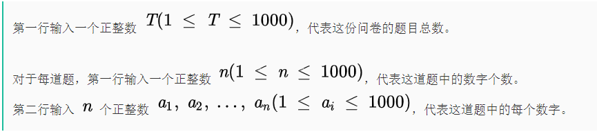
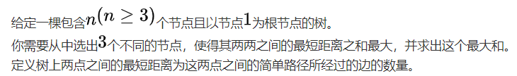
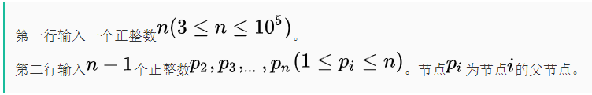
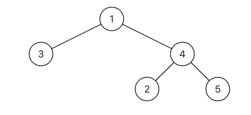
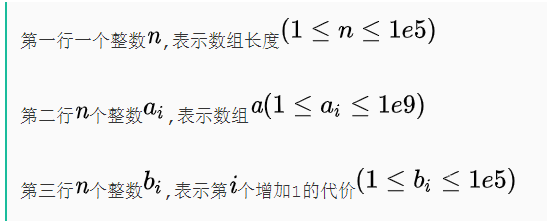

# 热门题目

## 两数之和

```java
/**
 * @see <a href="https://leetcode-cn.com/problems/two-sum/">leetcode</a>
 */
public int[] twoSum(int[] nums, int target) {
    Map<Integer, Integer> map = new HashMap<>();
    map.put(nums[0], 0);
    for (int i = 1; i < nums.length; i++) {
        int need = target - nums[i];
        if (map.containsKey(need)) {
            return new int[]{map.get(need), i};
        }
        map.put(nums[i], i);
    }
    return null;
}
```


# 笔试题

## 腾讯音乐2021春实习生

### 1. 找不同

时间限制：C/C++ 1秒，其他语言2秒

空间限制：C/C++ 64M，其他语言128M

牛牛最近迷上了《找不同》这个小游戏，在这个游戏中，每一轮，会给你两张很相似的照片，需要你指出其中的所有不同之处。

这一天，牛牛玩着这个游戏，路过牛妹身旁，偶然间注意到牛妹正对着很多数字发呆。牛牛瞄了一眼数字，随手指了一个数字，说这个数字在这些数中只出现了一次。经过牛妹人工检验，发现牛牛说得对。

牛妹非常好奇牛牛的这个新能力，觉得是因为牛牛玩《找不同》玩多了，于是对于这类不同于其它的部分特别敏感。

为了进一步检测牛牛的能力，牛妹决定拟定一份问卷，让牛牛回答，每份问卷中有若干道题目，每道题目含有若干个数字，需要牛牛快速回答出，每道题所给的数字中，最小的一个只出现了一次的数字是什么？

由于题量很多，显然不能让牛妹人工核对答案，于是向你求助，希望你能给予牛妹帮助。

**输入描述:**



**输出描述:**

> 对于问卷中的每道问题，一行输出一个整数代表答案；特殊的，如果不存在这样的数字，则输出  代表无解。

**输入例子1:**

>2
>3
>6 6 6
>3
>6 9 6

**输出例子1:**

> -1
> 9

**例子说明1:**

> 第一组测试数据，所有数字均为 6，无解。
> 第二组测试数据，两个数字为 6，一个数字为 9，根据题意可以发现，答案为数字 9

#### 代码:

```java
import java.util.Arrays;
import java.util.Scanner;

public class Test1 {
    public static void main(String[] args) {
        Scanner scanner = new Scanner(System.in);
        int n = Integer.valueOf(scanner.nextLine());
        for (int i = 0; i < n; i++) {
            int len = Integer.valueOf(scanner.nextLine());
            Integer[] array = Arrays.stream(scanner.nextLine().split(" ")).map(Integer::valueOf).toArray(Integer[]::new);
            Arrays.sort(array);
            int idx = 0;
            while (idx <= len) {
                if (idx == len) {
                    System.out.println(-1);
                    break;
                }
                int end = idx + 1;
                if ((end < len && !array[idx].equals(array[end])) || end == len) {
                    System.out.println(array[idx]);
                    break;
                }
                while (end < len && array[idx].equals(array[end])) {
                    end++;
                }
                idx = end;
            }
        }
    }
}
```

### 2.树上三角链

时间限制：C/C++ 1秒，其他语言2秒

空间限制：C/C++ 256M，其他语言512M



**输入描述:**



**输出描述:**

> 输出一个整数代表最大和。

**输入例子1:**

> 5
> 4 1 1 4

**输出例子1:**

> 8

**例子说明1:**

> 
>
> 3个节点为3，2，5
> 节点3与2的最短距离为3
> 节点3与5的最短距离为3
> 节点2与5的最短距离为2
> 3+3+2=8

#### 代码：

```java
import java.util.ArrayList;
import java.util.Arrays;
import java.util.List;
import java.util.Scanner;

public class Test2 {
    static Node[] tree;

    public static void main(String[] args) {
        Scanner scanner = new Scanner(System.in);
        int n = scanner.nextInt();
        tree = new Node[n];
        for (int i = 0; i < n; i++) {
            tree[i] = new Node();
        }
        for (int i = 1; i < n; i++) {
            int parent = scanner.nextInt();
            tree[parent - 1].addChild(tree[i]);
        }
        int[] max3 = calMaxLength(tree[0]);
        int sumOfMax3 = 0;
        for (int i = 0; i < 3; i++) {
            sumOfMax3 += max3[i];
        }
        System.out.println(sumOfMax3 * 2);
    }

    public static int[] calMaxLength(Node root) {
        int maxLSum = 0;
        int maxdeep = 0;
        int[] ret = new int[4];
        int[] c2MaxSum1 = new int[4];
        int[] c3MaxSum = new int[4];
        if (!root.child.isEmpty()) {
            for (Node chi : root.child) {
                int[] temp = calMaxLength(chi);
                if (maxdeep < temp[3]) {
                    maxdeep = temp[3];
                }
                int c3minidex = -1;//该节点为三个节点的共同交点，计算并与已有最大值比较
                for (int i = 0; i < 3; i++) {
                    if (c3minidex == -1 || c3MaxSum[i] < c3MaxSum[c3minidex]) {
                        c3minidex = i;
                    }
                }
                if (c3MaxSum[c3minidex] < temp[3]) {
                    c3MaxSum[c3minidex] = temp[3];
                    int c3temp = 0;
                    for (int i = 0; i < 3; i++) {
                        c3temp += c3MaxSum[i];
                    }
                    if (c3temp > maxLSum) {
                        maxLSum = c3temp;
                        ret = c3MaxSum;
                    }
                }
                int c1temp = 0;//该节点不是共同交点，计算并与已有最大值比较
                for (int i = 0; i < 3; i++) {
                    c1temp += temp[i];
                }
                if (maxLSum < c1temp) {
                    maxLSum = c1temp;
                    ret = temp;
                }
                int[] tempL = Arrays.copyOf(temp, 3);//该节点为两个节点的共同交点，计算并与已有最大值比较
                Arrays.sort(tempL);
                int[] tempLMax = Arrays.copyOf(c2MaxSum1, 3);
                Arrays.sort(tempLMax);
                int maxOfTwo = Math.max(tempL[1], tempLMax[1]);
                if (temp[3] + c2MaxSum1[3] + maxOfTwo > maxLSum) {
                    maxLSum = temp[3] + c2MaxSum1[3] + maxOfTwo;
                    ret = new int[4];
                    ret[0] = temp[3];
                    ret[1] = c2MaxSum1[3];
                    ret[2] = maxOfTwo;
                }
                if (c2MaxSum1[3] < temp[3] || (c2MaxSum1[3] == temp[3] && tempL[1] > tempLMax[1])) {
                    c2MaxSum1 = temp;
                }
            }
        }
        ret[3] = maxdeep + 1;
        return ret;
    }
}

class Node {
    List<Node> child = new ArrayList<>();

    public void addChild(Node child) {
        this.child.add(child);
    }
}
```

### 3. 最小代价

时间限制：C/C++ 1秒，其他语言2秒

空间限制：C/C++ 256M，其他语言512M


**输入描述:**



**输出描述:**

> 一个整数表示结果.

**输入例子1:**

>5
>1 2 3 4 5
>1 1 1 1 1

**输出例子1:**

> 0

**例子说明1:**

> 不用任何操作

**输入例子2:**

> 3
> 1 1 2
> 4 5 3

**输出例子2:**

> 7

**例子说明2:**

> 先把第1个数字1加1，此时代价为4，a数组为2 1 2。然后再把第三个数字2加1，此时代价为4+3=7，a数组为2 1 3。

#### 代码：

```java
import java.util.Arrays;
import java.util.Comparator;
import java.util.PriorityQueue;
import java.util.Scanner;

public class Test3 {
    public static void main(String[] args) {
        Scanner sc = new Scanner(System.in);
        int n = sc.nextInt();

        // 读取数据
        int[][] tmp = new int[n][2];
        for (int i = 0; i < n; i++) {
            tmp[i][0] = sc.nextInt();
        }
        for (int i = 0; i < n; i++) {
            tmp[i][1] = sc.nextInt();
        }

        /*
        排序规则：按照数的大小升序，如果数的值相同，按照代价升序
         */
        Arrays.sort(tmp, new Comparator<int[]>() {
            public int compare(int[] o1, int[] o2) {
                if (o1[0] == o2[0]) {
                    return o1[1] - o2[1];
                }
                return o1[0] - o2[0];
            }
        });

        PriorityQueue<Integer> queue = new PriorityQueue<Integer>(
                new Comparator<Integer>() {
                    public int compare(Integer o1, Integer o2) {
                        // 降序排列
                        return o2 - o1;
                    }
                });

        int cur = tmp[0][0];
        long all = 0;
        long ans = 0;

        for (int[] price : tmp) {
            if (!queue.isEmpty() && price[0] != cur) {
                while (!queue.isEmpty() && price[0] != cur++) {
                    all -= queue.poll();
                    ans += all;
                }
                cur = price[0];
            }
            queue.add(price[1]);
            all += price[1];
        }
        while (!queue.isEmpty()) {
            all -= queue.poll();
            ans += all;
        }
        System.out.println(ans);
    }
}
```

## 腾讯音乐2022春实习生

### 1.删除树的指定列

#### 代码：

A了38，其他错误报空指针

```java
import java.util.*;

public class Test1 {
    public static void main(String[] args) {
        TreeNode root = new TreeNode(1);
        root.left = new TreeNode(1);
        root.left.left = new TreeNode(1);
        root.left.left.left = new TreeNode(1);
        root.left.left.left.right = new TreeNode(1);
        root.left.left.right = new TreeNode(1);
        root.left.left.right.left = new TreeNode(1);
        root.left.right = new TreeNode(1);
        root.left.right.right = new TreeNode(1);
        root.right = new TreeNode(1);
        root.right.left = new TreeNode(1);
        ArrayList<Integer> list = new ArrayList<>();
        list.add(3);
        deleteLevel(root, list);
    }

    /**
     * 代码中的类名、方法名、参数名已经指定，请勿修改，直接返回方法规定的值即可
     *
     *
     * @param root TreeNode类
     * @param a int整型ArrayList
     * @return TreeNode类ArrayList
     */
    public static ArrayList<TreeNode> deleteLevel (TreeNode root, ArrayList<Integer> a) {
        // write code here
        Map<Integer, List<TreeNode>> levelMap = new HashMap<>();

        Queue<TreeNode> queue = new LinkedList<>();
        List<TreeNode> list = new ArrayList<>();
        list.add(root);
        int level = 1;
        levelMap.put(level++, list);
        int next = 0;
        if (root.left != null) {
            next++;
            queue.add(root.left);
        }
        if (root.right != null) {
            next++;
            queue.add(root.right);
        }
        while (next > 0) {
            int newNext = 0;
            list = new ArrayList<>();
            while (next > 0) {
                TreeNode node = queue.poll();
                if (node.left != null) {
                    newNext++;
                    queue.add(node.left);
                }
                if (node.right != null) {
                    newNext++;
                    queue.add(node.right);
                }
                list.add(node);
                next--;
            }
            levelMap.put(level++, list);
            next = newNext;
        }

        a.forEach(num -> {
            int pre = num - 1;
            if (pre != 0) {
                List<TreeNode> treeNodes = levelMap.get(pre);
                treeNodes.forEach(treeNode -> {
                    treeNode.left = null;
                    treeNode.right = null;
                });
            }
            levelMap.replace(num, null);
        });

        ArrayList<TreeNode> res = new ArrayList<>();
        for (int i = 1; i < level;) {
            while (i < level && levelMap.get(i) == null) {
                i++;
            }
            if (i < level) {
                List<TreeNode> treeNodes = levelMap.get(i);
                treeNodes.forEach(treeNode -> {
                    res.add(treeNode);
                });
                int end = i + 1;
                while (end < level && levelMap.get(end) != null) {
                    end++;
                }
                i = end;
            } else {
                return res;
            }
        }
        return res;
    }
}

class TreeNode {
    int val = 0;
    TreeNode left = null;
    TreeNode right = null;

    public TreeNode(int val) {
        this.val = val;
    }
}
```

别人的ac

```java
/**
 * 代码中的类名、方法名、参数名已经指定，请勿修改，直接返回方法规定的值即可
 *
 *
 * @param root TreeNode类
 * @param a int整型ArrayList
 * @return TreeNode类ArrayList
 */
public static ArrayList<TreeNode> deleteLevel (TreeNode root, ArrayList<Integer> a) {
    // write code here
    ArrayList<TreeNode> res = new ArrayList<>();
    Queue<TreeNode> queue = new LinkedList<>();
    if (root != null) {
        queue.add(root);
    }
    int depth = 1;
    if (!a.contains(1)) {
        res.add(root);
    }
    while (!queue.isEmpty()) {
        int size = queue.size();
        for (int i = 0; i < size; i++) {
            TreeNode temp = queue.poll();
            if (temp.left != null) {
                queue.add(temp.left);
            }
            if (temp.right != null) {
                queue.add(temp.right);
            }
            // 说明此层就是要删除的上一层
            if (a.contains(depth + 1)) {
                temp.left = null;
                temp.right = null;
            } else if (a.contains(depth)) {
                // 说明此层就是要删除的那层
                if (temp.left != null) {
                    res.add(temp.left);
                    temp.left = null;
                }
                if (temp.right != null) {
                    res.add(temp.right);
                    temp.right = null;
                }
            }
        }
        depth++;
    }
    return res;
}
```


### 2.树的异或

#### 代码：

```java
import java.util.*;

public class Test2 {
    public static void main(String[] args) {
        TreeNode root = new TreeNode(1);
        root.left = new TreeNode(2);
        root.right = new TreeNode(3);
        ArrayList<ArrayList<Integer>> op = new ArrayList<>();
        ArrayList<Integer> list = new ArrayList<>();
        list.add(2);
        list.add(4);
        op.add(list);
        list = new ArrayList<>();
        list.add(1);
        list.add(2);
        op.add(list);
        print(root);
        xorTree(root, op);
        System.out.println();
        print(root);
    }

    public static TreeNode xorTree (TreeNode root, ArrayList<ArrayList<Integer>> op) {
        // write code here
        Map<Integer, TreeNode> map = new HashMap<>();
        Queue<TreeNode> queue = new LinkedList<>();
        queue.add(root);
        while (!queue.isEmpty()) {
            TreeNode temp = queue.poll();
            map.put(temp.val, temp);
            temp.val = 0;

            if (temp.left != null) {
                queue.add(temp.left);
            }

            if (temp.right != null) {
                queue.add(temp.right);
            }
        }

        op.forEach(list -> {
            doIt(map.get(list.get(0)), list.get(1));
        });
        return root;
    }

    public static void doIt(TreeNode root, int val) {
        Queue<TreeNode> queue = new LinkedList<>();
        queue.add(root);
        while (!queue.isEmpty()) {
            TreeNode temp = queue.poll();
            temp.val ^= val;

            if (temp.left != null) {
                queue.add(temp.left);
            }

            if (temp.right != null) {
                queue.add(temp.right);
            }
        }
    }

    public static void print(TreeNode root) {
        Queue<TreeNode> queue = new LinkedList<>();
        queue.add(root);
        while (!queue.isEmpty()) {
            TreeNode temp = queue.poll();
            System.out.println(temp.val);

            if (temp.left != null) {
                queue.add(temp.left);
            }

            if (temp.right != null) {
                queue.add(temp.right);
            }
        }
    }
}
```

### 3.超过k次的字符

#### 代码：

```java
public class Test3 {
    public static void main(String[] args) {
        System.out.println('a' - 97);
        System.out.println('z' - 97);
    }

    public int howMany (String S, int k) {
        // write code here
        int count = 0;
        int[] arr = new int[26];
        boolean[] flag = new boolean[26];
        for (int i = 0; i < S.length(); i++) {
            int idx = S.charAt(i) - 97;
            arr[idx]++;
            if (arr[idx] >= k && !flag[idx]) {
                count++;
                flag[idx] = true;
            }
        }
        return count;
    }
}
```

# 字符串

## 基础

### 无重复字符的最长子串

```java
/**
 * @see <a href="https://leetcode-cn.com/problems/longest-substring-without-repeating-characters/">leetcode</a>
 */
public int lengthOfLongestSubstring(String s) {
    int len = s.length();
    if (len == 0) {
        return 0;
    }
    Map<Character, Integer> map = new HashMap<>();
    int left = 0;
    int max = 0;
    // 滑动窗口
    for (int right = 0; right < len; right++) {
        char c = s.charAt(right);
        if (map.containsKey(c)) {
            left = Math.max(left, map.get(c) + 1);
        }
        map.put(c, right);
        max  = Math.max(max, right - left + 1);
    }
    return max;
}
```

### Z 字形变换

```java
/**
 * @see <a href="https://leetcode-cn.com/problems/zigzag-conversion/">leetcode</a>
 */
public static String convert(String s, int numRows) {
    if (numRows < 2) {
        return s;
    }
    StringBuilder[] stringBuilders = new StringBuilder[numRows];
    for (int i = 0; i < numRows; i++) {
        stringBuilders[i] = new StringBuilder();
    }

    int flag = -1;
    int idx = 0;

    for (int i = 0; i < s.length(); i++) {
        stringBuilders[idx].append(s.charAt(i));
        if (idx == numRows - 1 || idx == 0) {
            flag = -flag;
        }
        idx += flag;
    }

    for (int i = 1; i < numRows; i++) {
        stringBuilders[0].append(stringBuilders[i]);
    }

    return stringBuilders[0].toString();
}
```

### 最长公共前缀

```java
/**
 * @see <a href="https://leetcode-cn.com/problems/longest-common-prefix/">leetcode</a>
 */
public String longestCommonPrefix(String[] strs) {
    int idx = 0;
    int minLen = Integer.MAX_VALUE;
    for (String s : strs) {
        minLen = Math.min(minLen, s.length());
    }
    while (idx < minLen) {
        char c = strs[0].charAt(idx);
        for (int i = 1; i < strs.length; i++) {
            if (strs[i].charAt(idx) != c) {
                return idx > 0 ? strs[0].substring(0, idx) : "";
            }
        }
        idx++;
    }
    return strs[0].substring(0, idx);
}
```

### 整数转罗马数字

```java
/**
 * @see <a href="https://leetcode-cn.com/problems/integer-to-roman/">leetcode</a>
 */
public String intToRoman(int num) {
    // 把阿拉伯数字与罗马数字可能出现的所有情况和对应关系，放在两个数组中，并且按照阿拉伯数字的大小降序排列
    int[] nums = {1000, 900, 500, 400, 100, 90, 50, 40, 10, 9, 5, 4, 1};
    String[] romans = {"M", "CM", "D", "CD", "C", "XC", "L", "XL", "X", "IX", "V", "IV", "I"};

    int idx = 0;
    StringBuilder res = new StringBuilder();
    while (idx < 13) {
        while (num < nums[idx]) {
            res.append(romans[idx]);
            num -= nums[idx];
        }
        idx++;
    }

    return res.toString();
}
```

### 罗马数字转整数

```java
/**
 * @see <a href="https://leetcode-cn.com/problems/roman-to-integer/">leetcode</a>
 */
public int romanToInt(String s) {
    int[] nums = {1000, 900, 500, 400, 100, 90, 50, 40, 10, 9, 5, 4, 1};
    String[] romans = {"M", "CM", "D", "CD", "C", "XC", "L", "XL", "X", "IX", "V", "IV", "I"};

    int idx = 0;
    int res = 0;
    int left = 0;
    int len = s.length();
    while (idx < 13) {
        // 判断是不是以指定字符串开头
        while (left < len && s.substring(left).startsWith(romans[idx])) {
            res += nums[idx];
            left+=romans[idx].length();
        }
        idx++;
    }
    return res;
}
```

### 电话号码的字母组合（回溯）

```java
List<char[]> arr = new ArrayList<char[]>() {
    {
        add(new char[]{'a','b','c'});
        add(new char[]{'d','e','f'});
        add(new char[]{'g','h','i'});
        add(new char[]{'j','k','l'});
        add(new char[]{'m','n','o'});
        add(new char[]{'p','q','r','s'});
        add(new char[]{'t','u','v'});
        add(new char[]{'w','x','y','z'});
    }
};

/**
 * @see <a href="https://leetcode-cn.com/problems/letter-combinations-of-a-phone-number/">leetcode</a>
 */
public List<String> letterCombinations(String digits) {
    if (digits == null || digits.length() == 0) {
        return new ArrayList<>(0);
    }
    List<String> res = new ArrayList<>();
    backtrack(res, digits, 0, new StringBuilder());
    return res;
}

public void backtrack(List<String> res, String digits, int idx, StringBuilder combination) {
    if (idx == digits.length()) {
        res.add(combination.toString());
    } else {
        char ch = digits.charAt(idx);
        char[] chars = arr.get(ch - '2');
        for (char c : chars) {
            backtrack(res, digits, idx + 1, combination.append(c));
            combination.deleteCharAt(idx);
        }
    }
}
```

### 有效的括号

```java
/**
 * @see <a href="https://leetcode-cn.com/problems/valid-parentheses/">leetcode</a>
 */
public boolean isValid(String s) {
    Stack<Character> stack = new Stack<>();
    int idx = 0;
    int len = s.length();
    while (idx < len) {
        char c = s.charAt(idx);
        if (isRight(c)) {
            if (!stack.isEmpty() && isMatch(stack.peek(), c)) {
                stack.pop();
            } else {
                return false;
            }
        } else {
            stack.push(c);
        }
        idx++;
    }
    return stack.isEmpty();
}

public boolean isRight(char c) {
    if (c == ')' || c == '}' || c == ']') {
        return true;
    }
    return false;
}

public boolean isMatch(char left, char right) {
    if (left == '(') {
        return right == ')';
    }
    if (left == '{') {
        return right == '}';
    }
    if (left == '[') {
        return right == ']';
    }
    return false;
}
```

### 括号生成

```java
/**
 * @see <a href="https://leetcode-cn.com/problems/generate-parentheses/">leetcode</a>
 */
public List<String> generateParenthesis(int n) {
    List<String> res = new LinkedList<>();
    backtrack(res, 0, 0, n, new StringBuilder());
    return res;
}

public void backtrack(List<String> res, int open, int close, int max, StringBuilder cur) {
    if (cur.length() == max * 2) {
        res.add(cur.toString());
        return;
    }
    if (open < max) {
        cur.append('(');
        backtrack(res, open + 1, close, max, cur);
        cur.deleteCharAt(cur.length() - 1);
    }
    if (close < open) {
        cur.append(')');
        backtrack(res, open, close + 1, max, cur);
        cur.deleteCharAt(cur.length() - 1);
    }
}
```

## 提升

### 字符串转换整数 (atoi)

```java
/**
 * @see <a href="https://leetcode-cn.com/problems/string-to-integer-atoi/">leetcode</a>
 */
public static int myAtoi(String str) {
    // 去除首位空格
    str = str.trim();
    if (str.length() == 0) return 0;
    // 当第一个字符不是数字，并且不是 - 或 + 号，直接return 0
    if (!Character.isDigit(str.charAt(0))
            && str.charAt(0) != '-' && str.charAt(0) != '+')
        return 0;
    int ans = 0;
    // 判断是否有 - 号
    boolean neg = str.charAt(0) == '-';
    // 初始化开始遍历坐标，第一个是数组就从0开始，不是数字就从1开始
    int i = !Character.isDigit(str.charAt(0)) ? 1 : 0;
    while (i < str.length() && Character.isDigit(str.charAt(i))) {
        // 这里逻辑有点复杂，我们最终要得到正数，计算过过程中按照负数计算，这样的好处是无论正数还是负数，统一tmp > ans就可以判断是否越界了
        // 对应计算安全的 tem 字符。计算方式与 ans 相反
        int tmp = ((neg ? Integer.MIN_VALUE : Integer.MIN_VALUE + 1) + (str.charAt(i) - '0')) / 10;
        if (tmp > ans) {
            return neg ? Integer.MIN_VALUE : Integer.MAX_VALUE;
        }
        // 这里取负数 - (str.charAt(i++) - '0')
        ans = ans * 10 - (str.charAt(i++) - '0');
    }
    return neg ? ans : -ans;
}

/**
 * 失败的做法
 * @param s
 * @return
 */
public static int myAtoi1(String s) {
    int len = s.length();
    int idx = 0;
    boolean negFlag = false;

    while (idx < len) {
        char c = s.charAt(idx);
        if (c == '-') {
            idx++;
            if (idx < len) {
                c = s.charAt(idx);
                if (c > 47 && c < 58) {
                    negFlag = true;
                    break;
                }
            }
            return 0;
        }
        if (c == '+') {
            idx++;
            if (idx < len) {
                c = s.charAt(idx);
                if (c > 47 && c < 58) {
                    break;
                }
            }
            return 0;
        }
        if (c > 47 && c < 58) {
            break;
        }
        if (c ==' ') {
            idx++;
        }
        else {
            return 0;
        }
    }
    StringBuilder numStr = new StringBuilder();
    while (idx < len) {
        char c = s.charAt(idx);
        if (c > 47 && c < 58) {
            numStr.append(c);
            idx++;
        } else {
            break;
        }
    }
    if (numStr.length() == 0) {
        return 0;
    }

    int left = 0;
    while (left < numStr.length()) {
        if (numStr.charAt(left) == '0') {
            left++;
        } else {
            break;
        }
    }

    String value = numStr.substring(left);
    int res = 0;
    if (negFlag) {
        res = value.length() > 10 ||
                (value.length() == 10 && value.compareTo("2147483648") > 0) ?
                Integer.MIN_VALUE :
                -Integer.valueOf(value);
    } else {
        res = value.length() > 10 ||
                (value.length() == 10 && value.compareTo("2147483647") > 0) ?
                Integer.MAX_VALUE :
                Integer.valueOf(value);
    }
    return res;
}
```

# 树

## 基础

### 二叉树前序遍历

```java
/**
 * @see <a href="https://leetcode-cn.com/problems/binary-tree-preorder-traversal/">leetcode</a>
 */
public List<Integer> preorderTraversal(TreeNode root) {
    if (root == null) {
        return new ArrayList<>();
    }
    Stack<TreeNode> stack = new Stack<>();
    TreeNode temp = root;
    List<Integer> res = new ArrayList<>();

    while (temp != null || !stack.isEmpty()) {
        if (temp != null) {
            res.add(temp.val);
            stack.add(temp);
            temp = temp.left;
        } else {
            temp = stack.pop().right;
        }
    }
    return res;
}

/**
 * 递归实现
 * @param root
 * @return
 */
public List<Integer> preorderTraversal1(TreeNode root) {
    List<Integer> res = new ArrayList<>();
    if (root != null) {
        innerPreorderTraversal1(root, res);
    }
    return res;
}

public void innerPreorderTraversal1(TreeNode treeNode, List<Integer> list) {
    if (treeNode != null) {
        list.add(treeNode.val);
        innerPreorderTraversal1(treeNode.left, list);
        innerPreorderTraversal1(treeNode.right, list);
    }
}
```

### 二叉树的中序遍历

```java
/**
 * @see <a href="https://leetcode-cn.com/problems/binary-tree-inorder-traversal/">leetcode</a>
 */
public List<Integer> inorderTraversal(TreeNode root) {
    List<Integer> res = new ArrayList<>();
    TreeNode temp = root;
    Stack<TreeNode> stack = new Stack<>();
    while (temp != null || !stack.isEmpty()) {
        if (temp != null) {
            stack.add(temp);
            temp = temp.left;
        } else {
            temp = stack.pop();
            res.add(temp.val);
            temp = temp.right;
        }
    }
    return res;
}
```

### 二叉树的后序遍历

```java
public static List<Integer> postorderTraversal(TreeNode root) {
    ArrayList<Integer> res = new ArrayList<>();
    if (root == null) {
        return res;
    }

    TreeNode cur, pre = null;

    Stack<TreeNode> stack = new Stack<>();
    stack.push(root);

    /**
     * 流程分析：
     * 1. 首先一直遍历到最左边叶子节点left，遍历过程中对当前遍历节点，先判断右子节点入栈，然后判断左子节点入栈
     * 2. 然后依次出栈，对栈顶元素判断，如果栈顶元素为叶子节点 或者 pre节点为栈顶节点的子节点，则加入到res
     */
    while (!stack.empty()) {
        cur = stack.peek();
        // 当前为叶子节点 或者 pre等于当前节点的左或者右子节点
        if ((cur.left == null && cur.right == null) || (pre != null && (pre == cur.left || pre == cur.right))) {
            res.add(cur.val);
            stack.pop();
            pre = cur;
        } else {
            if (cur.right != null)
                stack.push(cur.right);
            if (cur.left != null)
                stack.push(cur.left);
        }
    }
    return res;
}
```

### 二叉树的层序遍历

```java
/**
 * @see <a href="https://leetcode-cn.com/problems/binary-tree-level-order-traversal/">leetcode</a>
 */
public List<List<Integer>> levelOrder(TreeNode root) {
    if (root == null) {
        return new ArrayList<>(0);
    }
    List<List<Integer>> res = new ArrayList<>();
    Queue<TreeNode> queue = new LinkedList<>();

    queue.add(root);
    List<Integer> list = new ArrayList<>(1);
    list.add(root.val);
    int next = 1;

    while (next > 0) {
        int newNext = 0;
        list = new ArrayList<>(next);
        while (next > 0) {
            TreeNode treeNode = queue.poll();
            if (treeNode.left != null) {
                queue.add(treeNode.left);
                newNext++;
            }
            if (treeNode.right != null) {
                queue.add(treeNode.right);
                newNext++;
            }
            list.add(treeNode.val);
            next--;
        }
        res.add(list);
        next = newNext;
    }

    return res;
}
```

### [重要]二叉树的最大深度

```java
/**
 * @see <a href="https://leetcode-cn.com/problems/maximum-depth-of-binary-tree/">leetcode</a>
 */
public int maxDepth(TreeNode root) {
    if (root == null) {
        return 0;
    }
    return Math.max(maxDepth(root.left), maxDepth(root.right)) + 1;
}

/**
 * BFS
 * @param root
 * @return
 */
public int maxDepth1(TreeNode root) {
    if (root == null) {
        return 0;
    }
    Queue<TreeNode> queue = new LinkedList<>();
    queue.offer(root);
    int level = 0;
    while (!queue.isEmpty()) {
        // 这一层的节点个数
        int size = queue.size();
        level++;
        while (size > 0) {
            TreeNode treeNode = queue.poll();
            if (treeNode.left != null) {
                queue.offer(treeNode.left);
            }
            if (treeNode.right != null) {
                queue.offer(treeNode.right);
            }
            size--;
        }
    }
    return level;
}

/**
 * DFS
 * @param root
 * @return
 */
public int maxDepth2(TreeNode root) {
    if (root == null) {
        return 0;
    }
    int max = 0;
    Stack<TreeNode> treeNodeStack = new Stack<>();
    Stack<Integer> levelStack = new Stack<>();
    treeNodeStack.push(root);
    levelStack.push(1);
    while (!treeNodeStack.isEmpty()) {
        TreeNode treeNode = treeNodeStack.pop();
        Integer level = levelStack.pop();
        max = Math.max(max, level);
        if (treeNode.left != null) {
            treeNodeStack.push(treeNode.left);
            levelStack.push(level + 1);
        }
        if (treeNode.right != null) {
            treeNodeStack.push(treeNode.right);
            levelStack.push(level + 1);
        }
    }
    return max;
}
```

### 叶子节点的最大权值

```java
/**
 * 叶子节点的最大权重，递归实现
 * @param root
 * @return
 */
public int maxVal(TreeNode root) {
    if (root == null) {
        return 0;
    }
    return Math.max(maxVal(root.left), maxVal(root.right)) + root.val;
}

/**
 * BFS
 * @param root
 * @return
 */
public int maxVal1(TreeNode root) {
    if (root == null) {
        return 0;
    }
    int maxVal = Integer.MIN_VALUE;

    Queue<TreeNode> treeNodeQueue = new LinkedList<>();
    Queue<Integer> valQueue = new LinkedList<>();
    treeNodeQueue.add(root);
    valQueue.add(0);

    while (!treeNodeQueue.isEmpty()) {
        int size = treeNodeQueue.size();
        while (size > 0) {
            TreeNode treeNode = treeNodeQueue.poll();
            Integer curVal = treeNode.val + valQueue.poll();
            maxVal = Math.max(maxVal, curVal);
            if (treeNode.left != null) {
                treeNodeQueue.add(treeNode.left);
                valQueue.add(curVal);
            }
            if (treeNode.right != null) {
                treeNodeQueue.add(treeNode.right);
                valQueue.add(curVal);
            }
            size--;
        }
    }
    return maxVal;
}

/**
 * DFS
 * @param root
 * @return
 */
public int maxVal2(TreeNode root) {
    if (root == null) {
        return 0;
    }
    int maxVal = Integer.MIN_VALUE;

    Stack<TreeNode> treeNodeStack = new Stack<>();
    Stack<Integer> valStack = new Stack<>();
    treeNodeStack.add(root);
    valStack.add(0);
    while (!treeNodeStack.isEmpty()) {
        TreeNode treeNode = treeNodeStack.pop();
        Integer curVal = treeNode.val + valStack.pop();
        maxVal = Math.max(maxVal, curVal);

        if (treeNode.left != null) {
            treeNodeStack.add(treeNode.left);
            valStack.add(curVal);
        }
        if (treeNode.right != null) {
            treeNodeStack.add(treeNode.right);
            valStack.add(curVal);
        }
    }

    return maxVal;
}
```

## 提升

### *不同的二叉搜索树 II

```java
/**
 * @see <a href="https://leetcode-cn.com/problems/unique-binary-search-trees-ii/">leetcode</a>
 */
public List<TreeNode> generateTrees(int n) {
    if (n < 1) {
        return new ArrayList<>(0);
    }

    return helper(1, n);
}

public List<TreeNode> helper(int start, int end) {
    List<TreeNode> list = new ArrayList<>();

    if (start > end) {
        // 如果当前子树为空，不加null行吗？
        list.add(null);
        return list;
    }

    for (int i = start; i <= end; i++) {
        // 想想为什么这行不能放在这里，而放在下面？
        // TreeNode root = new TreeNode(i);
        List<TreeNode> left = helper(start, i - 1);
        List<TreeNode> right = helper(i + 1, end);

        // 固定左孩子，遍历右孩子
        for (TreeNode l : left) {
            for (TreeNode r : right) {
                TreeNode root = new TreeNode(i);
                root.left = l;
                root.right = r;
                list.add(root);
            }
        }
    }
    return list;
}
```

### *验证二叉搜索树

```java
/**
 * @see <a href="">leetcode</a>
 * 在递归中巧妙的使用了pre
 */
public boolean isValidBST(TreeNode root) {
    if (root == null) {
        return true;
    }
    // 访问左子树
    if (!isValidBST(root.left)) {
        return false;
    }
    // 访问当前节点：如果当前节点小于等于中序遍历的前一个节点，说明不满足BST，返回 false；否则继续遍历。
    if (root.val <= pre) {
        return false;
    }
    // pre放在这个位置，保证根节点和左右子节点进行比较
    pre = root.val;
    // 访问右子树
    return isValidBST(root.right);
}
```

### 二叉树的锯齿形层序遍历

```java
public static List<List<Integer>> zigzagLevelOrder(TreeNode root) {
        if (root == null) {
            return new ArrayList<>();
        }
        Deque<TreeNode> deque = new ArrayDeque<>();
        deque.addLast(root);
        int next = 1;
        // 从左向右
        boolean leftToRight = true;
        List<List<Integer>> res = new LinkedList<>();
        while (next > 0) {
            List<Integer> list = new ArrayList<>(next);
            int newNext = 0;
            if (leftToRight) {
                while (next > 0) {
                    TreeNode treeNode = deque.pollFirst();
                    list.add(treeNode.val);
                    if (treeNode.left != null) {
                        deque.addLast(treeNode.left);
                        newNext++;
                    }
                    if (treeNode.right != null) {
                        deque.addLast(treeNode.right);
                        newNext++;
                    }
                    next--;
                }
                leftToRight = false;
            } else {
                while (next > 0) {
                    TreeNode treeNode = deque.pollLast();
                    list.add(treeNode.val);
                    if (treeNode.right != null) {
                        deque.addFirst(treeNode.right);
                        newNext++;
                    }
                    if (treeNode.left != null) {
                        deque.addFirst(treeNode.left);
                        newNext++;
                    }
                    next--;
                }
                leftToRight = true;
            }
            next = newNext;
            res.add(list);
        }
        return res;
    }
```


# 多线程

## 按序打印

### volatile变量

```java
/**
 * @see <a href="https://leetcode-cn.com/problems/print-in-order/">leetcode</a>
 */
class Foo {
    /**
     * 保持可见性
     */
    volatile int count = 1;

    public Foo() {

    }

    public void first(Runnable printFirst) throws InterruptedException {
        // printFirst.run() outputs "first". Do not change or remove this line.
        printFirst.run();
        count++;
    }

    public void second(Runnable printSecond) throws InterruptedException {
        while (count!=2);
        // printSecond.run() outputs "second". Do not change or remove this line.
        printSecond.run();
        count++;
    }

    public void third(Runnable printThird) throws InterruptedException {
        while (count!=3);
        // printThird.run() outputs "third". Do not change or remove this line.
        printThird.run();
    }
}
```

### Semaphore信号量

```java
/**
 * @see <a href="https://leetcode-cn.com/problems/print-in-order/">leetcode</a>
 */
class Foo {

    Semaphore semaphore12, semaphore23;

    public Foo() {
        semaphore12 = new Semaphore(0);
        semaphore23 = new Semaphore(0);
    }

    public void first(Runnable printFirst) throws InterruptedException {
        // printFirst.run() outputs "first". Do not change or remove this line.
        printFirst.run();
        semaphore12.release();
    }

    public void second(Runnable printSecond) throws InterruptedException {
        semaphore12.acquire();
        // printSecond.run() outputs "second". Do not change or remove this line.
        printSecond.run();
        semaphore23.release();
    }

    public void third(Runnable printThird) throws InterruptedException {
        semaphore23.acquire();
        // printThird.run() outputs "third". Do not change or remove this line.
        printThird.run();
    }
}
```

### CountDownLatch

```java
/**
 * @see <a href="https://leetcode-cn.com/problems/print-in-order/">leetcode</a>
 */
class Foo {
    CountDownLatch countDownLatch12, countDownLatch23;

    public Foo() {
        countDownLatch12 = new CountDownLatch(1);
        countDownLatch23 = new CountDownLatch(1);
    }

    public void first(Runnable printFirst) throws InterruptedException {
        // printFirst.run() outputs "first". Do not change or remove this line.
        printFirst.run();
        countDownLatch12.countDown();
    }

    public void second(Runnable printSecond) throws InterruptedException {
        countDownLatch12.await();
        // printSecond.run() outputs "second". Do not change or remove this line.
        printSecond.run();
        countDownLatch23.countDown();
    }

    public void third(Runnable printThird) throws InterruptedException {
        countDownLatch23.await();
        // printThird.run() outputs "third". Do not change or remove this line.
        printThird.run();
    }
}
```

### BlockingQueue阻塞队列

```java
/**
 * @see <a href="https://leetcode-cn.com/problems/print-in-order/">leetcode</a>
 */
class Foo {
    BlockingQueue<Integer> blockingQueue12, blockingQueue23;

    public Foo() {
        //同步队列,没有容量，进去一个元素，必须等待取出来以后，才能再往里面放一个元素
        blockingQueue12 = new SynchronousQueue<>();
        blockingQueue23 = new SynchronousQueue<>();
    }

    public void first(Runnable printFirst) throws InterruptedException {
        // printFirst.run() outputs "first". Do not change or remove this line.
        printFirst.run();
        blockingQueue12.put(2);
    }

    public void second(Runnable printSecond) throws InterruptedException {
        blockingQueue12.take();
        // printSecond.run() outputs "second". Do not change or remove this line.
        printSecond.run();
        blockingQueue23.put(3);
    }

    public void third(Runnable printThird) throws InterruptedException {
        blockingQueue23.take();
        // printThird.run() outputs "third". Do not change or remove this line.
        printThird.run();
    }
}
```

### Lock锁

```java
/**
 * @see <a href="https://leetcode-cn.com/problems/print-in-order/">leetcode</a>
 */
class Foo {

    int num;
    Lock lock;
    //精确的通知和唤醒线程
    Condition condition1, condition2, condition3;

    public Foo() {
        num = 1;
        lock = new ReentrantLock();
        condition1 = lock.newCondition();
        condition2 = lock.newCondition();
        condition3 = lock.newCondition();
    }

    public void first(Runnable printFirst) throws InterruptedException {
        lock.lock();
        try {
            while (num != 1) {
                condition1.await();
            }
            // printFirst.run() outputs "first". Do not change or remove this line.
            printFirst.run();
            num = 2;
            condition2.signal();
        } catch (Exception e) {
            e.printStackTrace();
        } finally {
            lock.unlock();
        }
    }

    public void second(Runnable printSecond) throws InterruptedException {
        lock.lock();
        try {
            while (num != 2) {
                condition2.await();
            }
            // printSecond.run() outputs "second". Do not change or remove this line.
            printSecond.run();
            num = 3;
            condition3.signal();
        } catch (Exception e) {
            e.printStackTrace();
        } finally {
            lock.unlock();
        }
    }

    public void third(Runnable printThird) throws InterruptedException {
        lock.lock();
        try {
            while (num != 3) {
                condition3.await();
            }
            // printThird.run() outputs "third". Do not change or remove this line.
            printThird.run();
            num = 1;
            condition1.signal();
        } catch (Exception e) {
            e.printStackTrace();
        } finally {
            lock.unlock();
        }
    }
}
```

# 动态规划

## 基础

### 最长回文子串

```java
/**
 * @see <a href="https://leetcode-cn.com/problems/longest-palindromic-substring/">leetcode</a>
 */
public class Test18 {
    public String longestPalindrome(String s) {
        int len = s.length();
        if (len <= 1) {
            return s;
        }

        // dp[i][j] 用于记录 [i, j] 范围内是否为回文字符串
        boolean[][] dp = new boolean[len][len];

        int maxLen = 1;
        int begin = 0;

        dp[0][0] = true;

        for (int right = 1; right < len; right++) {
            dp[right][right] = true;
            for (int left = 0; left < right; left++) {
                if (s.charAt(left) != s.charAt(right)) {
                    dp[left][right] = false;
                } else {
                    // dp[left][right] 同时满足 首位字符相等， 并且 right - left <= 2，说明 [right,left]是字符串
                    if (right - left <= 2) {
                        dp[left][right] = true;
                    } else {
                        // 如果首尾满足回文字符串，则划分子问题dp[left][right] = dp[left + 1][right - 1];
                        dp[left][right] = dp[left + 1][right - 1];
                    }
                }
                if (dp[left][right]) {
                    int curLen = right - left + 1;
                    if (curLen > maxLen) {
                        maxLen = curLen;
                        begin = left;
                    }
                }
            }
        }
        return s.substring(begin, begin + maxLen);
    }
}
```

### 斐波那契数

```java
/**
 * @see <a href="https://leetcode-cn.com/problems/fibonacci-number/">leetcode</a>
 */
public int fib(int n) {
    if (n < 2) {
        return n;
    }
    int[] fibNums = new int[n + 1];
    fibNums[0] = 0;
    fibNums[1] = 1;
    for (int i = 2; i <= n; i++) {
        fibNums[i] = fibNums[i - 1] + fibNums[i - 2];
    }
    return fibNums[n];
}
```

### 第 N 个泰波那契数

```java
/**
 * @see <a href="https://leetcode-cn.com/problems/n-th-tribonacci-number/">leetcode</a>
 */
public int tribonacci(int n) {
    if (n < 3) {
        return n == 0 ? 0 : 1;
    }
    int[] tribonacciNums = new int[n + 1];
    tribonacciNums[0] = 0;
    tribonacciNums[1] = 1;
    tribonacciNums[2] = 1;
    for (int i = 3; i <= n; i++) {
        tribonacciNums[i] = tribonacciNums[i - 1] + tribonacciNums[i - 2] + tribonacciNums[i - 3];
    }
    return tribonacciNums[n];
}
```

### 爬楼梯

```java
/**
 * @see <a href="https://leetcode-cn.com/problems/climbing-stairs/">leetcode</a>
 */
public int climbStairs(int n) {
    if (n < 3) {
        return n;
    }
    int[] countNums = new int[n];
    countNums[0] = 1;
    countNums[1] = 2;
    for (int i = 2; i < n; i++) {
        countNums[i] = countNums[i - 1] + countNums[i - 2];
    }
    return countNums[n - 1];
}
```

### 使用最小花费爬楼梯

```java
/**
 * @see <a href="https://leetcode-cn.com/problems/min-cost-climbing-stairs/">leetcode</a>
 */
public int minCostClimbingStairs(int[] cost) {
    int len = cost.length;
    if (len == 1) {
        return cost[0];
    }
    if (len == 2) {
        return Math.min(cost[0], cost[1]);
    }
    for (int i = 2; i < len; i++) {
        cost[i] = cost[i] + Math.min(cost[i - 1], cost[i - 2]);
    }
    return Math.min(cost[len - 1], cost[len - 2]);
}
```

### 最佳观光组合

```java
/**
 * 思路：将 values[i] + values[j] + i - j 分成两部分 values[i] + i 和 values[j] - j
 * @see <a href="https://leetcode-cn.com/problems/best-sightseeing-pair/">leetcode</a>
 */
public int maxScoreSightseeingPair(int[] values) {
    int len = values.length;
    // 定义dp
    int max = Integer.MIN_VALUE;
    // 初始化初始值 values[i] + i
    int pre = values[0];
    // 确认遍历顺序
    for (int i = 1; i < len; i++) {
        // 状态转移
        // values[i] + i 和 values[j] - j
        max = Math.max(max, pre + (values[i] - i));
        // 更新values[i] + i
        pre = Math.max(pre, values[i] + i);
    }
    return max;
}
```

### 买卖股票的最佳时机

```java
/**
 * @see <a href="https://leetcode-cn.com/problems/best-time-to-buy-and-sell-stock/">leetcode</a>
 */
public static int maxProfit(int[] prices) {
    int len = prices.length;
    if (len < 2) return 0;
    // 定义dp
    /*
    dp[i][0] 下标为 i 这天结束的时候，不持股，手上拥有的现金数
    dp[i][1] 下标为 i 这天结束的时候，持股，手上拥有的现金数
     */
    int[][] dp = new int[prices.length][2];
    // 初始化初始值
    dp[0][0] = 0;
    dp[0][1] = -prices[0];

    // 确认遍历顺序
    for (int i = 1; i < prices.length; i++) {
        // 状态转移
        dp[i][0] = Math.max(dp[i - 1][0], dp[i - 1][1] + prices[i]);
        dp[i][1] = Math.max(dp[i - 1][1], -prices[i]);
    }
    return dp[prices.length - 1][0];
}
```

### 买卖股票的最佳时机 II

```java
/**
 * @see <a href="https://leetcode-cn.com/problems/best-time-to-buy-and-sell-stock-ii/">leetcode</a>
 */
public static int maxProfit(int[] prices) {
    // 定义dp
    int[][] dp = new int[prices.length][2];
    
    // 初始化初始值
    dp[0][0] = 0;
    dp[0][1] = -prices[0];

    for (int i = 1; i < prices.length; i++) {
        // 状态转移
        if (dp[i - 1][0] == 0 && prices[i] < prices[i - 1]) {
            // 找到第一个谷底
            dp[i][0] = Math.max(dp[i - 1][0], dp[i - 1][1] + prices[i]);
            dp[i][1] = Math.max(dp[i - 1][1], -prices[i]);
        } else if (prices[i] < prices[i - 1]) {
            // 找到下一个谷底
            dp[i][0] = Math.max(dp[i - 1][0], dp[i - 1][1] + prices[i]);
            dp[i][1] = Math.max(dp[i - 1][1], -prices[i]);
        } else {
            // 计算当前谷峰相对于上一个谷底的盈利值
            dp[i][0] = Math.max(dp[i - 1][0], dp[i - 1][0] + dp[i - 1][1] + prices[i]);
            dp[i][1] = Math.min(dp[i - 1][1], -prices[i]);
        }
    }
    return dp[prices.length - 1][0];
}

/**
 * 贪心，如果今天相比明天新增，就直接加上这段
 * @param prices
 * @return
 */
public int maxProfit1(int[] prices) {
    int profit = 0;
    for (int i = 1; i < prices.length; i++) {
        int tmp = prices[i] - prices[i - 1];
        if (tmp > 0) profit += tmp;
    }
    return profit;
}
```

### 等差数列划分

```java
/**
 * @see <a href="https://leetcode-cn.com/problems/arithmetic-slices/">leetcode</a>
 */
public int numberOfArithmeticSlices(int[] nums) {
    int len = nums.length;
    if (len < 3) {
        return 0;
    }
    // 定义dp
    int[] dp = new int[len];
    // 初始化dp
    dp[0] = 0;
    dp[1] = 0;

    int res = 0;
    for (int i = 2; i < len; i++) {
        if (nums[i] - nums[i - 1] == nums[i - 1] - nums[i - 2]) {
            dp[i] = dp[i - 1] + 1;
            res+=dp[i];
        }
    }
    return res;
}
```

### 杨辉三角

```java
/**
 * @see <a href="https://leetcode-cn.com/problems/pascals-triangle/">leetcode</a>
 */
public List<List<Integer>> generate(int numRows) {
    List<List<Integer>> res = new ArrayList<>(numRows);
    for (int i = 1; i <= numRows; i++) {
        List<Integer> row = new ArrayList<>(i);
        row.add(1);
        if (i > 1) {
            if (i > 2) {
                // 下标从0开始
                List<Integer> preRow = res.get(i - 2);
                for (int j = 1; j < i - 1; j++) {
                    row.add(preRow.get(j - 1) + preRow.get(j));
                }
            }
            row.add(1);
        }
        res.add(row);
    }
    return res;
}
```

### 杨辉三角 II

```java
/**
 * @see <a href="https://leetcode-cn.com/problems/pascals-triangle-ii/">leetcode</a>
 */
public List<Integer> getRow(int rowIndex) {
    List<Integer> res = new ArrayList<>(rowIndex);
    res.add(1);
    for (int i = 1; i <= rowIndex; i++) {
        res.add(0);
        for (int j = i; j > 0; --j) {
            res.set(j, res.get(j) + res.get(j - 1));
        }
    }
    return res;
}
```

## 提升

### 不同路径

```java
/**
 * @see <a href="https://leetcode-cn.com/problems/unique-paths/">leetcode</a>
 */
public int uniquePaths(int m, int n) {
    if (m == 1 || n == 1) {
        return 1;
    }
    int[][] res = new int[m][n];
    for (int i = 1; i < Math.min(m, n); i++) {
        res[0][i] = 1;
        res[i][0] = 1;
    }
    if (m > n) {
        for (int row = n; row < m; row++) {
            res[row][0] = 1;
        }
    } else if (m < n) {
        for (int col = m; col < n; col++) {
            res[0][col] = 1;
        }
    }

    for (int row = 1; row < m; row++) {
        for (int col = 1; col < n; col++) {
            // 当前的 count 等于 左边count + 上边的count
            res[row][col] = res[row][col - 1] + res[row - 1][col];
        }
    }
    return res[m - 1][n - 1];
}
```

### 不同路径 II

```java
/**
 * @see <a href="https://leetcode-cn.com/problems/unique-paths-ii/">leetcode</a>
 */
public static int uniquePathsWithObstacles(int[][] obstacleGrid) {
    int rows = obstacleGrid.length;
    int cols = obstacleGrid[0].length;
    if (rows == 1) {
        for (int i = 0; i < cols; i++) {
            if (obstacleGrid[0][i] == 1) {
                return 0;
            }
        }
        return 1;
    }
    if (cols == 1) {
        for (int i = 0; i < rows; i++) {
            if (obstacleGrid[i][0] == 1) {
                return 0;
            }
        }
        return 1;
    }
    int[][] dp = new int[rows][cols];
    if (obstacleGrid[0][0] == 1) {
        return 0;
    } else {
        dp[0][0] = 1;
    }

    for (int i = 1; i < Math.min(rows, cols); i++) {
        if (obstacleGrid[0][i] != 1 && dp[0][i - 1] == 1) {
            dp[0][i] = 1;
        }
        if (obstacleGrid[i][0] != 1 && dp[i - 1][0] == 1) {
            dp[i][0] = 1;
        }
    }

    if (rows > cols) {
        for (int row = cols; row < rows; row++) {
            if (obstacleGrid[row][0] != 1 && dp[row - 1][0] == 1) {
                dp[row][0] = 1;
            }
        }
    } else if (rows < cols) {
        for (int col = rows; col < cols; col++) {
            if (obstacleGrid[0][col] != 1 && dp[0][col - 1] == 1) {
                dp[0][col] = 1;
            }
        }
    }

    for (int row = 1; row < rows; row++) {
        for (int col = 1; col < cols; col++) {
            if (obstacleGrid[row][col] == 1) {
                dp[row][col] = 0;
            } else {
                dp[row][col] = dp[row][col - 1] + dp[row - 1][col];
            }
        }
    }
    return dp[rows - 1][cols - 1];
}
```

### 整数拆分

```java
/**
 * @see <a href="https://leetcode-cn.com/problems/integer-break/">leetcode</a>
 * 规律：
 * 1 —— 1
 * 2 —— 1 * 1
 * 3 —— 1 * 2
 * 4 —— 2 * 2
 * 5 —— 2 * 3
 * 6 —— 3 * 3
 * 7 —— 2 * 2 * 3
 * 8 —— 2 * 3 * 3
 * 9 —— 3 * 3 * 3
 * 10 —— 3 * 3 * 2 * 2
 * 能拿3先拿3，不能再拿2
 */
public static int integerBreak(int n) {
    if (n <= 3) {
        return n - 1;
    }
    int res = 1;
    while (n > 0) {
        if (n >= 5) {
            res *= 3;
            n -= 3;
        } else if (n == 4) {
            res *= 4;
            n = 0;
        } else {
            res *= n;
            n = 0;
        }
    }
    return res;
}

/**
 * 动态规划
 * @param n
 * @return
 */
public int integerBreak1(int n) {
    if (n <= 3) {
        return n - 1;
    }
    // dp数组
    int[] dp = new int[n+1];
    // 初始化条件,每个k默认都为1*1*1....的最小值
    Arrays.fill(dp,1);
    for(int i = 3; i <= n; i++){
        for(int j = 1; j < i; j++){
            //j为不可拆分值,i-j为待拆分值
            dp[i] = Math.max(dp[i], j*(dp[i-j] > (i-j) ? dp[i-j] : (i-j)));
        }
    }
    return dp[n];
}
```

### 不同的二叉搜索树

```java
/**
 * @see <a href="https://leetcode-cn.com/problems/unique-binary-search-trees/">leetcode</a>
 * 条件：
 * 二叉搜索数
 * 规律：
 * dp[1] —— 1
 * dp[2] —— 2
 * dp[3] —— 5 = (dp[2] * dp[0]) + (dp[1] * [1]) + (dp[2] * dp[0])
 * dp[4] —— 14  = (dp[3] * dp[0]) + (dp[2] * [1]) + (dp[1] * dp[2]) + (dp[0] * dp[3])
 */
public int numTrees(int n) {
    if (n <= 2) {
        return n;
    }
    int[] dp = new int[n + 1];
    // 边界值，取 1 方便计算
    dp[0] = 1;
    // 边界值，1
    dp[1] = 1;
    // 边界值，2
    dp[2] = 2;
    for (int i = 3; i <= n; i++) {
        for (int j = 0; j < i; j++) {
            dp[i] += (dp[j] * dp[i - j - 1]);
        }
    }
    return dp[n];
}

/**
 * 更简单的写法
 * @param n
 * @return
 */
public int numTrees1(int n) {
    int[] G = new int[n + 1];
    G[0] = 1;
    G[1] = 1;

    for (int i = 2; i <= n; ++i) {
        for (int j = 1; j <= i; ++j) {
            G[i] += G[j - 1] * G[i - j];
        }
    }
    return G[n];
}
```

### 打家劫舍

```java
/**
 * @see <a href="https://leetcode-cn.com/problems/house-robber/">leetcode</a>
 */
public int rob(int[] nums) {
    if (nums.length < 2) {
        return nums[0];
    }
    int[] dp = new int[nums.length];
    dp[0] = nums[0];
    dp[1] = Math.max(nums[0], nums[1]);
    for (int i = 2; i < nums.length; i++) {
        dp[i] = Math.max(dp[i - 1], dp[i - 2] + nums[i]);
    }
    return dp[nums.length - 1];
}
```

### 打家劫舍 II

```java
/**
 * @see <a href="https://leetcode-cn.com/problems/house-robber-ii/">leetcode</a>
 */
public int rob(int[] nums) {
    if (nums.length == 1) {
        return nums[0];
    }
    if (nums.length == 2){
        return Math.max(nums[0], nums[1]);
    }
    return Math.max(myRob(nums, 0, nums.length - 2), myRob(nums, 1, nums.length - 1));
}

public int myRob(int[] nums, int start, int end) {
    // 分别记录当前值和下一个值
    int pre = nums[start], next = Math.max(nums[start], nums[start + 1]);
    for (int i = start + 2; i <= end; i++) {
        // i 每次加 1， pre 和 next 每次交换实现2的跨度
        int temp = next;
        // 步长为 2， pre 和 nums[i]是不相邻的
        next = Math.max(pre + nums[i], next);
        pre = temp;
    }
    return next;
}
```

### 删除并获得点数

```java
/**
 * @see <a href="https://leetcode-cn.com/problems/delete-and-earn/">leetcode</a>
 */
public static int deleteAndEarn(int[] nums) {
    if (nums.length == 1) {
        return nums[0];
    }
    Arrays.sort(nums);
    int max = nums[nums.length - 1];
    int[] dp = new int[max + 1];

    // 初始化边界值
    int start = 0;
    int end = 1;
    int temp = nums[start];
    while (end < nums.length && nums[end] == nums[start]) {
        temp+=nums[end];
        end++;
    }
    dp[nums[start]] = temp;

    // 遍历dp数组， 动态规划
    // idx用于遍历dp数组
    int idx = nums[start] + 1;
    // start 和 end 用于计算相同值的和
    start = end;
    end++;
    while (idx <= max) {
        if (nums[start] == idx) {
            temp = nums[start];
            while (end < nums.length && nums[end] == nums[start]) {
                temp+=nums[start];
                end++;
            }
            dp[nums[start]] = Math.max(dp[nums[start] - 1], dp[nums[start] - 2] + temp);
            if (end >= nums.length) {
                break;
            }
            start = end;
            end++;
        } else {
            dp[idx] = Math.max(dp[idx - 1], dp[idx - 2]);
        }
        idx++;
    }
    return dp[max];
}
```

### 跳跃游戏

```java
public static void main(String[] args) {
    int[] arr = new int[]{2,5,0,0};
    canJump1(arr);
}

/**
 * @see <a href="https://leetcode-cn.com/problems/jump-game/">leetcode</a>
 */
public static boolean canJump(int[] nums) {
    boolean[] dp = new boolean[nums.length];
    dp[0] = true;
    for (int i = 0; i < nums.length; i++) {
        if (dp[i]) {
            int temp = nums[i];
            for (int j = 1, k = i + j; k < nums.length && j <= temp; j++, k++) {
                dp[k] = true;
            }
        } else {
            continue;
        }
    }
    return dp[nums.length - 1];
}

public static boolean canJump1(int[] nums) {
    if (nums.length == 1) {
        return true;
    }
    boolean[] dp = new boolean[nums.length];
    if (nums[0] <= 0) {
        return false;
    }
    dp[0] = true;
    // 用于指向可以到达的长下标
    int ok = 1;
    dp[1] = true;
    // 当前遍历的下标
    int idx = 0;
    while (ok < nums.length && idx <= ok) {
        int canOk = idx + nums[idx];
        if (canOk > ok) {
            for (int i = ok + 1; i < nums.length && i <= canOk; i++) {
                dp[i] = true;
            }
            ok = canOk;
        }
        idx++;
    }
    return dp[nums.length - 1];
}
```

### 最大子数组和

```java
/**
 * @see <a href="https://leetcode-cn.com/problems/maximum-subarray/">leetcode</a>
 */
public int maxSubArray(int[] nums) {
    int pre = 0;
    int res = nums[0];
    for (int i = 0; i < nums.length; i++) {
        pre = Math.max(pre + nums[i], nums[i]);
        res = Math.max(pre, res);
    }
    return res;
}

/**
 * 详尽的写法
 * @param nums
 * @return
 */
public int maxSubArray1(int[] nums) {
    int len = nums.length;
    // dp[i] 表示：以 nums[i] 结尾的连续子数组的最大和
    int[] dp = new int[len];
    dp[0] = nums[0];

    for (int i = 1; i < len; i++) {
        if (dp[i - 1] > 0) {
            dp[i] = dp[i - 1] + nums[i];
        } else {
            dp[i] = nums[i];
        }
    }

    // 也可以在上面遍历的同时求出 res 的最大值，这里我们为了语义清晰分开写，大家可以自行选择
    int res = dp[0];
    for (int i = 1; i < len; i++) {
        res = Math.max(res, dp[i]);
    }
    return res;
}
```

### 环形子数组的最大和

```java
/**
 * @see <a href="https://leetcode-cn.com/problems/maximum-sum-circular-subarray/">leetcode</a>
 */
public int maxSubarraySumCircular(int[] nums) {
    /*
    total为数组的总和，maxSum为最大子数组和，minSum为最小子数组和，curMax为包含当前元素的最大子数组和，curMin为包含当前元素的最小子数组和
     */
    int total = 0, maxSum = nums[0], curMax = 0, minSum = nums[0], curMin = 0;
    for (int num : nums) {
        curMax = Math.max(curMax + num, num);
        maxSum = Math.max(maxSum, curMax);
        curMin = Math.min(curMin + num, num);
        minSum = Math.min(minSum, curMin);
        total += num;
    }
    // 运用minSum记录最小字串和，然后通过Math.max(maxSum, total - minSum)就可以保证遍历一次可以得到循环链表的最大字串和
    return maxSum > 0 ? Math.max(maxSum, total - minSum) : maxSum;
}
```

### 乘积最大子数组

```java
/**
 * 巧妙的地方在于需要理解需要同时记录上一个max和min，当前遍历的数为负数时，max和min要交换
 * @see <a href="https://leetcode-cn.com/problems/maximum-product-subarray/">leetcode</a>
 */
public int maxProduct(int[] nums) {
    // 分别记录最大结果值，前一个的最大值，前一个的最小值
    int max = Integer.MIN_VALUE, iMax = 1, iMin = 1;
    for (int i = 0; i < nums.length; i++) {
        // 如果当前nums[i]小于0，则需要交换iMax和iMin
        if (nums[i] < 0) {
            int temp = iMax;
            iMax = iMin;
            iMin = temp;
        }
        iMax = Math.max(iMax * nums[i], nums[i]);
        iMin = Math.min(iMin * nums[i], nums[i]);

        max = Math.max(max, iMax);
    }
    return max;
}
```

### 乘积为正数的最长子数组长度

```java
public static void main(String[] args) {
    int[] arr = new int[]{9,-8,-9,3,-10,2};
    System.out.println(getMaxLen(arr));
}

/**
 * @see <a href="https://leetcode-cn.com/problems/maximum-length-of-subarray-with-positive-product/">leetcode</a>
 */
public static int getMaxLen(int[] nums) {
    // 最大值，前一个正数长度，前一个负数长度
    int max = 0, iMax = 0, iMin = 0;
    for (int i = 0; i < nums.length; i++) {
        // 如果当前为0的话，执行iMax = 0, iMin = 0;
        if (nums[i] == 0) {
            iMax = 0;
            iMin = 0;
            continue;
        }
        // 当前遍历的为负数
        if (nums[i] < 0) {
            // 说明当前阶段为第一个负数
            if (iMax == 0 && iMin == 0) {
                iMin = 1;
            } else {
                // 记录原来的iMax
                int temp = iMax;
                // 如果iMin为0，说明需要将iMax置0
                if (iMin == 0) {
                    iMax = 0;
                }
                // 负数取反，将iMax设置为iMin + 1
                else {
                    iMax = iMin + 1;
                }
                // 负数个数变为原来iMax + 1
                iMin = temp + 1;
            }
        } else {
            // 如果iMin != 0，当前正数，所以负数个数就要++
            if (iMin != 0) {
                iMin++;
            }
            // 正数个数++
            iMax++;
        }
        max = Math.max(max, iMax);
    }
    return max;
}
```

### 最佳买卖股票时机含冷冻期

```java
/**
 * @see <a href="https://leetcode-cn.com/problems/best-time-to-buy-and-sell-stock-with-cooldown/">leetcode</a>
 */
public static int maxProfit(int[] prices) {
    int n = prices.length;
    if (n <= 1) return 0;

    int[][] dp = new int[n][3];
    /*
    0.不持股且当天没卖出,定义其最大收益dp[i][0];
    1.持股,定义其最大收益dp[i][1]；
    2.不持股且当天卖出了，定义其最大收益dp[i][2]；
     */
    dp[0][0] = 0;
    dp[0][1] = -1 * prices[0];
    dp[0][2] = 0;

    for (int i = 1; i < n; i++) {
        // 状态转移
        // 更新不持股且当天没卖出
        dp[i][0] = Math.max(dp[i - 1][0], dp[i - 1][2]);
        // 更新当天持股的最大收益（为负数，也就是当天之前几天内的最小值取反）
        dp[i][1] = Math.max(dp[i - 1][1], dp[i - 1][0] - prices[i]);
        // 更新在当天不持股的最大收益
        dp[i][2] = dp[i - 1][1] + prices[i];

    }
    return Math.max(dp[n - 1][0], dp[n - 1][2]);
}
```

### 买卖股票的最佳时机含手续费

```java
/**
 * @see <a href="https://leetcode-cn.com/problems/best-time-to-buy-and-sell-stock-with-transaction-fee/">leetcode</a>
 */
public static int maxProfit(int[] prices, int fee) {
    int n = prices.length;
    int[][] dp = new int[n][2];
    dp[0][0] = 0;
    dp[0][1] = -prices[0];
    for (int i = 1; i < n; i++) {
        dp[i][0] = Math.max(dp[i - 1][0], dp[i - 1][1] + prices[i] - fee);
        // dp[i][1] 更新为之前最大盈利 - 当日价格
        dp[i][1] = Math.max(dp[i - 1][1], dp[i - 1][0] - prices[i]);
    }
    return dp[n - 1][0];
}

/**
 * 空间优化版本
 * @param prices
 * @param fee
 * @return
 */
public int maxProfit1(int[] prices, int fee) {
    int n = prices.length;
    int[] dp = new int[2];
    dp[0] = 0;
    dp[1] = -prices[0];
    for (int i = 1; i < n; i++) {
        int tmp = dp[0];
        dp[0] = Math.max(dp[0], dp[1] + prices[i] - fee);
        dp[1] = Math.max(dp[1], tmp - prices[i]);
    }
    return dp[0];
}
```

### *接雨水

```java
/**
 * @see <a href="https://leetcode-cn.com/problems/trapping-rain-water/">leetcode</a>
 */
public int trap(int[] height) {
    int sum = 0;
    int[] max_left = new int[height.length];
    int[] max_right = new int[height.length];

    // 从右开始遍历，获取每个位置左边最高墙
    for (int i = 1; i < height.length - 1; i++) {
        max_left[i] = Math.max(max_left[i - 1], height[i - 1]);
    }
    // 从左开始遍历，获取每个位置右边最高墙
    for (int i = height.length - 2; i >= 0; i--) {
        max_right[i] = Math.max(max_right[i + 1], height[i + 1]);
    }

    // 遍历每个位置
    for (int i = 1; i < height.length - 1; i++) {
        // 判断min 为 左右两边高墙中较低的
        int min = Math.min(max_left[i], max_right[i]);
        // 判断min是否比当前height[i]高
        if (min > height[i]) {
            // 当前位置可以接的雨水为min - height[i]
            sum = sum + (min - height[i]);
        }
    }
    return sum;
}
```

### 解码方法

```java
/**
 * @see <a href="https://leetcode-cn.com/problems/decode-ways/">leetcode</a>
 */
public static int numDecodings(String s) {
    if (s.length() == 0 || s.charAt(0) == '0') {
        return 0;
    }
    int len = s.length();
    // 定义dp
    int[] dp = new int[len + 1];
    // 初始化dp
    dp[0] = 1;
    for (int i = 1; i <= len; i++) {
        // 如果前一个字符不为 0，则直接dp[i] = dp[i - 1];
        if (s.charAt(i - 1) != '0') {
            dp[i] = dp[i - 1];
        }
        // 如果前两个字符不为 0，并且s.substring(i - 2, i)是有效字符，则dp[i] += dp[i - 2];
        if (i > 1 && s.charAt(i - 2) != '0') {
            int num = Integer.parseInt(s.substring(i - 2, i));
            if (num > 0 && num < 27) {
                dp[i] += dp[i - 2];
            }
        }
    }
    return dp[len];
}
```

### 丑数 II

```java
/**
 * @see <a href="https://leetcode-cn.com/problems/ugly-number-ii/">leetcode</a>
 */
public int nthUglyNumber(int n) {
    int[] dp = new int[n + 1];
    dp[1] = 1;
    int p2 = 1, p3 = 1, p5 = 1;
    for (int i = 2; i <= n; i++) {
        int num2 = dp[p2] * 2, num3 = dp[p3] * 3, num5 = dp[p5] * 5;
        dp[i] = Math.min(Math.min(num2, num3), num5);
        if (dp[i] == num2) {
            p2++;
        }
        if (dp[i] == num3) {
            p3++;
        }
        if(dp[i] == num5) {
            p5++;
        }
    }
    return dp[n];
}
```

### 不同的二叉搜索树

```java
/**
 * @see <a href="https://leetcode-cn.com/problems/unique-binary-search-trees/submissions/">leetcode</a>
 * 条件：
 * 二叉搜索数
 * 规律：
 * dp[1] —— 1
 * dp[2] —— 2
 * dp[3] —— 5 = (dp[2] * dp[0]) + (dp[1] * [1]) + (dp[2] * dp[0])
 * dp[4] —— 14  = (dp[3] * dp[0]) + (dp[2] * [1]) + (dp[1] * dp[2]) + (dp[0] * dp[3])
 */
public int numTrees(int n) {
    if (n < 3) {
        return n;
    }
    // 定义dp
    int[] dp = new int[n + 1];
    // 初始化dp，定义边界值
    dp[0] = 1;
    dp[1] = 1;
    dp[2] = 2;
    for (int i = 3; i <= n; i++) {
        for (int j = 0; j < i; j++) {
            dp[i] += (dp[j] * dp[i - j - 1]);
        }
    }
    return dp[n];
}
```

### 下降路径最小和

```java
public static int minFallingPathSum(int[][] matrix) {
    int row = matrix.length;
    int col = row;
    if (row == 1) {
        int res = 0;
        for (int i = 0; i < row; i++) {
            res += matrix[i][0];
        }
        return res;
    }
    int[][] dp = new int[row][col];
    for (int i = 0; i < col; i++) {
        dp[0][i] = matrix[0][i];
    }

    for (int i = 1; i < row; i++) {
        dp[i][0] = matrix[i][0] + Math.min(dp[i - 1][0], dp[i - 1][1]);
        for (int j = 1; j < col - 1; j++) {
            dp[i][j] = matrix[i][j] + Math.min(dp[i - 1][j], Math.min(dp[i - 1][j - 1], dp[i - 1][j + 1]));
        }
        dp[i][col - 1] = matrix[i][col - 1] + Math.min(dp[i - 1][col - 2], dp[i - 1][col - 1]);
    }

    int res = Integer.MAX_VALUE;
    for (int i = 0; i < col; i++) {
        res = Math.min(res, dp[row - 1][i]);
    }
    return res;
}
```

## 01背包

### 跳跃游戏 II

```java
/**
 * @see <a href="https://leetcode-cn.com/problems/jump-game-ii/">leetcode</a>
 */
public int jump(int[] nums) {
    int[] dp = new int[nums.length];
    Arrays.fill(dp, 10000);
    dp[0] = 0;
    // 正序遍历物品
    for (int i = 0; i < nums.length; i++) {
        // 遍历当前可以到达的背包
        for (int j = i + 1; j < nums.length && j <= i + nums[i]; j++) {
            dp[j] = Math.min(dp[j], dp[i] + 1);
        }
    }
    return dp[nums.length - 1];
}
```

### *分割等和子集

```java
/**
 * @see <a href="https://leetcode-cn.com/problems/partition-equal-subset-sum/">leetcode</a>
 */
public static boolean canPartition(int[] nums) {
    if(nums == null || nums.length == 0) return false;
    int n = nums.length;
    int sum = 0;
    for(int num : nums){
        sum += num;
    }
    //总和为奇数，不能平分
    if(sum % 2 != 0) return false;
    int target = sum / 2;
    int[] dp = new int[target + 1];
    // 正序遍历 物品
    for(int i = 0; i < n; i++){
        // 逆序遍历 背包
        for(int j = target; j >= nums[i]; j--){
            //物品 i 的重量是 nums[i]，其价值也是 nums[i]
            dp[j] = Math.max(dp[j], dp[j-nums[i]] + nums[i]);
        }
    }
    return dp[target] == target;
}
```

### *最后一块石头的重量 II

```java
/**
 * @see <a href="https://leetcode-cn.com/problems/last-stone-weight-ii/">leetcode</a>
 */
public int lastStoneWeightII(int[] stones) {
    int sum = 0;
    for (int stone : stones) {
        sum+=stone;
    }

    int target = sum >> 1;

    // 初始化 dp 数组
    int[] dp = new int[target + 1];

    // 正向遍历 物品
    for (int i = 0; i < stones.length; i++) {
        // 逆向遍历 背包
        for (int j = target; j >= stones[i]; j--) {
            dp[j] = Math.max(dp[j], dp[j - stones[i]] + stones[i]);
        }
    }
    return sum - 2 * dp[target];
}
```

### *目标和

[494. 目标和 - 力扣（LeetCode） (leetcode-cn.com)](https://leetcode-cn.com/problems/target-sum/)

```java
public static void main(String[] args) {
    int[] arr = new int[]{1,1,1,1,1};
    findTargetSumWays(arr, 3);
}

public static int findTargetSumWays(int[] nums, int target) {
    int sum = nums[0];
    for (int i = 1; i < nums.length; i++) {
        sum += nums[i];
    }

    target+=sum;

    if ((target & 1) == 1) return 0;

    target = Math.abs(target / 2);

    int[] dp = new int[target + 1];
    dp[0] = 1;
    for (int i = 0; i < nums.length; i++) {
        for (int j = target; j >= nums[i]; j--) {
            dp[j] += dp[j - nums[i]];
        }
    }
    return dp[target];
}
```


### *一和零

```java
/**
 * @see <a href="https://leetcode-cn.com/problems/ones-and-zeroes/">leetcode</a>
 */
public int findMaxForm(String[] strs, int m, int n) {
    int[][] dp = new int[m + 1][n + 1];
    int zero, one;
    for (String str : strs) {
        zero = 0;
        one = 0;
        for (int i = 0; i < str.length(); i++) {
            if (str.charAt(i) == '0') {
                zero++;
            } else {
                one++;
            }
        }

        for (int i = m; i >= zero; i--) {
            for (int j = n; j >= one; j--) {
                dp[i][j] = Math.max(dp[i][j], dp[i - zero][j - one] + 1);
            }
        }
    }
    return dp[m][n];
}
```

## 完全背包

### *零钱兑换 II

```java
/**
 * @see <a href="https://leetcode-cn.com/problems/coin-change-2/">leetcode</a>
 */
public int change(int amount, int[] coins) {
    int[] dp = new int[amount + 1];
    dp[0] = 1;
    // 遍历物品
    for (int i = 0; i < coins.length; i++) {
        // 遍历背包
        for (int j = coins[i]; j <= amount; j++) {
            // dp[j] 的 数量就为 dp[j] + dp[j - coins[i]]
            dp[j] += dp[j - coins[i]];
        }
    }

    return dp[amount];
}
```

### *组合总和 Ⅳ

```java
/**
 * @see <a href="https://leetcode-cn.com/problems/combination-sum-iv/">leetcode</a>
 */
public static int combinationSum4(int[] nums, int target) {
    int[] dp = new int[target + 1];
    // 设置为1， 为了计数
    dp[0] = 1;

    // 遍历背包
    for (int i = 0; i <= target; i++) {
        // 遍历物品
        for (int j = 0; j < nums.length; j++) {
            if (i >= nums[j]) {
                dp[i] += dp[i - nums[j]];
            }
        }
    }
    return dp[target];
}
```

### *完全平方数

```java
/**
 * @see <a href="https://leetcode-cn.com/problems/perfect-squares/">leetcode</a>
 */
public int numSquares(int n) {
    int[] dp = new int[n + 1];
    Arrays.fill(dp, Integer.MAX_VALUE);
    dp[0] = 0;

    // 遍历物品
    for (int i = 1; i * i <= n; i++) {
        for (int j = i * i; j <= n; j++) {
            if (dp[j - i * i] != Integer.MAX_VALUE) {
                dp[j] = Math.min(dp[j], dp[j - i * i] + 1);
            }
        }
    }
    return dp[n];
}
```

### *单词拆分

```java
/**
 * @see <a href="https://leetcode-cn.com/problems/word-break/submissions/">leetcode</a>
 */
public static boolean wordBreak(String s, List<String> wordDict) {
    int len = s.length();
    int size = wordDict.size();
    boolean[] dp = new boolean[len + 1];
    dp[0] = true;

    // 遍历背包
    for (int i = 1; i <= len; i++) {
        // 遍历物品
        for (int j = 0; j < i; j++) {
            if (dp[j]) {
                for (String word : wordDict) {
                    if (compareStr(s, j, i, word)) {
                        dp[i] = true;
                    }
                }
            }
        }
    }
    return dp[len];
}

public static boolean compareStr(String s1, int begin, int end, String s2) {
    if (end - begin != s2.length()) {
        return false;
    }
    int idx = 0;
    for (int i = begin; i < end; i++) {
        if (s1.charAt(i) != s2.charAt(idx++)) {
            return false;
        }
    }
    return true;
}
```

```java
public static boolean wordBreak(String s, List<String> wordDict) {
    Set<String> set = new HashSet<>(wordDict);
    int len = s.length();
    boolean[] dp = new boolean[len + 1];
    dp[0] = true;
    // 遍历背包
    for (int i = 1; i <= len; i++) {
        // 遍历物品
        for (int j = 0; j < i; j++) {
            if (dp[j] && set.contains(s.substring(j, i))) {
                dp[i] = dp[j];
                // 跳出当前循环
                break;
            }
        }
    }
    return dp[len];
}
```

### *打家劫舍 III

```java
/**
 * @see <a href="https://leetcode-cn.com/problems/house-robber-iii/">leetcode</a>
 */
public class Test22 {

    /**
     * 暴力递归，不记录
     * @param root
     * @return
     */
    public int rob1(TreeNode root) {
        if (root == null) {
            return 0;
        }

        int max = root.val;

        if (root.left != null) {
            max += rob1(root.left.left) + rob1(root.left.right);
        }

        if (root.right != null) {
            max += rob1(root.right.left) + rob1(root.right.right);
        }

        return Math.max(max, rob1(root.left) + rob1(root.right));
    }

    class TreeNode {
        int val;
        TreeNode left;
        TreeNode right;

        TreeNode() {
        }

        TreeNode(int val) {
            this.val = val;
        }

        TreeNode(int val, TreeNode left, TreeNode right) {
            this.val = val;
            this.left = left;
            this.right = right;
        }
    }
}
```

# 思路

## 实现使用位运算实现swap函数

```java
private void swap(int[] nums, int idx1, int idx2) {
	nums[idx1] ^= nums[idx2];
	nums[idx2] ^= nums[idx1];
	nums[idx1] ^= nums[idx2];
}
```

## 判断一个整数是否为奇数

除了常规的对2进行取余的办法进行判断，还可以采用以下的办法

```java
(i & 1) == 1
```

## 计算阶乘末尾0的个数

```java
/**
 * 解题思路：
 * 1、那么 n 过大时，从 1 遍历到 n, 那么会超时,因此我们修改下规律
 *
 *         n! = 1 * 2 * 3 * 4 * (1 * 5) * ... * (2 * 5) * ... * (3 * 5) ...
 *         我们发现，
 *         每隔 5 个数就会出现 一个 5，因此我们只需要通过 n / 5 来计算存在存在多少个 5 个数，那么就对应的存在多少个 5
 *         但是，我们也会发现
 *         每隔 25 个数会出现 一个 25， 而 25 存在 两个 5，我们上面只计算了 25 的一个 5，因此我们需要 n / 25 来计算存在多少个 25，加上它遗漏的 5
 *         同时，我们还会发现
 *         每隔 125 个数会出现一个 125，而 125 存在 三个 5，我们上面只计算了 125 的两个 5，因此我们需要 n / 125 来计算存在多少个 125，加上它遗漏的 5
 *         ...
 *
 *         因此我们 count = n / 5 + n / 25 + n / 125 + ...
 *         最终分母可能过大溢出，上面的式子可以进行转换
 *
 *         count = n / 5 + n / 5 / 5 + n / 5 / 5 / 5 + ...
 *         因此，我们这样进行循环
 *         n /= 5;
 *         count += n;
 *         这样，第一次加上的就是 每隔 5 个数的 5 的个数，第二次加上的就是 每隔 25 个数的 5 的个数 ...
 * @param n n
 * @return int
 */
 public int trailingZeroes(int n) {
	int count = 0;
	while (n >= 5) {
		n /= 5;
		count+=n;
	}
	return count;
}
```

# Leetcode随机

## 筛选单词所有字母是否在同一行

```java
import java.util.ArrayList;
import java.util.List;

/**
 * @see <a href="https://leetcode-cn.com/problems/keyboard-row/">leetcode</a>
 */
public class Test16 {

    static String[] ss = new String[]{"qwertyuiop", "asdfghjkl", "zxcvbnm"};
    static int[] hash = new int[26];

    /**
     * 指定每个字母所在的行数
     */
    static {
        for (int i = 0; i < ss.length; i++) {
            for (char c : ss[i].toCharArray()) {
                hash[c - 'a'] = i;
            }
        }
    }
    public String[] findWords(String[] words) {
        List<String> list = new ArrayList<>();
        out:for (String w : words) {
            int t = -1;
            for (char c : w.toCharArray()) {
                c = Character.toLowerCase(c);
                if (t == -1) {
                    t = hash[c - 'a'];
                }
                else if (t != hash[c - 'a']) {
                    continue out;
                }
            }
            list.add(w);
        }
        return list.toArray(new String[list.size()]);
    }
}
```

## 寻找二叉搜索数的众数

```java
/**
 * @see <a href="https://leetcode-cn.com/problems/find-mode-in-binary-search-tree/">leetcode</a>
 */
public class Test17 {
    // 记录上一个节点值，初始值为null是为了判断当前节点是否是第一个节点
    private Integer pre = null;
    // 二叉树中节点最大出现次数
    private int maxCount = 0;
    // 当前节点的值的最大出现次数
    private int currCount = 0;
    // 众数的个数，也就是数组长度
    private int retCount = 0;
    // 存储众数的数组
    private int[] ret = null;

    public int[] findMode(TreeNode root) {
        inOrder(root);
        pre = null;
        currCount = 0;
        ret = new int[retCount];
        retCount = 0;
        inOrder(root);
        return ret;
    }

    private void inOrder(TreeNode root) {
        if (root == null) {
            return;
        }
        inOrder(root.left);
        // 中序遍历，搜索二叉树增序
        // 当前节点值等于前一个节点的值，这个值的出现次数+1
        if (pre != null && root.val == pre) {
            currCount++;
        } else {
            // 如果当前节点是第一个节点或者当前节点值不等于前一个节点，那么这个值的出现次数记为1
            currCount = 1;
        }
        // 如果当前值的出现次数比最大出现次数还要大，那么说明当前值才是出现最多的众数，因此数组个数记为1
        if (currCount > maxCount) {
            maxCount = currCount;
            retCount = 1;
        } else if (currCount == maxCount) {
            // 这一步是为了第二次调用时给数组赋值用的
            // 第一次调用计算得出了最大出现次数，那么第二次调用时，发现当前值的最大出现次数==第一次得出的最大出现次数，那么这个值肯定是众数之一
            if (ret != null) {
                ret[retCount] = root.val;
            }
            // 如果当前值的出现次数等于最大出现次数，那么说明有多个众数，数组个数+1
            retCount++;
        }
        // 更新pre值
        pre = root.val;
        inOrder(root.right);
    }

    static class TreeNode {
      int val;
      TreeNode left;
      TreeNode right;
      TreeNode() {}
      TreeNode(int val) { this.val = val; }
      TreeNode(int val, TreeNode left, TreeNode right) {
          this.val = val;
          this.left = left;
          this.right = right;
      }
  }
}
```

## 子集再求和

```java
import java.util.Arrays;

/**
 * @see <a href="https://leetcode-cn.com/problems/range-sum-of-sorted-subarray-sums/">leetcode</a>
 */
public class Test19 {
    public static int rangeSum(int[] nums, int n, int left, int right) {
        int mod = 1000_000_007;
        int size = n * (n + 1) / 2;
        int[] res = new int[size];
        int idx = 0;
        for (int i = 0; i < n; i++) {
            int sum = 0;
            for (int j = i; j < n; j++) {
                sum+=nums[j];
                res[idx++] = sum;
            }
        }
        Arrays.sort(res);
        int sum = 0;
        for (int i = left - 1; i < right; i++) {
            sum = (res[i] + sum) % mod;
        }
        return sum;
    }

    public static void main(String[] args) {
        int[] array = new int[]{1, 2, 3, 4};
        int sum = rangeSum(array, 4, 1, 5);
        System.out.println(sum);
    }
}
```

## 下一个更大元素

```java
import java.util.Arrays;

/**
 * @see <a href="https://leetcode-cn.com/problems/next-greater-element-ii/submissions/">leetcode</a>
 */
public class Test18 {

    public static int[] nextGreaterElements(int[] nums) {
        int len = nums.length;
        int[] res = new int[len];
        for (int i = 0; i < len - 1; i++) {
            res[i] = getLastNextMax(nums, len, i);
        }
        res[len - 1] = getLastNextMax(nums, len, len - 1);
        return res;
    }

    public static int getLastNextMax(int[] nums, int len, int i) {
        int end = (i + 1) % len;
        if (nums[i] < nums[end]) {
            return nums[end];
        }
        int idx = (end + 1) % len;
        while (idx != end) {
            if (nums[idx] > nums[i]) {
                return nums[idx];
            } else {
                idx = (idx + 1) % len;
            }
        }
        return -1;
    }

    public static void main(String[] args) {
        int[] array = new int[]{1,2,1};
        int[] greaterElements = nextGreaterElements(array);
        System.out.println(Arrays.toString(greaterElements));
    }
}
```

## 三次操作后最大值与最小值的最小差

```java
import java.util.Arrays;

/**
 * @see <a href="https://leetcode-cn.com/problems/minimum-difference-between-largest-and-smallest-value-in-three-moves/">leetcode</a>
 */
public class Test21 {
    public static void main(String[] args) {
        int[] arr = new int[]{6,6,0,1,1,4,6};
        System.out.println(minDifference(arr));
    }

    public static int minDifference(int[] nums) {
        if(nums.length <= 4) {
            return 0;
        }
        Arrays.sort(nums);
        int maxValue = Integer.MAX_VALUE;
        if(nums[nums.length - 1] - nums[3] < maxValue) {
            maxValue = nums[nums.length - 1] - nums[3];
        }
        if(nums[nums.length - 2] - nums[2] < maxValue) {
            maxValue = nums[nums.length - 2] - nums[2];
        }
        if(nums[nums.length - 3] - nums[1] < maxValue) {
            maxValue = nums[nums.length - 3] - nums[1];
        }
        if(nums[nums.length - 4] - nums[0] < maxValue) {
            maxValue = nums[nums.length - 4] - nums[0];
        }

        return maxValue;
    }

//    public static int minDifference(int[] nums) {
//        int len = nums.length;
//        if (len <= 4) {
//            return 0;
//        }
//        int distinctCount = insertSort(nums);
//        if (distinctCount == len || distinctCount > 5) {
//            return Math.min(nums[len - 1] - nums[3], nums[len - 4] - nums[0]);
//        }
//        int min = Integer.MAX_VALUE;
//        for (int i = 0; i < 4; i++) {
//            min = Math.min(min, nums[i + 1] - nums[i]);
//        }
//        return min;
//    }
//
//    public static int insertSort(int[] nums) {
//        int count = 0;
//        int len = nums.length;
//        for (int i = 0; i < len; i++) {
//            int temp = nums[i];
//            int idx = i - 1;
//            while (idx >= 0) {
//                 if (nums[idx] > temp){
//                    nums[idx + 1] = nums[idx];
//                    idx--;
//                } else {
//                     if (nums[idx] == temp) {
//                         count++;
//                     }
//                     break;
//                 }
//            }
//            idx++;
//            nums[idx] = temp;
//        }
//        return len - count;
//    }
}
```

## 好数对的数目

```java
/**
 * @see <a href="https://leetcode-cn.com/problems/number-of-good-pairs/">leetcode</a>
 */
public class Test22 {
    public int numIdenticalPairs(int[] nums) {
        int ans = 0;
        //因为 1<= nums[i] <= 100  所以申请大小为100的数组
        //temp用来记录num的个数
        int[] temp = new int[100];
        for (int num : nums) {
            /*
            这行代码可以写成
            ans+=temp[num - 1];
            temp[num - 1]++;
            */
            ans += temp[num - 1]++;
        }
        return ans;
    }
}
```

## 仅含 1 的子串数

```java
import java.util.LinkedList;
import java.util.List;

/**
 * @see <a href="https://leetcode-cn.com/problems/number-of-substrings-with-only-1s/">leetcode</a>
 */
public class Test23 {
    public static int numSub(String s) {
        int mod = 1000_000_007;
        char[] arr = s.toCharArray();
        int len = arr.length;
        List<Integer> list = new LinkedList<>();
        for (int i = 0; i < len; i++) {
            if (arr[i] == '1') {
                int count = 1;
                while (i < len - 1 && arr[++i] == '1') {
                    count++;
                }
                list.add(count);
            }
        }
        int res = 0;
        for(int num : list) {
            while (num != 0) {
                res = (res + num) % mod;
                num--;
            }
        }
        return res;
    }

    public static void main(String[] args) {
        System.out.println(numSub("0110111"));
    }
}
```

## 换酒问题

```java
/**
 * @see <a href="https://leetcode-cn.com/problems/water-bottles/">leetcode</a>
 */
public class Test24 {
    public int numWaterBottles(int numBottles, int numExchange) {
        // 余数
        int remainder;
        // 除数
        int divisor;
        // 空瓶子数
        int empty =  numBottles;
        // 喝酒数
        int count = numBottles;
        while (empty >= numExchange) {
            remainder = empty % numExchange;
            divisor = empty / numExchange;
            count+=divisor;
            empty = remainder + divisor;
        }
        return count;
    }
}
```

## 奇数个数

```java
/**
 * @see <a href="https://leetcode-cn.com/problems/count-odd-numbers-in-an-interval-range/">leetcode</a>
 */
public class Test25 {
    public int countOdds(int low, int high) {
        if (low == high) {
            return low & 1;
        }
        return (low & 1) == 1 || (high & 1) == 1 ? (high - low) / 2 + 1 : (high - low) / 2;
    }
}
```

## 和为奇数的子数组数目

```java
/**
 * @see <a href="https://leetcode-cn.com/problems/number-of-sub-arrays-with-odd-sum/submissions/">leetcode</a>
 */
public class Test26 {
    public int numOfSubarrays(int[] arr) {
        int mod  = 1000_000_007;
        // 奇数数字个数
        int oddCount = 0;
        // 偶数数字个数
        int evenCount = 0;
        int count = 0;
        for (int num : arr) {
            if ((num & 1) == 1) {
                int temp = oddCount;
                oddCount = evenCount + 1;
                evenCount = temp;
            } else {
                evenCount++;
            }
            count = (count + oddCount) % mod;
        }
        return count;
    }
}
```

## 字符串的好分割数目

```java
import java.util.HashSet;
import java.util.Set;

/**
 * @see <a href="https://leetcode-cn.com/problems/number-of-good-ways-to-split-a-string/">leetcode</a>
 */
public class Test27 {
    public int numSplits(String s) {
        char[] chars = s.toCharArray();
        int len = chars.length;
        int[] left = new int[len];
        int[] right = new int[len];
        Set<Character> leftSet = new HashSet<>();
        Set<Character> rightSet = new HashSet<>();
        for (int i = 0, j = len - 1; i < len; i++, j --) {
            if (!leftSet.contains(chars[i])) {
                leftSet.add(chars[i]);
            }
            left[i] = leftSet.size();
            if (!rightSet.contains(chars[j])) {
                rightSet.add(chars[j]);
            }
            right[j] = rightSet.size();
        }
        int count = 0;
        for (int i = 0; i < len - 1; i++) {
            if (left[i] == right[i + 1]) {
                count++;
            }
        }
        return count;
    }
}
```

## 形成目标数组的子数组最少增加次数

```java
/**
 * @see <a href="https://leetcode-cn.com/problems/minimum-number-of-increments-on-subarrays-to-form-a-target-array/">leetcode</a>
 */
public class Test28 {
    public int minNumberOperations(int[] target) {
        if (target == null || target.length == 0) return 0;

        int ans = target[0];
        for (int i = 1; i < target.length; i++) {
            // 若target[i] - target[i - 1] > 0
            ans += Math.max(target[i] - target[i - 1], 0);
        }

        return ans;
    }
}
```

## 重新排列字符串

```java
/**
 * @see <a href="https://leetcode-cn.com/problems/shuffle-string/">leetcode</a>
 */
public class Test29 {
    public static String restoreString(String s, int[] indices) {
        char[] res = new char[indices.length];
        for (int i = 0; i < indices.length; i++) {
            res[indices[i]] = s.charAt(i);
        }
        return  String.valueOf(res);
    }

    public static void main(String[] args) {
        int[] arr = new int[]{4,5,6,7,0,2,1,3};
        System.out.println(restoreString("codeleet", arr));
    }
}
```

## 最少的后缀翻转次数

```java
/**
 * @see <a href="https://leetcode-cn.com/problems/minimum-suffix-flips/">leetcode</a>
 */
public class Test30 {
    public int minFlips(String target) {
        char[] chars = target.toCharArray();
        int len = chars.length;
        // 翻转次数
        int count = 0;
        int idx = 0;
        // 找到第一个 1 出现的位置
        for (int i = 0; i < len; i++) {
            if (chars[i] == '0') {
                continue;
            } else {
                count = 1;
                idx = i;
                break;
            }
        }
        if (count == 0) {
            return 0;
        }
        char pre = chars[idx];
        // 遍历 idx 之后的元素
        for (int i = idx + 1; i < len; i++) {
            char c = chars[i];
            if (c != pre) {
                count++;
                // 更新 pre
                pre = c;
            }
        }
        return count;
    }
}
```

## 统计好三元组

```java
/**
 * @see <a href="https://leetcode-cn.com/problems/count-good-triplets/">leetcode</a>
 */
public class Test33 {
    public int countGoodTriplets(int[] arr, int a, int b, int c) {
        int len = arr.length;
        int count = 0;
        for(int i=0;i<len;i++){
            for(int j=i+1;j<len;++j){
                for(int k=j+1;k<len;k++){
                    if(Math.abs(arr[i]-arr[j])<=a && Math.abs(arr[k]-arr[j])<=b && Math.abs(arr[i]-arr[k])<=c) {
                        count ++;
                    }
                }
            }
        }
        return count;
    }
}
```

## 找出数组游戏的赢家

```java
/**
 * @see <a href="https://leetcode-cn.com/problems/find-the-winner-of-an-array-game/">leetcode</a>
 */
public class Test34 {
    public static void main(String[] args) {
        int[] arr = new int[]{2,1,3,5,4,6,7};
        System.out.println(getWinner1(arr, 2));
    }

    /**
     * 超出时间限制
     * @param arr
     * @param k
     * @return
     */
    public static int getWinner1(int[] arr, int k) {
        // 连胜回合数
        int circle = 0;
        int pre = -1;
        int endIdx = arr.length - 1;
        int temp;
        while (true) {
            if (arr[0] > arr[1]) {
                if (circle == 0) {
                    circle++;
                    pre = arr[0];
                } else {
                    if (arr[0] == pre) {
                        circle++;
                        if (circle >= k) {
                            break;
                        }
                    } else {
                        circle = 1;
                        pre = arr[0];
                    }
                }
                temp = arr[1];
                for (int i = 1; i < endIdx; i++) {
                    arr[i] = arr[i + 1];
                }
            } else {
                if (circle == 0) {
                    circle++;
                    pre = arr[1];
                } else {
                    if (arr[1] == pre) {
                        circle++;
                        if (circle >= k) {
                            break;
                        }
                    } else {
                        circle = 1;
                        pre = arr[1];
                    }
                }
                temp = arr[0];
                for (int i = 0; i < endIdx; i++) {
                    arr[i] = arr[i + 1];
                }
            }
            arr[endIdx] = temp;
        }
        return arr[0];
    }

    public int getWinner(int[] arr, int k) {
        // win:胜利者,count:获胜场次
        int win=arr[0], count=0;
        /*到达获胜场次跳出循环*/
        for(int i = 1; i < arr.length && count < k; i++){
            /*arr[i]比win小*的情况*/
            if(arr[i] < win){
                count++;
            } else {
                /*如果win输掉了产生新的胜利者，count置为1*/
                win=arr[i];
                count=1;
            }
        }
        /*返回win*/
        return win;
    }
}
```

## 第 k 个缺失的正整数

```java
/**
 * @see <a href="https://leetcode-cn.com/problems/kth-missing-positive-number/">leetcode</a>
 */
public class Test35 {
    public static void main(String[] args) {
        int[] arr = new int[]{1,2};
        System.out.println(findKthPositive(arr, 1));
    }

    public static int findKthPositive(int[] arr, int k) {
        int lackCount = 0;
        int num = 0;
        int idx = 0;
        while (lackCount != k && idx < arr.length) {
            num++;
            if (arr[idx] == num) {
                idx++;
            } else {
                lackCount++;
            }
        }
        if (lackCount != k) {
            while (lackCount < k) {
                num++;
                lackCount++;
            }
        }
        return num;
    }
}
```

## K 次操作转变字符串

```java
/**
 * @see <a href="https://leetcode-cn.com/problems/can-convert-string-in-k-moves/">leetcode</a>
 */
public class Test36 {
    public static void main(String[] args) {
        String s1 = "atmtxzjkz";
        String s2 = "tvbtjhvjd";
        for (int i = 0; i < s1.length(); i++) {
            System.out.println(Math.abs(s1.charAt(i) - s2.charAt(i)));
        }
        System.out.println(canConvertString(s1, s2, 35));
    }

    public static boolean canConvertString(String s, String t, int k) {
        if (s.length() != t.length()) {
            return false;
        }
        int len = s.length();
        int[] arr = new int[26];
        for (int i = 0; i < len; i++) {
            // 需要走的距离，范围为[0,25]
            int distance = (t.charAt(i) - s.charAt(i) + 26) % 26;
            if (distance != 0) {
                // 实际需要走的距离，因为之前可能已经走过这次了，需要多走 arr[distance] 圈
                int realDistance = distance + arr[distance] * 26;
                if (realDistance <= k) {
                    arr[distance]++;
                } else {
                    return false;
                }
            }
        }
        return true;
    }
}
```

## 平衡括号字符串的最少插入次数

```java
import java.util.Stack;

/**
 * @see <a href="https://leetcode-cn.com/problems/minimum-insertions-to-balance-a-parentheses-string/">leetcode</a>
 */
public class Test37 {
    public int minInsertions(String s) {
        Stack<Character> stack = new Stack<>();
        int len = s.length();
        int ans = 0;
        for (int i = 0; i < len; ++i) {
            if (s.charAt(i) == '(') {
                stack.push('(');
                continue;
            }
            if (i + 1 == len) {
                if (stack.isEmpty())
                    ans += 2;
                else {
                    stack.pop();
                    ans += 1;
                }
            } else {
                // 连续两个 ))
                if (s.charAt(i + 1) == ')') {
                    if (stack.isEmpty()) {
                        ans++;
                    } else {
                        stack.pop();
                    }
                    i++;
                }
                // 只有一个 )
                else {
                    if (stack.isEmpty()) {
                        // 需要增加一个 ( 和 )
                        ans += 2;
                    } else {
                        // 需要增加一个 )
                        ans++;
                        i++;
                    }
                }
            }
        }

        ans += stack.size() * 2;
        return ans;
    }
}
```

## 整理字符串

```java
import java.util.Deque;
import java.util.LinkedList;

/**
 * @see <a href="https://leetcode-cn.com/problems/make-the-string-great/">leetcode</a>
 */
public class Test38 {
    public String makeGood(String s) {
        int n = s.length();
        char[] c = s.toCharArray();
        Deque<Character> deque = new LinkedList<>();
        for (int i = 0; i < n; i++) {
            if(deque.isEmpty()) deque.push(c[i]);
            else {
                if (Character.isLowerCase(deque.peek())){
                    if (Character.toLowerCase(c[i]) == deque.peek() && Character.isUpperCase(c[i])){
                        deque.poll();
                    }else {
                        deque.push(c[i]);
                    }
                }else {
                    if (Character.toLowerCase(deque.peek()) == c[i] && Character.isLowerCase(c[i])){
                        deque.poll();
                    }else {
                        deque.push(c[i]);
                    }
                }
            }
        }
        StringBuilder sb = new StringBuilder();
        while (!deque.isEmpty()) sb.append(deque.poll());
        return sb.reverse().toString();
    }
}
```

## 找出第 N 个二进制字符串中的第 K 位

```java
/**
 * @see <a href="https://leetcode-cn.com/problems/find-kth-bit-in-nth-binary-string/">leetcode</a>
 */
public class Test39 {
    public static void main(String[] args) {
        System.out.println(findKthBit(3, 1));
    }
    public static char findKthBit(int n, int k) {
        String str = getStr(n);
        return str.charAt(k - 1);
    }

    public static String getStr(int n) {
        if (n == 1) {
            return "0";
        } else {
            String str1 = getStr(n - 1);
            String str2 = reStr(str1);
            StringBuilder stringBuilder = new StringBuilder(str1);
            stringBuilder.append('1');
            stringBuilder.append(str2);
            return stringBuilder.toString();
        }
    }

    private static String reStr(String s) {
        StringBuilder stringBuilder = new StringBuilder();
        for (int i = s.length() - 1; i >= 0; i--) {
            stringBuilder.append(s.charAt(i) == '1' ? '0' : '1');
        }
        return stringBuilder.toString();
    }
}
```

## 和为目标值且不重叠的非空子数组的最大数目

```java
import java.util.HashSet;
import java.util.Set;

/**
 * @see <a href="https://leetcode-cn.com/problems/maximum-number-of-non-overlapping-subarrays-with-sum-equals-target/solution/shuang-bai-dan-ci-bian-li-by-santorini00-asrr/">leetcode</a>
 */
public class Test40 {
    public int maxNonOverlapping(int[] nums, int target) {
        Set<Integer> set = new HashSet<Integer>();
        set.add(0);
        int cnt = 0;
        int sum = 0;
        for (int num : nums) {
            sum += num;
            if (set.contains(sum - target)) {
                cnt++;
                set.clear();
            }
            set.add(sum);
        }
        return cnt;
    }
}
```

## 存在连续三个奇数的数组

```java
/**
 * @see <a href="https://leetcode-cn.com/problems/three-consecutive-odds/">leetcode</a>
 */
public class Test41 {
    public boolean threeConsecutiveOdds(int[] arr) {
        for (int i = 0; i < arr.length - 2; i++) {
            if ((arr[i] & 1) == 1 && (arr[i + 1] & 1) == 1 && (arr[i + 2] & 1) == 1) {
                return true;
            }
        }
        return false;
    }
}
```

## 千位分隔数

```java
import java.util.Stack;

/**
 * @see <a href="https://leetcode-cn.com/problems/thousand-separator/">leetcode</a>
 */
public class Test42 {
    public static void main(String[] args) {
        System.out.println(thousandSeparator(987));
    }

    public static String thousandSeparator(int n) {
        int remainder = n % 1000;
        int divisor = n / 1000;
        Stack<Integer> stack = new Stack<>();
        stack.push(remainder);
        while (divisor > 0) {
            remainder = divisor % 1000;
            stack.push(remainder);
            divisor /= 1000;
        }
        StringBuilder stringBuilder = new StringBuilder(String.valueOf(stack.pop()));
        while (!stack.isEmpty()) {
            stringBuilder.append('.');
            Integer pop = stack.pop();
            if (pop < 100) {
                stringBuilder.append('0');
            }
            if (pop < 10) {
                stringBuilder.append('0');
            }
            stringBuilder.append(String.valueOf(pop));
        }
        return stringBuilder.toString();
    }
}
```

## 可以到达所有点的最少点数目

```java
import java.util.ArrayList;
import java.util.List;

/**
 * @see <a href="https://leetcode-cn.com/problems/minimum-number-of-vertices-to-reach-all-nodes/">leetcode</a>
 */
public class Test43 {
    public List<Integer> findSmallestSetOfVertices(int n, List<List<Integer>> edges) {
        int[] inDegrees = new int[n];
        for (List<Integer> edge : edges) {
            // 能够到达的点就 ++
            inDegrees[edge.get(1)]++;
        }
        List<Integer> ans = new ArrayList<>();
        for (int i = 0; i < inDegrees.length; i++) {
            // 如果为0不能到达，就添加
            if (inDegrees[i] == 0) {
                ans.add(i);
            }
        }
        return ans;
    }
}
```

## 你可以获得的最大硬币数目

```java
import java.util.Arrays;

/**
 * @see <a href="https://leetcode-cn.com/problems/maximum-number-of-coins-you-can-get/">leetcode</a>
 */
public class Test44 {
    /**
     * 贪心法，拿的最多
     * @param piles
     * @return
     */
    public int maxCoins(int[] piles) {
        int len = piles.length;
        int count = len / 3;
        Arrays.sort(piles);
        int sum = 0;
        int idx = len - 2;
        while (count > 0) {
            sum+=piles[idx];
            count--;
            idx-=2;
        }
        return sum;
    }
}
```

## 查找大小为 M 的最新分组

解题思路：
这题如果使用正向遍历，就需要考虑数组融合，这样会很麻烦，它既然求的是一个长度为 m 的一组 1 的最后步骤，其实等价于逆序出现第一个长度为 m 的一组 1 的步骤，例 11101 变为 11111，题目找的是 11101 这个步骤，不就相当于找 11111 变为 11101 吗。

那么这题可以这么来做，逆序遍历，每次遍历可以看作将那个位置的 1 变为 0（因为最终状态为全 1，所以反向相当于 1 变为 0）。这里我们以找到一个长度为 2 的一组 1 为例，当前为 1110111，我们已经在下标为 3 的地方将 1 变为了 0（默认下标 0 开始），如果接下来下标为 6 的地方将 1 变为了 0，即变为 1110110，这时则存在长度为 2 的一组 1，即为所求。

算法流程：

添加边界 0，n+1；
逆序遍历数组，查找当前值左右两边第一个已经被遍历到的数（相当于上例中，值 6 找值 3，因为他们都已经被遍历了，对应下标的地方为 0），如果存在长度为m的地方，return true；不然，将值存放在 set 中
重复步骤 2
最好还是结合代码看，不会画图，所以只能通过文字描述，我觉得思想是好的，只是我的描述的不是很好，代码很容易看懂，配合文字应该比较好理解，见谅。

```java
import java.util.TreeSet;

/**
 * @see <a href="https://leetcode-cn.com/problems/find-latest-group-of-size-m/">leetcode</a>
 */
public class Test45 {
    public static void main(String[] args) {
        int[] arr = new int[]{3,5,1,2,4};
        System.out.println(findLatestStep(arr, 1));
    }

    /**
     * 超出时间限制
     * @param arr
     * @param m
     * @return
     */
    public static int findLatestStep1(int[] arr, int m) {
        int len = arr.length;
        int[] bitArr = new int[len];
        int lastIdx = -1;
        int count = 0;
        int minOneIdx = Integer.MAX_VALUE;
        for (int i = 0; i < len; i++) {
            int curIdx = arr[i] - 1;
            bitArr[curIdx] = 1;
            if (curIdx < minOneIdx) {
                minOneIdx = curIdx;
            }
            count++;
            int tempCount = 0;
            curIdx = minOneIdx;
            while (curIdx < len) {
                if (bitArr[curIdx] == 1) {
                    tempCount++;
                } else {
                    tempCount = 0;
                }
                if (tempCount == m) {
                    int nextIdx = curIdx + 1;
                    // 如果当前在数组最后了 或者 后一位的数据不为 1
                    if (nextIdx == len || bitArr[nextIdx] != 1) {
                        lastIdx = count;
                        break;
                    }
                }
                curIdx++;
            }
        }
        return lastIdx;
    }

    /**
     * 逆序遍历
     * @param arr
     * @param m
     * @return
     */
    public static int findLatestStep(int[] arr, int m) {
        int len = arr.length;
        TreeSet<Integer> set = new TreeSet<>();
        set.add(0);
        set.add(len + 1);
        if(len == m) return len;

        for (int i = len - 1; i >=0; i--) {
            int index = arr[i];
            int a = set.lower(index);
            int b = set.higher(index);
            if(index - a - 1 == m || b - index - 1 == m){
                return i;
            }
            set.add(index);
        }
        return -1;
    }
}
```

## 乘积为正数的最长子数组长度

```java
/**
 * @see <a href="https://leetcode-cn.com/problems/maximum-length-of-subarray-with-positive-product/">leetcode</a>
 */
public class Test46 {
    public static void main(String[] args) {
        int[] arr = new int[]{1,-1,-1,0,1,1,1,1};
        System.out.println(getMaxLen(arr));
    }

    public static int getMaxLen(int[] nums) {
        int n = nums.length;
        // 负、正数个数 第一个负数出现的位置
        int neg = 0, pos = 0, first = -1;
        int ans = 0;
        for (int i = 0; i < n; i++) {
            if (nums[i] == 0) {
                // 遇到0所有标记初始化
                pos = 0;
                neg = 0;
                first = -1;
            } else if (nums[i] > 0) {
                pos++;
            } else {
                // 记录该段第一个负数出现的位置
                if (first == -1) {
                    first = i;
                }
                neg++;
            }
            if ((neg & 1) == 0) {
                // 该段所有数乘积为正
                ans = Math.max(ans, pos + neg);
            } else {
                // 从第一个负数出现的位置后面到当前位置的乘积为正
                ans = Math.max(ans, i - first);
            }
        }
        return ans;
    }
}
```

## 二叉搜索树中的搜索

```java
/**
 * @see <a href="https://leetcode-cn.com/problems/search-in-a-binary-search-tree/">leetcode</a>
 */
public class Test47 {
    public TreeNode searchBST(TreeNode root, int val) {
        TreeNode temp = root;
        while (temp != null) {
            if (temp.val == val) {
                return temp;
            } else if (temp.val > val) {
                temp = temp.left;
            } else {
                temp = temp.right;
            }
        }
        return null;
    }

    class TreeNode {
        int val;
        TreeNode left;
        TreeNode right;

        TreeNode() {
        }

        TreeNode(int val) {
            this.val = val;
        }

        TreeNode(int val, TreeNode left, TreeNode right) {
            this.val = val;
            this.left = left;
            this.right = right;
        }
    }
}
```

## 二叉搜索树中的插入操作

```java
/**
 * @see <a href="https://leetcode-cn.com/problems/insert-into-a-binary-search-tree/">leetcode</a>
 */
public class Test48 {
    public TreeNode insertIntoBST(TreeNode root, int val) {
        // 到叶子节点，将新元素插入。
        if (root == null) {
            return new TreeNode(val);
        }
        // 如果当前节点大于插入元素，往左递归
        if (val < root.val) {
            root.left = insertIntoBST(root.left,val);
        }
        // 如果当前节点小于插入元素，往右递归
        if (val > root.val){
            root.right = insertIntoBST(root.right,val);
        }
        return root;
    }

    class TreeNode {
        int val;
        TreeNode left;
        TreeNode right;

        TreeNode() {
        }

        TreeNode(int val) {
            this.val = val;
        }

        TreeNode(int val, TreeNode left, TreeNode right) {
            this.val = val;
            this.left = left;
            this.right = right;
        }
    }
}
```

## 数据流中的第 K 大元素

```java
import java.util.PriorityQueue;

/**
 * @see <a href="https://leetcode-cn.com/problems/kth-largest-element-in-a-stream/">leetcode</a>
 */
public class Test49 {
    public static void main(String[] args) {
        int[] arr = new int[]{4, 5, 8, 2};
        KthLargest kthLargest = new KthLargest(3, arr);
    }

    static class KthLargest {
        PriorityQueue<Integer> queue;
        int k;

        public KthLargest(int k, int[] nums) {
            queue = new PriorityQueue<>((a, b) -> a - b);
            for (int i = 0; i < nums.length; i++) {
                // 添加到优先队列中
                queue.add(nums[i]);
                // 如果当前队列长度大于k，说明当前已经满足了第 k 大的元素，弹出头部元素
                if (queue.size() > k) {
                    queue.poll();
                }
            }
            this.k = k;
        }

        public int add(int val) {
            queue.add(val);
            if (queue.size() > k) {
                queue.poll();
            }
            return queue.peek();
        }
    }
}
```

## 二分查找

```java
/**
 * @see <a href="https://leetcode-cn.com/problems/binary-search/">leetcode</a>
 */
public class Test50 {
    public static void main(String[] args) {
        int[] arr = new int[]{-1,0,3,5,9,12};
        search(arr, 9);
    }

    public static int search(int[] nums, int target) {
        int low = 0;
        int high = nums.length - 1;
        while (low <= high) {
            int mid = (low + high) / 2;
            if (nums[mid] == target) {
                return mid;
            } else if (nums[mid] < target) {
                low = mid + 1;
            } else {
                high = mid - 1;
            }
        }
        return -1;
    }
}
```

## 最大升序子数组和

```java
/**
 * @see <a href="https://leetcode-cn.com/problems/maximum-ascending-subarray-sum/">leetcode</a>
 */
public class Test51 {
    public int maxAscendingSum(int[] nums) {
        int pre = nums[0];
        int sum = nums[0];
        int maxSum = nums[0];
        for (int i = 1; i < nums.length; i++) {
            if (nums[i] >= pre) {
                sum+=nums[i];
            } else {
                maxSum = Math.max(maxSum, sum);
                sum = nums[i];
            }
            pre = nums[i];
        }
        maxSum = Math.max(maxSum, sum);
        return maxSum;
    }
}
```

## 二叉搜索树节点最小距离

```java
import java.util.ArrayDeque;
import java.util.Deque;
import java.util.Stack;

/**
 * @see <a href="https://leetcode-cn.com/problems/minimum-distance-between-bst-nodes/">leetcode</a>
 */
public class Test53 {
    public static void main(String[] args) {

    }

    int ans = Integer.MAX_VALUE;
    TreeNode prev = null;

    public int minDiffInBST(TreeNode root) {
        // 栈模拟
        Deque<TreeNode> d = new ArrayDeque<>();
        while (root != null || !d.isEmpty()) {
            while (root != null) {
                d.addLast(root);
                root = root.left;
            }
            root = d.pollLast();
            if (prev != null) {
                ans = Math.min(ans, Math.abs(prev.val - root.val));
            }
            prev = root;
            root = root.right;
        }

        // 递归
        // dfs(root);

        return ans;
    }
    void dfs(TreeNode root) {
        if (root == null) return;
        dfs(root.left);
        if (prev != null) {
            ans = Math.min(ans, Math.abs(prev.val - root.val));
        }
        prev = root;
        dfs(root.right);
    }

    /**
     * 不能计算出跨层级的最小值
     * @param root
     * @return
     */
    public int minDiffInBST1(TreeNode root) {
        Stack<TreeNode> stack = new Stack<>();
        stack.push(root);
        int min = Integer.MAX_VALUE;
        while (!stack.isEmpty()) {
            TreeNode treeNode = stack.pop();
            if (treeNode.left != null) {
                min = Math.min(min, treeNode.val - treeNode.left.val);
                stack.push(treeNode.left);
            }
            if (treeNode.right != null) {
                min = Math.min(min, treeNode.right.val - treeNode.val);
                stack.push(treeNode.right);
            }
        }
        return min;
    }

    static class TreeNode {
        int val;
        TreeNode left;
        TreeNode right;

        TreeNode() {
        }

        TreeNode(int val) {
            this.val = val;
        }

        TreeNode(int val, TreeNode left, TreeNode right) {
            this.val = val;
            this.left = left;
            this.right = right;
        }
    }
}
```

## 接雨水

超出时间限制

```java
/**
 * @see <a href="https://leetcode-cn.com/problems/trapping-rain-water/">leetcode</a>
 */
public class Test54 {
    /**
     * [0,1,0,2,1,0,1,3,2,1,2,1]
     * @param height
     * @return
     */
    public int trap(int[] height) {
        int sum = 0;
        int max = getMax(height);//找到最大的高度，以便遍历。
        for (int i = 1; i <= max; i++) {
            boolean isStart = false; //标记是否开始更新 temp
            int temp_sum = 0;
            for (int j = 0; j < height.length; j++) {
                if (isStart && height[j] < i) {
                    temp_sum++;
                }
                if (height[j] >= i) {
                    sum = sum + temp_sum;
                    temp_sum = 0;
                    isStart = true;
                }
            }
        }
        return sum;
    }
    private int getMax(int[] height) {
        int max = 0;
        for (int i = 0; i < height.length; i++) {
            if (height[i] > max) {
                max = height[i];
            }
        }
        return max;
    }
}
```

## 去掉最低工资和最高工资后的工资平均值

```java
/**
 * @see <a href="https://leetcode-cn.com/problems/average-salary-excluding-the-minimum-and-maximum-salary/submissions/">leetcode</a>
 */
public class Test55 {
    public double average(int[] salary) {
        double max = Integer.MIN_VALUE;
        double min = Integer.MAX_VALUE;
        double sum = 0;
        for (int i = 0; i < salary.length; i++) {
            sum+=salary[i];
            if (salary[i] > max) {
                max = salary[i];
            }
            if (salary[i] < min) {
                min = salary[i];
            }
        }
        return (sum - max - min) / (salary.length - 2);
    }
}
```

## 冗余连接

```java
/**
 * @see <a href="https://leetcode-cn.com/problems/redundant-connection/">leetcode</a>
 */
public class Test56 {
    int parent[];

    public int[] findRedundantConnection(int[][] edges) {
        int length = edges.length;
        parent = new int[length + 1];
        for(int i = 0; i < length+1; i++) {
            parent[i] = i;
        }
        for(int i = 0; i < length; i++) {
            if(connected(edges[i][0], edges[i][1])) {
                return edges[i];
            } else {
                union(edges[i][0],edges[i][1]);
            }
        }
        return new int[2];
    }

    public void union(int x ,int y) {
        parent[find(x)] = find(y);
    }

    public int find(int x){
        if(x == parent[x]) {
            return x;
        }
        return parent[x] = find(parent[x]);
    }

    public boolean connected(int x,int y){
        return find(x) == find(y);
    }
}
```

## 向字符串添加空格

```java
/**
 * @see <a href="https://leetcode-cn.com/problems/adding-spaces-to-a-string/">leetcode</a>
 */
public class Test57 {
    public String addSpaces(String s, int[] spaces) {
        int len = s.length();
        int idx = 0;
        StringBuilder stringBuilder = new StringBuilder();
        for (int i = 0; i < len; i++) {
            if (idx < spaces.length && i == spaces[idx]) {
                stringBuilder.append(" ");
                idx++;
            }
            stringBuilder.append(s.charAt(i));
        }
        return stringBuilder.toString();
    }
}
```

## 最后一块石头的重量 II

```java
/**
 * @see <a href="https://leetcode-cn.com/problems/last-stone-weight-ii/">leetcode</a>
 */
public class Test58 {
    public int lastStoneWeightII(int[] ss) {
        int n = ss.length;
        int sum = 0;
        for (int i : ss) {
            sum += i;
        }
        int t = sum / 2;
        int[][] f = new int[n + 1][t + 1];
        for (int i = 1; i <= n; i++) {
            int x = ss[i - 1];
            for (int j = 0; j <= t; j++) {
                f[i][j] = f[i - 1][j];
                if (j >= x) {
                    f[i][j] = Math.max(f[i][j], f[i - 1][j - x] + x);
                }
            }
        }
        return Math.abs(sum - f[n][t] - f[n][t]);
    }
}
```

## 单词长度的最大乘积

```java
/**
 * @see <a href="https://leetcode-cn.com/problems/aseY1I/">leetcode</a>
 */
public class Test59 {
    public int maxProduct(String[] words) {
        int n = words.length;
        int[] masks = new int[n];
        for(int i = 0; i < n; i ++)
            for(int j = 0; j < words[i].length(); j ++)
                masks[i] |= 1 << words[i].charAt(j) - 'a';
        int ans = 0;
        for(int i = 0; i < n - 1; i ++)
            for(int j = i + 1; j < n; j ++)
                if((masks[i] & masks[j]) == 0)
                    ans = Math.max(words[i].length() * words[j].length(), ans);
        return ans;
    }
}
```

## 字符串的排列

```Java
public boolean checkInclusion(String s1, String s2) {
        int n = s1.length(), m = s2.length();
        if (n > m) {
            return false;
        }
        int[] cnt = new int[26];
        for (int i = 0; i < n; ++i) {
            --cnt[s1.charAt(i) - 'a'];
        }
        // 左指针
        int left = 0;
        // 右指针
        for (int right = 0; right < m; ++right) {
            // 获得右指针指向 char 对应的数组索引
            int x = s2.charAt(right) - 'a';
            ++cnt[x];
            // 如果当前左右指针指向的 子串 与 s1不相等，则将左指针前移动到右指针处
            while (cnt[x] > 0) {
                --cnt[s2.charAt(left) - 'a'];
                ++left;
            }
            // 直到左右区间的大小等于 s1 的长度，返回true
            if (right - left + 1 == n) {
                return true;
            }
        }
        return false;
    }
```

## 买卖股票的最佳时机

```java
/**
 * @see <a href="https://leetcode-cn.com/problems/best-time-to-buy-and-sell-stock/">leetcode</a>
 */
public class Test2 {
    public int maxProfit(int[] prices) {
        int min = Integer.MAX_VALUE;
        int maxProfit = Integer.MIN_VALUE;
        for (int i = 0; i < prices.length; i++) {
            if (prices[i] < min) {
                min = prices[i];
            }
            int tempProfit = prices[i] - min;
            if (tempProfit > maxProfit) {
                maxProfit = tempProfit;
            }
        }
        return maxProfit;
    }
}
```

## 寻找重复数

```java
/**
 * @see <a href="https://leetcode-cn.com/problems/find-the-duplicate-number/">leetcode</a>
 */
public class Test3 {
    public static void main(String[] args) {
        int[] arr = new int[]{1,2,3,4,5,6,6};
        System.out.println(findDuplicate(arr));
    }

    /**
     * @see <a href="https://leetcode-cn.com/problems/find-the-duplicate-number/solution/287xun-zhao-zhong-fu-shu-by-kirsche/">leetcode</a>
     */
    public static int findDuplicate(int[] nums) {
        int slow = 0;
        int fast = 0;
        slow = nums[slow];
        fast = nums[nums[fast]];
        // 只要 [1,n]个数出现重复数，必然会出现闭环，这样就找出这个闭环的入口
        while (slow != fast) {
            slow = nums[slow];
            fast = nums[nums[fast]];
        }
        int pre = 0;
        int next = slow;
        while (pre != next) {
            pre = nums[pre];
            next = nums[next];
        }
        return pre;
    }
}
```

## 剪绳子

```java
/**
 * @see <a href="https://leetcode-cn.com/problems/jian-sheng-zi-lcof/">leetcode</a>
 */
public class Test4 {
    public static void main(String[] args) {
        System.out.println(cuttingRope1(10));
    }

    /**
     * 动态规划
     * @param n
     * @return
     */
    public static int cuttingRope1(int n) {
        int[] dp = new int[n + 1];
        dp[2] = 1;
        for (int i = 3; i < n; i++) {
            for (int j = 2; j < i; j++) {
                // 动态规划， 最大值从 dp[i]， j * dp[i - j], j * dp[i - j] 中挑选出最大值
                dp[i] = Math.max(dp[i], Math.max(j * (i - j), j * dp[i - j]));
            }
        }
        return dp[n];
    }

    /**
     * 贪心法
     * @param n
     * @return
     */
    public int cuttingRope(int n) {
        if(n < 4){
            return n - 1;
        }
        int res = 1;
        // 分成 3 个为 1段可以得到最终的乘积最大
        while(n > 4){
            res *= 3;
            n -= 3;
        }
        return res * n;
    }
}
```

## 检查整数及其两倍数是否存在

```java
import java.util.HashSet;
import java.util.Set;

/**
 * @see <a href="https://leetcode-cn.com/problems/check-if-n-and-its-double-exist/">leetcode</a>
 */
public class Test5 {
    public boolean checkIfExist(int[] arr) {
        Set<Integer> set = new HashSet<>();
        for (int x : arr) {
            if (set.contains(x)) {
                return true;
            }
            set.add(2 * x);
            if ((x & 1) == 0) {
                set.add(x / 2);
            }
        }
        return false;
    }
}
```

## 子字符串突变后可能得到的最大整数

```java
/**
 * @see <a href="https://leetcode-cn.com/problems/largest-number-after-mutating-substring/">leetcode</a>
 */
public class Test6 {
    public static void main(String[] args) {
        int[] arr = new int[]{9,8,5,0,3,6,4,2,6,8};
        System.out.println(maximumNumber("132", arr));
    }

    public static String maximumNumber(String num, int[] change) {
        StringBuilder stringBuilder = new StringBuilder();
        boolean flag = false;
        for (int i = 0; i < num.length(); i++) {
            Integer value = num.charAt(i) - '0';
            // 遍历字串结束
            if (flag && value > change[value]) {
                stringBuilder.append(num.substring(i, num.length()));
                break;
            }
            if (value < change[value]) {
                flag = true;
                value = change[value];
            }
            stringBuilder.append(value);
        }
        return stringBuilder.toString();
    }
}
```

## 转变日期格式

```java
import java.util.HashMap;
import java.util.Map;

/**
 * @see <a href="https://leetcode-cn.com/problems/reformat-date/">leetcode</a>
 */
public class Test7 {

    Map<String, String> map = new HashMap<String, String>() {
        {
            put("Jan", "01");
            put("Feb", "02");
            put("Mar", "03");
            put("Apr", "04");
            put("May", "05");
            put("Jun", "06");
            put("Jul", "07");
            put("Aug", "08");
            put("Sep", "09");
            put("Oct", "10");
            put("Nov", "11");
            put("Dec", "12");
        }
    };


    public String reformatDate(String date) {
        String[] array = date.split(" ");
        StringBuilder stringBuilder = new StringBuilder(array[2]);
        stringBuilder.append('-');
        stringBuilder.append(map.get(array[1]));
        stringBuilder.append('-');
        if (array[0].length() == 4) {
            stringBuilder.append(array[0].charAt(0)).append(array[0].charAt(1));
        } else {
            stringBuilder.append(0).append(array[0].charAt(0));
        }
        return stringBuilder.toString();
    }
}
```

## 存在重复元素 III

```java
/**
 * @see <a href="https://leetcode-cn.com/problems/contains-duplicate-iii/">leetcode</a>
 */
public class Test8 {
    public static void main(String[] args) {
        int[] arr = new int[]{-2147483648,2147483647};
        System.out.println(containsNearbyAlmostDuplicate(arr, 1, 1));
    }

    /**
     * 超出时间限制
     * @param nums
     * @param k
     * @param t
     * @return
     */
    public static boolean containsNearbyAlmostDuplicate(int[] nums, int k, int t) {
        int len = nums.length - 1;
        for (int i = 0; i < len; i++) {
            int end = i + k;
            end = end > len ?  len : end;
            for (int j = i + 1; j <= end; j++) {
                if (Math.abs((long) nums[j] - (long) nums[i]) <= t) {
                    return true;
                }
            }
        }
        return false;
    }
}
```

## 奇偶树

```java
import java.util.*;

/**
 * @see <a href="https://leetcode-cn.com/problems/even-odd-tree/">leetcode</a>
 */
public class Test9 {
    public static void main(String[] args) {
//        TreeNode root = new TreeNode(5);
//        root.left = new TreeNode(4);
//        root.right = new TreeNode(2);
//        root.left.left = new TreeNode(3);
//        root.left.right = new TreeNode(3);
//        root.right.left = new TreeNode(7);

//        TreeNode root = new TreeNode(1);
//        root.left = new TreeNode(10);
//        root.right = new TreeNode(4);
//
//        root.left.left = new TreeNode(3);
//        root.left.right = null;
//        root.right.left = new TreeNode(7);
//        root.right.right = new TreeNode(9);
//
//        root.left.left.left = new TreeNode(12);
//        root.left.left.right = new TreeNode(8);
//        root.right.left.left = new TreeNode(6);
//        root.right.left.right = null;
//        root.right.right.left = null;
//        root.right.right.right = new TreeNode(2);

        TreeNode root = new TreeNode(11);

        root.left = new TreeNode(8);
        root.right = new TreeNode(6);

        root.left.left = new TreeNode(1);
        root.left.right = new TreeNode(3);;
        root.right.left = new TreeNode(9);
        root.right.right = new TreeNode(11);

        root.left.left.left = new TreeNode(30);
        root.left.left.right = new TreeNode(20);
        root.left.right.left = new TreeNode(18);
        root.left.right.right = new TreeNode(16);
        root.right.left.left = new TreeNode(12);
        root.right.left.right = new TreeNode(10);
        root.right.right.left = new TreeNode(4);
        root.right.right.right = new TreeNode(2);

        root.left.left.left.left = new TreeNode(17);
        System.out.println(isEvenOddTree(root));
    }

    public static boolean isEvenOddTree(TreeNode root) {
        int level = 0 ;
        Queue<TreeNode> deque = new ArrayDeque<>();
        deque.add(root);
        int count = 1;
        while (count > 0) {
            // 奇数
            if ((level & 1) == 0) {
                while (count > 0) {
                    TreeNode node = deque.poll();
                    count--;
                    // 如果当前是最后一个, 需要满足 偶数
                    // 如果当前不是最后一个，需要满足递减 并且 偶数
                    if ((count == 0 || node.val < deque.peek().val ) && (node.val & 1) == 1) {
                        if (node.left != null) {
                            deque.add(node.left);
                        }
                        if (node.right != null) {
                            deque.add(node.right);
                        }
                    } else {
                        return false;
                    }
                }
            }
            // 偶数
            else {
                while (count > 0) {
                    TreeNode node = deque.poll();
                    count--;
                    // 如果当前是最后一个, 需要满足 奇数
                    // 如果当前不是最后一个，需要满足递增 并且 奇数
                    if ((count == 0 || node.val > deque.peek().val)  && (node.val & 1) == 0) {
                        if (node.left != null) {
                            deque.add(node.left);
                        }
                        if (node.right != null) {
                            deque.add(node.right);
                        }
                    } else {
                        return false;
                    }
                }
            }
            count = deque.size();
            level++;
        }
        return true;
    }

    static class TreeNode {
        int val;
        TreeNode left;
        TreeNode right;

        TreeNode() {
        }

        TreeNode(int val) {
            this.val = val;
        }

        TreeNode(int val, TreeNode left, TreeNode right) {
            this.val = val;
            this.left = left;
            this.right = right;
        }
    }
}
```

## 找出数组中的所有孤独数字

```java
import java.util.ArrayList;
import java.util.Arrays;
import java.util.List;

/**
 * @see <a href="https://leetcode-cn.com/problems/find-all-lonely-numbers-in-the-array/">leetcode</a>
 */
public class Test10 {
    public List<Integer> findLonely(int[] nums) {
        List<Integer> res = new ArrayList<>();
        if (nums.length == 1) {
            res.add(nums[0]);
            return res;
        }
        int len = nums.length - 1;
        Arrays.sort(nums);

        // 判断第一个
        if (nums[0] + 1 < nums[1]) {
            res.add(nums[0]);
        }

        int idx = 1;
        while (idx < len) {
            if (nums[idx] + 1 < nums[idx + 1] && nums[idx] - 1 > nums[idx - 1]) {
                res.add(nums[idx]);
            }
            idx++;
        }

        // 判断最后一个
        if (nums[len] - 1 > nums[len - 1]) {
            res.add(nums[idx]);
        }
        return res;
    }
}
```

## 路径总和 III

```java
import java.util.Stack;

/**
 * @see <a href="https://leetcode-cn.com/problems/path-sum-iii/">leetcode</a>
 */
public class Test11 {
    public static void main(String[] args) {
        TreeNode root = new TreeNode(10);

        root.left = new TreeNode(5);
        root.right = new TreeNode(-3);

        root.left.left = new TreeNode(3);
        root.left.right = new TreeNode(2);
        root.right.right = new TreeNode(11);

        root.left.left.left = new TreeNode(3);
        root.left.left.right = new TreeNode(-2);
        root.left.right.right = new TreeNode(1);

        System.out.println(pathSum(root, 8));

    }

    /**
     * 前序遍历 + 递归求次数
     * @param root
     * @param targetSum
     * @return
     */
    public static int pathSum(TreeNode root, int targetSum) {
        Stack<TreeNode> stack = new Stack<>();
        TreeNode node = root;
        int count = 0;
        while (node != null || !stack.empty()) {
            if (node != null) {
                count+=getCount(node, 0, targetSum);
                stack.push(node);
                node = node.left;
            } else {
                TreeNode tem = stack.pop();
                node = tem.right;
            }
        }
        return count;
    }

    public static int getCount(TreeNode root, int preSum, int targetSum) {
        if (root == null) {
            return 0;
        }
        int curSum = root.val + preSum;
        if (curSum == targetSum) {
            return 1 + getCount(root.left, curSum, targetSum) + getCount(root.right, curSum, targetSum);
        }
        return getCount(root.left, curSum, targetSum) + getCount(root.right, curSum, targetSum);
    }

    static class TreeNode {
        int val;
        TreeNode left;
        TreeNode right;

        TreeNode() {
        }

        TreeNode(int val) {
            this.val = val;
        }

        TreeNode(int val, TreeNode left, TreeNode right) {
            this.val = val;
            this.left = left;
            this.right = right;
        }
    }
}
```

## 最大网络秩

```java
/**
 * @see <a href="https://leetcode-cn.com/problems/maximal-network-rank/">leetcode</a>
 */
public class Test12 {
    public static void main(String[] args) {
        int[][] arr = new int[][]{
                {0,1},
                {1,2},
                {2,3},
                {2,4},
                {5,6},
                {5,7}
        };
        System.out.println(maximalNetworkRank(8, arr));
    }

    public static int maximalNetworkRank(int n, int[][] roads) {
        // 用来存放两城市间连接状态
        boolean[][] isConnected = new boolean[n][n];
        // 存放节点度数
        int cnt[] = new int[n];
        for (int[] road : roads){
            cnt[road[0]]++;
            cnt[road[1]]++;
            isConnected[road[0]][road[1]] = true;
            isConnected[road[1]][road[0]] = true;
        }
        int max = 0;
        for (int i = 0; i < n; i++){
            // 两城市不同，因此j从i+1起步
            for (int j = i + 1; j < n; j++){
                // 如果两城市相连，则需要将结果排除两城市间道路被重复计算的一次
                if (isConnected[i][j]){
                    max = Math.max(max, cnt[i] + cnt[j] - 1);
                    continue;
                }
                // 反之结果为两城市节点度数之和
                max = Math.max(max, cnt[i] + cnt[j]);
            }
        }
        return max;
    }
}
```

## 分割两个字符串得到回文串

```java
/**
 * @see <a href="https://leetcode-cn.com/problems/split-two-strings-to-make-palindrome/">leetcode</a>
 */
public class Test13 {
    public static void main(String[] args) {
        // "pvhmzbezspn npszebzmhvp"
        System.out.println(checkPalindromeFormation1("pvhmupgqeltozftlmfjjde", "yjgpzbezspnnpszebzmhvp"));
    }
    
    public boolean checkPalindromeFormation(String a, String b) {
        return f1(a, b) || f1(b, a);
    }

    private boolean f1(String a, String b) {
        int m = a.length(), i = 0, j = m - 1;
        // 第一个循环，先找到 a 的头部 和 b的尾部公共部分
        for(; i < m && a.charAt(i) == b.charAt(j); i++, j--);
        /**
         * 需要注意 "abccef" 和 "cgdhga"，所以不能串行两个循环
         * 第二个循环，找到 b 从[i, j] 这部分的 的头部 和 尾部公共部分
         * for(; i < j && b.charAt(i) == b.charAt(j); i++, j--);
         * 第三个循环，找到 a 从[i, j] 这部分的 的头部 和 尾部公共部分
         * for(; i < j && a.charAt(i) == a.charAt(j); i++, j--);
         */
        return f2(a, i, j) || f2(b, i, j);
    }


    private boolean f2(String s, int i, int j) {
        for(; i < j && s.charAt(i) == s.charAt(j); i++, j--);
        return i >= j;
    }

    /**
     * 只能从中间判断
     * @param a
     * @param b
     * @return
     */
    public static boolean checkPalindromeFormation1(String a, String b) {
        int len = a.length();
        int size = len / 2;
        int begin = 0;
        int end = len - 1;
        boolean flag1 = true;
        boolean flag2 = true;
        while (size > 0 && (flag1 || flag2)) {
            if (a.charAt(begin) != b.charAt(end)) {
                flag1 = false;
            }
            if (a.charAt(end) != b.charAt(begin)) {
                flag2 = false;
            }
            begin++;
            end--;
            size--;
        }
        return flag1 || flag2;
    }
}
```

## 回文链表

```java
import java.util.ArrayDeque;
import java.util.Deque;
import java.util.Objects;

/**
 * @see <a href="https://leetcode-cn.com/problems/aMhZSa/">leetcode</a>
 */
public class Test14 {

    /**
     * 双端队列
     * @param head
     * @return
     */
    public boolean isPalindrome1(ListNode head) {
        Deque<Integer> deque = new ArrayDeque<>();
        ListNode node = head;
        while (node != null) {
            deque.addLast(node.val);
            node = node.next;
        }
        while (deque.size() > 1) {
            if (!Objects.equals(deque.pollFirst(), deque.pollLast())) {
                return false;
            }
        }
        return true;
    }

    /**
     * 只用快慢指针来解决, 反转右半部分的链表
     * @param head
     * @return
     */
    public boolean isPalindrome(ListNode head) {
        ListNode slow = head;
        ListNode fast = head;
        while(fast.next != null && fast.next.next != null){
            slow = slow.next;
            fast = fast.next.next;
        }
        slow = slow.next;
        ListNode pre = null;
        ListNode next = null;
        // 反转后半部分链表
        while(slow != null){
            next = slow.next;
            slow.next = pre;
            pre = slow;
            slow = next;
        }
        while(pre != null){
            if(pre.val != head.val){
                return false;
            } else{
                pre = pre.next;
                head = head.next;
            }
        }
        return true;
    }

    static class ListNode {
        int val;
        ListNode next;

        ListNode() {
        }

        ListNode(int val) {
            this.val = val;
        }

        ListNode(int val, ListNode next) {
            this.val = val;
            this.next = next;
        }
    }
}
```

## 最大重复子字符串

```java
/**
 * @see <a href="https://leetcode-cn.com/problems/maximum-repeating-substring/">leetcode</a>
 */
public class Test15 {
    public int maxRepeating(String sequence, String word) {
        int count = 0;
        StringBuilder stringBuilder = new StringBuilder(word);
        while (sequence.contains(stringBuilder)) {
            count++;
            stringBuilder.append(word);
        }
        return count;
    }
}
```

## 翻转等价二叉树

```java
class Solution {
    public boolean flipEquiv(TreeNode root1, TreeNode root2) {
        if (root1 == null && root2 == null) {
            return true;
        }
        if (root1 == null || root2 == null) {
            return false;
        }
        if (root1.val != root2.val) {
            return false;
        }
        return (flipEquiv(root1.left, root2.left) && flipEquiv(root1.right, root2.right)) || 
                (flipEquiv(root1.left, root2.right) && flipEquiv(root1.right, root2.left));
    }
}
```

## Z 字形变换

```java
public String convert(String s, int numRows) {
    if(numRows < 2) return s;
    List<StringBuilder> rows = new ArrayList<StringBuilder>(numRows);
    for(int i = 0; i < numRows; i++) rows.add(new StringBuilder());
    int i = 0, flag = -1;
    for(char c : s.toCharArray()) {
        rows.get(i).append(c);
        // 实现 z 字型，如果 i == 0 或者 i == numRows -1，说明到达了拐点，flag取反，实现了 z 的拐弯的效果
        if(i == 0 || i == numRows -1) {
            flag = - flag;
        }
        i += flag;
    }
    StringBuilder res = new StringBuilder();
    for(StringBuilder row : rows) {
        res.append(row);
    }
    return res.toString();
}
```

## 简化路径

```java
/**
 * @see <a href="https://leetcode-cn.com/problems/simplify-path/">leetcode</a>
 * 不能通过所有的测试用例
 */
public String simplifyPath1(String path) {
    int idx = 0;
    int len = path.length();
    Deque<String> deque = new ArrayDeque<>();
    while (idx < len) {
        int begin = idx;
        int end = idx + 1;
        char c = path.charAt(idx);
        if (c == '/') {
            while (end < len && path.charAt(end) == '/') {
                end++;
            }
        } else if (c == '.') {
            while (end < len && path.charAt(end) == '.') {
                end++;
            }
            int count = end - begin;
            if (count > 1) {
                if (!deque.isEmpty()){
                    deque.pollFirst();
                }
            }
        } else {
            while (end < len) {
                c = path.charAt(end);
                if (c == '.' || c == '/') {
                    break;
                }
                end++;
            }
            deque.addFirst(path.substring(begin, end));
        }
        idx = end;
    }
    StringBuilder stringBuilder = new StringBuilder();
    if (deque.isEmpty()) {
        return "/";
    }
    while (!deque.isEmpty()) {
        stringBuilder.append('/').append(deque.pollLast());
    }
    return stringBuilder.toString();
}

public String simplifyPath(String path) {
    Deque<String> d = new ArrayDeque<>();
    int n = path.length();
    for (int i = 1; i < n; ) {
        if (path.charAt(i) == '/') {
            i++;
            continue;
        }
        int j = i + 1;
        // 找到下一个是 '/' 的下标
        while (j < n && path.charAt(j) != '/') j++;
        // 截取两个 '/' 之间的字符串
        String item = path.substring(i, j);
        if (item.equals("..")) {
            if (!d.isEmpty()) {
                d.pollLast();
            }
        } else if (!item.equals(".")) {
            d.addLast(item);
        }
        i = j;
    }
    StringBuilder sb = new StringBuilder();
    while (!d.isEmpty()) sb.append("/" + d.pollFirst());
    return sb.length() == 0 ? "/" : sb.toString();
}
```


