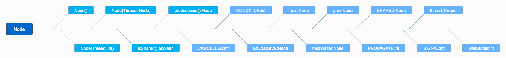

# [从ReentrantLock的实现看AQS的原理及应用](https://tech.meituan.com/2019/12/05/aqs-theory-and-apply.html)


## 1 ReentrantLock

### 1.1 ReentrantLock特性概览

ReentrantLock意思为可重入锁，指的是一个线程能够对一个临界资源重复加锁。为了帮助大家更好地理解ReentrantLock的特性，我们先将ReentrantLock跟常用的Synchronized进行比较，其特性如下（蓝色部分为本篇文章主要剖析的点）：


下面通过伪代码，进行更加直观的比较：

```java
// **************************Synchronized的使用方式**************************
// 1.用于代码块
synchronized (this) {}
// 2.用于对象
synchronized (object) {}
// 3.用于方法
public synchronized void test () {}
// 4.可重入
for (int i = 0; i < 100; i++) {
	synchronized (this) {}
}
// **************************ReentrantLock的使用方式**************************
public void test () throw Exception {
	// 1.初始化选择公平锁、非公平锁
	ReentrantLock lock = new ReentrantLock(true);
	// 2.可用于代码块
	lock.lock();
	try {
		try {
			// 3.支持多种加锁方式，比较灵活; 具有可重入特性
			if(lock.tryLock(100, TimeUnit.MILLISECONDS)){ }
		} finally {
			// 4.手动释放锁
			lock.unlock()
		}
	} finally {
		lock.unlock();
	}
}
```

### 1.2 ReentrantLock与AQS的关联

通过上文我们已经了解，ReentrantLock支持公平锁和非公平锁（关于公平锁和非公平锁的原理分析，可参考《[不可不说的Java“锁”事](https://mp.weixin.qq.com/s?__biz=MjM5NjQ5MTI5OA==&mid=2651749434&idx=3&sn=5ffa63ad47fe166f2f1a9f604ed10091&chksm=bd12a5778a652c61509d9e718ab086ff27ad8768586ea9b38c3dcf9e017a8e49bcae3df9bcc8&scene=38#wechat_redirect)》），并且ReentrantLock的底层就是由AQS来实现的。那么ReentrantLock是如何通过公平锁和非公平锁与AQS关联起来呢？ 我们着重从这两者的加锁过程来理解一下它们与AQS之间的关系（加锁过程中与AQS的关联比较明显，解锁流程后续会介绍）。

非公平锁源码中的加锁流程如下：

```java
// java.util.concurrent.locks.ReentrantLock#NonfairSync

// 非公平锁
static final class NonfairSync extends Sync {
	...
	final void lock() {
		if (compareAndSetState(0, 1))
			setExclusiveOwnerThread(Thread.currentThread());
		else
			acquire(1);
		}
  ...
}
```

这块代码的含义为：

- 若通过CAS设置变量State（同步状态）成功，也就是获取锁成功，则将当前线程设置为独占线程。
- 若通过CAS设置变量State（同步状态）失败，也就是获取锁失败，则进入Acquire方法进行后续处理。

第一步很好理解，但第二步获取锁失败后，后续的处理策略是怎么样的呢？这块可能会有以下思考：

- 某个线程获取锁失败的后续流程是什么呢？有以下两种可能：

(1) 将当前线程获锁结果设置为失败，获取锁流程结束。这种设计会极大降低系统的并发度，并不满足我们实际的需求。所以就需要下面这种流程，也就是AQS框架的处理流程。

(2) 存在某种排队等候机制，线程继续等待，仍然保留获取锁的可能，获取锁流程仍在继续。

- 对于问题1的第二种情况，既然说到了排队等候机制，那么就一定会有某种队列形成，这样的队列是什么数据结构呢？
- 处于排队等候机制中的线程，什么时候可以有机会获取锁呢？
- 如果处于排队等候机制中的线程一直无法获取锁，还是需要一直等待吗，还是有别的策略来解决这一问题？

带着非公平锁的这些问题，再看下公平锁源码中获锁的方式：

```java
// java.util.concurrent.locks.ReentrantLock#FairSync

static final class FairSync extends Sync {
  ...  
	final void lock() {
		acquire(1);
	}
  ...
}
```

看到这块代码，我们可能会存在这种疑问：Lock函数通过Acquire方法进行加锁，但是具体是如何加锁的呢？

结合公平锁和非公平锁的加锁流程，虽然流程上有一定的不同，但是都调用了Acquire方法，而Acquire方法是FairSync和UnfairSync的父类AQS中的核心方法。

对于上边提到的问题，其实在ReentrantLock类源码中都无法解答，而这些问题的答案，都是位于Acquire方法所在的类AbstractQueuedSynchronizer中，也就是本文的核心——AQS。下面我们会对AQS以及ReentrantLock和AQS的关联做详细介绍（相关问题答案会在2.3.5小节中解答）。

## 2 AQS

首先，我们通过下面的架构图来整体了解一下AQS框架：


- 上图中有颜色的为Method，无颜色的为Attribution。
- 总的来说，AQS框架共分为五层，自上而下由浅入深，从AQS对外暴露的API到底层基础数据。
- 当有自定义同步器接入时，只需重写第一层所需要的部分方法即可，不需要关注底层具体的实现流程。当自定义同步器进行加锁或者解锁操作时，先经过第一层的API进入AQS内部方法，然后经过第二层进行锁的获取，接着对于获取锁失败的流程，进入第三层和第四层的等待队列处理，而这些处理方式均依赖于第五层的基础数据提供层。

下面我们会从整体到细节，从流程到方法逐一剖析AQS框架，主要分析过程如下：


### 2.1 原理概览

AQS核心思想是，如果被请求的共享资源空闲，那么就将当前请求资源的线程设置为有效的工作线程，将共享资源设置为锁定状态；如果共享资源被占用，就需要一定的阻塞等待唤醒机制来保证锁分配。这个机制主要用的是CLH队列的变体实现的，将暂时获取不到锁的线程加入到队列中。

CLH：Craig、Landin and Hagersten队列，是单向链表，AQS中的队列是CLH变体的虚拟双向队列（FIFO），AQS是通过将每条请求共享资源的线程封装成一个节点来实现锁的分配。

主要原理图如下：


AQS使用一个Volatile的int类型的成员变量来表示同步状态，通过内置的FIFO队列来完成资源获取的排队工作，通过CAS完成对State值的修改。

#### 2.1.1 AQS数据结构

先来看下AQS中最基本的数据结构——Node，Node即为上面CLH变体队列中的节点。



解释一下几个方法和属性值的含义：

| 方法和属性值 | 含义                                                         |
| :----------- | :----------------------------------------------------------- |
| waitStatus   | 当前节点在队列中的状态                                       |
| thread       | 表示处于该节点的线程                                         |
| prev         | 前驱指针                                                     |
| predecessor  | 返回前驱节点，没有的话抛出npe                                |
| nextWaiter   | 指向下一个处于CONDITION状态的节点（由于本篇文章不讲述Condition Queue队列，这个指针不多介绍） |
| next         | 后继指针                                                     |

线程两种锁的模式：

| 模式      | 含义                           |
| :-------- | :----------------------------- |
| SHARED    | 表示线程以共享的模式等待锁     |
| EXCLUSIVE | 表示线程正在以独占的方式等待锁 |

waitStatus有下面几个枚举值：

| 枚举      | 含义                                           |
| :-------- | :--------------------------------------------- |
| 0         | 当一个Node被初始化的时候的默认值               |
| CANCELLED | 为1，表示线程获取锁的请求已经取消了            |
| CONDITION | 为-2，表示节点在等待队列中，节点线程等待唤醒   |
| PROPAGATE | 为-3，当前线程处在SHARED情况下，该字段才会使用 |
| SIGNAL    | 为-1，表示线程已经准备好了，就等资源释放了     |

#### 2.1.2 同步状态State

在了解数据结构后，接下来了解一下AQS的同步状态——State。AQS中维护了一个名为state的字段，意为同步状态，是由Volatile修饰的，用于展示当前临界资源的获锁情况。

```java
// java.util.concurrent.locks.AbstractQueuedSynchronizer

private volatile int state;
```

下面提供了几个访问这个字段的方法：

| 方法名                                                       | 描述                 |
| :----------------------------------------------------------- | :------------------- |
| protected final int getState()                               | 获取State的值        |
| protected final void setState(int newState)                  | 设置State的值        |
| protected final boolean compareAndSetState(int expect, int update) | 使用CAS方式更新State |

这几个方法都是Final修饰的，说明子类中无法重写它们。我们可以通过修改State字段表示的同步状态来实现多线程的独占模式和共享模式（加锁过程）。


对于我们自定义的同步工具，需要自定义获取同步状态和释放状态的方式，也就是AQS架构图中的第一层：API层。

## 2.2 AQS重要方法与ReentrantLock的关联

从架构图中可以得知，AQS提供了大量用于自定义同步器实现的Protected方法。自定义同步器实现的相关方法也只是为了通过修改State字段来实现多线程的独占模式或者共享模式。自定义同步器需要实现以下方法（ReentrantLock需要实现的方法如下，并不是全部）：

| 方法名                                      | 描述                                                         |
| :------------------------------------------ | :----------------------------------------------------------- |
| protected boolean isHeldExclusively()       | 该线程是否正在独占资源。只有用到Condition才需要去实现它。    |
| protected boolean tryAcquire(int arg)       | 独占方式。arg为获取锁的次数，尝试获取资源，成功则返回True，失败则返回False。 |
| protected boolean tryRelease(int arg)       | 独占方式。arg为释放锁的次数，尝试释放资源，成功则返回True，失败则返回False。 |
| protected int tryAcquireShared(int arg)     | 共享方式。arg为获取锁的次数，尝试获取资源。负数表示失败；0表示成功，但没有剩余可用资源；正数表示成功，且有剩余资源。 |
| protected boolean tryReleaseShared(int arg) | 共享方式。arg为释放锁的次数，尝试释放资源，如果释放后允许唤醒后续等待结点返回True，否则返回False。 |

一般来说，自定义同步器要么是独占方式，要么是共享方式，它们也只需实现tryAcquire-tryRelease、tryAcquireShared-tryReleaseShared中的一种即可。AQS也支持自定义同步器同时实现独占和共享两种方式，如ReentrantReadWriteLock。ReentrantLock是独占锁，所以实现了tryAcquire-tryRelease。

以非公平锁为例，这里主要阐述一下非公平锁与AQS之间方法的关联之处，具体每一处核心方法的作用会在文章后面详细进行阐述。