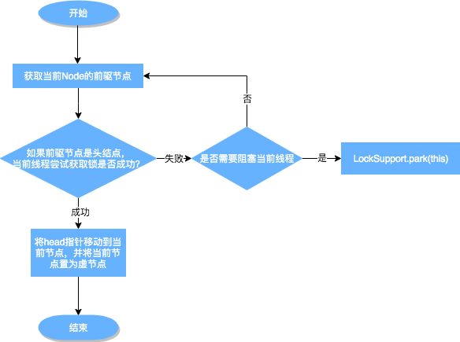
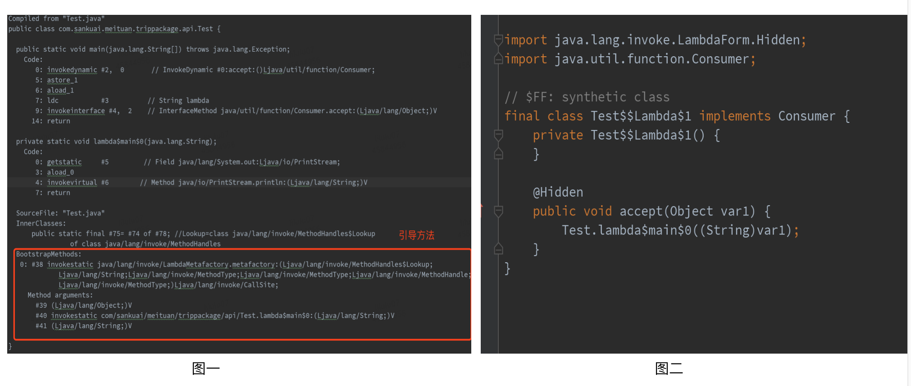
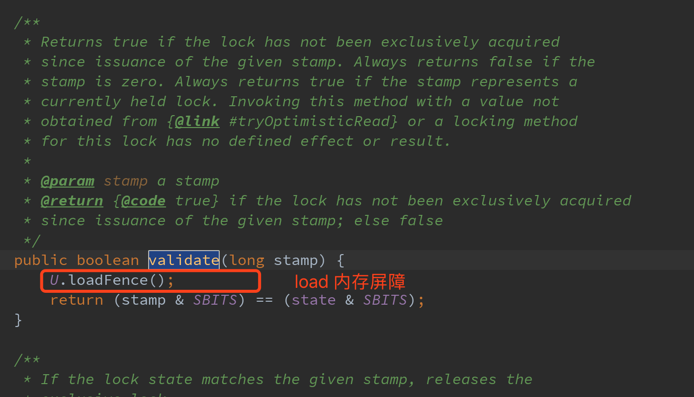

# [从ReentrantLock的实现看AQS的原理及应用](https://tech.meituan.com/2019/12/05/aqs-theory-and-apply.html)


## 1 ReentrantLock

### 1.1 ReentrantLock特性概览

ReentrantLock意思为可重入锁，指的是一个线程能够对一个临界资源重复加锁。为了帮助大家更好地理解ReentrantLock的特性，我们先将ReentrantLock跟常用的Synchronized进行比较，其特性如下（蓝色部分为本篇文章主要剖析的点）：


下面通过伪代码，进行更加直观的比较：

```java
// **************************Synchronized的使用方式**************************
// 1.用于代码块
synchronized (this) {}
// 2.用于对象
synchronized (object) {}
// 3.用于方法
public synchronized void test () {}
// 4.可重入
for (int i = 0; i < 100; i++) {
	synchronized (this) {}
}
// **************************ReentrantLock的使用方式**************************
public void test () throw Exception {
	// 1.初始化选择公平锁、非公平锁
	ReentrantLock lock = new ReentrantLock(true);
	// 2.可用于代码块
	lock.lock();
	try {
		try {
			// 3.支持多种加锁方式，比较灵活; 具有可重入特性
			if(lock.tryLock(100, TimeUnit.MILLISECONDS)){ }
		} finally {
			// 4.手动释放锁
			lock.unlock()
		}
	} finally {
		lock.unlock();
	}
}
```

### 1.2 ReentrantLock与AQS的关联

通过上文我们已经了解，ReentrantLock支持公平锁和非公平锁（关于公平锁和非公平锁的原理分析，可参考《[不可不说的Java“锁”事](https://mp.weixin.qq.com/s?__biz=MjM5NjQ5MTI5OA==&mid=2651749434&idx=3&sn=5ffa63ad47fe166f2f1a9f604ed10091&chksm=bd12a5778a652c61509d9e718ab086ff27ad8768586ea9b38c3dcf9e017a8e49bcae3df9bcc8&scene=38#wechat_redirect)》），并且ReentrantLock的底层就是由AQS来实现的。那么ReentrantLock是如何通过公平锁和非公平锁与AQS关联起来呢？ 我们着重从这两者的加锁过程来理解一下它们与AQS之间的关系（加锁过程中与AQS的关联比较明显，解锁流程后续会介绍）。

非公平锁源码中的加锁流程如下：

```java
// java.util.concurrent.locks.ReentrantLock#NonfairSync

// 非公平锁
static final class NonfairSync extends Sync {
	...
	final void lock() {
		if (compareAndSetState(0, 1))
			setExclusiveOwnerThread(Thread.currentThread());
		else
			acquire(1);
		}
  ...
}
```

这块代码的含义为：

- 若通过CAS设置变量State（同步状态）成功，也就是获取锁成功，则将当前线程设置为独占线程。
- 若通过CAS设置变量State（同步状态）失败，也就是获取锁失败，则进入Acquire方法进行后续处理。

第一步很好理解，但第二步获取锁失败后，后续的处理策略是怎么样的呢？这块可能会有以下思考：

- 某个线程获取锁失败的后续流程是什么呢？有以下两种可能：

(1) 将当前线程获锁结果设置为失败，获取锁流程结束。这种设计会极大降低系统的并发度，并不满足我们实际的需求。所以就需要下面这种流程，也就是AQS框架的处理流程。

(2) 存在某种排队等候机制，线程继续等待，仍然保留获取锁的可能，获取锁流程仍在继续。

- 对于问题1的第二种情况，既然说到了排队等候机制，那么就一定会有某种队列形成，这样的队列是什么数据结构呢？
- 处于排队等候机制中的线程，什么时候可以有机会获取锁呢？
- 如果处于排队等候机制中的线程一直无法获取锁，还是需要一直等待吗，还是有别的策略来解决这一问题？

带着非公平锁的这些问题，再看下公平锁源码中获锁的方式：

```java
// java.util.concurrent.locks.ReentrantLock#FairSync

static final class FairSync extends Sync {
  ...  
	final void lock() {
		acquire(1);
	}
  ...
}
```

看到这块代码，我们可能会存在这种疑问：Lock函数通过Acquire方法进行加锁，但是具体是如何加锁的呢？

结合公平锁和非公平锁的加锁流程，虽然流程上有一定的不同，但是都调用了Acquire方法，而Acquire方法是FairSync和UnfairSync的父类AQS中的核心方法。

对于上边提到的问题，其实在ReentrantLock类源码中都无法解答，而这些问题的答案，都是位于Acquire方法所在的类AbstractQueuedSynchronizer中，也就是本文的核心——AQS。下面我们会对AQS以及ReentrantLock和AQS的关联做详细介绍（相关问题答案会在2.3.5小节中解答）。

## 2 AQS

首先，我们通过下面的架构图来整体了解一下AQS框架：


- 上图中有颜色的为Method，无颜色的为Attribution。
- 总的来说，AQS框架共分为五层，自上而下由浅入深，从AQS对外暴露的API到底层基础数据。
- 当有自定义同步器接入时，只需重写第一层所需要的部分方法即可，不需要关注底层具体的实现流程。当自定义同步器进行加锁或者解锁操作时，先经过第一层的API进入AQS内部方法，然后经过第二层进行锁的获取，接着对于获取锁失败的流程，进入第三层和第四层的等待队列处理，而这些处理方式均依赖于第五层的基础数据提供层。

下面我们会从整体到细节，从流程到方法逐一剖析AQS框架，主要分析过程如下：


### 2.1 原理概览

AQS核心思想是，如果被请求的共享资源空闲，那么就将当前请求资源的线程设置为有效的工作线程，将共享资源设置为锁定状态；如果共享资源被占用，就需要一定的阻塞等待唤醒机制来保证锁分配。这个机制主要用的是CLH队列的变体实现的，将暂时获取不到锁的线程加入到队列中。

CLH：Craig、Landin and Hagersten队列，是单向链表，AQS中的队列是CLH变体的虚拟双向队列（FIFO），AQS是通过将每条请求共享资源的线程封装成一个节点来实现锁的分配。

主要原理图如下：


AQS使用一个Volatile的int类型的成员变量来表示同步状态，通过内置的FIFO队列来完成资源获取的排队工作，通过CAS完成对State值的修改。

#### 2.1.1 AQS数据结构

先来看下AQS中最基本的数据结构——Node，Node即为上面CLH变体队列中的节点。


解释一下几个方法和属性值的含义：

| 方法和属性值 | 含义                                                         |
| :----------- | :----------------------------------------------------------- |
| waitStatus   | 当前节点在队列中的状态                                       |
| thread       | 表示处于该节点的线程                                         |
| prev         | 前驱指针                                                     |
| predecessor  | 返回前驱节点，没有的话抛出npe                                |
| nextWaiter   | 指向下一个处于CONDITION状态的节点（由于本篇文章不讲述Condition Queue队列，这个指针不多介绍） |
| next         | 后继指针                                                     |

线程两种锁的模式：

| 模式      | 含义                           |
| :-------- | :----------------------------- |
| SHARED    | 表示线程以共享的模式等待锁     |
| EXCLUSIVE | 表示线程正在以独占的方式等待锁 |

waitStatus有下面几个枚举值：

| 枚举      | 含义                                           |
| :-------- | :--------------------------------------------- |
| 0         | 当一个Node被初始化的时候的默认值               |
| CANCELLED | 为1，表示线程获取锁的请求已经取消了            |
| CONDITION | 为-2，表示节点在等待队列中，节点线程等待唤醒   |
| PROPAGATE | 为-3，当前线程处在SHARED情况下，该字段才会使用 |
| SIGNAL    | 为-1，表示线程已经准备好了，就等资源释放了     |

#### 2.1.2 同步状态State

在了解数据结构后，接下来了解一下AQS的同步状态——State。**AQS中维护了一个名为state的字段，意为同步状态，是由Volatile修饰的，用于展示当前临界资源的获锁情况。**

```java
// java.util.concurrent.locks.AbstractQueuedSynchronizer

private volatile int state;
```

下面提供了几个访问这个字段的方法：

| 方法名                                                       | 描述                 |
| :----------------------------------------------------------- | :------------------- |
| protected final int getState()                               | 获取State的值        |
| protected final void setState(int newState)                  | 设置State的值        |
| protected final boolean compareAndSetState(int expect, int update) | 使用CAS方式更新State |

这几个方法都是Final修饰的，说明子类中无法重写它们。我们可以通过修改State字段表示的同步状态来实现多线程的独占模式和共享模式（加锁过程）。


对于我们自定义的同步工具，需要自定义获取同步状态和释放状态的方式，也就是AQS架构图中的第一层：API层。

## 2.2 AQS重要方法与ReentrantLock的关联

从架构图中可以得知，AQS提供了大量用于自定义同步器实现的Protected方法。自定义同步器实现的相关方法也只是为了通过修改State字段来实现多线程的独占模式或者共享模式。自定义同步器需要实现以下方法（ReentrantLock需要实现的方法如下，并不是全部）：

| 方法名                                      | 描述                                                         |
| :------------------------------------------ | :----------------------------------------------------------- |
| protected boolean isHeldExclusively()       | 该线程是否正在独占资源。只有用到Condition才需要去实现它。    |
| protected boolean tryAcquire(int arg)       | 独占方式。arg为获取锁的次数，尝试获取资源，成功则返回True，失败则返回False。 |
| protected boolean tryRelease(int arg)       | 独占方式。arg为释放锁的次数，尝试释放资源，成功则返回True，失败则返回False。 |
| protected int tryAcquireShared(int arg)     | 共享方式。arg为获取锁的次数，尝试获取资源。负数表示失败；0表示成功，但没有剩余可用资源；正数表示成功，且有剩余资源。 |
| protected boolean tryReleaseShared(int arg) | 共享方式。arg为释放锁的次数，尝试释放资源，如果释放后允许唤醒后续等待结点返回True，否则返回False。 |

一般来说，自定义同步器要么是独占方式，要么是共享方式，它们也只需实现tryAcquire-tryRelease、tryAcquireShared-tryReleaseShared中的一种即可。AQS也支持自定义同步器同时实现独占和共享两种方式，如ReentrantReadWriteLock。ReentrantLock是独占锁，所以实现了tryAcquire-tryRelease。

以非公平锁为例，这里主要阐述一下非公平锁与AQS之间方法的关联之处，具体每一处核心方法的作用会在文章后面详细进行阐述。


为了帮助大家理解ReentrantLock和AQS之间方法的交互过程，以非公平锁为例，我们将加锁和解锁的交互流程单独拎出来强调一下，以便于对后续内容的理解。


加锁：

- 通过ReentrantLock的加锁方法Lock进行加锁操作。
- 会调用到抽象内部类Sync的Lock方法（具体实现为内部类FairSync类和NonfairSync类），由于Sync#lock是抽象方法，根据ReentrantLock初始化选择的公平锁和非公平锁，执行相关内部类的Lock方法，本质上都会执行AQS的Acquire方法。
- AQS的Acquire方法会执行tryAcquire方法，但是由于tryAcquire需要自定义同步器实现，因此执行了ReentrantLock中的tryAcquire方法，由于ReentrantLock是通过公平锁和非公平锁内部类实现的tryAcquire方法，因此会根据锁类型不同，执行不同的tryAcquire。
- tryAcquire是获取锁逻辑，获取失败后，会执行框架AQS的后续逻辑，跟ReentrantLock自定义同步器无关。

解锁：

- 通过ReentrantLock的解锁方法Unlock进行解锁。
- Unlock会调用内部类Sync的Release方法，该方法继承于AQS。
- Release中会调用tryRelease方法，tryRelease需要自定义同步器实现，tryRelease只在ReentrantLock中的Sync实现，因此可以看出，释放锁的过程，并不区分是否为公平锁。
- 释放成功后，所有处理由AQS框架完成，与自定义同步器无关。

通过上面的描述，大概可以总结出ReentrantLock加锁解锁时API层核心方法的映射关系。


## 2.3 通过ReentrantLock理解AQS

ReentrantLock中公平锁和非公平锁在底层是相同的，这里以非公平锁为例进行分析。

在非公平锁中，有一段这样的代码：

```java
// java.util.concurrent.locks.ReentrantLock

static final class NonfairSync extends Sync {
	...
	final void lock() {
		if (compareAndSetState(0, 1))
			setExclusiveOwnerThread(Thread.currentThread());
		else
			acquire(1);
	}
  ...
}
```

看一下这个Acquire是怎么写的：

```java
// java.util.concurrent.locks.AbstractQueuedSynchronizer

public final void acquire(int arg) {
	if (!tryAcquire(arg) && acquireQueued(addWaiter(Node.EXCLUSIVE), arg))
		selfInterrupt();
}
```

再看一下tryAcquire方法：

```java
// java.util.concurrent.locks.AbstractQueuedSynchronizer

protected boolean tryAcquire(int arg) {
	throw new UnsupportedOperationException();
}
```

可以看出，这里只是AQS的简单实现，具体获取锁的实现方法是由各自的公平锁和非公平锁单独实现的（以ReentrantLock为例）。如果该方法返回了True，则说明当前线程获取锁成功，就不用往后执行了；如果获取失败，就需要加入到等待队列中。下面会详细解释线程是何时以及怎样被加入进等待队列中的。

### 2.3.1 线程加入等待队列

#### 2.3.1.1 加入队列的时机

当执行Acquire(1)时，会通过tryAcquire获取锁。在这种情况下，如果获取锁失败，就会调用addWaiter加入到等待队列中去。

#### 2.3.1.2 如何加入队列

获取锁失败后，会执行addWaiter(Node.EXCLUSIVE)加入等待队列，具体实现方法如下：

```java
// java.util.concurrent.locks.AbstractQueuedSynchronizer

private Node addWaiter(Node mode) {
	Node node = new Node(Thread.currentThread(), mode);
	// Try the fast path of enq; backup to full enq on failure
	Node pred = tail;
	if (pred != null) {
		node.prev = pred;
		if (compareAndSetTail(pred, node)) {
			pred.next = node;
			return node;
		}
	}
	enq(node);
	return node;
}
private final boolean compareAndSetTail(Node expect, Node update) {
	return unsafe.compareAndSwapObject(this, tailOffset, expect, update);
}
```

主要的流程如下：

- 通过当前的线程和锁模式新建一个节点。
- Pred指针指向尾节点Tail。
- 将New中Node的Prev指针指向Pred。
- 通过compareAndSetTail方法，完成尾节点的设置。这个方法主要是对tailOffset和Expect进行比较，如果tailOffset的Node和Expect的Node地址是相同的，那么设置Tail的值为Update的值。

```java
// java.util.concurrent.locks.AbstractQueuedSynchronizer

static {
	try {
		stateOffset = unsafe.objectFieldOffset(AbstractQueuedSynchronizer.class.getDeclaredField("state"));
		headOffset = unsafe.objectFieldOffset(AbstractQueuedSynchronizer.class.getDeclaredField("head"));
		tailOffset = unsafe.objectFieldOffset(AbstractQueuedSynchronizer.class.getDeclaredField("tail"));
		waitStatusOffset = unsafe.objectFieldOffset(Node.class.getDeclaredField("waitStatus"));
		nextOffset = unsafe.objectFieldOffset(Node.class.getDeclaredField("next"));
	} catch (Exception ex) { 
    throw new Error(ex); 
  }
}
```

从AQS的静态代码块可以看出，都是获取一个对象的属性相对于该对象在内存当中的偏移量，这样我们就可以根据这个偏移量在对象内存当中找到这个属性。tailOffset指的是tail对应的偏移量，所以这个时候会将new出来的Node置为当前队列的尾节点。同时，由于是双向链表，也需要将前一个节点指向尾节点。

- 如果Pred指针是Null（说明等待队列中没有元素），或者当前Pred指针和Tail指向的位置不同（说明被别的线程已经修改），就需要看一下Enq的方法。

```java
// java.util.concurrent.locks.AbstractQueuedSynchronizer

private Node enq(final Node node) {
	for (;;) {
		Node t = tail;
		if (t == null) { // Must initialize
			if (compareAndSetHead(new Node()))
				tail = head;
		} else {
			node.prev = t;
			if (compareAndSetTail(t, node)) {
				t.next = node;
				return t;
			}
		}
	}
}
```

如果没有被初始化，需要进行初始化一个头结点出来。但请注意，初始化的头结点并不是当前线程节点，而是调用了无参构造函数的节点。如果经历了初始化或者并发导致队列中有元素，则与之前的方法相同。其实，addWaiter就是一个在双端链表添加尾节点的操作，需要注意的是，双端链表的头结点是一个无参构造函数的头结点。

总结一下，线程获取锁的时候，过程大体如下：

1. 当没有线程获取到锁时，线程1获取锁成功。
2. 线程2申请锁，但是锁被线程1占有。


1. 如果再有线程要获取锁，依次在队列中往后排队即可。

回到上边的代码，hasQueuedPredecessors是公平锁加锁时判断等待队列中是否存在有效节点的方法。如果返回False，说明当前线程可以争取共享资源；如果返回True，说明队列中存在有效节点，当前线程必须加入到等待队列中。

```java
// java.util.concurrent.locks.ReentrantLock

public final boolean hasQueuedPredecessors() {
	// The correctness of this depends on head being initialized
	// before tail and on head.next being accurate if the current
	// thread is first in queue.
	Node t = tail; // Read fields in reverse initialization order
	Node h = head;
	Node s;
	return h != t && ((s = h.next) == null || s.thread != Thread.currentThread());
}
```

看到这里，我们理解一下h != t && ((s = h.next) == null || s.thread != Thread.currentThread());为什么要判断的头结点的下一个节点？第一个节点储存的数据是什么？

> 双向链表中，第一个节点为虚节点，其实并不存储任何信息，只是占位。真正的第一个有数据的节点，是在第二个节点开始的。当h != t时： 如果(s = h.next) == null，等待队列正在有线程进行初始化，但只是进行到了Tail指向Head，没有将Head指向Tail，此时队列中有元素，需要返回True（这块具体见下边代码分析）。 如果(s = h.next) != null，说明此时队列中至少有一个有效节点。如果此时s.thread == Thread.currentThread()，说明等待队列的第一个有效节点中的线程与当前线程相同，那么当前线程是可以获取资源的；如果s.thread != Thread.currentThread()，说明等待队列的第一个有效节点线程与当前线程不同，当前线程必须加入进等待队列。

```java
// java.util.concurrent.locks.AbstractQueuedSynchronizer#enq

if (t == null) { // Must initialize
	if (compareAndSetHead(new Node()))
		tail = head;
} else {
	node.prev = t;
	if (compareAndSetTail(t, node)) {
		t.next = node;
		return t;
	}
}
```

节点入队不是原子操作，所以会出现短暂的head != tail，此时Tail指向最后一个节点，而且Tail指向Head。如果Head没有指向Tail（可见5、6、7行），这种情况下也需要将相关线程加入队列中。所以这块代码是为了解决极端情况下的并发问题。

#### 2.3.1.3 等待队列中线程出队列时机

回到最初的源码：

```java
// java.util.concurrent.locks.AbstractQueuedSynchronizer

public final void acquire(int arg) {
	if (!tryAcquire(arg) && acquireQueued(addWaiter(Node.EXCLUSIVE), arg))
		selfInterrupt();
}
```

上文解释了addWaiter方法，这个方法其实就是把对应的线程以Node的数据结构形式加入到双端队列里，返回的是一个包含该线程的Node。而这个Node会作为参数，进入到acquireQueued方法中。acquireQueued方法可以对排队中的线程进行“获锁”操作。

总的来说，一个线程获取锁失败了，被放入等待队列，acquireQueued会把放入队列中的线程不断去获取锁，直到获取成功或者不再需要获取（中断）。

下面我们从“何时出队列？”和“如何出队列？”两个方向来分析一下acquireQueued源码：

```java
// java.util.concurrent.locks.AbstractQueuedSynchronizer

final boolean acquireQueued(final Node node, int arg) {
	// 标记是否成功拿到资源
	boolean failed = true;
	try {
		// 标记等待过程中是否中断过
		boolean interrupted = false;
		// 开始自旋，要么获取锁，要么中断
		for (;;) {
			// 获取当前节点的前驱节点
			final Node p = node.predecessor();
			// 如果p是头结点，说明当前节点在真实数据队列的首部，就尝试获取锁（别忘了头结点是虚节点）
			if (p == head && tryAcquire(arg)) {
				// 获取锁成功，头指针移动到当前node
				setHead(node);
				p.next = null; // help GC
				failed = false;
				return interrupted;
			}
			// 说明p为头节点且当前没有获取到锁（可能是非公平锁被抢占了）或者是p不为头结点，这个时候就要判断当前node是否要被阻塞（被阻塞条件：前驱节点的waitStatus为-1），防止无限循环浪费资源。具体两个方法下面细细分析
			if (shouldParkAfterFailedAcquire(p, node) && parkAndCheckInterrupt())
				interrupted = true;
		}
	} finally {
		if (failed)
			cancelAcquire(node);
	}
}
```

注：setHead方法是把当前节点置为虚节点，但并没有修改waitStatus，因为它是一直需要用的数据。

```java
// java.util.concurrent.locks.AbstractQueuedSynchronizer

private void setHead(Node node) {
	head = node;
	node.thread = null;
	node.prev = null;
}

// java.util.concurrent.locks.AbstractQueuedSynchronizer

// 靠前驱节点判断当前线程是否应该被阻塞
private static boolean shouldParkAfterFailedAcquire(Node pred, Node node) {
	// 获取头结点的节点状态
	int ws = pred.waitStatus;
	// 说明头结点处于唤醒状态
	if (ws == Node.SIGNAL)
		return true; 
	// 通过枚举值我们知道waitStatus>0是取消状态
	if (ws > 0) {
		do {
			// 循环向前查找取消节点，把取消节点从队列中剔除
			node.prev = pred = pred.prev;
		} while (pred.waitStatus > 0);
		pred.next = node;
	} else {
		// 设置前任节点等待状态为SIGNAL
		compareAndSetWaitStatus(pred, ws, Node.SIGNAL);
	}
	return false;
}
```

parkAndCheckInterrupt主要用于挂起当前线程，阻塞调用栈，返回当前线程的中断状态。

```java
// java.util.concurrent.locks.AbstractQueuedSynchronizer

private final boolean parkAndCheckInterrupt() {
    LockSupport.park(this);
    return Thread.interrupted();
}
```

上述方法的流程图如下：



从上图可以看出，跳出当前循环的条件是当“前置节点是头结点，且当前线程获取锁成功”。为了防止因死循环导致CPU资源被浪费，我们会判断前置节点的状态来决定是否要将当前线程挂起，具体挂起流程用流程图表示如下（shouldParkAfterFailedAcquire流程）：


从队列中释放节点的疑虑打消了，那么又有新问题了：

- shouldParkAfterFailedAcquire中取消节点是怎么生成的呢？什么时候会把一个节点的waitStatus设置为-1？
- 是在什么时间释放节点通知到被挂起的线程呢？

### 2.3.2 CANCELLED状态节点生成

acquireQueued方法中的Finally代码：

```java
// java.util.concurrent.locks.AbstractQueuedSynchronizer

final boolean acquireQueued(final Node node, int arg) {
	boolean failed = true;
	try {
    ...
		for (;;) {
			final Node p = node.predecessor();
			if (p == head && tryAcquire(arg)) {
				...
				failed = false;
        ...
			}
			...
	} finally {
		if (failed)
			cancelAcquire(node);
		}
}
```

通过cancelAcquire方法，将Node的状态标记为CANCELLED。接下来，我们逐行来分析这个方法的原理：

```java
// java.util.concurrent.locks.AbstractQueuedSynchronizer

private void cancelAcquire(Node node) {
  // 将无效节点过滤
	if (node == null)
		return;
  // 设置该节点不关联任何线程，也就是虚节点
	node.thread = null;
	Node pred = node.prev;
  // 通过前驱节点，跳过取消状态的node
	while (pred.waitStatus > 0)
		node.prev = pred = pred.prev;
  // 获取过滤后的前驱节点的后继节点
	Node predNext = pred.next;
  // 把当前node的状态设置为CANCELLED
	node.waitStatus = Node.CANCELLED;
  // 如果当前节点是尾节点，将从后往前的第一个非取消状态的节点设置为尾节点
  // 更新失败的话，则进入else，如果更新成功，将tail的后继节点设置为null
	if (node == tail && compareAndSetTail(node, pred)) {
		compareAndSetNext(pred, predNext, null);
	} else {
		int ws;
    // 如果当前节点不是head的后继节点，1:判断当前节点前驱节点的是否为SIGNAL，2:如果不是，则把前驱节点设置为SINGAL看是否成功
    // 如果1和2中有一个为true，再判断当前节点的线程是否为null
    // 如果上述条件都满足，把当前节点的前驱节点的后继指针指向当前节点的后继节点
		if (pred != head && ((ws = pred.waitStatus) == Node.SIGNAL || (ws <= 0 && compareAndSetWaitStatus(pred, ws, Node.SIGNAL))) && pred.thread != null) {
			Node next = node.next;
			if (next != null && next.waitStatus <= 0)
				compareAndSetNext(pred, predNext, next);
		} else {
      // 如果当前节点是head的后继节点，或者上述条件不满足，那就唤醒当前节点的后继节点
			unparkSuccessor(node);
		}
		node.next = node; // help GC
	}
}
```

当前的流程：

- 获取当前节点的前驱节点，如果前驱节点的状态是CANCELLED，那就一直往前遍历，找到第一个waitStatus <= 0的节点，将找到的Pred节点和当前Node关联，将当前Node设置为CANCELLED。
- 根据当前节点的位置，考虑以下三种情况：

(1) 当前节点是尾节点。

(2) 当前节点是Head的后继节点。

(3) 当前节点不是Head的后继节点，也不是尾节点。

根据上述第二条，我们来分析每一种情况的流程。

当前节点是尾节点。


当前节点是Head的后继节点。


当前节点不是Head的后继节点，也不是尾节点。


通过上面的流程，我们对于CANCELLED节点状态的产生和变化已经有了大致的了解，但是为什么所有的变化都是对Next指针进行了操作，而没有对Prev指针进行操作呢？什么情况下会对Prev指针进行操作？

> 执行cancelAcquire的时候，当前节点的前置节点可能已经从队列中出去了（已经执行过Try代码块中的shouldParkAfterFailedAcquire方法了），如果此时修改Prev指针，有可能会导致Prev指向另一个已经移除队列的Node，因此这块变化Prev指针不安全。 shouldParkAfterFailedAcquire方法中，会执行下面的代码，其实就是在处理Prev指针。shouldParkAfterFailedAcquire是获取锁失败的情况下才会执行，进入该方法后，说明共享资源已被获取，当前节点之前的节点都不会出现变化，因此这个时候变更Prev指针比较安全。
>
> ```java
> do {
> 	node.prev = pred = pred.prev;
> } while (pred.waitStatus > 0);
> ```

### 2.3.3 如何解锁

我们已经剖析了加锁过程中的基本流程，接下来再对解锁的基本流程进行分析。由于ReentrantLock在解锁的时候，并不区分公平锁和非公平锁，所以我们直接看解锁的源码：

```java
// java.util.concurrent.locks.ReentrantLock

public void unlock() {
	sync.release(1);
}
```

可以看到，本质释放锁的地方，是通过框架来完成的。

```java
// java.util.concurrent.locks.AbstractQueuedSynchronizer

public final boolean release(int arg) {
	if (tryRelease(arg)) {
		Node h = head;
		if (h != null && h.waitStatus != 0)
			unparkSuccessor(h);
		return true;
	}
	return false;
}
```

在ReentrantLock里面的公平锁和非公平锁的父类Sync定义了可重入锁的释放锁机制。

```java
// java.util.concurrent.locks.ReentrantLock.Sync

// 方法返回当前锁是不是没有被线程持有
protected final boolean tryRelease(int releases) {
	// 减少可重入次数
	int c = getState() - releases;
	// 当前线程不是持有锁的线程，抛出异常
	if (Thread.currentThread() != getExclusiveOwnerThread())
		throw new IllegalMonitorStateException();
	boolean free = false;
	// 如果持有线程全部释放，将当前独占锁所有线程设置为null，并更新state
	if (c == 0) {
		free = true;
		setExclusiveOwnerThread(null);
	}
	setState(c);
	return free;
}
```

我们来解释下述源码：

```java
// java.util.concurrent.locks.AbstractQueuedSynchronizer

public final boolean release(int arg) {
	// 上边自定义的tryRelease如果返回true，说明该锁没有被任何线程持有
	if (tryRelease(arg)) {
		// 获取头结点
		Node h = head;
		// 头结点不为空并且头结点的waitStatus不是初始化节点情况，解除线程挂起状态
		if (h != null && h.waitStatus != 0)
			unparkSuccessor(h);
		return true;
	}
	return false;
}
```

这里的判断条件为什么是h != null && h.waitStatus != 0？

> h == null Head还没初始化。初始情况下，head == null，第一个节点入队，Head会被初始化一个虚拟节点。所以说，这里如果还没来得及入队，就会出现head == null 的情况。
>
> h != null && waitStatus == 0 表明后继节点对应的线程仍在运行中，不需要唤醒。
>
> h != null && waitStatus < 0 表明后继节点可能被阻塞了，需要唤醒。

再看一下unparkSuccessor方法：

```java
// java.util.concurrent.locks.AbstractQueuedSynchronizer

private void unparkSuccessor(Node node) {
	// 获取头结点waitStatus
	int ws = node.waitStatus;
	if (ws < 0)
		compareAndSetWaitStatus(node, ws, 0);
	// 获取当前节点的下一个节点
	Node s = node.next;
	// 如果下个节点是null或者下个节点被cancelled，就找到队列最开始的非cancelled的节点
	if (s == null || s.waitStatus > 0) {
		s = null;
		// 就从尾部节点开始找，到队首，找到队列第一个waitStatus<0的节点。
		for (Node t = tail; t != null && t != node; t = t.prev)
			if (t.waitStatus <= 0)
				s = t;
	}
	// 如果当前节点的下个节点不为空，而且状态<=0，就把当前节点unpark
	if (s != null)
		LockSupport.unpark(s.thread);
}
```

为什么要从后往前找第一个非Cancelled的节点呢？原因如下。

之前的addWaiter方法：

```java
// java.util.concurrent.locks.AbstractQueuedSynchronizer

private Node addWaiter(Node mode) {
	Node node = new Node(Thread.currentThread(), mode);
	// Try the fast path of enq; backup to full enq on failure
	Node pred = tail;
	if (pred != null) {
		node.prev = pred;
		if (compareAndSetTail(pred, node)) {
			pred.next = node;
			return node;
		}
	}
	enq(node);
	return node;
}
```

我们从这里可以看到，节点入队并不是原子操作，也就是说，node.prev = pred; compareAndSetTail(pred, node) 这两个地方可以看作Tail入队的原子操作，但是此时pred.next = node;还没执行，如果这个时候执行了unparkSuccessor方法，就没办法从前往后找了，所以需要从后往前找。还有一点原因，在产生CANCELLED状态节点的时候，先断开的是Next指针，Prev指针并未断开，因此也是必须要从后往前遍历才能够遍历完全部的Node。

综上所述，如果是从前往后找，由于极端情况下入队的非原子操作和CANCELLED节点产生过程中断开Next指针的操作，可能会导致无法遍历所有的节点。所以，唤醒对应的线程后，对应的线程就会继续往下执行。继续执行acquireQueued方法以后，中断如何处理？

### 2.3.4 中断恢复后的执行流程

唤醒后，会执行return Thread.interrupted();，这个函数返回的是当前执行线程的中断状态，并清除。

```java
// java.util.concurrent.locks.AbstractQueuedSynchronizer

private final boolean parkAndCheckInterrupt() {
	LockSupport.park(this);
	return Thread.interrupted();
}
```

再回到acquireQueued代码，当parkAndCheckInterrupt返回True或者False的时候，interrupted的值不同，但都会执行下次循环。如果这个时候获取锁成功，就会把当前interrupted返回。

```java
// java.util.concurrent.locks.AbstractQueuedSynchronizer

final boolean acquireQueued(final Node node, int arg) {
	boolean failed = true;
	try {
		boolean interrupted = false;
		for (;;) {
			final Node p = node.predecessor();
			if (p == head && tryAcquire(arg)) {
				setHead(node);
				p.next = null; // help GC
				failed = false;
				return interrupted;
			}
			if (shouldParkAfterFailedAcquire(p, node) && parkAndCheckInterrupt())
				interrupted = true;
			}
	} finally {
		if (failed)
			cancelAcquire(node);
	}
}
```

如果acquireQueued为True，就会执行selfInterrupt方法。

```java
// java.util.concurrent.locks.AbstractQueuedSynchronizer

static void selfInterrupt() {
	Thread.currentThread().interrupt();
}
```

该方法其实是为了中断线程。但为什么获取了锁以后还要中断线程呢？这部分属于Java提供的协作式中断知识内容，感兴趣同学可以查阅一下。这里简单介绍一下：

1. 当中断线程被唤醒时，并不知道被唤醒的原因，可能是当前线程在等待中被中断，也可能是释放了锁以后被唤醒。因此我们通过Thread.interrupted()方法检查中断标记（该方法返回了当前线程的中断状态，并将当前线程的中断标识设置为False），并记录下来，如果发现该线程被中断过，就再中断一次。
2. 线程在等待资源的过程中被唤醒，唤醒后还是会不断地去尝试获取锁，直到抢到锁为止。也就是说，在整个流程中，并不响应中断，只是记录中断记录。最后抢到锁返回了，那么如果被中断过的话，就需要补充一次中断。

这里的处理方式主要是运用线程池中基本运作单元Worder中的runWorker，通过Thread.interrupted()进行额外的判断处理，感兴趣的同学可以看下ThreadPoolExecutor源码。

### 2.3.5 小结

我们在1.3小节中提出了一些问题，现在来回答一下。

> Q：某个线程获取锁失败的后续流程是什么呢？
>
> A：存在某种排队等候机制，线程继续等待，仍然保留获取锁的可能，获取锁流程仍在继续。
>
> Q：既然说到了排队等候机制，那么就一定会有某种队列形成，这样的队列是什么数据结构呢？
>
> A：是CLH变体的FIFO双端队列。
>
> Q：处于排队等候机制中的线程，什么时候可以有机会获取锁呢？
>
> A：可以详细看下2.3.1.3小节。
>
> Q：如果处于排队等候机制中的线程一直无法获取锁，需要一直等待么？还是有别的策略来解决这一问题？
>
> A：线程所在节点的状态会变成取消状态，取消状态的节点会从队列中释放，具体可见2.3.2小节。
>
> Q：Lock函数通过Acquire方法进行加锁，但是具体是如何加锁的呢？
>
> A：AQS的Acquire会调用tryAcquire方法，tryAcquire由各个自定义同步器实现，通过tryAcquire完成加锁过程。

## 3 AQS应用

### 3.1 ReentrantLock的可重入应用

ReentrantLock的可重入性是AQS很好的应用之一，在了解完上述知识点以后，我们很容易得知ReentrantLock实现可重入的方法。在ReentrantLock里面，不管是公平锁还是非公平锁，都有一段逻辑。

公平锁：

```java
// java.util.concurrent.locks.ReentrantLock.FairSync#tryAcquire

if (c == 0) {
	if (!hasQueuedPredecessors() && compareAndSetState(0, acquires)) {
		setExclusiveOwnerThread(current);
		return true;
	}
}
else if (current == getExclusiveOwnerThread()) {
	int nextc = c + acquires;
	if (nextc < 0)
		throw new Error("Maximum lock count exceeded");
	setState(nextc);
	return true;
}
```

非公平锁：

```java
// java.util.concurrent.locks.ReentrantLock.Sync#nonfairTryAcquire

if (c == 0) {
	if (compareAndSetState(0, acquires)){
		setExclusiveOwnerThread(current);
		return true;
	}
}
else if (current == getExclusiveOwnerThread()) {
	int nextc = c + acquires;
	if (nextc < 0) // overflow
		throw new Error("Maximum lock count exceeded");
	setState(nextc);
	return true;
}
```

从上面这两段都可以看到，有一个同步状态State来控制整体可重入的情况。State是Volatile修饰的，用于保证一定的可见性和有序性。

```java
// java.util.concurrent.locks.AbstractQueuedSynchronizer

private volatile int state;
```

接下来看State这个字段主要的过程：

1. State初始化的时候为0，表示没有任何线程持有锁。
2. 当有线程持有该锁时，值就会在原来的基础上+1，同一个线程多次获得锁是，就会多次+1，这里就是可重入的概念。
3. 解锁也是对这个字段-1，一直到0，此线程对锁释放。

### 3.2 JUC中的应用场景

除了上边ReentrantLock的可重入性的应用，AQS作为并发编程的框架，为很多其他同步工具提供了良好的解决方案。下面列出了JUC中的几种同步工具，大体介绍一下AQS的应用场景：

| 同步工具               | 同步工具与AQS的关联                                          |
| :--------------------- | :----------------------------------------------------------- |
| ReentrantLock          | 使用AQS保存锁重复持有的次数。当一个线程获取锁时，ReentrantLock记录当前获得锁的线程标识，用于检测是否重复获取，以及错误线程试图解锁操作时异常情况的处理。 |
| Semaphore              | 使用AQS同步状态来保存信号量的当前计数。tryRelease会增加计数，acquireShared会减少计数。 |
| CountDownLatch         | 使用AQS同步状态来表示计数。计数为0时，所有的Acquire操作（CountDownLatch的await方法）才可以通过。 |
| ReentrantReadWriteLock | 使用AQS同步状态中的16位保存写锁持有的次数，剩下的16位用于保存读锁的持有次数。 |
| ThreadPoolExecutor     | Worker利用AQS同步状态实现对独占线程变量的设置（tryAcquire和tryRelease）。 |

### 3.3 自定义同步工具

了解AQS基本原理以后，按照上面所说的AQS知识点，自己实现一个同步工具。

```java
public class LeeLock  {

    private static class Sync extends AbstractQueuedSynchronizer {
        @Override
        protected boolean tryAcquire (int arg) {
            return compareAndSetState(0, 1);
        }

        @Override
        protected boolean tryRelease (int arg) {
            setState(0);
            return true;
        }

        @Override
        protected boolean isHeldExclusively () {
            return getState() == 1;
        }
    }
    
    private Sync sync = new Sync();
    
    public void lock () {
        sync.acquire(1);
    }
    
    public void unlock () {
        sync.release(1);
    }
}
```

通过我们自己定义的Lock完成一定的同步功能。

```java
public class LeeMain {

    static int count = 0;
    static LeeLock leeLock = new LeeLock();

    public static void main (String[] args) throws InterruptedException {

        Runnable runnable = new Runnable() {
            @Override
            public void run () {
                try {
                    leeLock.lock();
                    for (int i = 0; i < 10000; i++) {
                        count++;
                    }
                } catch (Exception e) {
                    e.printStackTrace();
                } finally {
                    leeLock.unlock();
                }

            }
        };
        Thread thread1 = new Thread(runnable);
        Thread thread2 = new Thread(runnable);
        thread1.start();
        thread2.start();
        thread1.join();
        thread2.join();
        System.out.println(count);
    }
}
```

上述代码每次运行结果都会是20000。通过简单的几行代码就能实现同步功能，这就是AQS的强大之处。

## 总结

我们日常开发中使用并发的场景太多，但是对并发内部的基本框架原理了解的人却不多。由于篇幅原因，本文仅介绍了可重入锁ReentrantLock的原理和AQS原理，希望能够成为大家了解AQS和ReentrantLock等同步器的“敲门砖”。


# [Java魔法类：Unsafe应用解析](https://tech.meituan.com/2019/02/14/talk-about-java-magic-class-unsafe.html)

## 前言

Unsafe是位于sun.misc包下的一个类，主要提供一些用于执行低级别、不安全操作的方法，如直接访问系统内存资源、自主管理内存资源等，这些方法在提升Java运行效率、增强Java语言底层资源操作能力方面起到了很大的作用。但由于Unsafe类使Java语言拥有了类似C语言指针一样操作内存空间的能力，这无疑也增加了程序发生相关指针问题的风险。在程序中过度、不正确使用Unsafe类会使得程序出错的概率变大，使得Java这种安全的语言变得不再“安全”，因此对Unsafe的使用一定要慎重。

注：本文对sun.misc.Unsafe公共API功能及相关应用场景进行介绍。

## 基本介绍

如下Unsafe源码所示，Unsafe类为一单例实现，提供静态方法getUnsafe获取Unsafe实例，当且仅当调用getUnsafe方法的类为引导类加载器所加载时才合法，否则抛出SecurityException异常。

```java
public final class Unsafe {
  // 单例对象
  private static final Unsafe theUnsafe;

  private Unsafe() {
  }
  @CallerSensitive
  public static Unsafe getUnsafe() {
    Class var0 = Reflection.getCallerClass();
    // 仅在引导类加载器`BootstrapClassLoader`加载时才合法
    if(!VM.isSystemDomainLoader(var0.getClassLoader())) {    
      throw new SecurityException("Unsafe");
    } else {
      return theUnsafe;
    }
  }
}
```

那如若想使用这个类，该如何获取其实例？有如下两个可行方案。

其一，从`getUnsafe`方法的使用限制条件出发，通过Java命令行命令`-Xbootclasspath/a`把调用Unsafe相关方法的类A所在jar包路径追加到默认的bootstrap路径中，使得A被引导类加载器加载，从而通过`Unsafe.getUnsafe`方法安全的获取Unsafe实例。

```sh
java -Xbootclasspath/a: ${path}   // 其中path为调用Unsafe相关方法的类所在jar包路径 
```

其二，通过反射获取单例对象theUnsafe。

```java
private static Unsafe reflectGetUnsafe() {
    try {
      Field field = Unsafe.class.getDeclaredField("theUnsafe");
      field.setAccessible(true);
      return (Unsafe) field.get(null);
    } catch (Exception e) {
      log.error(e.getMessage(), e);
      return null;
    }
}
```

## 功能介绍


如上图所示，Unsafe提供的API大致可分为内存操作、CAS、Class相关、对象操作、线程调度、系统信息获取、内存屏障、数组操作等几类，下面将对其相关方法和应用场景进行详细介绍。

### 内存操作

这部分主要包含堆外内存的分配、拷贝、释放、给定地址值操作等方法。

```java
//分配内存, 相当于C++的malloc函数
public native long allocateMemory(long bytes);
//扩充内存
public native long reallocateMemory(long address, long bytes);
//释放内存
public native void freeMemory(long address);
//在给定的内存块中设置值
public native void setMemory(Object o, long offset, long bytes, byte value);
//内存拷贝
public native void copyMemory(Object srcBase, long srcOffset, Object destBase, long destOffset, long bytes);
//获取给定地址值，忽略修饰限定符的访问限制。与此类似操作还有: getInt，getDouble，getLong，getChar等
public native Object getObject(Object o, long offset);
//为给定地址设置值，忽略修饰限定符的访问限制，与此类似操作还有: putInt,putDouble，putLong，putChar等
public native void putObject(Object o, long offset, Object x);
//获取给定地址的byte类型的值（当且仅当该内存地址为allocateMemory分配时，此方法结果为确定的）
public native byte getByte(long address);
//为给定地址设置byte类型的值（当且仅当该内存地址为allocateMemory分配时，此方法结果才是确定的）
public native void putByte(long address, byte x);
```

通常，我们在Java中创建的对象都处于堆内内存（heap）中，堆内内存是由JVM所管控的Java进程内存，并且它们遵循JVM的内存管理机制，JVM会采用垃圾回收机制统一管理堆内存。与之相对的是堆外内存，存在于JVM管控之外的内存区域，Java中对堆外内存的操作，依赖于Unsafe提供的操作堆外内存的native方法。

#### 使用堆外内存的原因

- 对垃圾回收停顿的改善。由于堆外内存是直接受操作系统管理而不是JVM，所以当我们使用堆外内存时，即可保持较小的堆内内存规模。从而在GC时减少回收停顿对于应用的影响。
- 提升程序I/O操作的性能。通常在I/O通信过程中，会存在堆内内存到堆外内存的数据拷贝操作，对于需要频繁进行内存间数据拷贝且生命周期较短的暂存数据，都建议存储到堆外内存。

#### 典型应用

DirectByteBuffer是Java用于实现堆外内存的一个重要类，通常用在通信过程中做缓冲池，如在Netty、MINA等NIO框架中应用广泛。DirectByteBuffer对于堆外内存的创建、使用、销毁等逻辑均由Unsafe提供的堆外内存API来实现。

下图为DirectByteBuffer构造函数，创建DirectByteBuffer的时候，通过Unsafe.allocateMemory分配内存、Unsafe.setMemory进行内存初始化，而后构建Cleaner对象用于跟踪DirectByteBuffer对象的垃圾回收，以实现当DirectByteBuffer被垃圾回收时，分配的堆外内存一起被释放。


那么如何通过构建垃圾回收追踪对象Cleaner实现堆外内存释放呢？

Cleaner继承自Java四大引用类型之一的虚引用PhantomReference（众所周知，无法通过虚引用获取与之关联的对象实例，且当对象仅被虚引用引用时，在任何发生GC的时候，其均可被回收），通常PhantomReference与引用队列ReferenceQueue结合使用，可以实现虚引用关联对象被垃圾回收时能够进行系统通知、资源清理等功能。如下图所示，当某个被Cleaner引用的对象将被回收时，JVM垃圾收集器会将此对象的引用放入到对象引用中的pending链表中，等待Reference-Handler进行相关处理。其中，Reference-Handler为一个拥有最高优先级的守护线程，会循环不断的处理pending链表中的对象引用，执行Cleaner的clean方法进行相关清理工作。


所以当DirectByteBuffer仅被Cleaner引用（即为虚引用）时，其可以在任意GC时段被回收。当DirectByteBuffer实例对象被回收时，在Reference-Handler线程操作中，会调用Cleaner的clean方法根据创建Cleaner时传入的Deallocator来进行堆外内存的释放。


### CAS相关

如下源代码释义所示，这部分主要为CAS相关操作的方法。

```JAVA
/**
  *  CAS
  * @param o         包含要修改field的对象
  * @param offset    对象中某field的偏移量
  * @param expected  期望值
  * @param update    更新值
  * @return          true | false
  */
public final native boolean compareAndSwapObject(Object o, long offset,  Object expected, Object update);

public final native boolean compareAndSwapInt(Object o, long offset, int expected,int update);
  
public final native boolean compareAndSwapLong(Object o, long offset, long expected, long update);
```

什么是CAS? 即比较并替换，实现并发算法时常用到的一种技术。CAS操作包含三个操作数——内存位置、预期原值及新值。执行CAS操作的时候，将内存位置的值与预期原值比较，如果相匹配，那么处理器会自动将该位置值更新为新值，否则，处理器不做任何操作。我们都知道，CAS是一条CPU的原子指令（cmpxchg指令），不会造成所谓的数据不一致问题，Unsafe提供的CAS方法（如compareAndSwapXXX）底层实现即为CPU指令cmpxchg。

#### 典型应用

CAS在java.util.concurrent.atomic相关类、Java AQS、CurrentHashMap等实现上有非常广泛的应用。如下图所示，AtomicInteger的实现中，静态字段valueOffset即为字段value的内存偏移地址，valueOffset的值在AtomicInteger初始化时，在静态代码块中通过Unsafe的objectFieldOffset方法获取。在AtomicInteger中提供的线程安全方法中，通过字段valueOffset的值可以定位到AtomicInteger对象中value的内存地址，从而可以根据CAS实现对value字段的原子操作。


下图为某个AtomicInteger对象自增操作前后的内存示意图，对象的基地址baseAddress=“0x110000”，通过baseAddress+valueOffset得到value的内存地址valueAddress=“0x11000c”；然后通过CAS进行原子性的更新操作，成功则返回，否则继续重试，直到更新成功为止。


### 线程调度

这部分，包括线程挂起、恢复、锁机制等方法。

```java
//取消阻塞线程
public native void unpark(Object thread);
//阻塞线程
public native void park(boolean isAbsolute, long time);
//获得对象锁（可重入锁）
@Deprecated
public native void monitorEnter(Object o);
//释放对象锁
@Deprecated
public native void monitorExit(Object o);
//尝试获取对象锁
@Deprecated
public native boolean tryMonitorEnter(Object o);
```

如上源码说明中，方法park、unpark即可实现线程的挂起与恢复，将一个线程进行挂起是通过park方法实现的，调用park方法后，线程将一直阻塞直到超时或者中断等条件出现；unpark可以终止一个挂起的线程，使其恢复正常。

#### 典型应用

Java锁和同步器框架的核心类AbstractQueuedSynchronizer，就是通过调用`LockSupport.park()`和`LockSupport.unpark()`实现线程的阻塞和唤醒的，而LockSupport的park、unpark方法实际是调用Unsafe的park、unpark方式来实现。

### Class相关

此部分主要提供Class和它的静态字段的操作相关方法，包含静态字段内存定位、定义类、定义匿名类、检验&确保初始化等。

```java
//获取给定静态字段的内存地址偏移量，这个值对于给定的字段是唯一且固定不变的
public native long staticFieldOffset(Field f);
//获取一个静态类中给定字段的对象指针
public native Object staticFieldBase(Field f);
//判断是否需要初始化一个类，通常在获取一个类的静态属性的时候（因为一个类如果没初始化，它的静态属性也不会初始化）使用。 当且仅当ensureClassInitialized方法不生效时返回false。
public native boolean shouldBeInitialized(Class<?> c);
//检测给定的类是否已经初始化。通常在获取一个类的静态属性的时候（因为一个类如果没初始化，它的静态属性也不会初始化）使用。
public native void ensureClassInitialized(Class<?> c);
//定义一个类，此方法会跳过JVM的所有安全检查，默认情况下，ClassLoader（类加载器）和ProtectionDomain（保护域）实例来源于调用者
public native Class<?> defineClass(String name, byte[] b, int off, int len, ClassLoader loader, ProtectionDomain protectionDomain);
//定义一个匿名类
public native Class<?> defineAnonymousClass(Class<?> hostClass, byte[] data, Object[] cpPatches);
```

#### 典型应用

从Java 8开始，JDK使用invokedynamic及VM Anonymous Class结合来实现Java语言层面上的Lambda表达式。

- **invokedynamic**： invokedynamic是Java 7为了实现在JVM上运行动态语言而引入的一条新的虚拟机指令，它可以实现在运行期动态解析出调用点限定符所引用的方法，然后再执行该方法，invokedynamic指令的分派逻辑是由用户设定的引导方法决定。
- **VM Anonymous Class**：可以看做是一种模板机制，针对于程序动态生成很多结构相同、仅若干常量不同的类时，可以先创建包含常量占位符的模板类，而后通过Unsafe.defineAnonymousClass方法定义具体类时填充模板的占位符生成具体的匿名类。生成的匿名类不显式挂在任何ClassLoader下面，只要当该类没有存在的实例对象、且没有强引用来引用该类的Class对象时，该类就会被GC回收。故而VM Anonymous Class相比于Java语言层面的匿名内部类无需通过ClassClassLoader进行类加载且更易回收。

在Lambda表达式实现中，通过invokedynamic指令调用引导方法生成调用点，在此过程中，会通过ASM动态生成字节码，而后利用Unsafe的defineAnonymousClass方法定义实现相应的函数式接口的匿名类，然后再实例化此匿名类，并返回与此匿名类中函数式方法的方法句柄关联的调用点；而后可以通过此调用点实现调用相应Lambda表达式定义逻辑的功能。下面以如下图所示的Test类来举例说明。


Test类编译后的class文件反编译后的结果如下图一所示（删除了对本文说明无意义的部分），我们可以从中看到main方法的指令实现、invokedynamic指令调用的引导方法BootstrapMethods、及静态方法`lambda$main$0`（实现了Lambda表达式中字符串打印逻辑）等。在引导方法执行过程中，会通过Unsafe.defineAnonymousClass生成如下图二所示的实现Consumer接口的匿名类。其中，accept方法通过调用Test类中的静态方法`lambda$main$0`来实现Lambda表达式中定义的逻辑。而后执行语句`consumer.accept（"lambda"）`其实就是调用下图二所示的匿名类的accept方法。



### 对象操作

此部分主要包含对象成员属性相关操作及非常规的对象实例化方式等相关方法。

```java
//返回对象成员属性在内存地址相对于此对象的内存地址的偏移量
public native long objectFieldOffset(Field f);
//获得给定对象的指定地址偏移量的值，与此类似操作还有：getInt，getDouble，getLong，getChar等
public native Object getObject(Object o, long offset);
//给定对象的指定地址偏移量设值，与此类似操作还有：putInt，putDouble，putLong，putChar等
public native void putObject(Object o, long offset, Object x);
//从对象的指定偏移量处获取变量的引用，使用volatile的加载语义
public native Object getObjectVolatile(Object o, long offset);
//存储变量的引用到对象的指定的偏移量处，使用volatile的存储语义
public native void putObjectVolatile(Object o, long offset, Object x);
//有序、延迟版本的putObjectVolatile方法，不保证值的改变被其他线程立即看到。只有在field被volatile修饰符修饰时有效
public native void putOrderedObject(Object o, long offset, Object x);
//绕过构造方法、初始化代码来创建对象
public native Object allocateInstance(Class<?> cls) throws InstantiationException;
```

#### 典型应用

- **常规对象实例化方式**：我们通常所用到的创建对象的方式，从本质上来讲，都是通过new机制来实现对象的创建。但是，new机制有个特点就是当类只提供有参的构造函数且无显示声明无参构造函数时，则必须使用有参构造函数进行对象构造，而使用有参构造函数时，必须传递相应个数的参数才能完成对象实例化。
- **非常规的实例化方式**：而Unsafe中提供allocateInstance方法，仅通过Class对象就可以创建此类的实例对象，而且不需要调用其构造函数、初始化代码、JVM安全检查等。它抑制修饰符检测，也就是即使构造器是private修饰的也能通过此方法实例化，只需提类对象即可创建相应的对象。由于这种特性，allocateInstance在java.lang.invoke、Objenesis（提供绕过类构造器的对象生成方式）、Gson（反序列化时用到）中都有相应的应用。

如下图所示，在Gson反序列化时，如果类有默认构造函数，则通过反射调用默认构造函数创建实例，否则通过UnsafeAllocator来实现对象实例的构造，UnsafeAllocator通过调用Unsafe的allocateInstance实现对象的实例化，保证在目标类无默认构造函数时，反序列化不够影响。


### 数组相关

这部分主要介绍与数据操作相关的arrayBaseOffset与arrayIndexScale这两个方法，两者配合起来使用，即可定位数组中每个元素在内存中的位置。

```java
//返回数组中第一个元素的偏移地址
public native int arrayBaseOffset(Class<?> arrayClass);
//返回数组中一个元素占用的大小
public native int arrayIndexScale(Class<?> arrayClass);
```

#### 典型应用

这两个与数据操作相关的方法，在java.util.concurrent.atomic 包下的AtomicIntegerArray（可以实现对Integer数组中每个元素的原子性操作）中有典型的应用，如下图AtomicIntegerArray源码所示，通过Unsafe的arrayBaseOffset、arrayIndexScale分别获取数组首元素的偏移地址base及单个元素大小因子scale。后续相关原子性操作，均依赖于这两个值进行数组中元素的定位，如下图二所示的getAndAdd方法即通过checkedByteOffset方法获取某数组元素的偏移地址，而后通过CAS实现原子性操作。


### 内存屏障

在Java 8中引入，用于定义内存屏障（也称内存栅栏，内存栅障，屏障指令等，是一类同步屏障指令，是CPU或编译器在对内存随机访问的操作中的一个同步点，使得此点之前的所有读写操作都执行后才可以开始执行此点之后的操作），避免代码重排序。

```java
//内存屏障，禁止load操作重排序。屏障前的load操作不能被重排序到屏障后，屏障后的load操作不能被重排序到屏障前
public native void loadFence();
//内存屏障，禁止store操作重排序。屏障前的store操作不能被重排序到屏障后，屏障后的store操作不能被重排序到屏障前
public native void storeFence();
//内存屏障，禁止load、store操作重排序
public native void fullFence();
```

#### 典型应用

在Java 8中引入了一种锁的新机制——StampedLock，它可以看成是读写锁的一个改进版本。StampedLock提供了一种乐观读锁的实现，这种乐观读锁类似于无锁的操作，完全不会阻塞写线程获取写锁，从而缓解读多写少时写线程“饥饿”现象。由于StampedLock提供的乐观读锁不阻塞写线程获取读锁，当线程共享变量从主内存load到线程工作内存时，会存在数据不一致问题，所以当使用StampedLock的乐观读锁时，需要遵从如下图用例中使用的模式来确保数据的一致性。


如上图用例所示计算坐标点Point对象，包含点移动方法move及计算此点到原点的距离的方法distanceFromOrigin。在方法distanceFromOrigin中，首先，通过tryOptimisticRead方法获取乐观读标记；然后从主内存中加载点的坐标值 (x,y)；而后通过StampedLock的validate方法校验锁状态，判断坐标点(x,y)从主内存加载到线程工作内存过程中，主内存的值是否已被其他线程通过move方法修改，如果validate返回值为true，证明(x, y)的值未被修改，可参与后续计算；否则，需加悲观读锁，再次从主内存加载(x,y)的最新值，然后再进行距离计算。其中，校验锁状态这步操作至关重要，需要判断锁状态是否发生改变，从而判断之前copy到线程工作内存中的值是否与主内存的值存在不一致。

下图为StampedLock.validate方法的源码实现，通过锁标记与相关常量进行位运算、比较来校验锁状态，在校验逻辑之前，会通过Unsafe的loadFence方法加入一个load内存屏障，目的是避免上图用例中步骤②和StampedLock.validate中锁状态校验运算发生重排序导致锁状态校验不准确的问题。



### 系统相关

这部分包含两个获取系统相关信息的方法。

```Java
//返回系统指针的大小。返回值为4（32位系统）或 8（64位系统）。
public native int addressSize();  
//内存页的大小，此值为2的幂次方。
public native int pageSize();
```

#### 典型应用

如下图所示的代码片段，为java.nio下的工具类Bits中计算待申请内存所需内存页数量的静态方法，其依赖于Unsafe中pageSize方法获取系统内存页大小实现后续计算逻辑。

```java
	private static int pageSize = -1;

    static int pageSize() {
        if (pageSize == -1)
            pageSize = unsafe().pageSize();
        return pageSize;
    }

    static int pageCount(long size) {
        return (int)(size + (long)pageSize() - 1L) / pageSize();
    }
```

## 结语

本文对Java中的sun.misc.Unsafe的用法及应用场景进行了基本介绍，我们可以看到Unsafe提供了很多便捷、有趣的API方法。即便如此，由于Unsafe中包含大量自主操作内存的方法，如若使用不当，会对程序带来许多不可控的灾难。因此对它的使用我们需要慎之又慎。

# [聊聊MyBatis缓存机制](https://tech.meituan.com/2018/01/19/mybatis-cache.html)

## 前言

MyBatis是常见的Java数据库访问层框架。在日常工作中，开发人员多数情况下是使用MyBatis的默认缓存配置，但是MyBatis缓存机制有一些不足之处，在使用中容易引起脏数据，形成一些潜在的隐患。个人在业务开发中也处理过一些由于MyBatis缓存引发的开发问题，带着个人的兴趣，希望从应用及源码的角度为读者梳理MyBatis缓存机制。

本次分析中涉及到的代码和数据库表均放在GitHub上，地址： [mybatis-cache-demo](https://github.com/kailuncen/mybatis-cache-demo) 。

## 目录

本文按照以下顺序展开。

- 一级缓存介绍及相关配置。
- 一级缓存工作流程及源码分析。
- 一级缓存总结。
- 二级缓存介绍及相关配置。
- 二级缓存源码分析。
- 二级缓存总结。
- 全文总结。

## 一级缓存

### 一级缓存介绍

在应用运行过程中，我们有可能在一次数据库会话中，执行多次查询条件完全相同的SQL，MyBatis提供了一级缓存的方案优化这部分场景，如果是相同的SQL语句，会优先命中一级缓存，避免直接对数据库进行查询，提高性能。具体执行过程如下图所示。


每个SqlSession中持有了Executor，每个Executor中有一个LocalCache。当用户发起查询时，MyBatis根据当前执行的语句生成`MappedStatement`，在Local Cache进行查询，如果缓存命中的话，直接返回结果给用户，如果缓存没有命中的话，查询数据库，结果写入`Local Cache`，最后返回结果给用户。具体实现类的类关系图如下图所示。


### 一级缓存配置

我们来看看如何使用MyBatis一级缓存。开发者只需在MyBatis的配置文件中，添加如下语句，就可以使用一级缓存。共有两个选项，`SESSION`或者`STATEMENT`，默认是`SESSION`级别，即在一个MyBatis会话中执行的所有语句，都会共享这一个缓存。一种是`STATEMENT`级别，可以理解为缓存只对当前执行的这一个`Statement`有效。

```xml
<setting name="localCacheScope" value="SESSION"/>
```

### 一级缓存实验

接下来通过实验，了解MyBatis一级缓存的效果，每个单元测试后都请恢复被修改的数据。

首先是创建示例表student，创建对应的POJO类和增改的方法，具体可以在entity包和mapper包中查看。

```sql
CREATE TABLE `student` (
  `id` int(11) unsigned NOT NULL AUTO_INCREMENT,
  `name` varchar(200) COLLATE utf8_bin DEFAULT NULL,
  `age` tinyint(3) unsigned DEFAULT NULL,
  PRIMARY KEY (`id`)
) ENGINE=InnoDB AUTO_INCREMENT=4 DEFAULT CHARSET=utf8 COLLATE=utf8_bin;
```

在以下实验中，id为1的学生名称是凯伦。

#### 实验1

开启一级缓存，范围为会话级别，调用三次`getStudentById`，代码如下所示：

```java
public void getStudentById() throws Exception {
        SqlSession sqlSession = factory.openSession(true); // 自动提交事务
        StudentMapper studentMapper = sqlSession.getMapper(StudentMapper.class);
        System.out.println(studentMapper.getStudentById(1));
        System.out.println(studentMapper.getStudentById(1));
        System.out.println(studentMapper.getStudentById(1));
    }
```

执行结果：


我们可以看到，只有第一次真正查询了数据库，后续的查询使用了一级缓存。

#### 实验2

增加了对数据库的修改操作，验证在一次数据库会话中，如果对数据库发生了修改操作，一级缓存是否会失效。

```java
@Test
public void addStudent() throws Exception {
        SqlSession sqlSession = factory.openSession(true); // 自动提交事务
        StudentMapper studentMapper = sqlSession.getMapper(StudentMapper.class);
        System.out.println(studentMapper.getStudentById(1));
        System.out.println("增加了" + studentMapper.addStudent(buildStudent()) + "个学生");
        System.out.println(studentMapper.getStudentById(1));
        sqlSession.close();
}
```

执行结果：


我们可以看到，在修改操作后执行的相同查询，查询了数据库，**一级缓存失效**。

#### 实验3

开启两个`SqlSession`，在`sqlSession1`中查询数据，使一级缓存生效，在`sqlSession2`中更新数据库，验证一级缓存只在数据库会话内部共享。

```java
@Test
public void testLocalCacheScope() throws Exception {
        SqlSession sqlSession1 = factory.openSession(true); 
        SqlSession sqlSession2 = factory.openSession(true); 

        StudentMapper studentMapper = sqlSession1.getMapper(StudentMapper.class);
        StudentMapper studentMapper2 = sqlSession2.getMapper(StudentMapper.class);

        System.out.println("studentMapper读取数据: " + studentMapper.getStudentById(1));
        System.out.println("studentMapper读取数据: " + studentMapper.getStudentById(1));
        System.out.println("studentMapper2更新了" + studentMapper2.updateStudentName("小岑",1) + "个学生的数据");
        System.out.println("studentMapper读取数据: " + studentMapper.getStudentById(1));
        System.out.println("studentMapper2读取数据: " + studentMapper2.getStudentById(1));
}
```


`sqlSession2`更新了id为1的学生的姓名，从凯伦改为了小岑，但session1之后的查询中，id为1的学生的名字还是凯伦，出现了脏数据，也证明了之前的设想，一级缓存只在数据库会话内部共享。

### 一级缓存工作流程&源码分析

那么，一级缓存的工作流程是怎样的呢？我们从源码层面来学习一下。

#### 工作流程

一级缓存执行的时序图，如下图所示。


#### 源码分析

接下来将对MyBatis查询相关的核心类和一级缓存的源码进行走读。这对后面学习二级缓存也有帮助。

**SqlSession**： 对外提供了用户和数据库之间交互需要的所有方法，隐藏了底层的细节。默认实现类是`DefaultSqlSession`。


**Executor**： `SqlSession`向用户提供操作数据库的方法，但和数据库操作有关的职责都会委托给Executor。


如下图所示，Executor有若干个实现类，为Executor赋予了不同的能力，大家可以根据类名，自行学习每个类的基本作用。


在一级缓存的源码分析中，主要学习`BaseExecutor`的内部实现。

**BaseExecutor**： `BaseExecutor`是一个实现了Executor接口的抽象类，定义若干抽象方法，在执行的时候，把具体的操作委托给子类进行执行。

```java
protected abstract int doUpdate(MappedStatement ms, Object parameter) throws SQLException;
protected abstract List<BatchResult> doFlushStatements(boolean isRollback) throws SQLException;
protected abstract <E> List<E> doQuery(MappedStatement ms, Object parameter, RowBounds rowBounds, ResultHandler resultHandler, BoundSql boundSql) throws SQLException;
protected abstract <E> Cursor<E> doQueryCursor(MappedStatement ms, Object parameter, RowBounds rowBounds, BoundSql boundSql) throws SQLException;
```

在一级缓存的介绍中提到对`Local Cache`的查询和写入是在`Executor`内部完成的。在阅读`BaseExecutor`的代码后发现`Local Cache`是`BaseExecutor`内部的一个成员变量，如下代码所示。

```java
public abstract class BaseExecutor implements Executor {
protected ConcurrentLinkedQueue<DeferredLoad> deferredLoads;
protected PerpetualCache localCache;
```

**Cache**： MyBatis中的Cache接口，提供了和缓存相关的最基本的操作，如下图所示：


有若干个实现类，使用装饰器模式互相组装，提供丰富的操控缓存的能力，部分实现类如下图所示：


`BaseExecutor`成员变量之一的`PerpetualCache`，是对Cache接口最基本的实现，其实现非常简单，内部持有HashMap，对一级缓存的操作实则是对HashMap的操作。如下代码所示：

```java
public class PerpetualCache implements Cache {
  private String id;
  private Map<Object, Object> cache = new HashMap<Object, Object>();
```

在阅读相关核心类代码后，从源代码层面对一级缓存工作中涉及到的相关代码，出于篇幅的考虑，对源码做适当删减，读者朋友可以结合本文，后续进行更详细的学习。

为执行和数据库的交互，首先需要初始化`SqlSession`，通过`DefaultSqlSessionFactory`开启`SqlSession`：

```java
private SqlSession openSessionFromDataSource(ExecutorType execType, TransactionIsolationLevel level, boolean autoCommit) {
    ............
    final Executor executor = configuration.newExecutor(tx, execType);     
    return new DefaultSqlSession(configuration, executor, autoCommit);
}
```

在初始化`SqlSesion`时，会使用`Configuration`类创建一个全新的`Executor`，作为`DefaultSqlSession`构造函数的参数，创建Executor代码如下所示：

```java
public Executor newExecutor(Transaction transaction, ExecutorType executorType) {
    executorType = executorType == null ? defaultExecutorType : executorType;
    executorType = executorType == null ? ExecutorType.SIMPLE : executorType;
    Executor executor;
    if (ExecutorType.BATCH == executorType) {
      executor = new BatchExecutor(this, transaction);
    } else if (ExecutorType.REUSE == executorType) {
      executor = new ReuseExecutor(this, transaction);
    } else {
      executor = new SimpleExecutor(this, transaction);
    }
    // 尤其可以注意这里，如果二级缓存开关开启的话，是使用CahingExecutor装饰BaseExecutor的子类
    if (cacheEnabled) {
      executor = new CachingExecutor(executor);                      
    }
    executor = (Executor) interceptorChain.pluginAll(executor);
    return executor;
}
```

`SqlSession`创建完毕后，根据Statment的不同类型，会进入`SqlSession`的不同方法中，如果是`Select`语句的话，最后会执行到`SqlSession`的`selectList`，代码如下所示：

```java
@Override
public <E> List<E> selectList(String statement, Object parameter, RowBounds rowBounds) {
      MappedStatement ms = configuration.getMappedStatement(statement);
      return executor.query(ms, wrapCollection(parameter), rowBounds, Executor.NO_RESULT_HANDLER);
}
```

`SqlSession`把具体的查询职责委托给了Executor。如果只开启了一级缓存的话，首先会进入`BaseExecutor`的`query`方法。代码如下所示：

```java
@Override
public <E> List<E> query(MappedStatement ms, Object parameter, RowBounds rowBounds, ResultHandler resultHandler) throws SQLException {
    BoundSql boundSql = ms.getBoundSql(parameter);
    CacheKey key = createCacheKey(ms, parameter, rowBounds, boundSql);
    return query(ms, parameter, rowBounds, resultHandler, key, boundSql);
}
```

在上述代码中，会先根据传入的参数生成CacheKey，进入该方法查看CacheKey是如何生成的，代码如下所示：

```java
CacheKey cacheKey = new CacheKey();
cacheKey.update(ms.getId());
cacheKey.update(rowBounds.getOffset());
cacheKey.update(rowBounds.getLimit());
cacheKey.update(boundSql.getSql());
//后面是update了sql中带的参数
cacheKey.update(value);
```

在上述的代码中，将`MappedStatement`的Id、SQL的offset、SQL的limit、SQL本身以及SQL中的参数传入了CacheKey这个类，最终构成CacheKey。以下是这个类的内部结构：

```java
private static final int DEFAULT_MULTIPLYER = 37;
private static final int DEFAULT_HASHCODE = 17;

private int multiplier;
private int hashcode;
private long checksum;
private int count;
private List<Object> updateList;

public CacheKey() {
    this.hashcode = DEFAULT_HASHCODE;
    this.multiplier = DEFAULT_MULTIPLYER;
    this.count = 0;
    this.updateList = new ArrayList<Object>();
}
```

首先是成员变量和构造函数，有一个初始的`hachcode`和乘数，同时维护了一个内部的`updatelist`。在`CacheKey`的`update`方法中，会进行一个`hashcode`和`checksum`的计算，同时把传入的参数添加进`updatelist`中。如下代码所示：

```java
public void update(Object object) {
    int baseHashCode = object == null ? 1 : ArrayUtil.hashCode(object); 
    count++;
    checksum += baseHashCode;
    baseHashCode *= count;
    hashcode = multiplier * hashcode + baseHashCode;
    
    updateList.add(object);
}
```

同时重写了`CacheKey`的`equals`方法，代码如下所示：

```java
@Override
public boolean equals(Object object) {
    .............
    for (int i = 0; i < updateList.size(); i++) {
      Object thisObject = updateList.get(i);
      Object thatObject = cacheKey.updateList.get(i);
      if (!ArrayUtil.equals(thisObject, thatObject)) {
        return false;
      }
    }
    return true;
}
```

除去hashcode、checksum和count的比较外，只要updatelist中的元素一一对应相等，那么就可以认为是CacheKey相等。只要两条SQL的下列五个值相同，即可以认为是相同的SQL。

> Statement Id + Offset + Limmit + Sql + Params

BaseExecutor的query方法继续往下走，代码如下所示：

```java
list = resultHandler == null ? (List<E>) localCache.getObject(key) : null;
if (list != null) {
    // 这个主要是处理存储过程用的。
    handleLocallyCachedOutputParameters(ms, key, parameter, boundSql);
    } else {
    list = queryFromDatabase(ms, parameter, rowBounds, resultHandler, key, boundSql);
}
```

如果查不到的话，就从数据库查，在`queryFromDatabase`中，会对`localcache`进行写入。

在`query`方法执行的最后，会判断一级缓存级别是否是`STATEMENT`级别，如果是的话，就清空缓存，这也就是`STATEMENT`级别的一级缓存无法共享`localCache`的原因。代码如下所示：

```java
if (configuration.getLocalCacheScope() == LocalCacheScope.STATEMENT) {
        clearLocalCache();
}
```

在源码分析的最后，我们确认一下，如果是`insert/delete/update`方法，缓存就会刷新的原因。

`SqlSession`的`insert`方法和`delete`方法，都会统一走`update`的流程，代码如下所示：

```java
@Override
public int insert(String statement, Object parameter) {
    return update(statement, parameter);
  }
   @Override
  public int delete(String statement) {
    return update(statement, null);
}
```

`update`方法也是委托给了`Executor`执行。`BaseExecutor`的执行方法如下所示：

```java
@Override
public int update(MappedStatement ms, Object parameter) throws SQLException {
    ErrorContext.instance().resource(ms.getResource()).activity("executing an update").object(ms.getId());
    if (closed) {
      throw new ExecutorException("Executor was closed.");
    }
    clearLocalCache();
    return doUpdate(ms, parameter);
}
```

每次执行`update`前都会清空`localCache`。

至此，一级缓存的工作流程讲解以及源码分析完毕。

### 总结

1. MyBatis一级缓存的生命周期和SqlSession一致。
2. MyBatis一级缓存内部设计简单，只是一个没有容量限定的HashMap，在缓存的功能性上有所欠缺。
3. MyBatis的一级缓存最大范围是SqlSession内部，有多个SqlSession或者分布式的环境下，数据库写操作会引起脏数据，建议设定缓存级别为Statement。

## 二级缓存

### 二级缓存介绍

在上文中提到的一级缓存中，其最大的共享范围就是一个SqlSession内部，如果多个SqlSession之间需要共享缓存，则需要使用到二级缓存。开启二级缓存后，会使用CachingExecutor装饰Executor，进入一级缓存的查询流程前，先在CachingExecutor进行二级缓存的查询，具体的工作流程如下所示。


二级缓存开启后，同一个namespace下的所有操作语句，都影响着同一个Cache，即二级缓存被多个SqlSession共享，是一个全局的变量。

当开启缓存后，数据的查询执行的流程就是 二级缓存 -> 一级缓存 -> 数据库。

### 二级缓存配置

要正确的使用二级缓存，需完成如下配置的。

1. 在MyBatis的配置文件中开启二级缓存。

```xml
<setting name="cacheEnabled" value="true"/>
```

1. 在MyBatis的映射XML中配置cache或者 cache-ref 。

cache标签用于声明这个namespace使用二级缓存，并且可以自定义配置。

```xml
<cache/>   
```

- `type`：cache使用的类型，默认是`PerpetualCache`，这在一级缓存中提到过。
- `eviction`： 定义回收的策略，常见的有FIFO，LRU。
- `flushInterval`： 配置一定时间自动刷新缓存，单位是毫秒。
- `size`： 最多缓存对象的个数。
- `readOnly`： 是否只读，若配置可读写，则需要对应的实体类能够序列化。
- `blocking`： 若缓存中找不到对应的key，是否会一直blocking，直到有对应的数据进入缓存。

`cache-ref`代表引用别的命名空间的Cache配置，两个命名空间的操作使用的是同一个Cache。

```xml
<cache-ref namespace="mapper.StudentMapper"/>
```

### 二级缓存实验

接下来我们通过实验，了解MyBatis二级缓存在使用上的一些特点。

在本实验中，id为1的学生名称初始化为点点。

#### 实验1

测试二级缓存效果，不提交事务，`sqlSession1`查询完数据后，`sqlSession2`相同的查询是否会从缓存中获取数据。

```java
@Test
public void testCacheWithoutCommitOrClose() throws Exception {
        SqlSession sqlSession1 = factory.openSession(true); 
        SqlSession sqlSession2 = factory.openSession(true); 
        
        StudentMapper studentMapper = sqlSession1.getMapper(StudentMapper.class);
        StudentMapper studentMapper2 = sqlSession2.getMapper(StudentMapper.class);

        System.out.println("studentMapper读取数据: " + studentMapper.getStudentById(1));
        System.out.println("studentMapper2读取数据: " + studentMapper2.getStudentById(1));
}
```

执行结果：


我们可以看到，当`sqlsession`没有调用`commit()`方法时，二级缓存并没有起到作用。

#### 实验2

测试二级缓存效果，当提交事务时，`sqlSession1`查询完数据后，`sqlSession2`相同的查询是否会从缓存中获取数据。

```java
@Test
public void testCacheWithCommitOrClose() throws Exception {
        SqlSession sqlSession1 = factory.openSession(true); 
        SqlSession sqlSession2 = factory.openSession(true); 
        
        StudentMapper studentMapper = sqlSession1.getMapper(StudentMapper.class);
        StudentMapper studentMapper2 = sqlSession2.getMapper(StudentMapper.class);

        System.out.println("studentMapper读取数据: " + studentMapper.getStudentById(1));
        sqlSession1.commit();
        System.out.println("studentMapper2读取数据: " + studentMapper2.getStudentById(1));
}
```


从图上可知，`sqlsession2`的查询，使用了缓存，缓存的命中率是0.5。

#### 实验3

测试`update`操作是否会刷新该`namespace`下的二级缓存。

```java
@Test
public void testCacheWithUpdate() throws Exception {
        SqlSession sqlSession1 = factory.openSession(true); 
        SqlSession sqlSession2 = factory.openSession(true); 
        SqlSession sqlSession3 = factory.openSession(true); 
        
        StudentMapper studentMapper = sqlSession1.getMapper(StudentMapper.class);
        StudentMapper studentMapper2 = sqlSession2.getMapper(StudentMapper.class);
        StudentMapper studentMapper3 = sqlSession3.getMapper(StudentMapper.class);
        
        System.out.println("studentMapper读取数据: " + studentMapper.getStudentById(1));
        sqlSession1.commit();
        System.out.println("studentMapper2读取数据: " + studentMapper2.getStudentById(1));
        
        studentMapper3.updateStudentName("方方",1);
        sqlSession3.commit();
        System.out.println("studentMapper2读取数据: " + studentMapper2.getStudentById(1));
}
```


我们可以看到，在`sqlSession3`更新数据库，并提交事务后，`sqlsession2`的`StudentMapper namespace`下的查询走了数据库，没有走Cache。

#### 实验4

验证MyBatis的二级缓存不适应用于映射文件中存在多表查询的情况。

通常我们会为每个单表创建单独的映射文件，由于MyBatis的二级缓存是基于`namespace`的，多表查询语句所在的`namspace`无法感应到其他`namespace`中的语句对多表查询中涉及的表进行的修改，引发脏数据问题。

```java
@Test
public void testCacheWithDiffererntNamespace() throws Exception {
        SqlSession sqlSession1 = factory.openSession(true); 
        SqlSession sqlSession2 = factory.openSession(true); 
        SqlSession sqlSession3 = factory.openSession(true); 
    
        StudentMapper studentMapper = sqlSession1.getMapper(StudentMapper.class);
        StudentMapper studentMapper2 = sqlSession2.getMapper(StudentMapper.class);
        ClassMapper classMapper = sqlSession3.getMapper(ClassMapper.class);
        
        System.out.println("studentMapper读取数据: " + studentMapper.getStudentByIdWithClassInfo(1));
        sqlSession1.close();
        System.out.println("studentMapper2读取数据: " + studentMapper2.getStudentByIdWithClassInfo(1));

        classMapper.updateClassName("特色一班",1);
        sqlSession3.commit();
        System.out.println("studentMapper2读取数据: " + studentMapper2.getStudentByIdWithClassInfo(1));
}
```

执行结果：


在这个实验中，我们引入了两张新的表，一张class，一张classroom。class中保存了班级的id和班级名，classroom中保存了班级id和学生id。我们在`StudentMapper`中增加了一个查询方法`getStudentByIdWithClassInfo`，用于查询学生所在的班级，涉及到多表查询。在`ClassMapper`中添加了`updateClassName`，根据班级id更新班级名的操作。

当`sqlsession1`的`studentmapper`查询数据后，二级缓存生效。保存在StudentMapper的namespace下的cache中。当`sqlSession3`的`classMapper`的`updateClassName`方法对class表进行更新时，`updateClassName`不属于`StudentMapper`的`namespace`，所以`StudentMapper`下的cache没有感应到变化，没有刷新缓存。当`StudentMapper`中同样的查询再次发起时，从缓存中读取了脏数据。

#### 实验5

为了解决实验4的问题呢，可以使用Cache ref，让`ClassMapper`引用`StudenMapper`命名空间，这样两个映射文件对应的SQL操作都使用的是同一块缓存了。

执行结果：


不过这样做的后果是，缓存的粒度变粗了，多个`Mapper namespace`下的所有操作都会对缓存使用造成影响。

### 二级缓存源码分析

MyBatis二级缓存的工作流程和前文提到的一级缓存类似，只是在一级缓存处理前，用`CachingExecutor`装饰了`BaseExecutor`的子类，在委托具体职责给`delegate`之前，实现了二级缓存的查询和写入功能，具体类关系图如下图所示。


#### 源码分析

源码分析从`CachingExecutor`的`query`方法展开，源代码走读过程中涉及到的知识点较多，不能一一详细讲解，读者朋友可以自行查询相关资料来学习。

`CachingExecutor`的`query`方法，首先会从`MappedStatement`中获得在配置初始化时赋予的Cache。

```java
Cache cache = ms.getCache();
```

本质上是装饰器模式的使用，具体的装饰链是：

> SynchronizedCache -> LoggingCache -> SerializedCache -> LruCache -> PerpetualCache。


以下是具体这些Cache实现类的介绍，他们的组合为Cache赋予了不同的能力。

- `SynchronizedCache`：同步Cache，实现比较简单，直接使用synchronized修饰方法。
- `LoggingCache`：日志功能，装饰类，用于记录缓存的命中率，如果开启了DEBUG模式，则会输出命中率日志。
- `SerializedCache`：序列化功能，将值序列化后存到缓存中。该功能用于缓存返回一份实例的Copy，用于保存线程安全。
- `LruCache`：采用了Lru算法的Cache实现，移除最近最少使用的Key/Value。
- `PerpetualCache`： 作为为最基础的缓存类，底层实现比较简单，直接使用了HashMap。

然后是判断是否需要刷新缓存，代码如下所示：

```java
flushCacheIfRequired(ms);
```

在默认的设置中`SELECT`语句不会刷新缓存，`insert/update/delte`会刷新缓存。进入该方法。代码如下所示：

```java
private void flushCacheIfRequired(MappedStatement ms) {
    Cache cache = ms.getCache();
    if (cache != null && ms.isFlushCacheRequired()) {      
      tcm.clear(cache);
    }
}
```

MyBatis的`CachingExecutor`持有了`TransactionalCacheManager`，即上述代码中的tcm。

`TransactionalCacheManager`中持有了一个Map，代码如下所示：

```java
private Map<Cache, TransactionalCache> transactionalCaches = new HashMap<Cache, TransactionalCache>();
```

这个Map保存了Cache和用`TransactionalCache`包装后的Cache的映射关系。

`TransactionalCache`实现了Cache接口，`CachingExecutor`会默认使用他包装初始生成的Cache，作用是如果事务提交，对缓存的操作才会生效，如果事务回滚或者不提交事务，则不对缓存产生影响。

在`TransactionalCache`的clear，有以下两句。清空了需要在提交时加入缓存的列表，同时设定提交时清空缓存，代码如下所示：

```java
@Override
public void clear() {
	clearOnCommit = true;
	entriesToAddOnCommit.clear();
}
```

`CachingExecutor`继续往下走，`ensureNoOutParams`主要是用来处理存储过程的，暂时不用考虑。

```java
if (ms.isUseCache() && resultHandler == null) {
	ensureNoOutParams(ms, parameterObject, boundSql);
```

之后会尝试从tcm中获取缓存的列表。

```java
List<E> list = (List<E>) tcm.getObject(cache, key);
```

在`getObject`方法中，会把获取值的职责一路传递，最终到`PerpetualCache`。如果没有查到，会把key加入Miss集合，这个主要是为了统计命中率。

```java
Object object = delegate.getObject(key);
if (object == null) {
	entriesMissedInCache.add(key);
}
```

`CachingExecutor`继续往下走，如果查询到数据，则调用`tcm.putObject`方法，往缓存中放入值。

```java
if (list == null) {
	list = delegate.<E> query(ms, parameterObject, rowBounds, resultHandler, key, boundSql);
	tcm.putObject(cache, key, list); // issue #578 and #116
}
```

tcm的`put`方法也不是直接操作缓存，只是在把这次的数据和key放入待提交的Map中。

```java
@Override
public void putObject(Object key, Object object) {
    entriesToAddOnCommit.put(key, object);
}
```

从以上的代码分析中，我们可以明白，如果不调用`commit`方法的话，由于`TranscationalCache`的作用，并不会对二级缓存造成直接的影响。因此我们看看`Sqlsession`的`commit`方法中做了什么。代码如下所示：

```java
@Override
public void commit(boolean force) {
    try {
      executor.commit(isCommitOrRollbackRequired(force));
```

因为我们使用了CachingExecutor，首先会进入CachingExecutor实现的commit方法。

```java
@Override
public void commit(boolean required) throws SQLException {
    delegate.commit(required);
    tcm.commit();
}
```

会把具体commit的职责委托给包装的`Executor`。主要是看下`tcm.commit()`，tcm最终又会调用到`TrancationalCache`。

```java
public void commit() {
    if (clearOnCommit) {
      delegate.clear();
    }
    flushPendingEntries();
    reset();
}
```

看到这里的`clearOnCommit`就想起刚才`TrancationalCache`的`clear`方法设置的标志位，真正的清理Cache是放到这里来进行的。具体清理的职责委托给了包装的Cache类。之后进入`flushPendingEntries`方法。代码如下所示：

```java
private void flushPendingEntries() {
    for (Map.Entry<Object, Object> entry : entriesToAddOnCommit.entrySet()) {
      delegate.putObject(entry.getKey(), entry.getValue());
    }
    ................
}
```

在`flushPending`Entries中，将待提交的Map进行循环处理，委托给包装的Cache类，进行`putObject`的操作。

后续的查询操作会重复执行这套流程。如果是`insert|update|delete`的话，会统一进入`CachingExecutor`的`update`方法，其中调用了这个函数，代码如下所示：

```java
private void flushCacheIfRequired(MappedStatement ms) 
```

在二级缓存执行流程后就会进入一级缓存的执行流程，因此不再赘述。

### 总结

1. MyBatis的二级缓存相对于一级缓存来说，实现了`SqlSession`之间缓存数据的共享，同时粒度更加的细，能够到`namespace`级别，通过Cache接口实现类不同的组合，对Cache的可控性也更强。
2. MyBatis在多表查询时，极大可能会出现脏数据，有设计上的缺陷，安全使用二级缓存的条件比较苛刻。
3. 在分布式环境下，由于默认的MyBatis Cache实现都是基于本地的，分布式环境下必然会出现读取到脏数据，需要使用集中式缓存将MyBatis的Cache接口实现，有一定的开发成本，直接使用Redis、Memcached等分布式缓存可能成本更低，安全性也更高。

## 全文总结

本文对介绍了MyBatis一二级缓存的基本概念，并从应用及源码的角度对MyBatis的缓存机制进行了分析。最后对MyBatis缓存机制做了一定的总结，个人建议MyBatis缓存特性在生产环境中进行关闭，单纯作为一个ORM框架使用可能更为合适。

## 作者简介

- 凯伦，美团点评后端研发工程师，2016年毕业于上海海事大学，现从事美团点评餐饮平台相关的开发工作。

## 招聘信息

美团点评点餐事业部期待你的加入，上海在招岗位：Java后台，数据开发，前端，QA，产品，产品运营，商业分析等。内推简历邮箱：weiyanping#meituan.com