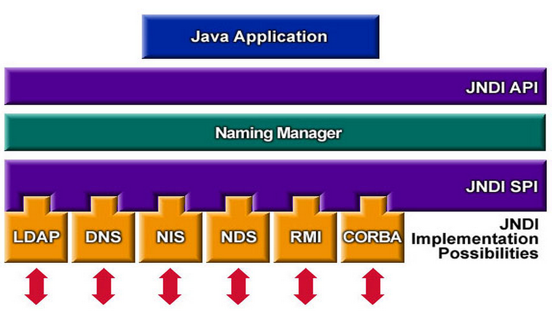

## 普通类想要使用springbean

编写一个工具类，通过静态方法获取bean

```java
@Component
public class SpringUtils implements ApplicationContextAware {
    private static Log log = LogFactory.getLog(SpringUtils.class);

    private static ApplicationContext applicationContext;

    public   void setApplicationContext(ApplicationContext applicationContext) {
        SpringUtils.applicationContext = applicationContext;
    }

    private static ApplicationContext getContext() {
        return applicationContext;
    }

    public static <T> T getBean(Class<T> clazz, String beanId) throws ClassCastException {
        ApplicationContext context = SpringUtils.getContext();
        Object bean = context.getBean(clazz, beanId);
        return (T)bean;
    }

    public static <T> T getBean(Class<T> clazz) throws ClassCastException {
        ApplicationContext context = SpringUtils.getContext();
        Object bean = context.getBean(clazz);
        return (T)bean;
    }
}
```

## 动态开启定时任务

- 定义一个抽象类ScheduleTask，指定每个任务的id属性和抽象的run方法

```java
/**
 * 定时任务抽象类(父类)
 * 具体执行方法请继承该类，然后重写run方法
 */
public abstract class ScheduleTask implements Runnable {
    private String id;

    public void setId(String id) {
        this.id = id;
    }

    public String getId() {
        return id;
    }

    public ScheduleTask(String id) {
        this.id = id;
    }

    @Override
    public abstract void run();
}
```

- 定义一个具体的任务类，继承ScheduleTask，实现run方法

```java
public class MyTask extends ScheduleTask {
    public MyTask(String id) {
        super(id);
    }

    @Override
    public void run() {
        //todo Your operation
        System.out.println(new Date() + "任务" + this.getId() + "开始执行...hello world!");
    }
}
```

- 编写一个工具类，完成定时任务的创建、修改、删除操作

```java
/**
 * 定时任务工具类
 *
 */
public class ScheduleUtil {
    private static final Log LOG = LogFactory.getLog(ScheduleUtil.class);

    private static ThreadPoolTaskScheduler threadPoolTaskScheduler = new ThreadPoolTaskScheduler();

    private static Map<String, ScheduledFuture<?>> scheduledFutureMap = new ConcurrentHashMap<>();

    static{
        threadPoolTaskScheduler.initialize();
        LOG.info("初始化线程池...");
    }

    /**
     * 启动某定时任务，到时间点就运行一次
     * @param scheduleTask
     * @param startTime
     */
    public static synchronized void start(ScheduleTask scheduleTask, Date startTime){
        if (isExist(scheduleTask.getId())){
            LOG.info("启动定时任务"+ scheduleTask.getId()+"失败，任务已存在");
            return;
        }
        ScheduledFuture<?>scheduledFuture = threadPoolTaskScheduler.schedule(scheduleTask,startTime);
        scheduledFutureMap.put(scheduleTask.getId(),scheduledFuture);
        LOG.info("启动定时任务"+ scheduleTask.getId()+"，执行时间为"+ startTime);
    }

    /**
     * 启动某定时任务，以固定周期运行
     * @param scheduleTask
     * @param period
     */
    public static synchronized void start(ScheduleTask scheduleTask, long period){
        if (isExist(scheduleTask.getId())){
            LOG.info("启动定时任务"+ scheduleTask.getId()+"失败，任务已存在");
            return;
        }
        ScheduledFuture<?>scheduledFuture = threadPoolTaskScheduler.scheduleAtFixedRate(scheduleTask,period);
        scheduledFutureMap.put(scheduleTask.getId(),scheduledFuture);
        LOG.info("启动定时任务" + scheduleTask.getId() + "，执行周期为" + period + "毫秒");
    }

    /**
     * 取消某定时任务
     * @param scheduleTask
     */
    public static synchronized void cancel(ScheduleTask scheduleTask){
        ScheduledFuture<?> scheduledFuture = scheduledFutureMap.get(scheduleTask.getId());
        if(scheduledFuture != null && !scheduledFuture.isCancelled()){
            scheduledFuture.cancel(false);
        }
        scheduledFutureMap.remove(scheduleTask.getId());
        LOG.info("取消定时任务"+ scheduleTask.getId());
    }
    /**
     * 修改定时任务执行时间
     * @param scheduleTask
     * @param startTime
     */
    public static synchronized void reset(ScheduleTask scheduleTask,Date startTime){
        //先取消定时任务
        String id = scheduleTask.getId();
        ScheduledFuture<?> scheduledFuture = scheduledFutureMap.get(id);
        if(scheduledFuture != null && !scheduledFuture.isCancelled()){
            scheduledFuture.cancel(false);
        }
        scheduledFutureMap.remove(id);
        //然后启动新的定时任务
        scheduledFuture = threadPoolTaskScheduler.schedule(scheduleTask,startTime);
        scheduledFutureMap.put(id,scheduledFuture);
        LOG.info("重置定时任务"+ id+"，执行时间为"+ startTime);
    }

    /**
     * 修改某定时任务，以固定周期运行
     * @param scheduleTask
     * @param period
     */
    public static synchronized void reset(ScheduleTask scheduleTask, long period) {
        // 先取消定时任务
        String id = scheduleTask.getId();
        ScheduledFuture<?> scheduledFuture = scheduledFutureMap.get(id);
        if (scheduledFuture == null && !scheduledFuture.isCancelled()) {
            scheduledFuture.cancel(false);
        }
        scheduledFutureMap.remove(id);
        // 然后重写启动定时任务
        scheduledFuture = threadPoolTaskScheduler.scheduleAtFixedRate(scheduleTask, period);
        scheduledFutureMap.put(id, scheduledFuture);
        LOG.info("重置定时任务" + scheduleTask.getId() + "，执行周期为" + period + "毫秒");
    }

    /**
     * 判断某个定时任务是否存在或已经取消
     * @param id
     */
    public static Boolean isExist(String id) {
        ScheduledFuture<?> scheduledFuture = scheduledFutureMap.get(id);
        if (scheduledFuture != null && !scheduledFuture.isCancelled()) {
            return true;
        }
        return false;
    }
}
```

- 使用main方法进行测试

```java
public class Main {
    public static void main(String[] args) throws Exception {
        //任务1
        ScheduleTask helloTask1 = new MyTask("task1");//new一个具体的执行任务
        ScheduleUtil.start(helloTask1, new Date(System.currentTimeMillis() + 5000));//5秒后执行一次
        ScheduleUtil.reset(helloTask1, new Date(System.currentTimeMillis() + 10000));//修改时间，10秒后执行

        //任务2
        ScheduleTask helloTask2 = new MyTask("task2");//new一个具体的执行任务
        ScheduleUtil.start(helloTask2, 2000);//每2秒执行一次
        Thread.sleep(5000);
        ScheduleUtil.cancel(helloTask2);//取消定时任务
    }
}
```

- 测试结果

```
10:16:05.113 [main] INFO org.springframework.scheduling.concurrent.ThreadPoolTaskScheduler - Initializing ExecutorService
10:16:05.117 [main] INFO com.hikvision.ScheduleUtil - 初始化线程池...
10:16:05.123 [main] INFO com.hikvision.ScheduleUtil - 启动定时任务task1，执行时间为Fri Feb 25 10:16:10 CST 2022
10:16:05.123 [main] INFO com.hikvision.ScheduleUtil - 重置定时任务task1，执行时间为Fri Feb 25 10:16:15 CST 2022
10:16:05.123 [main] INFO com.hikvision.ScheduleUtil - 启动定时任务task2，执行周期为2000毫秒
Fri Feb 25 10:16:05 CST 2022任务task2开始执行...hello world!
Fri Feb 25 10:16:07 CST 2022任务task2开始执行...hello world!
Fri Feb 25 10:16:09 CST 2022任务task2开始执行...hello world!
10:16:10.136 [main] INFO com.hikvision.ScheduleUtil - 取消定时任务task2
Fri Feb 25 10:16:15 CST 2022任务task1开始执行...hello world!
```

## LRU算法和Java中的LinkedHashMap分析

> LRU（Least recently used），即最近最少使用算法，该算法根据数据的历史访问记录来进行淘汰数据，其核心思想是“如果数据最近被访问过，那么将来被访问的几率也更高”。

**实现过程** 1. 新数据将被插入到链表表头； 2. 访问缓存中的数据时，将该数据移动到链表表头; 3. 当链表满时，将链表尾部的数据丢弃。


**页面置换算法** LRU 算法，是操作系统中一种典型的内存管理算法，常用于虚拟页式存储，这种页面置换算法的原理是，对于在内存中但又不用的数据块（内存块）叫做 LRU，操作系统会根据哪些数据属于 LRU 而将其移出内存，用于腾出空间来加载另外的数据。

看下面的一个例子：

> 一进程刚获得3个主存块的使用权，若该进程访问页面的次序是1、2、3、4、1、2、5、1、2、3、4、5。当采用LRU算法时，发生的缺页次数是 (10)


> Java中的LinkedHashMap所运用到的LRU思路

LinkHashMap的一个构造函数中，设置了accessOrder参数，设置为true的话就开启类似于LRU思想中的`访问缓存中的数据时，将该数据移动到链表表头; `

```java
    /**
     * Constructs an empty <tt>LinkedHashMap</tt> instance with the
     * specified initial capacity, load factor and ordering mode.
     *
     * @param  initialCapacity the initial capacity
     * @param  loadFactor      the load factor
     * @param  accessOrder     the ordering mode - <tt>true</tt> for
     *         access-order, <tt>false</tt> for insertion-order
     * @throws IllegalArgumentException if the initial capacity is negative
     *         or the load factor is nonpositive
     */
    public LinkedHashMap(int initialCapacity,
                         float loadFactor,
                         boolean accessOrder) {
        super(initialCapacity, loadFactor);
        this.accessOrder = accessOrder;
    }
```

开启accessOrder后的put方法，发现会执行一个afterNodeAccess(e)的方法

```java
    /**
     * Returns the value to which the specified key is mapped,
     * or {@code null} if this map contains no mapping for the key.
     *
     * <p>More formally, if this map contains a mapping from a key
     * {@code k} to a value {@code v} such that {@code (key==null ? k==null :
     * key.equals(k))}, then this method returns {@code v}; otherwise
     * it returns {@code null}.  (There can be at most one such mapping.)
     *
     * <p>A return value of {@code null} does not <i>necessarily</i>
     * indicate that the map contains no mapping for the key; it's also
     * possible that the map explicitly maps the key to {@code null}.
     * The {@link #containsKey containsKey} operation may be used to
     * distinguish these two cases.
     */
    public V get(Object key) {
        Node<K,V> e;
        if ((e = getNode(hash(key), key)) == null)
            return null;
        if (accessOrder)
            afterNodeAccess(e);
        return e.value;
    }
```

afterNodeAccess方法实现了将当前节点放到尾部

```java
void afterNodeAccess(HashMap.Node<K,V> e) { // move node to last
        LinkedHashMap.Entry<K,V> last;
        // 判断当前节点e不是尾部节点
        if (accessOrder && (last = tail) != e) {
            LinkedHashMap.Entry<K,V> p =
                    (LinkedHashMap.Entry<K,V>)e, b = p.before, a = p.after;
            p.after = null;
            if (b == null)
                head = a;
            else
                b.after = a;
            if (a != null)
                a.before = b;
            else
                last = b;
            if (last == null)
                head = p;
            else {
                p.before = last;
                last.after = p;
            }
            tail = p;
            ++modCount;
        }
    }
```

但是由于Java容器的扩容机制，所以不能实现`当链表满时，将链表尾部的数据丢弃`


## MySQL中对LRU算法优化

> 冷热分离

实际上，MySQL 确实没有直接使用 LRU 算法，而是在 LRU 算法上进行了优化。

从上面的全表扫描和预读机制的问题分析中，我们可以看到，根本原因就是从磁盘上新读取到的数据页，在加载进 Buffer Pool 时，可能将我们频繁访问的数据给淘汰，也就是出现了冷热数据的现象。因此，MySQL 的优化思路就是：对数据进行冷热分离，将 LRU 链表分成两部分，一部分用来存放冷数据，也就是刚从磁盘读进来的数据，另一部分用来存放热点数据，也就是经常被访问到数据。

其中，存放冷数据的区域占这个 LRU 链表的多少呢？这由参数 **「innodb_old_blocks_pct」** 控制，默认是 37%（约八分之三）。冷热分离的 LRU 链表示意图如下（图片来自于MySQL官方文档）。

```sql
show variables like 'innodb_old_blocks_pct';
```


优化过后的 LRU 链表，又是如何进行数据页的存放的呢？

*「当从磁盘读取数据页后，会先将数据页存放到 LRU 链表冷数据区的头部，如果这些缓存页在 1 秒之后被访问，那么就将缓存页移动到热数据区的头部；如果是 1 秒之内被访问，则不会移动，缓存页仍然处于冷数据区中。1 秒这个数值，是由参数 innodb_old_blocks_time 控制。*」**

```text
show variables like 'innodb_old_blocks_time';
```

当遇到全表扫描或者预读时，如果没有空闲缓存页来存放它们，那么将会淘汰一个数据页，而此时淘汰地是冷数据区尾部的数据页。冷数据区的数据就是不经常访问的，因此这解决了误将热点数据淘汰的问题。如果在 1 秒后，因全表扫描和预读机制额外加载进来的缓存页，仍然没有人访问，那么它们会一直待在冷数据区，当再需要淘汰数据时，首先淘汰地就是这一部分数据。

至此，基于冷热分离优化后的 LRU 链表，完美解决了直接使用 LRU 链表带来的问题。

> LRU 链表的极致优化

实际上，MySQL 在冷热分离的基础上还做了一层优化。

当一个缓存页处于热数据区域的时候，我们去访问这个缓存页，这个时候我们真的有必要把它移动到热点数据区域的头部吗？

从代码的角度来看，将链表中的数据移动到头部，实际上就是修改元素的指针指向，这个操作是非常快的。但是为了安全起见，在修改链表的时候，我们需要对链表加上锁，否则容易出现并发问题。

当并发量大的时候，因为要加锁，会存在锁竞争，每次移动显然效率就会下降。因此 MySQL 针对这一点又做了优化，如果一个缓存页处于热数据区域，且在热数据区域的前 1/4 区域（注意是热数据区域的 1/4，不是整个链表的 1/4），那么当访问这个缓存页的时候，就不用把它移动到热数据区域的头部；如果缓存页处于热数据的后 3/4 区域，那么当访问这个缓存页的时候，会把它移动到热数据区域的头部。

> 生产上的 MySQL 调优

理解了上面的原理，下面则基于这些原理，说一些MySQL可以优化的方案。

MySQL 的数据最终是存储在磁盘上的，每次查询数据时，我们先需要把数据加载进缓存，然后读取，如果每次查询的数据都已经存在于缓存了，那么就不用去磁盘读取，避免了一次磁盘 IO，这是我们最期望的。因此为了尽量在 LRU 链表中缓存更多的缓存页，我们**「可以根据服务器的配置，尽量调大 Buffer Pool 的大小」**。

另外，在进行增删改查的时候，需要涉及到对 Buffer Pool 中 LRU 链表、Free 链表、Flush 链表的修改，为了线程安全，我们需要进行加锁。因此为了提高并发度，MySQL 支持配置多个 Buffer Pool 实例。当有多个Buffer Pool实例时，就能将请求分别分摊到这些Buffer Pool中，减少了锁的竞争。

可以通过如下命令去查看 Buffer Pool 的大小以及 Buffer Pool 实例的个数。

```sql
# buffer pool大小
show variables like 'innodb_buffer_pool_size';
# buffer pool实例个数
show variables like 'innodb_buffer_pool_instances';
```

> Free 链表是维护空闲缓存页的列表，Flush 链表是维护脏页的链表。什么是脏页，感兴趣的同学可以先自己查阅相关资料

另外在实际应用中，在没有外部监控工具的情况下，我们该如何知道 MySQL 的一些状态信息呢？如：缓存命中率、缓存页的空闲数、脏页数量、LRU 链表中缓存页个数、冷热数据的比例、磁盘 IO 读取的数据页数量等信息。可以通过如下命令查看：

```sql
show engine innodb status;
```

这个命令的查询结果是一个很长的字符串，可以复制出来，放在文本文件中查看分析，部分信息截图如下：


如果看到 **「youngs/s」** 这个值较高，说明数据从冷数据区移到热数据的频率较大，因此可以适当调大热数据所占的比例，也就是减小**「innodb_old_blocks_pct」**参数的值，也可以调大**「innodb_old_blocks_time」**参数的值

如果看到 **「non-youngs/s」** 这个值较高，说明数据被加载进缓存当中后，没有被移动到热数据区，这是因为在 1s 内被访问了，这很可能是全表扫描造成的，这个时候就可以去检查一下代码，是不是SQL语句写得不恰当。

> 总结

总结一下，本文详细说明了普通的 LRU 链表并不适用于 MySQL，全表扫描和预读机制均会导致热点数据被淘汰，从而导致性能下降的问题。MySQL 在 LRU 算法的基础上做了优化，将链表拆分为冷、热两部分，从而解决了冷热数据的问题。最后介绍了几种 MySQL 优化的方法，可以通过调到 Buffer Pool 的大小以及个数来提升性能，也可以结合 MySQL 的运行状态信息来决定是否需要调整 LRU 链表的冷热数据区的比例。

另外，将数据进行冷热分离的这种思路，非常值得借鉴。

最后，实践是检验理论的唯一标准，MySQL 相关的原理明白了，至于生产环境的 MySQL 应该如何优化，还需要结合实际情况以及机器的配置来决定如何配置 MySQL 的参数。

## LFU代码实现

```java
import java.util.HashMap;
import java.util.LinkedList;
import java.util.Map;

/**
 * 频次 + 节点链表，通过频率可以得到该频率下的所有缓存
 * 如果只有一个缓存，那么删除即可
 * 如果有多个，从缓存中找到 最近最久未使用的，删除
 * @param <K>
 * @param <V>
 */
public class LFUCache<K, V> {
    /**
     * 内部类用于实现记录不同数据的访问频率
     */
    private class Node {
        K key;
        V val;
        int freq;

        public Node(K key, V val, int freq) {
            this.key = key;
            this.val = val;
            this.freq = freq;
        }
    }

    /**
     * 用于最小频率
     */
    private int minFreq;

    /**
     * 容量值
     */
    private int capacity;

    /**
     * 键和值，已经对应的频率
     */
    private Map<K, Node> keyTable;

    /**
     * 低频率的访问节点记录表
     */
    private Map<Integer, LinkedList<K>> freqTable;

    public LFUCache(int capacity) {
        this.minFreq = 0;
        this.capacity = capacity;
        keyTable = new HashMap<>(capacity);
        freqTable = new HashMap<>();
    }

    /**
     * 获取key对应的value
     * @param key
     * @return
     */
    public V get(K key) {
        if (capacity == 0 || !keyTable.containsKey(key)) {
            return null;
        }
        Node node = keyTable.get(key);
        increaseFreq(key);
        return node.val;
    }

    /**
     * 更新低频的访问频率表freqTable
     * @param key
     */
    private synchronized void increaseFreq(K key) {
        Node node = keyTable.get(key);
        V val = node.val;
        int freq = node.freq;
        // 从频率为freq的map中清楚当前节点
        freqTable.get(freq).remove(key);
        // 如果当前链表为空，我们需要在哈希表中删除，且更新minFreq
        if (freqTable.get(freq).size() == 0) {
            freqTable.remove(freq);
            // 如果当前被get的节点是minFreq对应的唯一节点，那么minFreq需要++
            if (minFreq == freq) {
                minFreq++;
            }
        }
        // 插入到 freq + 1 中
        LinkedList<K> list = freqTable.getOrDefault(freq + 1, new LinkedList<>());
        Node tempNode = new Node(key, val, freq + 1);
        // 头插法
        list.offerFirst(key);
        freqTable.put(freq + 1, list);
        // 要更新原来的节点，因为节点的频率变了
        keyTable.put(key, tempNode);
    }

    /**
     * 向缓存中加入值
     * @param key
     * @param val
     */
    public synchronized void put(K key, V val) {
        if (capacity == 0) {
            throw new IllegalArgumentException("缓存池的大小为0");
        }
        if (keyTable.containsKey(key)) {
            // 更新缓存的值
            Node node = keyTable.get(key);
            // 更新值
            node.val = val;
            keyTable.put(key,node);
            increaseFreq(key);
            return;
        }
        // 缓存里没有，如果缓存已满，需要先进行删除操作，再新建node添加
        if (keyTable.size() == capacity) {
            // 通过minFreq拿到freqTable[minFreq]链表的末尾节点
            K freqKey = freqTable.get(minFreq).peekLast();
            keyTable.remove(freqKey);
            freqTable.get(minFreq).pollLast();
            // 频率为minFreq的链表没有信息了,就把这个链表删掉
            if (freqTable.get(minFreq).size() == 0) {
                freqTable.remove(minFreq);
            }
        }
        // 拿到，频率为1的链表  如果没有就新建一个
        LinkedList<K> list = freqTable.getOrDefault(1, new LinkedList<K>());
        // 头插
        list.offerFirst(key);
        // 更新频率为1的，频率hashmap
        freqTable.put(1, list);
        keyTable.put(key, new Node(key, val, 1));
        minFreq = 1;
    }

    @Override
    public String toString() {
        return "LFUCache{" +
                "minFreq=" + minFreq +
                ", freqTable=" + freqTable +
                '}';
    }
}
```

> 测试

```java
public class Main {
    public static void main(String[] args) {
        LFUCache<String, String> lfuCache = new LFUCache<>(10);
        lfuCache.put("test1", "hello");
        lfuCache.put("test2", "hello");
        lfuCache.put("test3", "hello");
        System.out.println(lfuCache);
        lfuCache.get("test2");
        lfuCache.get("test2");
        System.out.println(lfuCache);
        lfuCache.put("test4", "hello");
        lfuCache.put("test5", "hello");
        lfuCache.put("test6", "hello");
        lfuCache.put("test7", "hello");
        lfuCache.put("test8", "hello");
        lfuCache.put("test9", "hello");
        lfuCache.put("test10", "hello");
        lfuCache.get("test4");
        lfuCache.get("test2");
        lfuCache.get("test6");
        lfuCache.get("test5");
        System.out.println(lfuCache);
        lfuCache.put("test11", "hello");
        // 1节点已经被删除了
        System.out.println(lfuCache);
        lfuCache.get("test11");
        System.out.println(lfuCache);
    }
}
```

输出结果：

```java
LFUCache{minFreq=1, freqTable={1=[test3, test2, test1]}}
LFUCache{minFreq=1, freqTable={1=[test3, test1], 3=[test2]}}
LFUCache{minFreq=1, freqTable={1=[test10, test9, test8, test7, test3, test1], 2=[test5, test6, test4], 4=[test2]}}
LFUCache{minFreq=1, freqTable={1=[test11, test10, test9, test8, test7, test3], 2=[test5, test6, test4], 4=[test2]}}
LFUCache{minFreq=1, freqTable={1=[test10, test9, test8, test7, test3], 2=[test11, test5, test6, test4], 4=[test2]}}
```


## W-TinyLFU

[(12条消息) 一篇学会Caffeine W-TinyLFU源码分析_xxsiyao的博客-CSDN博客](https://blog.csdn.net/xxsiyao/article/details/118731094)

## 重写jar包里面的方法

在工作中有时候一些业务场景，已封装的jar包里面的部分方法无法满足，这时候就需要我们将这部分方法进行重写已来满足业务需要。

>重写步骤：

1.找到你所要重写的方法的所在类，查看其中的路径；

2.在我们的src目录下新建一个同包名同类名的类；

3.将jar包中的重写方法所在类的所有代码复制到我们新建的同包名同类名的类中；

4.在我们新建的同包名同类名的类中修改对应的方法中的代码，注意要保持方法中的参数不要发生改变，也不要删除原类中已有的方法，但是可以新增一些方法。

> 原理：

编译输出的时候会优先使用我们src下面的Java类，而不是优先使用Jar包里面的Java类，这样就达到了覆盖jar包方法的目的。

## CGLIB(Code Generation Library) 介绍与原理

### 什么是cglib

简单来说，cglib 就是用来自动生成代理类的。与 JDK 自带的动态代理相比，有以下几点不同：

1. JDK 动态代理要求被代理类实现某个接口，而 cglib 无该要求。
2. **在目标方法的执行速度上，由于采用了`FastClass`机制，cglib 更快**（以空间换时间，后面会讲到）。

### 常见的动态代理有哪些？

我们接触比较多的一般是 JDK 动态代理和本文讲到的 cglib，这两个类库都是**运行时生成代理类**。spring-aop 同时使用了这两种类库。

另外，还有`javassit`和`aspectJ`等第三方类库， 它们既能编译时生成代理类，也能在运行时生成代理类。本文不作扩展，感兴趣的可以研究下。

### 为什么要用动态代理

为了让学到的东西能够形成体系，我们需要问很多问题，例如，它是用来解决什么问题的，不用它行不行，它相比其他有哪些优缺点，等等。这里，我们需要先思考为什么要使用动态代理。

为了更好地解答这个问题，这里通过一个简单的例子来逐步说明。

首先，我有一个用户相关的`Controller`。

```java
class UserController {
    public Response create(UserCreateDTO dto){
        String id = userService.create(dto);
        return Response.of(id);
    }

    public Response update(UserUpdateDTO dto){
        String id = userService.update(dto);
        return Response.of(id);
    }

    public Response delete(UserDeleteDTO dto){
        String id = userService.delete(dto);
        return Response.of(id);
    }

    public Response getById(String id){
        UserVO user = userService.getById(id);
        return Response.of(user);
    }

    // zzs001······
}
```

为了方便监控跟踪，我希望将每个方法的入参、出参、当前登录人等等信息打印出来。简单的做法就是直接在每个方法里嵌入打印日志的代码，如下：

```java
class UserController {
    public Response create(UserCreateDTO dto){
        // 打印入参日志
        // ······
        Response response = Response.of(userService.create(dto));
        // 打印出参日志
        // ······
        return response;
    }

    public Response update(UserUpdateDTO dto){
        // 打印入参日志
        // ······
        Response response = Response.of(userService.update(dto));
        // 打印出参日志
        // ······
        return response;
    }

    public Response delete(UserDeleteDTO dto){
        // 打印入参日志
        // ······
        Response response = Response.of(userService.delete(dto));
        // 打印出参日志
        // ······
        return response;
    }

    public Response getById(String id){
        // 打印入参日志
        // ······
        Response response = Response.of(userService.getById(id));
        // 打印出参日志
        // ······
        return response;
    }

    // zzs001······
}
```

明显可以看出来，这种做法有两个的问题：**一是需要手动添加大量重复代码，二是代码耦合度较高**。

当然，问题要一个个解决，首先，针对第二个问题，我创建了一个`UserControllerCommonLogProxy`来专门处理请求日志，如下：

```java
class UserControllerCommonLogProxy extends UserController {
    public Response create(UserCreateDTO dto){
        // 打印入参日志
        // ······
        Response response = super.create(dto);
        // 打印出参日志
        // ······
        return response;
    }

    public Response update(UserUpdateDTO dto){
        // 打印入参日志
        // ······
        Response response = super.update(dto);
        // 打印出参日志
        // ······
        return response;
    }

    public Response delete(UserDeleteDTO dto){
        // 打印入参日志
        // ······
        Response response = super.delete(dto);
        // 打印出参日志
        // ······
        return response;
    }

    public Response getById(String id){
        // 打印入参日志
        // ······
        Response response = super.getById(id);
        // 打印出参日志
        // ······
        return response;
    }

    // zzs001······
}
```

上面例子中，我不直接访问`UserController`，而是通过`UserControllerCommonLogProxy`来间接访问。其实，这就是代理，严格来说属于**静态代理**，和接下来要讲的动态代理不太一样。

静态代理解决了代码耦合的问题，但这种做法产生了一个新的问题：**需要手动创建和维护大量的代理类**。我需要为每一个`Controller`都增加一个`Proxy`，项目中将会有大量的`*Proxy`，而且，当`UserController`增加方法时，需要在对应的`Proxy`中实现。

这个时候，我们会想，要是代理类能自动生成该多好。于是，动态代理就派上用场了。

**我们只要定义好代理类的逻辑，动态代理就能帮我们生成对应的代理类（可以在编译时生成，也可以在运行时生成），而不需要我们手动创建**。

所以，**我们用动态代理，本质上是为了更简单方便地实现 AOP**。

### 如何使用cglib

还是继续开篇的例子，我需要打印`UserController`的入参、出参等信息。

### 工程环境

JDK：1.8.0_231

maven：3.6.3

IDE：Spring Tool Suite 4.6.1.RELEASE

### 引入依赖

项目类型 Maven Project，打包方式 jar

```xml
<!-- cglib -->
    <dependency>
        <groupId>cglib</groupId>
        <artifactId>cglib</artifactId>
        <version>3.2.5</version>
    </dependency>
    <!-- junit -->
    <dependency>
        <groupId>junit</groupId>
        <artifactId>junit</artifactId>
        <version>4.12</version>
        <scope>test</scope>
    </dependency>
```

### 定义代理类的逻辑

首先，我们需要在某个地方定义好代理类的逻辑，在本文的例子中，代理的逻辑就是在方法执行前打印入参，方法执行后打印出参。我们可以通过实现`MethodInterceptor`接口来定义这些逻辑。根据 aop 联盟的标准（可以自行了解下），`MethodInterceptor`属于一种`Advice`。

需要注意一点，**这里要通过`proxy.invokeSuper`来调用目标类的方法，而不是使用`method.invoke`，不然会出现栈溢出等问题**。如果你非要调用`method.invoke`，你需要把目标类对象作为`LogInterceptor`的成员属性，在调用`method.invoke`时将它作为入参，而不是使用`MethodInterceptor.intercept`的入参 obj，但是，我不推荐你这么做，因为你将无法享受到 cglib 代理类执行快的优势（然而还是很多人这么做）。

```java
public class LogInterceptor implements MethodInterceptor {
    // 这里传入的obj是代理类对象，而不是目标类对象
    public Object intercept(Object obj, Method method, Object[] args, MethodProxy proxy) throws Throwable {
        System.err.println("打印" + method.getName() + "方法的入参");
        // 注意，这里要调用proxy.invokeSuper，而不是method.invoke，不然会出现栈溢出等问题
        Object obj2 = proxy.invokeSuper(obj, args);
        System.err.println("打印" + method.getName() + "方法的出参");
        return obj2;
    }
}
```

### 获取代理类

我们主要通过`Enhancer`来配置、获取代理类对象，下面的代码挺好理解的，我们需要告诉 cglib，**我要代理谁，代理的逻辑放在哪里**。

```java
@Test
public void testBase() throws InterruptedException {
    // 设置输出代理类到指定路径，便于后面分析
    System.setProperty(DebuggingClassWriter.DEBUG_LOCATION_PROPERTY, "D:/growUp/test");
    // 创建Enhancer对象
    Enhancer enhancer = new Enhancer();
    // 设置哪个类需要代理
    enhancer.setSuperclass(UserController.class);
    // 设置怎么代理
    enhancer.setCallback(new LogInterceptor());
    // 获取代理类实例
    UserController userController = (UserController) enhancer.create();
    // 测试代理类
    System.out.println("-------------");
    userController.save();
    System.out.println("-------------");
    userController.delete();
    System.out.println("-------------");
    userController.update();
    System.out.println("-------------");
    userController.find();
}
```

我们也可以同时设置多个`Callback`，需要注意的是，**设置了多个`Callback`不是说一个方法可以被多个`Callback`拦截，而是说目标类中不同的方法可以被不同的`Callback`拦截**。所以，当设置了多个`Callback`时，cglib 需要知道哪些方法使用哪个`Callback`，我们需要额外设置`CallbackFilter`来指定每个方法使用的是哪个`Callback`。项目中我也提供了例子。

### 运行结果

运行上面的测试方法，可以看到，我们使用 cglib 很简单地实现了代理，不但较好地解耦合，而且减少了大量重复代码。

```text
-------------
打印save方法的入参
增加用户
打印save方法的出参
-------------
打印delete方法的入参
删除用户
打印delete方法的出参
-------------
打印update方法的入参
修改用户
打印update方法的出参
-------------
打印find方法的入参
查找用户
打印find方法的出参
```

### 代理类源码分析

接下来我们来看看 cglib 的源码。

cglib **如何生成代理类**的源码就不分析了，感兴趣的可以自行研究（cglib 的源码可读性还是很强的），我们只要记住两点就行，1. cglib 的代理类会缓存起来，不会重复创建；2. 使用的是 asm 来生成`Class`文件。

我们直接来看**代理类方法执行**的源码。

### 代理类文件

在上面例子中，我们指定的文件夹下生成了三个文件，一个代理类文件，两个`FastClass`文件。

通过 debug 可以发现，代理类文件是调用`Enhancer.create`的时候生成的，而两个`FastClass`文件是第一次调用`MethodProxy.invokeSuper`的时候才生成。这两个`FastClass`是用来干嘛的？


### 代理类的源码

下面看看代理类文件的源码（本文采用`Luyten`作为反编译工具，**考虑篇幅问题，这里仅展示 update 方法**）。

在静态代码块执行时，会初始化目标类 update 方法对应的`Method`对象，也会初始化代理类 update 方法对应的`MethodProxy`对象。这个`MethodProxy`对象非常重要，通过它才能使用`FastClass`。

另外，我们需要注意两个方法，一个是`update`方法，该方法中会去调用我们定义的`MethodInterceptor`的`intercept`方法，另一个是`CGLIB$update$0`方法，该方法直接调用`UserController`的`update`方法。后面我们会发现，`update`方法饶了一圈回来最终会调用`CGLIB$update$0`方法。

```java
//生成类的名字规则是：被代理classname + "$$"+classgeneratorname+"ByCGLIB"+"$$"+key的hashcode
public class UserController$$EnhancerByCGLIB$$e6f193aa extends UserController implements Factory {
    private boolean CGLIB$BOUND;
    public static Object CGLIB$FACTORY_DATA;
    private static final ThreadLocal CGLIB$THREAD_CALLBACKS;
    private static final Callback[] CGLIB$STATIC_CALLBACKS;

    //我们一开始传入的MethodInterceptor对象  zzs001
    private MethodInterceptor CGLIB$CALLBACK_0;
    private static Object CGLIB$CALLBACK_FILTER;
    //目标类的update方法对象
    private static final Method CGLIB$update$0$Method;
    //代理类的update方法对象
    private static final MethodProxy CGLIB$update$0$Proxy;
    private static final Object[] CGLIB$emptyArgs;

    static void CGLIB$STATICHOOK1() {
        CGLIB$THREAD_CALLBACKS = new ThreadLocal();
        CGLIB$emptyArgs = new Object[0];
        final Class<?> forName = Class.forName("cn.zzs.cglib.UserController$$EnhancerByCGLIB$$e6f193aa");
        final Class<?> forName2;
        final Method[] methods = ReflectUtils.findMethods(new String[]{"update", "()V", "find", "()V", "delete", "()V", "save", "()V"},
                (forName2 = Class.forName("cn.zzs.cglib.UserController")).getDeclaredMethods());
        // 初始化目标类的update方法对象
        CGLIB$update$0$Method = methods[0];
        // 初始化代理类update方法对象
        CGLIB$update$0$Proxy = MethodProxy.create((Class) forName2, (Class) forName, "()V", "update", "CGLIB$update$0");
    }

    // 这个方法将直接调用UserController的update方法
    final void CGLIB$update$0() {
        super.update();
    }

    public final void update() {
        MethodInterceptor cglib$CALLBACK_2;
        MethodInterceptor cglib$CALLBACK_0;
        if ((cglib$CALLBACK_0 = (cglib$CALLBACK_2 = this.CGLIB$CALLBACK_0)) == null) {
            CGLIB$BIND_CALLBACKS(this);
            cglib$CALLBACK_2 = (cglib$CALLBACK_0 = this.CGLIB$CALLBACK_0);
        }
        //一般走这里，即调用我们传入MethodInterceptor对象的intercept方法
        if (cglib$CALLBACK_0 != null) {
            cglib$CALLBACK_2.intercept((Object) this, UserController$$EnhancerByCGLIB$$e6f193aa.CGLIB$update$0$Method, UserController$$EnhancerByCGLIB$$e6f193aa.CGLIB$emptyArgs, UserController$$EnhancerByCGLIB$$e6f193aa.CGLIB$update$0$Proxy);
            return;
        }
        super.update();
    }
}
```

### 创建FastClass文件

在`MethodProxy.invokeSuper(Object, Object[])`方法中，我们会发现，两个`FastClass`文件是在`init`方法中生成的。当然，它们也只会创建一次。

我们用到的主要是代理类的`FastClass`，通过它，我们可以直接调用到`CGLIB$update$0`方法，相当于可以直接调用目标类的`update`方法。

```java
public Object invokeSuper(Object obj, Object[] args) throws Throwable {
        try {
            //初始化，创建了两个FastClass类对象
            init();
            FastClassInfo fci = fastClassInfo;
            // 这里将直接调用代理类的CGLIB$update$0方法，而不是通过反射调用
            // fci.f2：代理类的FastClass对象，fci.i2为CGLIB$update$0方法对应的索引，obj为当前的代理类对象，args为update方法的参数列表
            return fci.f2.invoke(fci.i2, obj, args);
        } catch (InvocationTargetException e) {
            throw e.getTargetException();
        }
    }
    private void init(){  
        if (fastClassInfo == null){  
            synchronized (initLock){  
                if (fastClassInfo == null){  
                    CreateInfo ci = createInfo;  
                    FastClassInfo fci = new FastClassInfo();  
                    // 创建目标类的FastClass对象
                    fci.f1 = helper(ci, ci.c1);  
                    // 创建代理类的FastClass对象
                    fci.f2 = helper(ci, ci.c2);  
                    // 获取update方法的索引
                    fci.i1 = fci.f1.getIndex(sig1);  
                    // 获取CGLIB$update$0方法的索引，这个很重要
                    fci.i2 = fci.f2.getIndex(sig2);  
                    fastClassInfo = fci;  
                    createInfo = null;  
                }  
            }  
        }  
    }
```

### FastClass的作用

打开代理类的`FastClass`文件，可以看到，通过方法索引我们可以匹配到`CGLIB$update$0`方法，并且直接调用它，而不需要像 JDK 动态代理一样通过反射的方式调用，极大提高了执行效率。

```java
//传入参数：
    //n：方法索引
    //o：代理类实例
    //array：方法输入参数
    public Object invoke(final int n, final Object o, final Object[] array) throws InvocationTargetException {
        final UserController$$EnhancerByCGLIB$$e6f193aa userController$$EnhancerByCGLIB$$e6f193aa = (UserController$$EnhancerByCGLIB$$e6f193aa)o;
        try {
            switch (n) {
                case 0: {
                    return new Boolean(userController$$EnhancerByCGLIB$$e6f193aa.equals(array[0]));
                }
                case 1: {
                    return userController$$EnhancerByCGLIB$$e6f193aa.toString();
                }
                case 2: {
                    return new Integer(userController$$EnhancerByCGLIB$$e6f193aa.hashCode());
                }
                case 3: {
                    return userController$$EnhancerByCGLIB$$e6f193aa.clone();
                }
                // ·······
                case 24: {
                    // 通过匹配方法索引，直接调用该方法，这个方法里将直接调用目标类的方法
                    userController$$EnhancerByCGLIB$$e6f193aa.CGLIB$update$0();
                    return null;
                }
                // ·······

        }
        catch (Throwable t) {
            throw new InvocationTargetException(t);
        }
        throw new IllegalArgumentException("Cannot find matching method/constructor");
    }
```

通过上面的分析，我们找到了 cglib 代理类执行起来更快的原因。

### 结语

以上基本讲完 cglib 的使用和源码分析。

> 三个类测试

```java
package com.wu.cglib.controller;

public class MyController {
    public Integer add1(Integer i){
        Integer result = i + 1;
        return result;
    }

    public Integer reduce1(Integer i){
        Integer result = i - 1;
        return result;
    }

}
```

```java
package com.wu.cglib.interceptor;

import net.sf.cglib.proxy.MethodInterceptor;
import net.sf.cglib.proxy.MethodProxy;

import java.lang.reflect.Method;

public class LogInterceptor implements MethodInterceptor {
    // 这里传入的obj是代理类对象，而不是目标类对象
    public Object intercept(Object obj, Method method, Object[] args, MethodProxy proxy) throws Throwable {
        System.err.println("打印" + method.getName() + "方法的入参");
        // 注意，这里要调用proxy.invokeSuper，而不是method.invoke，不然会出现栈溢出等问题
        Object obj2 = proxy.invokeSuper(obj, args);
        System.err.println("打印" + method.getName() + "方法的出参");
        return obj2;
    }
}
```

```java
import com.wu.cglib.controller.MyController;

import com.wu.cglib.interceptor.LogInterceptor;
import net.sf.cglib.core.DebuggingClassWriter;
import net.sf.cglib.proxy.Enhancer;
import org.junit.Test;

public class CGLibTest {
    @Test
    public void testBase() throws InterruptedException {
        // 设置输出代理类到指定路径，便于后面分析
        System.setProperty(DebuggingClassWriter.DEBUG_LOCATION_PROPERTY, "D:/test");
        // 创建Enhancer对象
        Enhancer enhancer = new Enhancer();
        // 设置哪个类需要代理
        enhancer.setSuperclass(MyController.class);
        // 设置怎么代理
        enhancer.setCallback(new LogInterceptor());
        // 获取代理类实例
        MyController myController = (MyController) enhancer.create();
        // 测试代理类
        System.out.println("-------------");
        myController.add1(2);
        System.out.println("-------------");
        myController.reduce1(2);
    }
}
```

## JNDI

**JNDI 是什么**

JNDI是 Java 命名与目录接口（Java Naming and Directory Interface），在J2EE规范中是重要的规范之一，不少专家认为，没有透彻理解JNDI的意义和作用，就没有真正掌握J2EE特别是EJB的知识。

**那么，JNDI到底起什么作用？**

要了解JNDI的作用，我们可以从“如果不用JNDI我们怎样做？用了JNDI后我们又将怎样做？”这个问题来探讨。

#### **没有JNDI的做法：**

程序员开发时，知道要开发访问MySQL数据库的应用，于是将一个对 MySQL JDBC 驱动程序类的引用进行了编码，并通过使用适当的 JDBC URL 连接到数据库。
就像以下代码这样：

```java
Connection conn=null; 
try { 
    Class.forName("com.mysql.jdbc.Driver", true, Thread.currentThread().getContextClassLoader()); 
    conn=DriverManager.getConnection("jdbc:mysql://MyDBServer?user=qingfeng&password=mingyue"); 
    /* 使用conn并进行SQL操作 */
    ...... 
    conn.close(); 
}catch(Exception e) { 
    e.printStackTrace(); 
}  
finally { 
  if(conn!=null) { 
  try { 
      conn.close(); 
  }catch(SQLException e) {} 
 }
}　　
```

这是传统的做法，也是以前非Java程序员（如Delphi、VB等）常见的做法。这种做法一般在小规模的开发过程中不会产生问题，只要程序员熟悉Java语言、了解JDBC技术和MySQL，可以很快开发出相应的应用程序。

**没有JNDI的做法存在的问题：**

1、数据库服务器名称MyDBServer 、用户名和口令都可能需要改变，由此引发JDBC URL需要修改；

2、数据库可能改用别的产品，如改用DB2或者Oracle，引发JDBC驱动程序包和类名需要修改；

3、随着实际使用终端的增加，原配置的连接池参数可能需要调整；

4、......

**解决办法：**

程序员应该不需要关心“具体的数据库后台是什么？JDBC驱动程序是什么？JDBC URL格式是什么？访问数据库的用户名和口令是什么？”等等这些问题，程序员编写的程序应该没有对 JDBC 驱动程序的引用，没有服务器名称，没有用户名称或口令 —— 甚至没有数据库池或连接管理。而是把这些问题交给J2EE容器来配置和管理，程序员只需要对这些配置和管理进行引用即可。

由此，就有了JNDI。

#### **用了JNDI之后的做法：**

首先，在在J2EE容器中配置JNDI参数，定义一个数据源，也就是JDBC引用参数，给这个数据源设置一个名称；然后，在程序中，通过数据源名称引用数据源从而访问后台数据库。

**具体操作如下（以JBoss为例）：**

1、配置数据源

在JBoss的 D:/jboss420GA/docs/examples/jca 文件夹下面，有很多不同数据库引用的数据源定义模板。将其中的 mysql-ds.xml 文件Copy到你使用的服务器下，如 D:/jboss420GA/server/default/deploy。

修改 mysql-ds.xml 文件的内容，使之能通过JDBC正确访问你的MySQL数据库，如下：

```xml
<?xml version="1.0" encoding="UTF-8"?>
<datasources>
<local-tx-datasource>
     <jndi-name>MySqlDS</jndi-name>
    <connection-url>jdbc:mysql://localhost:3306/lw</connection-url>
    <driver-class>com.mysql.jdbc.Driver</driver-class>
    <user-name>root</user-name>
    <password>rootpassword</password>
<exception-sorter-class-name>org.jboss.resource.adapter.jdbc.vendor.MySQLExceptionSorter</exception-sorter-class-name>
    <metadata>
       <type-mapping>mySQL</type-mapping>
    </metadata>
</local-tx-datasource>
</datasources>
```

这里，定义了一个名为MySqlDS的数据源，其参数包括JDBC的URL，驱动类名，用户名及密码等。

2、在程序中引用数据源：

```java
Connection conn=null;
try {
  Context ctx=new InitialContext();
  Object datasourceRef=ctx.lookup("java:MySqlDS"); //引用数据源
  DataSource ds=(Datasource)datasourceRef;
  conn=ds.getConnection();
  /* 使用conn进行数据库SQL操作 */
  ......
  c.close();
}
catch(Exception e) {
  e.printStackTrace();
}
finally {
  if(conn!=null) {
    try {
      conn.close();
    } catch(SQLException e) { }
  }
}
```

直接使用JDBC或者通过JNDI引用数据源的编程代码量相差无几，但是现在的程序可以不用关心具体JDBC参数了。
在系统部署后，如果数据库的相关参数变更，只需要重新配置 mysql-ds.xml 修改其中的JDBC参数，只要保证数据源的名称不变，那么程序源代码就无需修改。

由此可见，JNDI避免了程序与数据库之间的紧耦合，使应用更加易于配置、易于部署。

JNDI的扩展：JNDI在满足了数据源配置的要求的基础上，还进一步扩充了作用：所有与系统外部的资源的引用，都可以通过JNDI定义和引用。

所以，在J2EE规范中，J2EE 中的资源并不局限于 JDBC 数据源。引用的类型有很多，其中包括资源引用（已经讨论过）、环境实体和 EJB 引用。特别是 EJB 引用，它暴露了 JNDI 在 J2EE 中的另外一项关键角色：查找其他应用程序组件。

EJB 的 JNDI 引用非常类似于 JDBC 资源的引用。在服务趋于转换的环境中，这是一种很有效的方法。可以对应用程序架构中所得到的所有组件进行这类配置管理，从 EJB 组件到 JMS 队列和主题，再到简单配置字符串或其他对象，这可以降低随时间的推移服务变更所产生的维护成本，同时还可以简化部署，减少集成工作。 外部资源”。

#### **总 结：**

J2EE 规范要求所有 J2EE 容器都要提供 JNDI 规范的实现。JNDI 在 J2EE 中的角色就是“交换机” —— J2EE 组件在运行时间接地查找其他组件、资源或服务的通用机制。在多数情况下，提供 JNDI 供应者的容器可以充当有限的数据存储，这样管理员就可以设置应用程序的执行属性，并让其他应用程序引用这些属性（Java 管理扩展（Java Management Extensions，JMX）也可以用作这个目的）。JNDI 在 J2EE 应用程序中的主要角色就是提供间接层，这样组件就可以发现所需要的资源，而不用了解这些间接性。

在 J2EE 中，JNDI 是把 J2EE 应用程序合在一起的粘合剂，JNDI 提供的间接寻址允许跨企业交付可伸缩的、功能强大且很灵活的应用程序。这是 J2EE 的承诺，而且经过一些计划和预先考虑，这个承诺是完全可以实现的。

最近一直在对J2EE的笔记进行整理和复习,虽然J2EE视频是看过一遍了,但是当我看自己做的笔记的时候陌生程度还是很大,而真正的对某个概念有所认识的时候是将笔记和以前看过的视频印象进行摩擦,J2EE主要讲解的内容是各个规范,再清楚一些就是各个概念,现阶段的目标并不是掌握J2EE,而是对J2EE进行轮廓和概念上的了解和认识,到下一步DRP项目中再深层次的对各个规范进行摩擦和认识。

JNDI,翻译为Java命名和目录结构(JavaNaming And Directory Interface)官方对其解释为JNDI是一组在Java应用中访问命名和目录服务的API(ApplicationProgramming Interface)说明很精炼,但是比较抽象。

上面的解释中提高了命名服务和目录服务两个概念.先要了解JNDI就必须知道,命名服务和目录服务是做什么用的。

学习新的概念和知识，比较有效的方式是通过和以前所学过的内容进行联系，比较。

关于命名服务,其实我们很多时候都在用它,但是并不知道它是它,比较典型的是域名服务器DNS(Domain Naming Service),大对人对DNS还是比较了解的,它是将域名映射到IP地址的服务.比如百度的域名[www.baidu.com](http://developer.51cto.com/art/201112/www.baidu.com)所映射的IP地址是http://202.108.22.5/,你在浏览器中输入两个内容是到的同一个页面.用命名服务器的原因是因为我们记忆baidu这几个有意义的字母要比记202.108.22.5更容易记忆,但如果站到计算机的角度上,它更喜欢处理这些数字。

从我们生活中找的话还有很多类似的例子,比如说你的身份证号和你的名字可以"理解"成一种命名服务,你的学号和姓名也可以"解释"为一种命名服务。

可以看出命名服务的特点:一个值和另一个值的映射,将我们人类更容易认识的值同计算机更容易认识的值进行一一映射。

到现在应该对命名服务有所理解吧?

至于目录服务,从计算机角度理解为在互联网上有着各种各样的资源和主机,但是这些内容都是散落在互联网中,为了访问这些散落的资源并获得相应的服务,就需要用到目录服务。

[](http://images.51cto.com/files/uploadimg/20111231/1547420.png)

从我们日常生活中去理解目录服务的概念可以从电话簿说起,电话簿本身就是一个比较典型的目录服务,如果你要找到某个人的电话号码,你需要从电话簿里找到这个人的名称,然后再看其电话号码。

[](http://images.51cto.com/files/uploadimg/20111231/1547421.png) 

理解了命名服务和目录服务再回过头来看JDNI,它是一个为Java应用程序提供命名服务的应用程序接口,为我们提供了查找和访问各种命名和目录服务的通用统一的接口.通过JNDI统一接口我们可以来访问各种不同类型的服务.如下图所示,我们可以通过JNDI API来访问刚才谈到的DNS。

[](http://images.51cto.com/files/uploadimg/20111231/1547422.png)

## 数据库事务的四种隔离级别

### spring（[数据库](https://cloud.tencent.com/solution/database?from=10680)）事务隔离级别分为四种（级别递减）：

1、**Serializable （串行化）**：

这是数据库最高的隔离级别，这种级别下，事务“串行化顺序执行”，也就是一个一个排队执行。

这种级别下，“脏读”、“不可重复读”、“幻读”都可以被避免，但是执行效率奇差，性能开销也最大，所以基本没人会用。

2、**REPEATABLE READ（可重复读）** ：

可重复读，顾名思义，就是专门针对“不可重复读”这种情况而制定的隔离级别，自然，它就可以有效的避免“不可重复读”。而它也是MySql的默认隔离级别。

在这个级别下，普通的查询同样是使用的“快照读”，但是，和“读提交”不同的是，当事务启动时，就不允许进行“修改操作（Update）”了，而“不可重复读”恰恰是因为两次读取之间进行了数据的修改，因此，“可重复读”能够有效的避免“不可重复读”，但却避免不了“幻读”，因为幻读是由于“插入或者删除操作（Insert or Delete）”而产生的。

3、**READ COMMITTED （读提交）**：

读提交，顾名思义，就是只能读到已经提交了的内容。这是各种系统中最常用的一种隔离级别，也是[SQL Server](https://cloud.tencent.com/product/sqlserver?from=10680)和Oracle的默认隔离级别，保证了一个事务不会读到另一个并行事务已修改但未提交的数据，避免了“脏读取”，但不能避免“幻读”和“不可重复读取”。该级别适用于大多数系统。这里多说点：那为什么“读提交”同“读未提交”一样，都没有查询加锁，但是却能够避免脏读呢？

这就要说道另一个机制“快照（snapshot）”，而这种既能保证一致性又不加锁的读也被称为“快照读（Snapshot Read）”

假设没有“快照读”，那么当一个更新的事务没有提交时，另一个对更新数据进行查询的事务会因为无法查询而被阻塞，这种情况下，并发能力就相当的差。而“快照读”就可以完成高并发的查询，不过，“读提交”只能避免“脏读”，并不能避免“不可重复读”和“幻读”。

4、**Read Uncommitted（读未提交）** ：

读未提交，顾名思义，就是可以读到未提交的内容。因此，在这种隔离级别下，查询是不会加锁的，也由于查询的不加锁，所以这种隔离级别的一致性是最差的，可能会产生“脏读”、“不可重复读”、“幻读”。如无特殊情况，基本是不会使用这种隔离级别的。

### 脏读、不可重复读、幻读：

也许有很多读者会对上述隔离级别中提及到的 脏读、不可重复读、幻读 的理解有点吃力，我在这里尝试使用通俗的方式来解释这三种语义：

**脏读：**所谓的脏读，其实就是读到了别的事务回滚前的脏数据。比如事务B执行过程中修改了数据X，在未提交前，事务A读取了X，而事务B却回滚了，这样事务A就形成了脏读。

也就是说，当前事务读到的数据是别的事务想要修改成为的但是没有修改成功的数据。

**不可重复读：**事务A首先读取了一条数据，然后执行逻辑的时候，事务B将这条数据改变了，然后事务A再次读取的时候，发现数据不匹配了，就是所谓的不可重复读了。

也就是说，当前事务先进行了一次数据读取，然后再次读取到的数据是别的事务修改成功的数据，导致两次读取到的数据不匹配，也就照应了不可重复读的语义。

**幻读：**事务A首先根据条件索引得到N条数据，然后事务B改变了这N条数据之外的M条或者增添了M条符合事务A搜索条件的数据，导致事务A再次搜索发现有N+M条数据了，就产生了幻读。

也就是说，当前事务读第一次取到的数据比后来读取到数据条目少。

### 不可重复读和幻读比较：

两者有些相似，但是前者针对的是update或delete，后者针对的insert。

### 总结一下：

> Q1: 为什么会出现“脏读”？

A1: 因为没有“select”操作没有规矩。

> Q2: 为什么会出现“不可重复读”？

A2: 因为“update”操作没有规矩。

> Q3: 为什么会出现“幻读”？

A3: 因为“insert”和“delete”操作没有规矩。

> Q4: “读未提（Read Uncommitted）”能预防啥？

Q4: 啥都预防不了。

> Q5: “读提交（Read Committed）”能预防啥？

A5: 使用“快照读（Snapshot Read）”，避免“脏读”，但是可能出现“不可重复读”和“幻读”。

> Q6: “可重复读（Repeated Red）”能预防啥？

A6: 使用“快照读（Snapshot Read）”，锁住被读取记录，避免出现“脏读”、“不可重复读”，但是可能出现“幻读”。

> Q7: “串行化（Serializable）”能预防啥？

A7: 排排坐，吃果果，有效避免“脏读”、“不可重复读”、“幻读”，不过效果谁用谁知道。

## sql commit的三种方式

### 事务提交

在数据库的插入、删除和修改操作时，只有当事务在提交到数据库时才算完成。在事务提交前，只有操作数据库的这个人才能有权看到所做的事情，别人只有在最后提交完成后才可以看到。
提交数据有三种类型：显式提交、隐式提交及自动提交。下面分别说明这三种类型。
(1) 显式提交
用COMMIT命令直接完成的提交为显式提交。其格式为：

```sql
SQL>COMMIT；
```

(2) 隐式提交
用SQL命令间接完成的提交为隐式提交。这些命令是：

```sql
ALTER，AUDIT，COMMENT，CONNECT，CREATE，DISCONNECT，DROP，
EXIT，GRANT，NOAUDIT，QUIT，REVOKE，RENAME。
```

(3) 自动提交
若把AUTOCOMMIT设置为ON，则在插入、修改、删除语句执行后，系统将自动进行提交，这就是自动提交。其格式为：

```sql
SQL>SET AUTOCOMMIT ON；
```

## javassist使用全解析

Java 字节码以二进制的形式存储在 .class 文件中，每一个 .class 文件包含一个 Java 类或接口。Javaassist 就是一个用来 处理 Java 字节码的类库。它可以在一个已经编译好的类中添加新的方法，或者是修改已有的方法，并且不需要对字节码方面有深入的了解。同时也可以去生成一个新的类对象，通过完全手动的方式。

### 1. 使用 Javassist 创建一个 class 文件

首先需要引入jar包：

```xml
<dependency>
  <groupId>org.javassist</groupId>
  <artifactId>javassist</artifactId>
  <version>3.25.0-GA</version>
</dependency>
```

编写创建对象的类：

```java
package com.rickiyang.learn.javassist;

import javassist.*;

/**
 * @author rickiyang
 * @date 2019-08-06
 * @Desc
 */
public class CreatePerson {

    /**
     * 创建一个Person 对象
     *
     * @throws Exception
     */
    public static void createPseson() throws Exception {
        ClassPool pool = ClassPool.getDefault();

        // 1. 创建一个空类
        CtClass cc = pool.makeClass("com.rickiyang.learn.javassist.Person");

        // 2. 新增一个字段 private String name;
        // 字段名为name
        CtField param = new CtField(pool.get("java.lang.String"), "name", cc);
        // 访问级别是 private
        param.setModifiers(Modifier.PRIVATE);
        // 初始值是 "xiaoming"
        cc.addField(param, CtField.Initializer.constant("xiaoming"));

        // 3. 生成 getter、setter 方法
        cc.addMethod(CtNewMethod.setter("setName", param));
        cc.addMethod(CtNewMethod.getter("getName", param));

        // 4. 添加无参的构造函数
        CtConstructor cons = new CtConstructor(new CtClass[]{}, cc);
        cons.setBody("{name = \"xiaohong\";}");
        cc.addConstructor(cons);

        // 5. 添加有参的构造函数
        cons = new CtConstructor(new CtClass[]{pool.get("java.lang.String")}, cc);
        // $0=this / $1,$2,$3... 代表方法参数
        cons.setBody("{$0.name = $1;}");
        cc.addConstructor(cons);

        // 6. 创建一个名为printName方法，无参数，无返回值，输出name值
        CtMethod ctMethod = new CtMethod(CtClass.voidType, "printName", new CtClass[]{}, cc);
        ctMethod.setModifiers(Modifier.PUBLIC);
        ctMethod.setBody("{System.out.println(name);}");
        cc.addMethod(ctMethod);

        //这里会将这个创建的类对象编译为.class文件
        cc.writeFile("/Users/yangyue/workspace/springboot-learn/java-agent/src/main/java/");
    }

    public static void main(String[] args) {
        try {
            createPseson();
        } catch (Exception e) {
            e.printStackTrace();
        }
    }
}
```

执行上面的 main 函数之后，会在指定的目录内生成 Person.class 文件：

```java
//
// Source code recreated from a .class file by IntelliJ IDEA
// (powered by Fernflower decompiler)
//

package com.rickiyang.learn.javassist;

public class Person {
    private String name = "xiaoming";

    public void setName(String var1) {
        this.name = var1;
    }

    public String getName() {
        return this.name;
    }

    public Person() {
        this.name = "xiaohong";
    }

    public Person(String var1) {
        this.name = var1;
    }

    public void printName() {
        System.out.println(this.name);
    }
}
```

跟咱们预想的一样。

在 Javassist 中，类 `Javaassit.CtClass` 表示 class 文件。一个 GtClass (编译时类）对象可以处理一个 class 文件，`ClassPool`是 `CtClass` 对象的容器。它按需读取类文件来构造 `CtClass` 对象，并且保存 `CtClass` 对象以便以后使用。

需要注意的是 ClassPool 会在内存中维护所有被它创建过的 CtClass，当 CtClass 数量过多时，会占用大量的内存，API中给出的解决方案是 **有意识的调用`CtClass`的`detach()`方法以释放内存**。

`ClassPool`需要关注的方法：

1. getDefault : 返回默认的`ClassPool` 是单例模式的，一般通过该方法创建我们的ClassPool；
2. appendClassPath, insertClassPath : 将一个`ClassPath`加到类搜索路径的末尾位置 或 插入到起始位置。通常通过该方法写入额外的类搜索路径，以解决多个类加载器环境中找不到类的尴尬；
3. toClass : 将修改后的CtClass加载至当前线程的上下文类加载器中，CtClass的`toClass`方法是通过调用本方法实现。**需要注意的是一旦调用该方法，则无法继续修改已经被加载的class**；
4. get , getCtClass : 根据类路径名获取该类的CtClass对象，用于后续的编辑。

`CtClass`需要关注的方法：

1. freeze : 冻结一个类，使其不可修改；
2. isFrozen : 判断一个类是否已被冻结；
3. prune : 删除类不必要的属性，以减少内存占用。调用该方法后，许多方法无法将无法正常使用，慎用；
4. defrost : 解冻一个类，使其可以被修改。如果事先知道一个类会被defrost， 则禁止调用 prune 方法；
5. detach : 将该class从ClassPool中删除；
6. writeFile : 根据CtClass生成 `.class` 文件；
7. toClass : 通过类加载器加载该CtClass。

上面我们创建一个新的方法使用了`CtMethod`类。CtMthod代表类中的某个方法，可以通过CtClass提供的API获取或者CtNewMethod新建，通过CtMethod对象可以实现对方法的修改。

`CtMethod`中的一些重要方法：

1. insertBefore : 在方法的起始位置插入代码；
2. insterAfter : 在方法的所有 return 语句前插入代码以确保语句能够被执行，除非遇到exception；
3. insertAt : 在指定的位置插入代码；
4. setBody : 将方法的内容设置为要写入的代码，当方法被 abstract修饰时，该修饰符被移除；
5. make : 创建一个新的方法。

注意到在上面代码中的：setBody()的时候我们使用了一些符号：

```java
// $0=this / $1,$2,$3... 代表方法参数
cons.setBody("{$0.name = $1;}");
```

具体还有很多的符号可以使用，但是不同符号在不同的场景下会有不同的含义，所以在这里就不在赘述，可以看javassist 的说明文档。http://www.javassist.org/tutorial/tutorial2.html

### 2. 调用生成的类对象

#### 1. 通过反射的方式调用

上面的案例是创建一个类对象然后输出该对象编译完之后的 .class 文件。那如果我们想调用生成的类对象中的属性或者方法应该怎么去做呢？javassist也提供了相应的api，生成类对象的代码还是和第一段一样，将最后写入文件的代码替换为如下：

```java
// 这里不写入文件，直接实例化
Object person = cc.toClass().newInstance();
// 设置值
Method setName = person.getClass().getMethod("setName", String.class);
setName.invoke(person, "cunhua");
// 输出值
Method execute = person.getClass().getMethod("printName");
execute.invoke(person);
```

然后执行main方法就可以看到调用了 `printName`方法。

#### 2. 通过读取 .class 文件的方式调用

```java
ClassPool pool = ClassPool.getDefault();
// 设置类路径
pool.appendClassPath("/Users/yangyue/workspace/springboot-learn/java-agent/src/main/java/");
CtClass ctClass = pool.get("com.rickiyang.learn.javassist.Person");
Object person = ctClass.toClass().newInstance();
//  ...... 下面和通过反射的方式一样去使用
```

#### 3. 通过接口的方式

上面两种其实都是通过反射的方式去调用，问题在于我们的工程中其实并没有这个类对象，所以反射的方式比较麻烦，并且开销也很大。那么如果你的类对象可以抽象为一些方法得合集，就可以考虑为该类生成一个接口类。这样在`newInstance()`的时候我们就可以强转为接口，可以将反射的那一套省略掉了。

还拿上面的`Person`类来说，新建一个`PersonI`接口类：

```java
package com.rickiyang.learn.javassist;

/**
 * @author rickiyang
 * @date 2019-08-07
 * @Desc
 */
public interface PersonI {

    void setName(String name);

    String getName();

    void printName();

}
```

实现部分的代码如下：

```java
ClassPool pool = ClassPool.getDefault();
pool.appendClassPath("/Users/yangyue/workspace/springboot-learn/java-agent/src/main/java/");

// 获取接口
CtClass codeClassI = pool.get("com.rickiyang.learn.javassist.PersonI");
// 获取上面生成的类
CtClass ctClass = pool.get("com.rickiyang.learn.javassist.Person");
// 使代码生成的类，实现 PersonI 接口
ctClass.setInterfaces(new CtClass[]{codeClassI});

// 以下通过接口直接调用 强转
PersonI person = (PersonI)ctClass.toClass().newInstance();
System.out.println(person.getName());
person.setName("xiaolv");
person.printName();
```

使用起来很轻松。

### 3. 修改现有的类对象

前面说到新增一个类对象。这个使用场景目前还没有遇到过，一般会遇到的使用场景应该是修改已有的类。比如常见的日志切面，权限切面。我们利用javassist来实现这个功能。

有如下类对象：

```java
package com.rickiyang.learn.javassist;

/**
 * @author rickiyang
 * @date 2019-08-07
 * @Desc
 */
public class PersonService {

    public void getPerson(){
        System.out.println("get Person");
    }

    public void personFly(){
        System.out.println("oh my god,I can fly");
    }
}
```

然后对他进行修改：

```java
package com.rickiyang.learn.javassist;

import javassist.ClassPool;
import javassist.CtClass;
import javassist.CtMethod;
import javassist.Modifier;

import java.lang.reflect.Method;

/**
 * @author rickiyang
 * @date 2019-08-07
 * @Desc
 */
public class UpdatePerson {

    public static void update() throws Exception {
        ClassPool pool = ClassPool.getDefault();
        CtClass cc = pool.get("com.rickiyang.learn.javassist.PersonService");

        CtMethod personFly = cc.getDeclaredMethod("personFly");
        personFly.insertBefore("System.out.println(\"起飞之前准备降落伞\");");
        personFly.insertAfter("System.out.println(\"成功落地。。。。\");");


        //新增一个方法
        CtMethod ctMethod = new CtMethod(CtClass.voidType, "joinFriend", new CtClass[]{}, cc);
        ctMethod.setModifiers(Modifier.PUBLIC);
        ctMethod.setBody("{System.out.println(\"i want to be your friend\");}");
        cc.addMethod(ctMethod);

        Object person = cc.toClass().newInstance();
        // 调用 personFly 方法
        Method personFlyMethod = person.getClass().getMethod("personFly");
        personFlyMethod.invoke(person);
        //调用 joinFriend 方法
        Method execute = person.getClass().getMethod("joinFriend");
        execute.invoke(person);
    }

    public static void main(String[] args) {
        try {
            update();
        } catch (Exception e) {
            e.printStackTrace();
        }
    }
}
```

在`personFly`方法前后加上了打印日志。然后新增了一个方法`joinFriend`。执行main函数可以发现已经添加上了。

**另外需要注意的是：上面的`insertBefore()` 和 `setBody()`中的语句，如果你是单行语句可以直接用双引号，但是有多行语句的情况下，你需要将多行语句用`{}`括起来。javassist只接受单个语句或用大括号括起来的语句块。**

## Callable接口详解

- Callable: 返回结果并且可能抛出异常的任务。
- 优点：
  - 可以获得任务执行返回值；
  - 通过与Future的结合，可以实现利用Future来跟踪异步计算的结果。

### Runnable和Callable的区别：

1、Callable规定的方法是call()，Runnable规定的方法是run().

2、Callable的任务执行后可返回值，而Runnable的任务是不能返回值得

3、call方法可以抛出异常，run方法不可以

4、运行Callable任务可以拿到一个Future对象，表示异步计算的结果。它提供了检查计算是否完成的方法，以等待计算的完成，并检索计算的结果。通过Future对象可以了解任务执行情况，可取消任务的执行，还可获取执行结果。

5、代码示例：

```java
  //Callable 接口
  public interface Callable<V> {
     V call() throws Exception;
  }
  // Runnable 接口
  public interface Runnable {
      public abstract void run();
  }
```


------

#### Future接口

- Future是一个接口，代表了一个异步计算的结果。接口中的方法用来检查计算是否完成、等待完成和得到计算的结果。
- 当计算完成后，只能通过get()方法得到结果，get方法会阻塞直到结果准备好了。
- 如果想取消，那么调用cancel()方法。其他方法用于确定任务是正常完成还是取消了。
- 一旦计算完成了，那么这个计算就不能被取消。

#### FutureTask类

- FutureTask类实现了RunnableFuture接口，而RunnnableFuture接口继承了Runnable和Future接口，所以说FutureTask是一个提供异步计算的结果的任务。
- FutureTask可以用来包装Callable或者Runnbale对象。因为FutureTask实现了Runnable接口，所以FutureTask也可以被提交给Executor（如上面例子那样）。

### Callable两种执行方式

1、借助FutureTask执行

- FutureTask类同时实现了两个接口，Future和Runnable接口，所以它既可以作为Runnable被线程执行，又可以作为Future得到Callable的返回值。

- 具体流程：

  - ```java
      //定义实现Callable接口的的实现类重写call方法。
      public class MyCallableTask implements Callable<Integer>{
          @Override
              public Integer call() throws Exception {
                 //TODO 线程执行方法
              }
      }
      ---------------------------------------------------------
      //创建Callable对象
      Callable<Integer> mycallabletask = new MyCallableTask();
      //开始线程
      FutureTask<Integer> futuretask= new FutureTask<Integer>(mycallabletask);
      new Thread(futuretask).start();
      --------------------------------------------------------
      通过futuretask可以得到MyCallableTask的call()的运行结果：
      futuretask.get();
    ```

2、借助线程池来运行

- 线程池中执行Callable任务原型：

  - ```java
      public interface ExecutorService extends Executor {
          //提交一个Callable任务，返回值为一个Future类型
          <T> Future<T> submit(Callable<T> task);
      
              //other methods...
      }
    ```

- 借助线程池来运行Callable任务的一般流程为：

  - ```java
       ExecutorService exec = Executors.newCachedThreadPool();
       Future<Integer> future = exec.submit(new MyCallableTask());
    ```

  - 通过future可以得到MyCallableTask的call()的运行结果： future.get();

#### 举例说明

例1：

- ```
    public class CallableTest {
        public static void main(String[] args) throws ExecutionException, InterruptedException,TimeoutException{
            //创建一个线程池
            ExecutorService executor = Executors.newCachedThreadPool();
            Future<String> future = executor.submit(()-> {
                    TimeUnit.SECONDS.sleep(5);
                    return "CallableTest";
            });
            System.out.println(future.get());
            executor.shutdown();
        }
    }
  123456789101112
  ```

例2：Callable任务借助FutureTask运行：

- ```java
    public class CallableAndFutureTask {
        Random random = new Random();
        public static void main(String[] args) {
            Callable<Integer> callable = new Callable<Integer>() {
                public Integer call() throws Exception {
                    return random.nextInt(10000);
                }
            };
            FutureTask<Integer> future = new FutureTask<Integer>(callable);
            Thread thread = new Thread(future);
            thread.start();
            try {
                Thread.sleep(2000);
                System.out.println(future.get());
            } catch (Exception e) {
                e.printStackTrace();
            }
        }
    }
  ```

- 例3：Callable任务和线程池一起使用，然后返回值是Future:

  - ```java
       public class CallableAndFuture {
           Random random = new Random();
           public static void main(String[] args) {
               ExecutorService threadPool = Executors.newSingleThreadExecutor();
               Future<Integer> future = threadPool.submit(new Callable<Integer>() {
                   public Integer call() throws Exception {
                       return random.nextInt(10000);
                   }
               });
               try {
                   Thread.sleep(3000);
                   System.out.println(future.get());
               } catch (Exception e) {
                   e.printStackTrace();
               }
           }
       }
    ```

- 例4：当执行多个Callable任务，有多个返回值时，我们可以创建一个Future的集合：

  - ```java
      class MyCallableTask implements Callable<String> {
          private int id;
          public OneTask(int id){
              this.id = id;
          }
          @Override
          public String call() throws Exception {
              for(int i = 0;i<5;i++){
                  System.out.println("Thread"+ id);
                  Thread.sleep(1000);
              }
              return "Result of callable: "+id;
          }
      }
      public class Test {
      
          public static void main(String[] args) {
              ExecutorService exec = Executors.newCachedThreadPool();
              ArrayList<Future<String>> results = new ArrayList<Future<String>>();
      
              for (int i = 0; i < 5; i++) {
                  results.add(exec.submit(new MyCallableTask(i)));
              }
      
              for (Future<String> fs : results) {
                  if (fs.isDone()) {
                      try {
                          System.out.println(fs.get());
                      } catch (Exception e) {
                          e.printStackTrace();
                      }
                  } else {
                      System.out.println("MyCallableTask任务未完成！");
                  }
              }
              exec.shutdown();
          }
      }
    ```

### StopWatch的使用

- Spring提供的计时器StopWatch对于秒、毫秒为单位方便计时的程序，尤其是单线程、顺序执行程序的时间特性的统计输出支持比较好。也就是说假如我们手里面有几个在顺序上前后执行的几个任务，而且我们比较关心几个任务分别执行的时间占用状况，希望能够形成一个不太复杂的日志输出，StopWatch提供了这样的功能。而且Spring的StopWatch基本上也就是仅仅为了这样的功能而实现。

- ```java
    public String call() throws Exception {
    	StopWatch stopWatch = new StopWatch();
    	stopWatch.start("测试StopWatch");
    	//TODO 业务逻辑
    	stopWatch.stop();
    	return "test";
    }
  ```

## Mybatis延迟加载

### 什么是延迟加载

延迟加载是加载策略的一种，加载策略分为延迟加载和直接加载两种策略。延迟加载主要体现在关联查询中。

比如在开发过程中很多时候我们并不需要总是在加载⽤户信息时就⼀定要加载他的订单信息。此时就是我们所说的延迟加载。

**延迟加载就是在需要⽤到数据时才进⾏加载，不需要⽤到数据时就不加载数据。延迟加载也称懒加载。**

#### 延迟加载的优点

Mybatis先从单表查询，需要时再从关联表去关联查询，⼤⼤提⾼数据库性能，因为查询单表要⽐关联查询多张表速度要快。

#### 延迟加载的缺点

因为只有当需要⽤到数据时，才会进⾏数据库查询，这样在⼤批量数据查询时，因为查询⼯作也要消耗时间，所以可能造成⽤户等待时间变⻓，造成⽤户体验下降。

#### 注意事项

- 在多表中：
  - ⼀对多，多对多：通常情况下采⽤延迟加载⼀对⼀
  - （多对⼀）：通常情况下采⽤⽴即加载
- 延迟加载是基于嵌套查询来实现的

### 延迟加载的实现

#### 局部延迟加载实现

在association和collection标签中都有⼀个fetchType属性，通过修改它的值，可以修改局部的加载策略。

```xml
 <!--开启⼀对多延迟加载-->
<resultMap id="userMap" type="user">
<id column="id" property="id"></id>
<result column="username" property="username"></result>
<result column="password" property="password"></result>
<result column="birthday" property="birthday"></result>
<!--fetchType="lazy" 懒加载策略 fetchType="eager" ⽴即加载策略-->
<collection property="orderList" ofType="order" column="id" select="com.mybatis.dao.OrderMapper.findByUid" fetchType="lazy">
</collection>
</resultMap>

<select id="findAll" resultMap="userMap">
SELECT * FROM `user`
</select>
复制代码
```

#### 全局延迟加载实现

在Mybatis的核⼼配置⽂件中可以使⽤setting标签修改全局的加载策略。

```xml
<settings>
<!--开启全局延迟加载功能-->
<setting name="lazyLoadingEnabled" value="true"/>
</settings>
```

#### 注意事项

```xml
<!--关闭⼀对⼀延迟加载-->
<resultMap id="orderMap" type="order">
<id column="id" property="id"></id>
<result column="ordertime" property="ordertime"></result>
<result column="total" property="total"></result>
<!-- fetchType="lazy" 懒加载策略 fetchType="eager" ⽴即加载策略-->
<association
property="user"
column="uid"
javaType="user"
select="com.mybatis.dao.UserMapper.findById"
fetchType="eager">
</association>
</resultMap>
<select id="findAll" resultMap="orderMap">
SELECT * from orders
</select>
```

### 延迟加载原理实现

它的原理是，使⽤ CGLIB 或 Javassist( 默认 ) 创建⽬标对象的代理对象。当调⽤代理对象的延迟加载属性的getting ⽅法时，进⼊拦截器⽅法。⽐如调⽤ ⽅法，进⼊拦截器的 ⽅法，发现 需要延迟加载时，那么就会单独发送事先保存好的查询关联 B 对象的 SQL ，把 B 查询上来，然后调⽤a.setB(b) ⽅法，于是成 a.getB().getName() ⽅法的调⽤。这就是延迟加载的基本原理 对象b属性就有值了，接着往下走

### 总结

延迟加载主要是通过动态代理的形式实现，通过代理拦截到指定⽅法，执⾏数据加载。

## 分布式锁中的王者方案-Redisson


我们先来看下 Redis 官网怎么说，


而 Java 版的 分布式锁的框架就是 Redisson。本篇实战内容将会基于我的开源项目 PassJava 来整合 Redisson。

我把`后端`、`前端`、`小程序`都上传到同一个仓库里面了，大家可以通过 `Github` 或 `码云`访问。地址如下：

> **Github**: https://github.com/Jackson0714/PassJava-Platform
>
> **码云**：https://gitee.com/jayh2018/PassJava-Platform
>
> **配套教程**：www.passjava.cn

在实战之前，我们先来看下使用 Redisson 的原理。

### 一、Redisson 是什么？

如果你之前是在用 Redis 的话，那使用 Redisson 的话将会事半功倍，Redisson 提供了使用 Redis的最简单和最便捷的方法。

Redisson的宗旨是促进使用者对 Redis 的关注分离（Separation of Concern），从而让使用者能够将精力更集中地放在处理业务逻辑上。

Redisson 是一个在 Redis 的基础上实现的 Java 驻内存数据网格（In-Memory Data Grid）。


- **Netty 框架**：Redisson采用了基于NIO的Netty框架，不仅能作为Redis底层驱动客户端，具备提供对Redis各种组态形式的连接功能，对Redis命令能以同步发送、异步形式发送、异步流形式发送或管道形式发送的功能，LUA脚本执行处理，以及处理返回结果的功能
- **基础数据结构**：将原生的Redis Hash，List，Set，String，Geo，HyperLogLog等数据结构封装为Java里大家最熟悉的映射（Map），列表（List），集（Set），通用对象桶（Object Bucket），地理空间对象桶（Geospatial Bucket），基数估计算法（HyperLogLog）等结构，
- **分布式数据结构**：这基础上还提供了分布式的多值映射（Multimap），本地缓存映射（LocalCachedMap），有序集（SortedSet），计分排序集（ScoredSortedSet），字典排序集（LexSortedSet），列队（Queue），阻塞队列（Blocking Queue），有界阻塞列队（Bounded Blocking Queue），双端队列（Deque），阻塞双端列队（Blocking Deque），阻塞公平列队（Blocking Fair Queue），延迟列队（Delayed Queue），布隆过滤器（Bloom Filter），原子整长形（AtomicLong），原子双精度浮点数（AtomicDouble），BitSet等Redis原本没有的分布式数据结构。
- **分布式锁**：Redisson还实现了Redis文档中提到像分布式锁Lock这样的更高阶应用场景。事实上Redisson并没有不止步于此，在分布式锁的基础上还提供了联锁（MultiLock），读写锁（ReadWriteLock），公平锁（Fair Lock），红锁（RedLock），信号量（Semaphore），可过期性信号量（PermitExpirableSemaphore）和闭锁（CountDownLatch）这些实际当中对多线程高并发应用至关重要的基本部件。正是通过实现基于Redis的高阶应用方案，使Redisson成为构建分布式系统的重要工具。

### 二、整合 Redisson

Spring Boot 整合 Redisson 有两种方案：

- 程序化配置。
- 文件方式配置。

本篇介绍如何用程序化的方式整合 Redisson。

#### 2.1 引入 Maven 依赖

在 passjava-question 微服务的 pom.xml 引入 redisson的 maven 依赖。

```java
<!-- https://mvnrepository.com/artifact/org.redisson/redisson -->
<dependency>
    <groupId>org.redisson</groupId>
    <artifactId>redisson</artifactId>
    <version>3.15.5</version>
</dependency>
```

#### 2.2 自定义配置类

下面的代码是单节点 Redis 的配置。

```java
@Configuration
public class MyRedissonConfig {
    /**
     * 对 Redisson 的使用都是通过 RedissonClient 对象
     * @return
     * @throws IOException
     */
    @Bean(destroyMethod="shutdown") // 服务停止后调用 shutdown 方法。
    public RedissonClient redisson() throws IOException {
        // 1.创建配置
        Config config = new Config();
        // 集群模式
        // config.useClusterServers().addNodeAddress("127.0.0.1:7004", "127.0.0.1:7001");
        // 2.根据 Config 创建出 RedissonClient 示例。
        config.useSingleServer().setAddress("redis://127.0.0.1:6379");
        return Redisson.create(config);
    }
}
```

#### 2.3 测试配置类

新建一个单元测试方法。

```java
@Autowired
RedissonClient redissonClient;

@Test
public void TestRedisson() {
    System.out.println(redissonClient);
}
```

我们运行这个测试方法，打印出 redissonClient

```java
org.redisson.Redisson@77f66138
```

### 三、分布式可重入锁

#### 3.1 可重入锁测试

基于Redis的Redisson分布式可重入锁`RLock`Java 对象实现了`java.util.concurrent.locks.Lock`接口。同时还提供了[异步（Async）](http://static.javadoc.io/org.redisson/redisson/3.10.0/org/redisson/api/RLockAsync.html)、[反射式（Reactive）](http://static.javadoc.io/org.redisson/redisson/3.10.0/org/redisson/api/RLockReactive.html)和[RxJava2标准](http://static.javadoc.io/org.redisson/redisson/3.10.0/org/redisson/api/RLockRx.html)的接口。

```java
RLock lock = redisson.getLock("anyLock");
// 最常见的使用方法
lock.lock();
```

我们用 passjava 这个开源项目测试下可重入锁的两个点：

- （1）多个线程抢占锁，后面锁需要等待吗？
- （2）如果抢占到锁的线程所在的服务停了，锁会不会被释放？

##### 3.1.1 验证一：可重入锁是阻塞的吗？

为了验证以上两点，我写了个 demo 程序：代码的流程就是设置`WuKong-lock`锁，然后加锁，打印线程 ID，等待 10 秒后释放锁，最后返回响应：“test lock ok”。

```java
@ResponseBody
@GetMapping("test-lock")
public String TestLock() {
    // 1.获取锁，只要锁的名字一样，获取到的锁就是同一把锁。
    RLock lock = redisson.getLock("WuKong-lock");

    // 2.加锁
    lock.lock();
    try {
        System.out.println("加锁成功，执行后续代码。线程 ID：" + Thread.currentThread().getId());
        Thread.sleep(10000);
    } catch (Exception e) {
        //TODO
    } finally {
        lock.unlock();
        // 3.解锁
        System.out.println("Finally，释放锁成功。线程 ID：" + Thread.currentThread().getId());
    }

    return "test lock ok";
}
```

先验证第一个点，用两个 http 请求来测试抢占锁。

请求的 URL：

```java
http://localhost:11000/question/v1/redisson/test/test-lock
```


第一个线程对应的线程 ID 为 86，10秒后，释放锁。在这期间，第二个线程需要等待锁释放。

第一个线程释放锁之后，第二个线程获取到了锁，10 秒后，释放锁。

画了一个流程图，帮助大家理解。如下图所示：


- 第一步：线程 A 在 0 秒时，抢占到锁，0.1 秒后，开始执行等待 10 s。
- 第二步：线程 B 在 0.1 秒尝试抢占锁，未能抢到锁（被 A 抢占了）。
- 第三步：线程 A 在 10.1 秒后，释放锁。
- 第四步：线程 B 在 10.1 秒后抢占到锁，然后等待 10 秒后释放锁。

由此可以得出结论，Redisson 的可重入锁（lock）是阻塞其他线程的，需要等待其他线程释放的。

##### 3.1.2 验证二：服务停了，锁会释放吗？

如果线程 A 在等待的过程中，服务突然停了，那么锁会释放吗？如果不释放的话，就会成为死锁，阻塞了其他线程获取锁。

我们先来看下线程 A 的获取锁后的，Redis 客户端查询到的结果，如下图所示：


WuKong-lock 有值，而且大家可以看到 TTL 在不断变小，说明 WuKong-lock 是自带过期时间的。

通过观察，经过 30 秒后，WuKong-lock 过期消失了。说明 Redisson 在停机后，占用的锁会自动释放。


那这又是什么原理呢？这里就要提一个概念了，`看门狗`。


#### 3.2 看门狗原理

如果负责储存这个分布式锁的 Redisson 节点宕机以后，而且这个锁正好处于锁住的状态时，这个锁会出现锁死的状态。为了避免这种情况的发生，Redisson内部提供了一个监控锁的`看门狗`，它的作用是在Redisson实例被关闭前，不断的延长锁的有效期。

默认情况下，看门狗的检查锁的超时时间是30秒钟，也可以通过修改[Config.lockWatchdogTimeout](https://github.com/redisson/redisson/wiki/2.-配置方法#lockwatchdogtimeout监控锁的看门狗超时单位毫秒)来另行指定。

如果我们未制定 lock 的超时时间，就使用 30 秒作为看门狗的默认时间。只要占锁成功，就会启动一个`定时任务`：每隔 10 秒重新给锁设置过期的时间，过期时间为 30 秒。

如下图所示：


当服务器宕机后，因为锁的有效期是 30 秒，所以会在 30 秒内自动解锁。（30秒等于宕机之前的锁占用时间+后续锁占用的时间）。

如下图所示：


#### 3.3 设置锁过期时间

我们也可以通过给锁设置过期时间，让其自动解锁。

如下所示，设置锁 8 秒后自动过期。

```csharp
lock.lock(8, TimeUnit.SECONDS);
```

如果业务执行时间超过 8 秒，手动释放锁将会报错，如下图所示：


所以我们如果设置了锁的自动过期时间，则执行业务的时间一定要小于锁的自动过期时间，否则就会报错。

### 四、王者方案

上一篇我讲解了分布式锁的五种方案：《从青铜到钻石的演进方案》，这一篇主要是讲解如何用 Redisson 在 Spring Boot 项目中实现分布式锁的方案。

因为 Redisson 非常强大，实现分布式锁的方案非常简洁，所以称作`王者方案`。

原理图如下：


代码如下所示：

```java
// 1.设置分布式锁
RLock lock = redisson.getLock("lock");
// 2.占用锁
lock.lock();
// 3.执行业务
...
// 4.释放锁
lock.unlock();
```

和之前 Redis 的方案相比，简洁很多。

### 五、分布式读写锁

基于 Redis 的 Redisson 分布式可重入读写锁`RReadWriteLock` Java对象实现了`java.util.concurrent.locks.ReadWriteLock`接口。其中读锁和写锁都继承了 `RLock`接口。

写锁是一个拍他锁（互斥锁），读锁是一个共享锁。

- 读锁 + 读锁：相当于没加锁，可以并发读。
- 读锁 + 写锁：写锁需要等待读锁释放锁。
- 写锁 + 写锁：互斥，需要等待对方的锁释放。
- 写锁 + 读锁：读锁需要等待写锁释放。


示例代码如下：

```java
RReadWriteLock rwlock = redisson.getReadWriteLock("anyRWLock");
// 最常见的使用方法
rwlock.readLock().lock();
// 或
rwlock.writeLock().lock();
```

另外Redisson还通过加锁的方法提供了`leaseTime`的参数来指定加锁的时间。超过这个时间后锁便自动解开了。

```java
// 10秒钟以后自动解锁
// 无需调用unlock方法手动解锁
rwlock.readLock().lock(10, TimeUnit.SECONDS);
// 或
rwlock.writeLock().lock(10, TimeUnit.SECONDS);

// 尝试加锁，最多等待100秒，上锁以后10秒自动解锁
boolean res = rwlock.readLock().tryLock(100, 10, TimeUnit.SECONDS);
// 或
boolean res = rwlock.writeLock().tryLock(100, 10, TimeUnit.SECONDS);
...
lock.unlock();
```

### 六、分布式信号量

基于Redis的Redisson的分布式信号量（[Semaphore](http://static.javadoc.io/org.redisson/redisson/3.10.0/org/redisson/api/RSemaphore.html)）Java对象`RSemaphore`采用了与`java.util.concurrent.Semaphore`相似的接口和用法。同时还提供了[异步（Async）](http://static.javadoc.io/org.redisson/redisson/3.10.0/org/redisson/api/RSemaphoreAsync.html)、[反射式（Reactive）](http://static.javadoc.io/org.redisson/redisson/3.10.0/org/redisson/api/RSemaphoreReactive.html)和[RxJava2标准](http://static.javadoc.io/org.redisson/redisson/3.10.0/org/redisson/api/RSemaphoreRx.html)的接口。

关于信号量的使用大家可以想象一下这个场景，有三个停车位，当三个停车位满了后，其他车就不停了。可以把车位比作信号，现在有三个信号，停一次车，用掉一个信号，车离开就是释放一个信号。


我们用 Redisson 来演示上述停车位的场景。

先定义一个占用停车位的方法：

```java
/**
* 停车，占用停车位
* 总共 3 个车位
*/
@ResponseBody
@RequestMapping("park")
public String park() throws InterruptedException {
  // 获取信号量（停车场）
  RSemaphore park = redisson.getSemaphore("park");
  // 获取一个信号（停车位）
  park.acquire();

  return "OK";
}
```

再定义一个离开车位的方法：

```java
/**
 * 释放车位
 * 总共 3 个车位
 */
@ResponseBody
@RequestMapping("leave")
public String leave() throws InterruptedException {
    // 获取信号量（停车场）
    RSemaphore park = redisson.getSemaphore("park");
    // 释放一个信号（停车位）
    park.release();

    return "OK";
}
```

为了简便，我用 Redis 客户端添加了一个 key：“park”，值等于 3，代表信号量为 park，总共有三个值。


然后用 postman 发送 park 请求占用一个停车位。


然后在 redis 客户端查看 park 的值，发现已经改为 2 了。继续调用两次，发现 park 的等于 0，当调用第四次的时候，会发现请求一直处于`等待中`，说明车位不够了。如果想要不阻塞，可以用 tryAcquire 或 tryAcquireAsync。

我们再调用离开车位的方法，park 的值变为了 1，代表车位剩余 1 个。

**注意**：多次执行释放信号量操作，剩余信号量会一直增加，而不是到 3 后就封顶了。

其他分布式锁：

- 公平锁（Fair Lock）
- 联锁（MultiLock）
- 红锁（RedLock）
- 读写锁（ReadWriteLock）
- 可过期性信号量（PermitExpirableSemaphore）
- 闭锁（CountDownLatch）


## NIO
