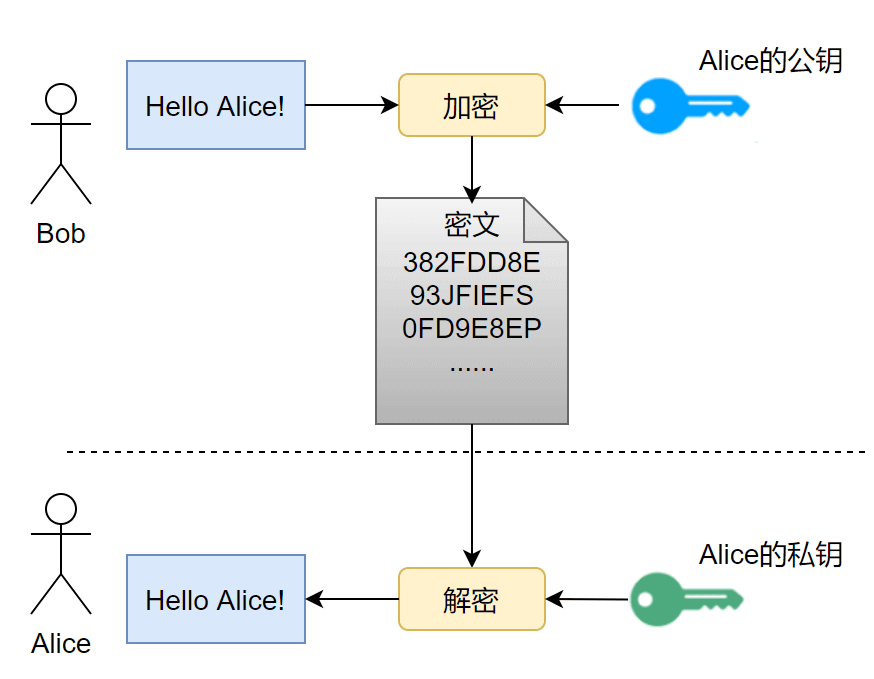

# IP数据报格式详解

在 TCP/IP 协议中，使用 IP 协议传输数据的包被称为 IP 数据包，每个数据包都包含 IP 协议规定的内容。IP 协议规定的这些内容被称为 **IP 数据报文（IP Datagram）**或者 **IP 数据报**。

IP 数据报文由首部（称为报头）和数据两部分组成。首部的前一部分是固定长度，共 20 字节，是所有 IP 数据报必须具有的。在首部的固定部分的后面是一些可选字段，其长度是可变的。

每个 IP 数据报都以一个 IP 报头开始。源计算机构造这个 IP 报头，而目的计算机利用 IP 报头中封装的信息处理数据。IP 报头中包含大量的信息，如源 IP 地址、目的 IP 地址、数据报长度、IP 版本号等。每个信息都被称为一个字段。

IP 数据报头字段如图所示。


IP 报头的最小长度为 20 字节，上图中每个字段的含义如下：

#### 1) 版本（version）

占 4 位，表示 IP 协议的版本。通信双方使用的 IP 协议版本必须一致。目前广泛使用的IP协议版本号为 4，即 IPv4。

#### 2) 首部长度（网际报头长度IHL）

占 4 位，可表示的最大十进制数值是 15。这个字段所表示数的单位是 32 位字长（1 个 32 位字长是 4 字节）。因此，当 IP 的首部长度为 1111 时（即十进制的 15），首部长度就达到 60 字节。当 IP 分组的首部长度不是 4 字节的整数倍时，必须利用最后的填充字段加以填充。

数据部分永远在 4 字节的整数倍开始，这样在实现 IP 协议时较为方便。首部长度限制为 60 字节的缺点是，长度有时可能不够用，之所以限制长度为 60 字节，是希望用户尽量减少开销。最常用的首部长度就是 20 字节（即首部长度为 0101），这时不使用任何选项。

#### 3) 区分服务（tos）

也被称为服务类型，占 8 位，用来获得更好的服务。这个字段在旧标准中叫做服务类型，但实际上一直没有被使用过。1998 年 IETF 把这个字段改名为区分服务（Differentiated Services，DS）。只有在使用区分服务时，这个字段才起作用。

#### 4) 总长度（totlen）

首部和数据之和，单位为字节。总长度字段为 16 位，因此数据报的最大长度为 2^16-1=65535 字节。

#### 5) 标识（identification）

用来标识数据报，占 16 位。IP 协议在存储器中维持一个计数器。每产生一个数据报，计数器就加 1，并将此值赋给标识字段。当数据报的长度超过网络的 MTU，而必须分片时，这个标识字段的值就被复制到所有的数据报的标识字段中。具有相同的标识字段值的分片报文会被重组成原来的数据报。

#### 6) 标志（flag）

占 3 位。第一位未使用，其值为 0。第二位称为 DF（不分片），表示是否允许分片。取值为 0 时，表示允许分片；取值为 1 时，表示不允许分片。第三位称为 MF（更多分片），表示是否还有分片正在传输，设置为 0 时，表示没有更多分片需要发送，或数据报没有分片。

#### 7) 片偏移（offsetfrag）

占 13 位。当报文被分片后，该字段标记该分片在原报文中的相对位置。片偏移以 8 个字节为偏移单位。所以，除了最后一个分片，其他分片的偏移值都是 8 字节（64 位）的整数倍。

#### 8) 生存时间（TTL）

表示数据报在网络中的寿命，占 8 位。该字段由发出数据报的源主机设置。其目的是防止无法交付的数据报无限制地在网络中传输，从而消耗网络资源。

路由器在转发数据报之前，先把 TTL 值减 1。若 TTL 值减少到 0，则丢弃这个数据报，不再转发。因此，TTL 指明数据报在网络中最多可经过多少个路由器。TTL 的最大数值为 255。若把 TTL 的初始值设为 1，则表示这个数据报只能在本局域网中传送。 

#### 9) 协议

表示该数据报文所携带的数据所使用的协议类型，占 8 位。该字段可以方便目的主机的 IP 层知道按照什么协议来处理数据部分。不同的协议有专门不同的协议号。

例如，TCP 的协议号为 6，UDP 的协议号为 17，ICMP 的协议号为 1。

#### 10) 首部检验和（checksum）

用于校验数据报的首部，占 16 位。数据报每经过一个路由器，首部的字段都可能发生变化（如TTL），所以需要重新校验。而数据部分不发生变化，所以不用重新生成校验值。

#### 11) 源地址

表示数据报的源 IP 地址，占 32 位。

#### 12) 目的地址

表示数据报的目的 IP 地址，占 32 位。该字段用于校验发送是否正确。

#### 13) 可选字段

该字段用于一些可选的报头设置，主要用于测试、调试和安全的目的。这些选项包括严格源路由（数据报必须经过指定的路由）、网际时间戳（经过每个路由器时的时间戳记录）和安全限制。

#### 14) 填充

由于可选字段中的长度不是固定的，使用若干个 0 填充该字段，可以保证整个报头的长度是 32 位的整数倍。

#### 15) 数据部分

表示传输层的数据，如保存 TCP、UDP、ICMP 或 IGMP 的数据。数据部分的长度不固定。

# OSI 和 TCP/IP 网络分层模型详解（基础）

## OSI 七层模型

**OSI 七层模型** 是国际标准化组织提出一个网络分层模型，其大体结构以及每一层提供的功能如下图所示：


每一层都专注做一件事情，并且每一层都需要使用下一层提供的功能比如传输层需要使用网络层提供的路由和寻址功能，这样传输层才知道把数据传输到哪里去。

**OSI 的七层体系结构概念清楚，理论也很完整，但是它比较复杂而且不实用，而且有些功能在多个层中重复出现。**

上面这种图可能比较抽象，再来一个比较生动的图片。下面这个图片是我在国外的一个网站上看到的，非常赞！


**既然 OSI 七层模型这么厉害，为什么干不过 TCP/IP 四 层模型呢？**

的确，OSI 七层模型当时一直被一些大公司甚至一些国家政府支持。这样的背景下，为什么会失败呢？我觉得主要有下面几方面原因：

1. OSI 的专家缺乏实际经验，他们在完成 OSI 标准时缺乏商业驱动力
2. OSI 的协议实现起来过分复杂，而且运行效率很低
3. OSI 制定标准的周期太长，因而使得按 OSI 标准生产的设备无法及时进入市场（20 世纪 90 年代初期，虽然整套的 OSI 国际标准都已经制定出来，但基于 TCP/IP 的互联网已经抢先在全球相当大的范围成功运行了）
4. OSI 的层次划分不太合理，有些功能在多个层次中重复出现。

OSI 七层模型虽然失败了，但是却提供了很多不错的理论基础。为了更好地去了解网络分层，OSI 七层模型还是非常有必要学习的。

最后再分享一个关于 OSI 七层模型非常不错的总结图片！


## TCP/IP 四层模型

**TCP/IP 四层模型** 是目前被广泛采用的一种模型,我们可以将 TCP / IP 模型看作是 OSI 七层模型的精简版本，由以下 4 层组成：

1. 应用层
2. 传输层
3. 网络层
4. 网络接口层

需要注意的是，我们并不能将 TCP/IP 四层模型 和 OSI 七层模型完全精确地匹配起来，不过可以简单将两者对应起来，如下图所示：


### 应用层（Application layer）

**应用层位于传输层之上，主要提供两个终端设备上的应用程序之间信息交换的服务，它定义了信息交换的格式，消息会交给下一层传输层来传输。** 我们把应用层交互的数据单元称为报文。


应用层协议定义了网络通信规则，对于不同的网络应用需要不同的应用层协议。在互联网中应用层协议很多，如支持 Web 应用的 HTTP 协议，支持电子邮件的 SMTP 协议等等。


### 传输层（Transport layer）

**传输层的主要任务就是负责向两台终端设备进程之间的通信提供通用的数据传输服务。** 应用进程利用该服务传送应用层报文。“通用的”是指并不针对某一个特定的网络应用，而是多种应用可以使用同一个运输层服务。

**运输层主要使用以下两种协议：**

1. **传输控制协议 TCP**（Transmisson Control Protocol）--提供**面向连接**的，**可靠的**数据传输服务。
2. **用户数据协议 UDP**（User Datagram Protocol）--提供**无连接**的，尽最大努力的数据传输服务（**不保证数据传输的可靠性**）。


### 网络层（Network layer）

**网络层负责为分组交换网上的不同主机提供通信服务。** 在发送数据时，网络层把运输层产生的报文段或用户数据报封装成分组和包进行传送。在 TCP/IP 体系结构中，由于网络层使用 IP 协议，因此分组也叫 IP 数据报，简称数据报。

注意 ⚠️：**不要把运输层的“用户数据报 UDP”和网络层的“IP 数据报”弄混**。

**网络层的还有一个任务就是选择合适的路由，使源主机运输层所传下来的分株，能通过网络层中的路由器找到目的主机。**

这里强调指出，网络层中的“网络”二字已经不是我们通常谈到的具体网络，而是指计算机网络体系结构模型中第三层的名称。

互联网是由大量的异构（heterogeneous）网络通过路由器（router）相互连接起来的。互联网使用的网络层协议是无连接的网际协议（Intert Prococol）和许多路由选择协议，因此互联网的网络层也叫做**网际层**或**IP 层**。


### 网络接口层（Network interface layer）

我们可以把网络接口层看作是数据链路层和物理层的合体。

1. 数据链路层(data link layer)通常简称为链路层（ 两台主机之间的数据传输，总是在一段一段的链路上传送的）。**数据链路层的作用是将网络层交下来的 IP 数据报组装成帧，在两个相邻节点间的链路上传送帧。每一帧包括数据和必要的控制信息（如同步信息，地址信息，差错控制等）。**
2. **物理层的作用是实现相邻计算机节点之间比特流的透明传送，尽可能屏蔽掉具体传输介质和物理设备的差异**


## 为什么网络要分层？

在这篇文章的最后，我想聊聊：“为什么网络要分层？”。

说到分层，我们先从我们平时使用框架开发一个后台程序来说，我们往往会按照每一层做不同的事情的原则将系统分为三层（复杂的系统分层会更多）:

1. Repository（数据库操作）
2. Service（业务操作）
3. Controller（前后端数据交互）

**复杂的系统需要分层，因为每一层都需要专注于一类事情。网络分层的原因也是一样，每一层只专注于做一类事情。**

好了，再来说回：“为什么网络要分层？”。我觉得主要有 3 方面的原因：

1. **各层之间相互独立**：各层之间相互独立，各层之间不需要关心其他层是如何实现的，只需要知道自己如何调用下层提供好的功能就可以了（可以简单理解为接口调用）**。这个和我们对开发时系统进行分层是一个道理。**
2. **提高了整体灵活性** ：每一层都可以使用最适合的技术来实现，你只需要保证你提供的功能以及暴露的接口的规则没有改变就行了。**这个和我们平时开发系统的时候要求的高内聚、低耦合的原则也是可以对应上的。**
3. **大问题化小** ： 分层可以将复杂的网络间题分解为许多比较小的、界线比较清晰简单的小问题来处理和解决。这样使得复杂的计算机网络系统变得易于设计，实现和标准化。 **这个和我们平时开发的时候，一般会将系统功能分解，然后将复杂的问题分解为容易理解的更小的问题是相对应的，这些较小的问题具有更好的边界（目标和接口）定义。**

我想到了计算机世界非常非常有名的一句话，这里分享一下：

> 计算机科学领域的任何问题都可以通过增加一个间接的中间层来解决，计算机整个体系从上到下都是按照严格的层次结构设计的。

# HTTP vs HTTPS（应用层）

## HTTP 协议

### HTTP 协议介绍

HTTP 协议，全称超文本传输协议（Hypertext Transfer Protocol）。顾名思义，HTTP 协议就是用来规范超文本的传输，超文本，也就是网络上的包括文本在内的各式各样的消，具体来说，主要是来规范浏览器和服务器端的行为的。

并且，HTTP 是一个无状态（stateless）协议，也就是说服务器不维护任何有关客户端过去所发请求的消息。这其实是一种懒政，有状态协议会更加复杂，需要维护状态（历史信息），而且如果客户或服务器失效，会产生状态的不一致，解决这种不一致的代价更高。

### HTTP 协议通信过程

HTTP 是应用层协议，它以 TCP（传输层）作为底层协议，默认端口为 80. 通信过程主要如下：

1. 服务器在 80 端口等待客户的请求。
2. 浏览器发起到服务器的 TCP 连接（创建套接字 Socket）。
3. 服务器接收来自浏览器的 TCP 连接。
4. 浏览器（HTTP 客户端）与 Web 服务器（HTTP 服务器）交换 HTTP 消息。
5. 关闭 TCP 连接。

### HTTP 协议优点

扩展性强、速度快、跨平台支持性好。

## HTTPS 协议

### HTTPS 协议介绍

HTTPS 协议（Hyper Text Transfer Protocol Secure），是 HTTP 的加强安全版本。HTTPS 是基于 HTTP 的，也是用 TCP 作为底层协议，并额外使用 SSL/TLS 协议用作加密和安全认证。默认端口号是 443.

HTTPS 协议中，SSL 通道通常使用基于密钥的加密算法，密钥长度通常是 40 比特或 128 比特。

### HTTPS 协议优点

保密性好、信任度高。

## HTTPS 的核心—SSL/TLS协议

HTTPS 之所以能达到较高的安全性要求，就是结合了 SSL/TLS 和 TCP 协议，对通信数据进行加密，解决了 HTTP 数据透明的问题。接下来重点介绍一下 SSL/TLS 的工作原理。

### SSL 和 TLS 的区别？

**SSL 和 TLS 没有太大的区别。**

SSL 指安全套接字协议（Secure Sockets Layer），首次发布与 1996 年。SSL 的首次发布其实已经是他的 3.0 版本，SSL 1.0 从未面世，SSL 2.0 则具有较大的缺陷（DROWN 缺陷——Decrypting RSA with Obsolete and Weakened eNcryption）。很快，在 1999 年，SSL 3.0 进一步升级，**新版本被命名为 TLS 1.0**。因此，TLS 是基于 SSL 之上的，但由于习惯叫法，通常把 HTTPS 中的核心加密协议混成为 SSL/TLS。

### SSL/TLS 的工作原理

#### 非对称加密

SSL/TLS 的核心要素是**非对称加密**。非对称加密采用两个密钥——一个公钥，一个私钥。在通信时，私钥仅由解密者保存，公钥由任何一个想与解密者通信的发送者（加密者）所知。可以设想一个场景，

> 在某个自助邮局，每个通信信道都是一个邮箱，每一个邮箱所有者都在旁边立了一个牌子，上面挂着一把钥匙：这是我的公钥，发送者请将信件放入我的邮箱，并用公钥锁好。
>
> 但是公钥只能加锁，并不能解锁。解锁只能由邮箱的所有者——因为只有他保存着私钥。
>
> 这样，通信信息就不会被其他人截获了，这依赖于私钥的保密性。



非对称加密的公钥和私钥需要采用一种复杂的数学机制生成（密码学认为，为了较高的安全性，尽量不要自己创造加密方案）。公私钥对的生成算法依赖于单向陷门函数。

> 单向函数：已知单向函数 f，给定任意一个输入 x，易计算输出 y=f(x)；而给定一个输出 y，假设存在 f(x)=y，很难根据 f 来计算出 x。
>
> 单向陷门函数：一个较弱的单向函数。已知单向陷门函数 f，陷门 h，给定任意一个输入 x，易计算出输出 y=f(x;h)；而给定一个输出 y，假设存在 f(x;h)=y，很难根据 f 来计算出 x，但可以根据 f 和 h 来推导出 x。


上图就是一个单向函数（不是单项陷门函数），假设有一个绝世秘籍，任何知道了这个秘籍的人都可以把苹果汁榨成苹果，那么这个秘籍就是“陷门”了吧。

在这里，函数 f 的计算方法相当于公钥，陷门 h 相当于私钥。公钥 f 是公开的，任何人对已有输入，都可以用 f 加密，而要想根据加密信息还原出原信息，必须要有私钥才行。

#### 对称加密

使用 SSL/TLS 进行通信的双方需要使用非对称加密方案来通信，但是非对称加密设计了较为复杂的数学算法，在实际通信过程中，计算的代价较高，效率太低，因此，SSL/TLS 实际对消息的加密使用的是对称加密。

> 对称加密：通信双方共享唯一密钥 k，加解密算法已知，加密方利用密钥 k 加密，解密方利用密钥 k 解密，保密性依赖于密钥 k 的保密性。


对称加密的密钥生成代价比公私钥对的生成代价低得多，那么有的人会问了，为什么 SSL/TLS 还需要使用非对称加密呢？因为对称加密的保密性完全依赖于密钥的保密性。在双方通信之前，需要商量一个用于对称加密的密钥。我们知道网络通信的信道是不安全的，传输报文对任何人是可见的，密钥的交换肯定不能直接在网络信道中传输。因此，使用非对称加密，对对称加密的密钥进行加密，保护该密钥不在网络信道中被窃听。这样，通信双方只需要一次非对称加密，交换对称加密的密钥，在之后的信息通信中，使用绝对安全的密钥，对信息进行对称加密，即可保证传输消息的保密性。

#### 公钥传输的信赖性

SSL/TLS 介绍到这里，了解信息安全的朋友又会想到一个安全隐患，设想一个下面的场景：

> 客户端 C 和服务器 S 想要使用 SSL/TLS 通信，由上述 SSL/TLS 通信原理，C 需要先知道 S 的公钥，而 S 公钥的唯一获取途径，就是把 S 公钥在网络信道中传输。要注意网络信道通信中有几个前提：
>
> 1. 任何人都可以捕获通信包
> 2. 通信包的保密性由发送者设计
> 3. 保密算法设计方案默认为公开，而（解密）密钥默认是安全的
>
> 因此，假设 S 公钥不做加密，在信道中传输，那么很有可能存在一个攻击者 A，发送给 C 一个诈包，假装是 S 公钥，其实是诱饵服务器 AS 的公钥。当 C 收获了 AS 的公钥（却以为是 S 的公钥），C 后续就会使用 AS 公钥对数据进行加密，并在公开信道传输，那么 A 将捕获这些加密包，用 AS 的私钥解密，就截获了 C 本要给 S 发送的内容，而 C 和 S 二人全然不知。
>
> 同样的，S 公钥即使做加密，也难以避免这种信任性问题，C 被 AS 拐跑了！


为了公钥传输的信赖性问题，第三方机构应运而生——证书颁发机构（CA，Certificate Authority）。CA 默认是受信任的第三方。CA 会给各个服务器颁发证书，证书存储在服务器上，并附有 CA 的**电子签名**（见下节）。

当客户端（浏览器）向服务器发送 HTTPS 请求时，一定要先获取目标服务器的证书，并根据证书上的信息，检验证书的合法性。一旦客户端检测到证书非法，就会发生错误。客户端获取了服务器的证书后，由于证书的信任性是由第三方信赖机构认证的，而证书上又包含着服务器的公钥信息，客户端就可以放心的信任证书上的公钥就是目标服务器的公钥。

#### 数字签名

好，到这一小节，已经是 SSL/TLS 的尾声了。上一小节提到了数字签名，数字签名要解决的问题，是防止证书被伪造。第三方信赖机构 CA 之所以能被信赖，就是靠数字签名技术。

数字签名，是 CA 在给服务器颁发证书时，使用散列+加密的组合技术，在证书上盖个章，以此来提供验伪的功能。具体行为如下：

> CA 知道服务器的公钥，对该公钥采用散列技术生成一个摘要。CA 使用 CA 私钥对该摘要进行加密，并附在证书下方，发送给服务器。
>
> 现在服务器将该证书发送给客户端，客户端需要验证该证书的身份。客户端找到第三方机构 CA，获知 CA 的公钥，并用 CA 公钥对证书的签名进行解密，获得了 CA 生成的摘要。
>
> 客户端对证书数据（也就是服务器的公钥）做相同的散列处理，得到摘要，并将该摘要与之前从签名中解码出的摘要做对比，如果相同，则身份验证成功；否则验证失败。


注意，验证身份的证书一定是由 CA 的公钥进行签名，而不能由发送者自己来签名。这是为了抵抗以下的攻击场景：

> 攻击者使用某种手段，欺骗了客户端，将服务器的公钥替换为攻击者的诱饵公钥。
>
> 假使证书的签名使用的是服务器的私钥，那么客户端在解码的时候，将会使用假的服务器公钥（实则为诱饵公钥）。那么，如果该证书实则由攻击者（使用自己的私钥签名）发出，那么客户端就会成功验证（攻击者的）身份为真，从而信赖了证书中的公钥。
>
> 如果使用 CA 的私钥和公钥来对签名处理，则不会出现上述问题。

总结来说，带有证书的公钥传输机制如下：

1. 设有服务器 S，客户端 C，和第三方信赖机构 CA。
2. S 信任 CA，CA 是知道 S 公钥的，CA 向 S 颁发证书。并附上 CA 私钥对消息摘要的加密签名。
3. S 获得 CA 颁发的证书，将该证书传递给 C。
4. C 获得 S 的证书，信任 CA 并知晓 CA 公钥，使用 CA 公钥对 S 证书山的签名解密，同时对消息进行散列处理，得到摘要。比较摘要，验证 S 证书的真实性。
5. 如果 C 验证 S 证书是真实的，则信任 S 的公钥（在 S 证书中）。


## 总结

- **端口号** ：HTTP 默认是 80，HTTPS 默认是 443。
- **URL 前缀** ：HTTP 的 URL 前缀是 `http://`，HTTPS 的 URL 前缀是 `https://`。
- **安全性和资源消耗** ： HTTP 协议运行在 TCP 之上，所有传输的内容都是明文，客户端和服务器端都无法验证对方的身份。HTTPS 是运行在 SSL/TLS 之上的 HTTP 协议，SSL/TLS 运行在 TCP 之上。所有传输的内容都经过加密，加密采用对称加密，但对称加密的密钥用服务器方的证书进行了非对称加密。所以说，HTTP 安全性没有 HTTPS 高，但是 HTTPS 比 HTTP 耗费更多服务器资源。

# TCP 三次握手和四次挥手(面试常客)

为了准确无误地把数据送达目标处，TCP 协议采用了三次握手策略。

### TCP 三次握手漫画图解

如下图所示，下面的两个机器人通过 3 次握手确定了对方能正确接收和发送消息(图片来源：《图解 HTTP》)。


**简单示意图：**


- 客户端–发送带有 SYN 标志的数据包–一次握手–服务端
- 服务端–发送带有 SYN/ACK 标志的数据包–二次握手–客户端
- 客户端–发送带有带有 ACK 标志的数据包–三次握手–服务端

**详细示意图（图片来源不详）**


### 为什么要三次握手

**三次握手的目的是建立可靠的通信信道，说到通讯，简单来说就是数据的发送与接收，而三次握手最主要的目的就是双方确认自己与对方的发送与接收是正常的。**

第一次握手：Client 什么都不能确认；Server 确认了对方发送正常，自己接收正常

第二次握手：Client 确认了：自己发送、接收正常，对方发送、接收正常；Server 确认了：对方发送正常，自己接收正常

第三次握手：Client 确认了：自己发送、接收正常，对方发送、接收正常；Server 确认了：自己发送、接收正常，对方发送、接收正常

所以三次握手就能确认双方收发功能都正常，缺一不可。

### 第 2 次握手传回了 ACK，为什么还要传回 SYN？

接收端传回发送端所发送的 ACK 是为了告诉客户端，我接收到的信息确实就是你所发送的信号了，这表明从客户端到服务端的通信是正常的。而回传 SYN 则是为了建立并确认从服务端到客户端的通信。”

> SYN 同步序列编号(Synchronize Sequence Numbers) 是 TCP/IP 建立连接时使用的握手信号。在客户机和服务器之间建立正常的 TCP 网络连接时，客户机首先发出一个 SYN 消息，服务器使用 SYN-ACK 应答表示接收到了这个消息，最后客户机再以 ACK(Acknowledgement）消息响应。这样在客户机和服务器之间才能建立起可靠的 TCP 连接，数据才可以在客户机和服务器之间传递。

### 为什么要四次挥手


断开一个 TCP 连接则需要“四次挥手”：

- 客户端-发送一个 FIN，用来关闭客户端到服务器的数据传送
- 服务器-收到这个 FIN，它发回一 个 ACK，确认序号为收到的序号加 1 。和 SYN 一样，一个 FIN 将占用一个序号
- 服务器-关闭与客户端的连接，发送一个 FIN 给客户端
- 客户端-发回 ACK 报文确认，并将确认序号设置为收到序号加 1

任何一方都可以在数据传送结束后发出连接释放的通知，待对方确认后进入半关闭状态。当另一方也没有数据再发送的时候，则发出连接释放通知，对方确认后就完全关闭了 TCP 连接。

举个例子：A 和 B 打电话，通话即将结束后，A 说“我没啥要说的了”，B 回答“我知道了”，但是 B 可能还会有要说的话，A 不能要求 B 跟着自己的节奏结束通话，于是 B 可能又巴拉巴拉说了一通，最后 B 说“我说完了”，A 回答“知道了”，这样通话才算结束。

上面讲的比较概括，推荐一篇讲的比较细致的文章：https://blog.csdn.net/qzcsu/article/details/72861891

# TCP, UDP 协议的区别


UDP 在传送数据之前不需要先建立连接，远地主机在收到 UDP 报文后，不需要给出任何确认。虽然 UDP 不提供可靠交付，但在某些情况下 UDP 却是一种最有效的工作方式（一般用于即时通信），比如： QQ 语音、 QQ 视频 、直播等等

TCP 提供面向连接的服务。在传送数据之前必须先建立连接，数据传送结束后要释放连接。 TCP 不提供广播或多播服务。由于 TCP 要提供可靠的，面向连接的传输服务（TCP 的可靠体现在 TCP 在传递数据之前，会有三次握手来建立连接，而且在数据传递时，有确认、窗口、重传、拥塞控制机制，在数据传完后，还会断开连接用来节约系统资源），这难以避免增加了许多开销，如确认，流量控制，计时器以及连接管理等。这不仅使协议数据单元的首部增大很多，还要占用许多处理机资源。TCP 一般用于文件传输、发送和接收邮件、远程登录等场景。

## TCP 协议如何保证可靠传输

1. 应用数据被分割成 TCP 认为最适合发送的数据块。
2. TCP 给发送的每一个包进行编号，接收方对数据包进行排序，把有序数据传送给应用层。
3. **校验和：** TCP 将保持它首部和数据的检验和。这是一个端到端的检验和，目的是检测数据在传输过程中的任何变化。如果收到段的检验和有差错，TCP 将丢弃这个报文段和不确认收到此报文段。
4. TCP 的接收端会丢弃重复的数据。
5. **流量控制：** TCP 连接的每一方都有固定大小的缓冲空间，TCP 的接收端只允许发送端发送接收端缓冲区能接纳的数据。当接收方来不及处理发送方的数据，能提示发送方降低发送的速率，防止包丢失。TCP 使用的流量控制协议是可变大小的滑动窗口协议。 （TCP 利用滑动窗口实现流量控制）
6. **拥塞控制：** 当网络拥塞时，减少数据的发送。
7. **ARQ 协议：** 也是为了实现可靠传输的，它的基本原理就是每发完一个分组就停止发送，等待对方确认。在收到确认后再发下一个分组。
8. **超时重传：** 当 TCP 发出一个段后，它启动一个定时器，等待目的端确认收到这个报文段。如果不能及时收到一个确认，将重发这个报文段。

### ARQ 协议

**自动重传请求**（Automatic Repeat-reQuest，ARQ）是 OSI 模型中数据链路层和传输层的错误纠正协议之一。它通过使用确认和超时这两个机制，在不可靠服务的基础上实现可靠的信息传输。如果发送方在发送后一段时间之内没有收到确认帧，它通常会重新发送。ARQ 包括停止等待 ARQ 协议和连续 ARQ 协议。

#### 停止等待 ARQ 协议

停止等待协议是为了实现可靠传输的，它的基本原理就是每发完一个分组就停止发送，等待对方确认（回复 ACK）。如果过了一段时间（超时时间后），还是没有收到 ACK 确认，说明没有发送成功，需要重新发送，直到收到确认后再发下一个分组。

在停止等待协议中，若接收方收到重复分组，就丢弃该分组，但同时还要发送确认。

**优缺点：**

- **优点：** 简单
- **缺点：** 信道利用率低，等待时间长

**1) 无差错情况:**

发送方发送分组, 接收方在规定时间内收到, 并且回复确认. 发送方再次发送。

**2) 出现差错情况（超时重传）:**

停止等待协议中超时重传是指只要超过一段时间仍然没有收到确认，就重传前面发送过的分组（认为刚才发送过的分组丢失了）。因此每发送完一个分组需要设置一个超时计时器，其重传时间应比数据在分组传输的平均往返时间更长一些。这种自动重传方式常称为 **自动重传请求 ARQ** 。另外在停止等待协议中若收到重复分组，就丢弃该分组，但同时还要发送确认。**连续 ARQ 协议** 可提高信道利用率。发送维持一个发送窗口，凡位于发送窗口内的分组可连续发送出去，而不需要等待对方确认。接收方一般采用累积确认，对按序到达的最后一个分组发送确认，表明到这个分组位置的所有分组都已经正确收到了。

**3) 确认丢失和确认迟到**

- **确认丢失** ：确认消息在传输过程丢失。当 A 发送 M1 消息，B 收到后，B 向 A 发送了一个 M1 确认消息，但却在传输过程中丢失。而 A 并不知道，在超时计时过后，A 重传 M1 消息，B 再次收到该消息后采取以下两点措施：1. 丢弃这个重复的 M1 消息，不向上层交付。 2. 向 A 发送确认消息。（不会认为已经发送过了，就不再发送。A 能重传，就证明 B 的确认消息丢失）。
- **确认迟到** ：确认消息在传输过程中迟到。A 发送 M1 消息，B 收到并发送确认。在超时时间内没有收到确认消息，A 重传 M1 消息，B 仍然收到并继续发送确认消息（B 收到了 2 份 M1）。此时 A 收到了 B 第二次发送的确认消息。接着发送其他数据。过了一会，A 收到了 B 第一次发送的对 M1 的确认消息（A 也收到了 2 份确认消息）。处理如下：1. A 收到重复的确认后，直接丢弃。2. B 收到重复的 M1 后，也直接丢弃重复的 M1。

#### 连续 ARQ 协议

**连续 ARQ 协议可提高信道利用率。发送方维持一个发送窗口，凡位于发送窗口内的分组可以连续发送出去，而不需要等待对方确认。接收方一般采用累积确认，对按序到达的最后一个分组发送确认，表明到这个分组为止的所有分组都已经正确收到了。**

**优缺点：**

- **优点：** 信道利用率高，容易实现，即使确认丢失，也不必重传。
- **缺点：** 不能向发送方反映出接收方已经正确收到的所有分组的信息。 比如：发送方发送了 5 条 消息，中间第三条丢失（3 号），这时接收方只能对前两个发送确认。发送方无法知道后三个分组的下落，而只好把后三个全部重传一次。这也叫 Go-Back-N（回退 N），表示需要退回来重传已经发送过的 N 个消息。

### 滑动窗口和流量控制

**TCP 利用滑动窗口实现流量控制。流量控制是为了控制发送方发送速率，保证接收方来得及接收。** 接收方发送的确认报文中的窗口字段可以用来控制发送方窗口大小，从而影响发送方的发送速率。将窗口字段设置为 0，则发送方不能发送数据。

### 拥塞控制

在某段时间，若对网络中某一资源的需求超过了该资源所能提供的可用部分，网络的性能就要变坏。这种情况就叫拥塞。拥塞控制就是为了防止过多的数据注入到网络中，这样就可以使网络中的路由器或链路不致过载。拥塞控制所要做的都有一个前提，就是网络能够承受现有的网络负荷。拥塞控制是一个全局性的过程，涉及到所有的主机，所有的路由器，以及与降低网络传输性能有关的所有因素。相反，流量控制往往是点对点通信量的控制，是个端到端的问题。流量控制所要做到的就是抑制发送端发送数据的速率，以便使接收端来得及接收。

为了进行拥塞控制，TCP 发送方要维持一个 **拥塞窗口(cwnd)** 的状态变量。拥塞控制窗口的大小取决于网络的拥塞程度，并且动态变化。发送方让自己的发送窗口取为拥塞窗口和接收方的接受窗口中较小的一个。

TCP 的拥塞控制采用了四种算法，即 **慢开始** 、 **拥塞避免** 、**快重传** 和 **快恢复**。在网络层也可以使路由器采用适当的分组丢弃策略（如主动队列管理 AQM），以减少网络拥塞的发生。

- **慢开始：** 慢开始算法的思路是当主机开始发送数据时，如果立即把大量数据字节注入到网络，那么可能会引起网络阻塞，因为现在还不知道网络的符合情况。经验表明，较好的方法是先探测一下，即由小到大逐渐增大发送窗口，也就是由小到大逐渐增大拥塞窗口数值。cwnd 初始值为 1，每经过一个传播轮次，cwnd 加倍。
- **拥塞避免：** 拥塞避免算法的思路是让拥塞窗口 cwnd 缓慢增大，即每经过一个往返时间 RTT 就把发送放的 cwnd 加 1.
- **快重传与快恢复：** 在 TCP/IP 中，快速重传和恢复（fast retransmit and recovery，FRR）是一种拥塞控制算法，它能快速恢复丢失的数据包。没有 FRR，如果数据包丢失了，TCP 将会使用定时器来要求传输暂停。在暂停的这段时间内，没有新的或复制的数据包被发送。有了 FRR，如果接收机接收到一个不按顺序的数据段，它会立即给发送机发送一个重复确认。如果发送机接收到三个重复确认，它会假定确认件指出的数据段丢失了，并立即重传这些丢失的数据段。有了 FRR，就不会因为重传时要求的暂停被耽误。 　当有单独的数据包丢失时，快速重传和恢复（FRR）能最有效地工作。当有多个数据信息包在某一段很短的时间内丢失时，它则不能很有效地工作。

# 在浏览器中输入 url 地址 ->> 显示主页的过程(面试常客)

百度好像最喜欢问这个问题。

> 打开一个网页，整个过程会使用哪些协议？

图解（图片来源：《图解 HTTP》）：


> 上图有一个错误，请注意，是 OSPF 不是 OPSF。 OSPF（Open Shortest Path First，ospf）开放最短路径优先协议, 是由 Internet 工程任务组开发的路由选择协议

总体来说分为以下几个过程:

1. DNS 解析
2. TCP 连接
3. 发送 HTTP 请求
4. 服务器处理请求并返回 HTTP 报文
5. 浏览器解析渲染页面
6. 连接结束

具体可以参考下面这篇文章：

- https://segmentfault.com/a/1190000006879700

# 状态码


# tcp的半连接与完全连接队列

server端的半连接队列(syn队列)

在三次握手协议中，服务器维护一个半连接队列，该队列为每个客户端的SYN包开设一个条目(服务端在接收到SYN包的时候，就已经创建了request_sock结构，存储在半连接队列中)，该条目表明服务器已收到SYN包，并向客户发出确认，正在等待客户的确认包（会进行第二次握手发送SYN＋ACK 的包加以确认）。这些条目所标识的连接在服务器处于Syn_RECV状态，当服务器收到客户的确认包时，删除该条目，服务器进入ESTABLISHED状态。
 该队列为SYN 队列，长度为 max(64, /proc/sys/net/ipv4/tcp_max_syn_backlog)  ，在机器的tcp_max_syn_backlog值在/proc/sys/net/ipv4/tcp_max_syn_backlog下配置。

### server端的完全连接队列(accpet队列)

当第三次握手时，当server接收到ACK 报之后， 会进入一个新的叫 accept 的队列，该队列的长度为 min(backlog, somaxconn)，默认情况下，somaxconn 的值为 128，表示最多有 129 的 ESTAB 的连接等待 accept()，而 backlog 的值则应该是由 int listen(int sockfd, int backlog) 中的第二个参数指定，listen 里面的 backlog 可以有我们的应用程序去定义的。

## 当Client发送SYN包之后挂了(`syn flood攻击`)

Client发送SYN包给Server后挂了，Server回给Client的SYN-ACK一直没收到Client的ACK确认，这个时候这个连接既没建立起来，也不能算失败。这就需要一个超时时间让Server将这个连接断开，否则这个连接就会一直占用Server的SYN连接队列中的一个位置，大量这样的连接就会将Server的SYN连接队列耗尽，让正常的连接无法得到处理。

目前，Linux下默认会进行5次重发SYN-ACK包，重试的间隔时间从1s开始，下次的重试间隔时间是前一次的双倍，5次的重试时间间隔为1s, 2s, 4s, 8s, 16s，总共31s，第5次发出后还要等32s都知道第5次也超时了，所以，总共需要 1s + 2s + 4s+ 8s+ 16s + 32s = 63s，TCP才会把断开这个连接。由于，SYN超时需要63秒，那么就给攻击者一个攻击服务器的机会，攻击者在短时间内发送大量的SYN包给Server(俗称 SYN flood 攻击)，用于耗尽Server的SYN队列。对于应对SYN 过多的问题，linux提供了几个TCP参数：tcp_syncookies、tcp_synack_retries、tcp_max_syn_backlog、tcp_abort_on_overflow 来调整应对。

> net.ipv4.tcp_synack_retries #内核放弃连接之前发送SYN+ACK包的数量
>  net.ipv4.tcp_syn_retries    #内核放弃建立连接之前发送SYN包的数量

> 为了应对SYNflooding（即客户端只发送SYN包发起握手而不回应ACK完成连接建立，填满server端的半连接队列，让它无法处理正常的握手请求），Linux实现了一种称为SYNcookie的机制，通过net.ipv4.tcp_syncookies控制，设置为1表示开启。简单说SYNcookie就是将连接信息编码在ISN(initialsequencenumber)中返回给客户端，这时server不需要将半连接保存在队列中，而是利用客户端随后发来的ACK带回的ISN还原连接信息，以完成连接的建立，避免了半连接队列被攻击SYN包填满。

## 当syn队列满的情况(`tcp_abort_on_overflow`)

对于SYN半连接队列的大小是由（/proc/sys/net/ipv4/tcp_max_syn_backlog）这个内核参数控制的，有些内核似乎也受listen的backlog参数影响，取得是两个值的最小值。当这个队列满了，不开启syncookies的时候，Server会丢弃新来的SYN包，而Client端在多次重发SYN包得不到响应而返回（`connection time out`）错误。但是，当Server端开启了syncookies=1，那么SYN半连接队列就没有逻辑上的最大值了，并且/proc/sys/net/ipv4/tcp_max_syn_backlog设置的值也会被忽略。

> Client端在多次重发SYN包得不到响应而返回`connection time out`错误

查看


```undefined
netstat -s | grep LISTEN
4375 SYNs to LISTEN sockets dropped
```

## 当accept队列满的情况

当accept队列满了之后，即使client继续向server发送ACK的包，也会不被响应，此时ListenOverflows+1，同时server通过/proc/sys/net/ipv4/tcp_abort_on_overflow来决定如何返回，0表示直接丢弃该ACK，1表示发送RST通知client；相应的，client则会分别返回`read timeout` 或者 `connection reset by peer`。

> client则会分别返回`read timeout` 或者 `connection reset by peer`

查看


```ruby
root@b5dbe93bcb04:/opt# netstat -s | grep listen
22438 times the listen queue of a socket overflowed
```

accept队列满了，对 syn队列也有影响，在代码 net/ipv4/tcp_ipv4.c ：


```csharp
int tcp_v4_conn_request(struct sock *sk, struct sk_buff *skb)
{
    /*tcp_syncookies为2 进行syn cookie
      tcp_syncookies为1 且request队列满了 进行syn cookie处理
      tcp_syncookies为0 且request队列满了 将该syn报文drop掉
    */
    if ((sysctl_tcp_syncookies == 2 ||
         inet_csk_reqsk_queue_is_full(sk)) && !isn) {
        want_cookie = tcp_syn_flood_action(sk, skb, "TCP");
        if (!want_cookie)
            goto drop;
    }

    /* Accept backlog is full. If we have already queued enough
     * of warm entries in syn queue, drop request. 
     */
    if (sk_acceptq_is_full(sk) && inet_csk_reqsk_queue_young(sk) > 1) {
        NET_INC_STATS_BH(sock_net(sk), LINUX_MIB_LISTENOVERFLOWS);
        goto drop;
}
```

accept队列大多数情况下会比较小，所以会出现SYN 队列没有满，而ACCEPT 队列满了的情况，此时会按照tcp_aborton_overflow来决定直接丢弃，还是返回拒绝RST。 而如果启用了syncookies，那么syncookies会开启，限制SYN包进入的速度。

> 当系统丢弃最后的 ACK，而系统中还有一个 net.ipv4.tcp_synack_retries 设置时，Linux 会重新发送 SYN ACK 包。而客户端收到多个 SYN ACK 包，则会认为之前的 ACK 丢包了。于是促使客户端再次发送 ACK ，在 accept队列有空闲的时候最终完成连接。若 accept队列始终满员，则最终客户端收到 RST 包。

